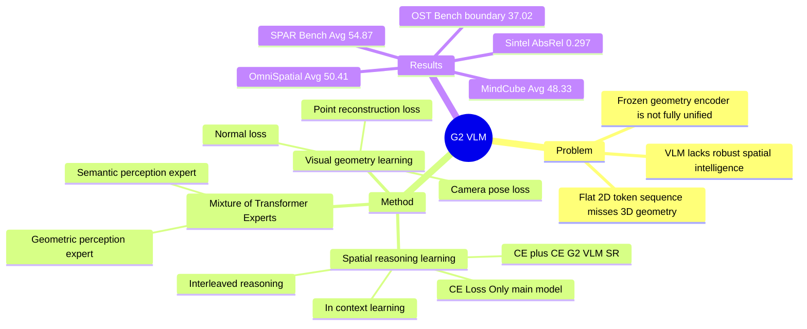

## Summary
G2 VLM 把 spatial 3D reconstruction 和 spatial understanding 放进同一个 VLM：用 geometric perception expert 学 3D point/camera/depth 表示，用 semantic perception expert 做多模态理解，并通过 shared self-attention、in-context learning 和 interleaved reasoning 把几何能力转化为空间推理能力。

## Problem & Motivation
现有 VLM 在 spatial understanding 和 spatial reasoning 上仍然不稳，作者把原因归结为训练过程缺少 explicit visual geometry learning：多图像或视频帧通常被当成扁平 2D token 序列，主要依赖 language/2D priors，而没有把 2D perception lift 到 coherent 3D representation。

已有 3D-VLM 或 spatial VLM 有两类路线：一类仍按标准 VLM 设计，用 curated spatial reasoning data 补能力；另一类把 frozen geometry encoder 的特征接到 VLM 上。G2 VLM 的问题 formulation 更直接：不要只把几何作为外部辅助特征，而是在 VLM 内部训练一个可预测 3D attributes 的 geometry pathway，让 low-level 3D reconstruction 和 high-level spatial reasoning 共享表示。

这对 embodied AI / VLM 研究有意义，因为很多空间问题不是单纯语义识别，而是依赖 viewpoint、distance、relative pose、3D layout 和 multi-view consistency。论文没有直接做 GUI agent 或机器人闭环控制，但它处理的是 spatial intelligence 的底层感知与推理接口，因此与 embodied reasoning 和视觉空间 grounding 强相关。

## Method
G2 VLM 采用 Mixture-of-Transformer-Experts (MoT) 架构，包含两个 expert。Geometric perception expert 使用 DINOv2 vision encoder 注入 low-level visual information，再用 LLM-style global attention 推理 3D-aware features；其 geometry heads 包括 local point head、camera head、global point head，输出每个输入图像的 camera pose `T_i` 和 pixel-aligned 3D point map `X_i`。Semantic perception expert 基于 Qwen2-VL-2B，保留 Qwen2 vision encoder、dynamic resolution 和 Multimodal Rotary Position Embedding，用于 multimodal understanding 与语言输出。

两个 expert 通过 shared multimodal self-attention 交互，作者把它类比为 two-streams hypothesis：semantic expert 是 "what pathway"，geometry expert 是 "where pathway"。为了让几何 expert 更容易接入现代 LLM 框架，论文放弃 VGGT 风格的 camera tokens 和 alternating attention，使用 permutation equivariant design 与 global attention，使 DINOv2 features 和 Qwen2 visual features 能以相同方式被 LLM 消化。

训练分两大阶段。第一阶段冻结 semantic expert，把 geometry expert 从随机初始化开始训练在大规模 3D annotated datasets 上，loss 为 point reconstruction loss、camera pose loss 和 normal loss 的加权和；训练细节是先 224x224 分辨率 100K iterations、lr 2e-4，再 518x518 分辨率 20K steps、lr 5e-4，每个 batch 随机采样 2-24 frames。第二阶段 joint training，让 semantic expert 学会通过 in-context learning 和 interleaved reasoning 使用几何特征，默认优化 language modeling cross-entropy。

Joint-training 有三个变体：CE Loss Only 冻结 geometry expert，只更新 semantic expert；CE + CE Loss 用 CE loss 更新 geometry expert，使几何特征偏向 spatial understanding；VG + CE Loss 同时保留 visual geometry loss 和 CE loss。论文称 VG + CE Loss 在 Figure 4 中同时改善 visual geometry 和 spatial reasoning，但需要 large-scale 3D annotations，scalability 较差；主模型 G2 VLM 因此采用 CE Loss Only，专门优化 spatial reasoning 的 G2 VLM-SR 使用 CE + CE Loss。

训练数据方面，geometry expert 覆盖 ScanNet、Co3Dv2、BlendMVS、DL3DV、MegaDepth、WildRGBD、TarTanAir、Taskonomy、ArkitScenes、HyperSim、Habitat、ScanNetPP、GTA-SFM、MatrixCity、Aria Synthetic Environments、Mapfree 和 internal synthetic indoor datasets。Joint training 使用 SPAR-7M、OmniSpatial、MindCube、OST-Bench training sets 和 LLaVA-One-Vision 等 general VQA 数据。

## Key Results
**Visual Geometry。** 在 monocular depth estimation 上，G2 VLM 在 Sintel 的 Abs Rel 为 0.297、`delta < 1.25` 为 0.589，优于 VGGT 的 0.335 / 0.599 的 Abs Rel，但弱于 Pi3 的 0.277 / 0.614；在 NYU-v2 上为 0.062 / 0.954，接近 VGGT 0.056 / 0.951 和 Pi3 0.054 / 0.956。这里的结论应写成 "competitive/comparable"，不能写成全面 SOTA。

**Point Map Estimation。** 在 ETH3D 上，G2 VLM 的 Acc./Comp. 为 0.414 / 0.309，Comp. 接近 VGGT 的 0.305，但 Acc. 明显弱于 VGGT 0.280 和 Pi3 0.194；在 7Scenes 上，G2 VLM 为 0.046 / 0.029，也弱于 VGGT 0.022 / 0.026 和 Pi3 0.016 / 0.022。说明它能做 feed-forward 3D reconstruction，但 point accuracy 不是表中最强。

**Camera Pose Estimation。** 在 Co3Dv2 上，G2 VLM 的 RRA@30 / RTA@30 / AUC@30 为 97.91 / 95.20 / 74.81，接近 Fast3R 的 AUC@30 73.43 和 CUT3R 的 75.82，但显著低于 VGGT 88.59 与 Pi3 88.41。论文强调它没有使用 VGGT 的 camera token prior，也没有像 Pi3 那样从预训练权重 fine-tune，这是解释差距时需要保留的上下文。

**Spatial Understanding & Reasoning。** G2 VLM-SR-2B 在 SPAR-Bench Avg 达到 54.87，高于 GPT-4o 36.39、Qwen2.5-VL-72B 39.40、VLM3R-7B 43.21，也比 Qwen2-VL-2B base model 的 24.60 高 30.27。分项为 Low 59.99、Medium 36.27、High 56.51，supplementary Table 3 还报告它在 SPAR-Bench low category 超过 human level 55.31。

**MindCube / OST-Bench / OmniSpatial。** G2 VLM-SR-2B 在 MindCube Avg 为 48.33，高于 GPT-4o 38.81、Claude-4-Sonnet 44.75、LLaVA-OneVision-7B 47.43 和 VLM3R-7B 42.09；在 OmniSpatial Avg 为 50.41，接近 GPT-4o 50.74，并高于 VLM3R-7B 48.08。OST-Bench 是明显边界：G2 VLM-SR-2B 为 37.02，低于 GPT-4o 53.05、Qwen2.5-VL-72B 50.54 和 InternVL2.5-8B 49.56，但仍高于 Spatial-MLLM-7B 26.72 与 SpaceQwen2.5-VL-3B 26.61。

**Ablation。** Table 2 显示，仅把 Qwen2-VL-2B fine-tune 到 spatial understanding data 后，SPAR-Bench Avg 从 24.60 提到 48.93；加入 geometry pretraining 和 geometry expert 后，Frame-Att. in GP 为 52.34，Mixed-Att. in GP 为 53.64，最终 global attention 的 G2 VLM-SR 为 54.87。这支持两个已知结论：visual geometry representation 不是普通 fine-tuning 的替代品，且 geometry expert 越强，spatial reasoning gain 越大。

## Strengths & Weaknesses
**已知的亮点**：这篇论文的关键贡献是统一，而不是单点刷新某个 geometry benchmark。G2 VLM 同时具备 depth / point map / camera pose prediction 和 spatial QA/reasoning 能力，且 geometry expert 不是 frozen external encoder，而是 VLM 内部的 dedicated expert，通过 shared self-attention 与 semantic expert 交互。这个设计比简单 concat 3D features 更干净，也更容易成为 embodied spatial reasoning 的 baseline。

**已知的实验支撑**：SPAR-Bench、MindCube、OmniSpatial 的结果显示，2B 规模的 G2 VLM-SR 能超过或接近更大 VLM 和 spatial expert models；Table 2 也把 geometry pretraining 的贡献从普通 spatial fine-tuning 中分离出来。Visual geometry 部分虽然不全面领先，但足以说明该 VLM 没有牺牲掉低层 3D reconstruction 能力。

**已知的弱项 / 边界**：第一，visual geometry 不是 SOTA，尤其 Co3Dv2 AUC@30 74.81 显著落后 VGGT 88.59 / Pi3 88.41，ETH3D/7Scenes Acc. 也落后。第二，OST-Bench 上 G2 VLM-SR 37.02 低于多个更大的 open/proprietary VLM，作者自己的解释是 online spatio-temporal scene understanding 可能需要更大模型存储更多知识。第三，论文结论部分明确提到 large-scale models 的 training instability 是 potential limitation，需要 advanced optimization、data curation 和大量 compute。

**已知的 baseline 覆盖**：spatial reasoning 对比了 proprietary models、open-source models 和 spatial expert models，包括 GPT-4o、Claude-3.7/4 Sonnet、LLaVA、Qwen2/2.5-VL、InternVL2.5、SpaceMantis、Spatial-MLLM、SpaceQwen 和 VLM3R。visual geometry 对比了 Fast3R、CUT3R、FLARE、VGGT 和 Pi3，覆盖了当前 feed-forward 3D reconstruction 的主要强 baseline。

**推测**：geometry expert 对 SPAR-Bench 与 MindCube 的提升，可能来自 metric geometry、viewpoint relation 和 3D correspondence 对语言推理的补充；但论文没有做 causal probing，例如扰动 depth/pose prediction、替换 geometry expert、或对不同 question type 做机制分析，所以这仍然只是由 ablation 间接支持的解释。

**不知道**：论文没有提供系统 failure case section，也没有报告 GUI layout reasoning、机器人闭环导航/操作、active perception 或 long-horizon spatial memory 任务表现。title page 标注 Project Page 和 GitHub，但正文没有给出具体 URL；论文也没有出现 DOI。对于 geometry prediction 错误如何传导到最终 reasoning answer、以及 G2 VLM-SR 在 noisy camera / low-quality video / dynamic interaction 下是否稳健，本文没有给出答案。

## Mind Map

## Notes
这篇论文值得和 SpaceMind、VLM3R、SpatialVLM 一起看：SpaceMind 侧重 camera-guided fusion，VLM3R 侧重把 3D reconstruction 特征对齐到 instruction following，G2 VLM 则更像是把 geometry prediction task 本身纳入 VLM 训练目标。对我更有启发的是它把 "where pathway" 做成 first-class expert，而不是把 depth/pose 当作后处理工具。

后续可追的问题有三个。第一，geometry expert 的收益是否主要来自 metric depth/pose，还是来自 DINOv2 low-level features 对 spatial concepts 的补充。第二，G2 VLM-SR 在 OST-Bench 弱于大模型，说明 online spatio-temporal understanding 可能还需要 temporal memory 或 larger semantic capacity，仅有 geometry expert 不够。第三，这类 "reconstruct before/while reasoning" 的模式能否迁移到 GUI agent：GUI 没有真实 3D，但有 viewport、scroll position、z-order、relative layout 和 interaction affordance，可能存在一个类似 "geometry expert" 的 2.5D/UI-structure expert。
