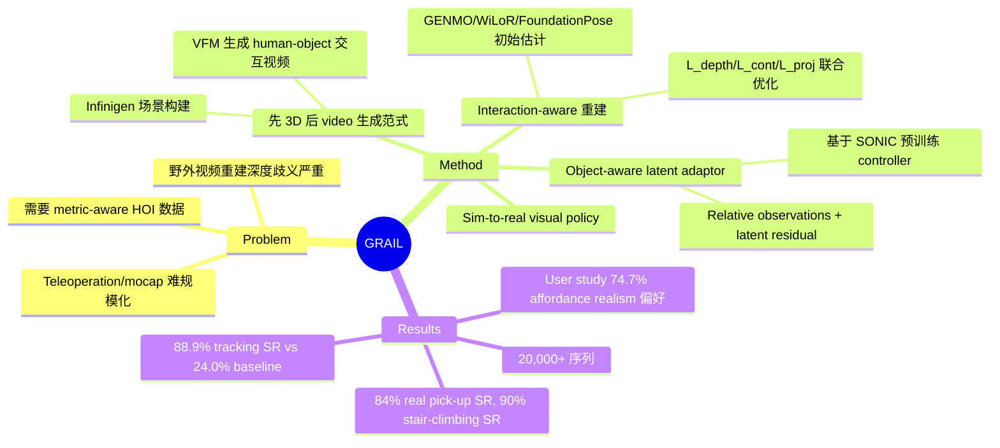

## Summary

GRAIL 是一条完全数字化的 humanoid loco-manipulation 数据生成 pipeline，通过先指定 3D 场景配置再调用 video foundation model 生成人-物交互视频，然后用 metric-aware 重建恢复 4D 交互轨迹，retarget 到 humanoid 训练 tracking policy，最终在 Unitree G1 实现 84% 物体抓取成功率和 90% 爬楼梯成功率。

## Problem & Motivation

Humanoid loco-manipulation 数据扩展面临两难：teleoperation 和 mocap 需要物理设备、人工操作、难以规模化；直接从野外视频重建则要从模糊的单目输入中同时推断相机参数、metric scale、物体几何、接触关系，深度歧义严重。现有方法要么依赖昂贵的物理采集，要么重建质量不足以支撑 sim-to-real。

## Method

### 四阶段 pipeline

**Stage 1: Robot-Centric Human Video Generation**

核心设计是先构建完整的 3D 配置再生成视频，而非反向推断。Pipeline 先用 Infinigen 构建场景、用刚体仿真让物体 settle 到稳定初始状态、渲染首帧（已知相机内外参），然后让 VLM 生成交互 prompt，最后用 video foundation model（如 Kling）在静态相机设定下生成 reference HOI 视频。关键是场景中的人物角色按目标 humanoid 比例预拟合，保证生成的动作尺度与机器人匹配。

**Stage 2: Interaction-Aware HOI Reconstruction**

分两步恢复 4D human-object interaction 轨迹：

- **初始运动估计**：GENMO 提供 SMPL-X body pose（shape 固定为预拟合角色）、WiLoR 细化 MANO 手部参数（带时序插值和 Savitzky-Golay 平滑）、FoundationPose（fine-tune 5 epochs，depth 通道置零用于纯 RGB 跟踪）跟踪物体 6-DoF pose。
  
- **联合优化**：独立重建结果会产生 misalignment，系统对所有帧的 residual motion 参数做优化，损失函数包含：
  - **L_kp**（keypoint alignment）：最小化投影与检测到的 2D body/hand keypoint 距离
  - **L_proj**（object projection）：保持 FoundationPose 的 image-space 对齐
  - **L_depth**（depth alignment）：用 MoGe-2 深度估计（对齐到 ground-truth 背景深度）通过 SAM2 分割出 human/object，双向 Chamfer distance 恢复 metric scale
  - **L_cont**（contact alignment）：VLM 预测每帧接触标签，驱动接触 body vertices 与 filtered object vertices 的 depth-only Chamfer distance
  - **L_reg**（regularization）：抑制 foot skating + pelvis velocity matching + 时序平滑

**Stage 3: Task-General Loco-Manipulation Tracking**

将 retarget 后的动作转为 tracking policy，基于预训练的 whole-body controller SONIC 构建两个专门化模块：

- **Object-Aware Latent Adaptor**：冻结 SONIC 的 encoder/quantizer/decoder，只训练一个 adaptor 观察本体感知 + object reference（pose、hand-to-object transforms、contact forces、BPS shape encoding、delta observations），输出 64-dim latent residual（缩放 λ=0.1）+ 2-dim binary hand primitives（映射到每手 7 finger DoFs）。架构：3-layer MLP [512, 256, 128] + SiLU。

- **Scene-Aware Tracker**：端到端 fine-tune controller，加入 height-map encoder（11×11 grid，1.5m extent，0.15m resolution，3-layer CNN [64, 128, 256]）用于 terrain-conditioned control。带 parallel kinematic decoder 做辅助 MSE 正则。

Reward 设计：motion tracking 用 exponential reward over reference-simulation discrepancies（root pose、body positions/orientations、velocities）；object-aware tracking 额外加物体 pose tracking reward + contact-gated grasp reward（三部分：sustained contact、opposing thumb-index approach、fingertip proximity to contact centroid）。

**Stage 4: Sim-to-Real Deployment**

将 tracking policy 蒸馏为 egocentric visual policy（消费头部相机 RGB 输入），训练时用 domain randomization。部署时 G1 连接带 RTX 5090 GPU 的台式机，用 Luxonis OAK-D W 相机，10 Hz 推理频率。

### 数据规模

生成 20,000+ 序列，涵盖四类任务：
- **Pick-up**：diverse grasp strategies，varying shapes and placement heights
- **Whole-body manipulation**：carrying、pushing、repositioning larger items while walking
- **Sitting**：diverse chair styles with approach、adjustment、settling
- **Terrain traversal**：procedurally generated curbs、slopes、stairs

从 1,000 object assets（Robocasa、ComAsset、OMOMO、Hunyuan3D）+ 1,000 terrain configurations 生成。

## Key Results

**HOI Generation Quality**（Table 1，20 objects from ComAsset，对比 CHOIS/HOIDiff/DAViD）：
- Contact distance: 0.008 vs. 0.012（HOIDiff 最优 baseline）
- Penetration ratio: 0.90% vs. 1.46%（DAViD）
- Interaction Score: 3.58 vs. 2.74（DAViD）
- Tracking Success Rate: 88.9% vs. 24.0%（DAViD）
- Body Deviation: 0.0913 vs. 0.2120（HOIDiff）
- Object Deviation: 0.0851 vs. 0.3352（HOIDiff）

**Task-General Tracking**（Table 2，124 motions across 43 objects，对比 HDMI/ResMimic）：
- Success Rate: 81.4% vs. 49.2%（ResMimic）、48.5%（HDMI）
- Object Position Error: 0.135 vs. 0.393（ResMimic）、0.283（HDMI）

**Ablation**（Table 2）：
- 移除 SONIC：SR 降至 45.0%
- 禁用 latent adaptor（vanilla SONIC）：SR 降至 39.7%（尽管 body tracking 最好）
- 用绝对观测替代相对观测：SR 降至 57.9%

**Reconstruction Loss Ablation**（Table 8）：
- 移除 L_proj：SR 降至 41.6%
- 移除 L_depth：SR 降至 42.6%
- 移除 L_cont：SR 降至 53.3%

**Sim-to-Real Deployment**（Table 3）：
- **Stair-climbing**: 90% real-world success rate
- **Pick-up (seen objects)**: 84% average（cube、apple、tea box、carrot、wet wipes）
- **Pick-up (unseen objects)**: 80% average（spray can、lint roller、peach、flashlight、medicine bottle）

**User Study**（30 participants，3-of-4 sampling）：
- GRAIL preferred for affordance realism: 74.7%
- GRAIL preferred for physical plausibility: 70.9%

**Runtime**（单个 5-second 121-frame 序列，单 A100）：约 14 分钟，joint optimization 占 ~8 分钟。训练单个 policy（2,000-4,000 motions，64 L40 GPUs）：~30 小时，摊销 ~0.5-0.9 分钟/motion。Fine-tuning 新动作收敛约 6,000 iterations（~6 小时）。

## Strengths & Weaknesses

**Strengths**:
- **设计聪明**：先指定 3D 场景再生成视频，彻底解决了野外视频重建的深度歧义和 scale 不确定性问题，这是核心 insight。用 video foundation model 的 human manipulation prior 而非直接生成 robot video，巧妙绕过了 VFM 对机器人数据稀缺的限制。
- **工程完整**：四阶段 pipeline 每个环节都有针对性设计——L_depth 用 ground-truth background 对齐 MoGe-2 depth、L_cont 用 VLM 预测接触标签驱动优化、object-aware adaptor 的 relative observations 设计都是精心打磨的细节。Ablation 证明每个损失项都不可少。
- **数据规模 + Sim-to-Real 效果**：20,000+ 序列 + 84% real-world pick-up SR、90% stair-climbing SR 证明了 pipeline 的实用性。对 unseen objects 也有 80% SR，泛化性不错。
- **实验全面**：HOI generation、tracking、sim-to-real、user study、ablation 覆盖完整 pipeline，数字亮眼（88.9% tracking SR vs. 24.0% baseline、contact distance 0.008 vs. 0.012）。

**Weaknesses**:
- **依赖性强**：需要 3D object assets、simulator-ready scenes、cooperative VFM，这三样都不是轻易能拿到的。论文说"severe occlusion、fast motion、inconsistent object appearance from VFM"会让重建质量下降，failure filtering 丢弃了 non-trivial fraction 的序列——到底丢了多少？这个 overhead 没说清楚。
- **Task-general 的边界模糊**：论文强调 task-general，但 Table 2 的 ablation 显示移除 SONIC 后 SR 只有 45%，说明对预训练 controller 依赖很重。而且"motion family 变化显著时仍需 training 或 fine-tuning"——那到底哪些任务能 zero-shot、哪些需要 fine-tune？论文没给清晰的 boundary。
- **Video Foundation Model 是黑盒**：整个 pipeline 的成败绑定在 Kling 等 VFM 的生成质量上，但 VFM 本身是黑盒、不受控。如果 VFM 生成的视频物理不合理或交互不自然，后续再精心优化也救不回来。User study 说 GRAIL 在 affordance realism 上胜出 74.7%，反过来看就是 25.3% 的人觉得不如 baseline，这个比例不算低。
- **Real-world 评估有限**：只在 Unitree G1 上测试，只有 pick-up 和 stair-climbing 两类任务，每类只有少量物体（seen 5 个、unseen 5 个）。Whole-body manipulation 和 sitting 都没有 real-world 结果，不知道是因为 sim-to-real gap 太大还是硬件限制。

**潜在影响**：这篇工作最大的价值在于证明了"先 3D 后 video"的生成范式可以绕过野外视频重建的根本困难，同时利用 VFM 的 human prior 扩展 humanoid 数据。如果 3D assets 和 VFM 质量持续提升，这条 pipeline 有潜力成为 humanoid loco-manipulation 数据的主流生产方式。但短期内 3D assets 获取成本、VFM 可控性、task generality 边界都是卡点。

## Mind Map

## Notes

- **关键 insight**："先指定 3D 场景再生成视频"这个设计是整篇论文的灵魂，彻底解决了 metric scale 和深度歧义问题。这比"先生成视频再重建"的范式在工程上更可行。
- **与 [[2503-GR00TN1]] 的对比**：GR00T-N1 强调 generalist humanoid policy，GRAIL 专注于 loco-manipulation 数据生成 pipeline。两者互补——GR00T 可以用 GRAIL 生成的数据训练。
- **与 VLA 的关系**：GRAIL 的 visual policy 本质上是 VLA 的一种实现，但专门针对 humanoid whole-body control 设计。Object-aware latent adaptor 的设计（relative observations + frozen SONIC）值得借鉴。
- **疑问**：Failure filtering 到底丢了多少数据？论文说"non-trivial fraction"但没给具体数字，这对评估 pipeline 效率很重要。Whole-body manipulation 和 sitting 为什么没有 real-world 结果？是 sim-to-real gap 太大还是评估资源不够？
