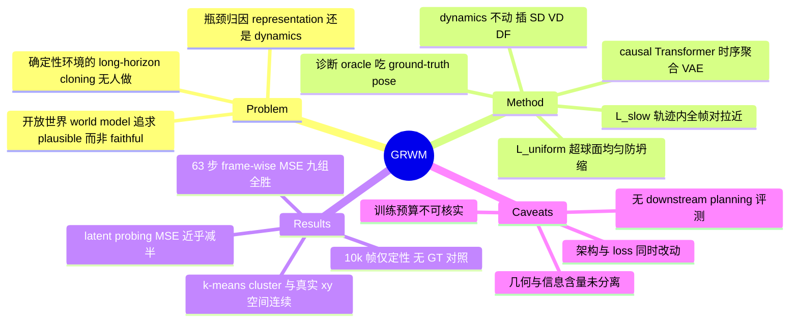

## Summary

GRWM 研究 deterministic 3D 环境的 long-horizon cloning，主张 rollout 崩坏的瓶颈在 autoencoder 的 latent 几何结构而非 dynamics model，方法是在带 causal Transformer 时序聚合的 VAE 上加 temporal slowness 与 hypersphere uniformity 两项正则。在 M3x3-DET / M9x9-DET / MC-DET 三个自建数据集与 SD/VD/DF 三个 dynamics backbone 上，63 步 frame-wise MSE 与 latent probing MSE 都优于 vanilla VAE。但全部量化指标都是 pixel 重建或 latent 回归，没有任何 downstream planning/control 评测，且 GRWM 相对 baseline 同时改动了 encoder 架构与 loss，"latent geometry 是关键变量"的因果归属并不干净。

## Problem & Motivation

作者的出发点是：主流 world model 押在 open-world 与 stochastic 生成上，追求 plausibility 和 diversity，但对需要可靠预测的固定任务（fixed-map 机器人导航、静态地图上的 game AI）不适用——这类模型产出的未来"只是看起来合理，而不是忠实的"。论文因此提出 deterministic cloning 问题：给定初始观测 o1 与动作序列，模型必须复现那条唯一真实轨迹，而不是生成一个可信的替代世界。

选择 deterministic 设定是刻意的方法论安排而非最终目标。作者明说这是一个 controlled setting，用来定位 long-horizon fidelity 的瓶颈成分：没有随机性意味着 fidelity 可以被严格评估，而且底层 state 低维、可获取，从而可以构造一个 oracle 上界。

论文对现有工作的判断是：representation learning 与 dynamics modeling 这两个挑战本质耦合，但社区把绝大部分精力投在了更强的 latent transition model 与 causal/relational inductive bias 上，autoencoder 被当作纯工程件——只负责压缩，优化目标是重建质量，没人管 latent 的几何形状是否有利于长程外推。

## Method

**第一步是一个诊断实验，而不是方法。** 作者构造 oracle world model：encoder 把观测历史映射到上一时刻状态 ŝ(t-1) = f_enc(o(t-k:t-1))，dynamics 预测 ŝt = f_dyn(ŝ(t-1), at)，decoder 重建 ôt = f_dec(ŝt)。区别在于 oracle 直接吃 ground-truth agent pose (x, y, θ)。两个模型架构相同，只有 latent 来源不同：oracle 长程近零误差，VAE-WM 误差迅速累积。作者据此断言瓶颈在 representation 而非 dynamics。

**Temporal Contextualize Architecture。** 动机是 perceptual aliasing——迷宫里不同位置的第一人称观测可能几乎相同，单帧无法确定全局状态，必须跨时间聚合。每帧先由 2D CNN 独立编码，再由带 sliding window 的 causal Transformer 聚合成 zt；decoder 只从 zt 重建当前帧 ôt，保证 zt 是"被历史 enrich 过的当前状态"的紧凑表示。

**Temporal Contrastive Regularization。** zt 过一个线性 projection head 得到 p，L2 归一化到单位超球面上得 p'，两项正则都作用在 p' 上：

- `L_slow`：同一条轨迹 context window 内**所有帧对**的平均 L2 距离，逼轨迹段映射成超球面上一条紧凑连续的路径。
- `L_uniform`：对 batch 内**跨轨迹**的负样本对取 log E[exp(-2·dist²)]，防止 slowness 单独作用导致的表示坍缩。

总目标为 `L_total = L_recon + β·L_KL + λ_slow·L_slow + λ_uniform·L_uniform`。

**dynamics model 完全不动。** 表示模块被插到三个现成的 latent generative world model 上：Standard Diffusion（即 DIAMOND，[[2405-DIAMOND]]）、Video Diffusion、Diffusion Forcing。这是论文比较设计里最干净的一环——dynamics 侧严格对齐。

## Key Results

**Rollout fidelity（主结果，Fig. 3）**：frame-wise pixel MSE，63 步，3 数据集 × 3 dynamics model 共 9 组，GRWM 全部优于 vanilla-VAE baseline，且差距随 rollout 长度扩大；oracle 作为误差下界。这是论文唯一的主文量化 rollout 证据。

**Latent probing（Table 1）**：冻结 encoder，用小 MLP 从 latent 回归 ground-truth (x, y, θ)，held-out 回归 MSE 从 VAE-WM 的 0.082 / 0.106 / 0.137 降到 GRWM 的 0.031 / 0.058 / 0.081（M3x3-DET / M9x9-DET / MC-DET）。

**Latent clustering（Fig. 7）**：latent 上做 k-means（k=20），把每帧画在其真实 (x, y) 坐标处并按 cluster ID 上色。VAE 的 cluster 碎裂散布，同色点落在地图上互不相邻的区域；GRWM 的 cluster 空间连续，基本对应具体走廊或房间。

**定性长程（Sec. 6.3）**：M9x9-DET 上跑 10,000 帧连续生成（每 1000 步采一帧展示），MC-DET 上 100 帧，M9x9-DET 上另看 100 / 400 帧。VAE-WM 陷入重复低复杂度画面，作者的解释是模型在视觉相似但因果不连通的区域之间"teleport"——pixel 重建损失把同色不同墙映射到相邻 latent，制造了低重建误差的 attractor state。这些结果没有配任何数字。

**Supplementary**：Maze 9x9 感知指标——DF 的 SSIM 0.8448→0.8516、rFID 4.4345→2.8729；VD 0.5979→0.7537、18.1453→7.2813；SD 0.8367→0.8369、6.4686→4.5200（SD 的 SSIM 基本没动，只有 rFID 改善）。Atari 补充实验 Asterix PSNR 28.57→29.04、Breakout 34.23→37.76，作者自陈"limited in scale and not intended as a full Atari benchmark"。消融：两项 loss 缺一不可（单独去掉任一项，rollout 发散出 NaN，只能报 autoencoder 训练期的 loss 统计）；projection head 把 L_recon 从 0.00291 降到 0.00061 而 probing 基本不变；latent dim 16/32/64/128 上 GRWM 全面优于 baseline 且几乎不受维度影响，而 vanilla VAE 维度越大反而越差；all-pairs 的 slowness 优于 adjacent-only。

## Evidence Ledger

| Claim ID | Claim | Type | Source locator | Evidence excerpt | Status |
|:--|:--|:--|:--|:--|:--|
| C1 | Oracle（吃 ground-truth pose）长程近零 MSE，架构相同的 VAE-WM 误差迅速累积 | causal-mechanism | p.32605 Sec. 4 / Fig. 1 | "the oracle maintains near-zero error over long horizons, while VAE-WM accumulates error rapidly" | source-verified |
| C2 | 主量化 rollout 指标为 63 步 frame-wise pixel MSE，9 组组合中 GRWM 全胜 | number | p.32607 Fig. 3 / Sec. 6.2 | "consistently outperforms baselines (dashed lines)... over 63 steps" | source-verified |
| C3 | Latent probing MSE 0.082/0.106/0.137 → 0.031/0.058/0.081 | number | p.32608 Table 1 | "VAE-WM 0.082 0.106 0.137 GRWM 0.031 0.058 0.081" | source-verified |
| C4 | 10,000 帧 rollout 仅有可视化，无任何量化指标；且使用随机采样动作序列 | benchmark-setting | p.32607 Sec. 6.3 / Fig. 6 | "We use a sequence of randomly sampled actions to simulate an trajectory" | source-verified |
| C5 | 全文与附录均无 downstream control / planning / task-success 评测，指标只有 MSE、SSIM、rFID、PSNR 与 latent 回归 | benchmark-setting | Sec. 6.2/6.4 p.32606-32608；Supp. B-C | "We evaluate prediction fidelity using frame-wise MSE" | source-verified |
| C6 | GRWM 的 encoder 用 causal Transformer 聚合滑窗历史帧，与 baseline 的差异不止于两项 loss；无"保留时序架构、去掉两项正则"的对照 | benchmark-setting | p.32605 Sec. 5.1；Supp. Table 3 (E.1) | "aggregated by a causal Transformer with a sliding temporal window" | source-verified |
| C7 | 论文自陈 GRWM 相对标准 VAE world model 有额外计算开销 | comparison | p.32609 Sec. 8 | "GRWM introduces additional computation beyond a standard VAE-based world model due to temporal aggregation and geometric regularization" | source-verified |
| C8 | Latent dim 16/32/64/128 消融中 GRWM 每一档都优于 vanilla VAE-WM，baseline 对维度高度敏感 | number | Supp. E.3 Fig. 4 | "GRWM consistently outperforms the vanilla VAE-WM across all tested dimensions" | source-verified |
| C9 | 环境为 MuJoCo 渲染的 Memory-Maze 3x3/9x9 与 Blender 渲染的 Minecraft 地图；离散三动作；每数据集 5000 条轨迹、单条至多 1000 帧 | benchmark-setting | Supp. D p.1；p.32606 | "Each dataset contains 5000 trajectories in total" | source-verified |
| C10 | Atari 补充实验 Asterix PSNR 28.57→29.04、Breakout 34.23→37.76，作者自陈规模受限、非完整 benchmark | number | Supp. C Table 2 | "this experiment is limited in scale and is not intended as a full Atari benchmark" | source-verified |
| C11 | Maze 9x9 上 SD 的 SSIM 几乎未变（0.8367→0.8369），仅 rFID 改善（6.4686→4.5200） | number | Supp. B Table 1 | "SD 0.8367 0.8369 6.4686 4.5200" | source-verified |
| C12 | Limitations 明确承认 partially observable / stochastic / photorealistic 场景的扩展未解决，且与 oracle 仍有大差距 | benchmark-setting | p.32609 Sec. 8 | "Scaling to more complex settings—such as partially observable, stochastic, or photorealistic environments—remains unresolved" | source-verified |
| C13 | GRWM 与 baseline 是否在对齐的 compute / data / 训练轮数预算下训练 | comparison | Supp. A p.1（训练配置全部推给代码库） | "Detailed training configurations... are available in the accompanying code repository" | not-checkable |

## Strengths & Weaknesses

**值得借鉴的地方。** 最有价值的不是 GRWM 这个方法，而是它的实验设计姿势：选一个能构造 oracle 上界的受控环境，先问"到底哪个组件是瓶颈"，再针对性地下药。world model 领域绝大多数论文没有这一步，直接堆 dynamics model 容量。dynamics 侧跨三个 backbone 保持不变、只换表示模块，这是一个真 intervention 而非事后相关性观察。latent dimension 消融（16/32/64/128 每档 GRWM 都赢）是全文最有信息量的对照，它排除了"GRWM 只是 latent 容量更大"这个平凡解释；顺带那个负面发现——vanilla VAE 的 latent 越大长程误差反而累积越快——本身就值得单独记住。"teleportation" 的失效机制解释（pixel 重建损失把同色墙映射到相邻 latent，制造低误差 attractor）是具体且可证伪的，不是含糊的叙事。Limitations 节对环境复杂度、视觉伪影、计算开销、与 oracle 的剩余差距都做了诚实交代。

**"critical" 的因果归属并不干净，有两处混淆。** 第一，撑起标题的 Sec. 4 诊断实验根本不是对几何的干预。把学到的 latent 换成 ground-truth (x, y, θ)，改变的是**信息含量**而不只是几何：论文自己在 5.1 节承认"oracle 用的是坐标，直接编码全局状态，而图像只提供局部信息"。一个信息严格更多、且天然消歧的 oracle 会赢，与它的几何形状无关。所以这个实验能支持的结论是"瓶颈在 dynamics model 的上游"，而不是"瓶颈是 latent 的几何结构"——后者是论文 contribution 1 的原话，比证据强。第二，GRWM 相对 baseline 同时改了两件事：encoder 架构（causal Transformer 聚合 k 帧历史）与两项正则损失。消融只做了"去掉其中一项 loss"（两个变体都发散成 NaN），从未报告"保留时序架构、两项正则全去掉"的对照。于是"时序上下文解决了 perceptual aliasing"与"contrastive 几何修正了流形"这两个解释无法分离——而 5.1 节给出的 aliasing 论证恰恰是一个信息论证，不是几何论证。结论：对正则项确有干预证据，对"几何是那个起作用的变量"则没有完成识别。

**deterministic 的边界，论文基本认了，但标题没认。** 环境是 MuJoCo 的 Memory-Maze 3x3/9x9 加一张围起来的 Minecraft 地图，离散三动作，ground-truth state 只有三维。Sec. 8 明确写了 partially observable / stochastic / photorealistic 未解决。需要说清楚这里**不能**外推什么：一是随机动态——那里多个未来都合法，pixel MSE 会主动奖励模糊的均值预测，整套指标的方向会反过来，而这恰是论文批评的"plausible 而非 faithful"的镜像失败；二是真实视频——那里不存在紧凑的 ground-truth state，构造不出 oracle，"与 oracle 的差距"这个全文核心叙事框架直接失效。但标题里 "in Long-Horizon World Models" 没有 deterministic 限定，引言里"GRWM 作为 plug-and-play 组件系统性地为 SOTA world model 解锁长程保真度"也是无限定的推广句；附录那两个 Atari 游戏被作者自己标注为"非完整 benchmark"，撑不起这个推广。

**"long-horizon" 量化到 63 步，其余是看图。** 10,000 帧和 400 帧的结果只有可视化。更要紧的是 10,000 步那张图用的是随机采样的动作序列，且没有 ground-truth 对照行，判据实际上是"GRWM 的画面更多样、更连贯"——在一篇以"plausible 不等于 faithful"立论的论文里，用视觉多样性来评判旗舰长程结果，正是它自己要批判的那种推理。全部量化指标都是 pixel 空间重建量或对 (x, y, θ) 的 latent 回归探针，全文与附录没有任何 downstream control / planning / task-success 评测——尽管引言是用"给 RL agent 当 simulator"和"机器人任务规划"来立动机的。按 [[2607-GigaWorld1]] 的判据（evaluator 质量取决于 long-horizon action fidelity 而非视觉观感）和 [[2506-VJEPA2]] 的做法（latent world model 一路做到 zero-shot robot planning），GRWM 的实用性主张尚未被检验。顺带一提，latent probing MSE 才是全文最接近"可用动态"的指标，却占篇幅最少。

**baseline 的 dynamics 对齐了，encoder 预算没有。** SD / VD / DF 三个 dynamics model 保持不变是干净的；但表示侧不对齐：GRWM 多了 Transformer 时序聚合，论文自己承认计算开销更高。训练配置（超参、轮数、数据预算）在正文与附录都没有，附录 A 把它整体推给代码库，因此**从一手来源无法核实两者是否在对齐预算下训练**（见 Evidence Ledger C13）。另一个缺口是表示侧的对照只有 vanilla VAE：DINO-WM、denoised MDP、CLTT 系方法都在 Related Work 里被引，却没有一个进入实验。所以"contrastive constraint 是强 inductive bias"这个结论，是相对"不加正则"成立的，不是相对"别的表示学习目标"成立的。

**其他。** 全文没有 seed 或方差报告。附录 Table 4 的 VAE-WM probing MSE 记为 0.136，未注明数据集，与正文 Table 1 的三个值（0.082/0.106/0.137）都不精确吻合，而同表 GRWM 的 0.058 恰好等于 M9x9-DET 的值；Table 3 与 Table 4 的 L_recon 也有小幅出入。大概率是不同 run，但在没有方差报告的前提下，这类不一致无法判断量级。

**对领域的意义。** 这个 reframing 是健康的纠偏：[[WorldModel-Survey]] 里反复出现的判断是这条线 engineering-heavy、insight-light，而本文至少在受控设定下尝试给出机制性断言，deterministic-oracle 这个诊断台也可复用。但作为证据，它是一个规模很小的存在性证明，而不是被证明的普遍规律；标题的因果措辞跑在了证据前面。评 3 分：方法论姿势值得偷，结论不宜直接引用。

## Mind Map

## Notes

- 最想追的一个对照实验：把时序 Transformer encoder 保留、两项正则全部去掉，训一个纯重建版本。如果它已经接近 GRWM，那么标题里的 "latent geometry" 就该改成 "temporal context"；如果差距仍大，几何这条因果链才立得住。论文缺的正是这一格。
- oracle 那个诊断可以被更严格地改造：与其换成 ground-truth 坐标，不如保持信息含量不变，只对同一个 latent 施加不同的度量/正则（例如冻结 encoder 后学一个保持互信息的重参数化），再看 rollout 是否随几何变化。那才是对"geometry 是关键变量"的直接干预。
- deterministic cloning 与 [[2408-GameNGen]] 的 DOOM clone、[[2402-Genie]] 的可控生成构成三个点：GameNGen 也是确定性游戏世界但走 pixel-space 高保真路线，Genie 走的是多样性。把三者放在"faithful vs plausible"这一轴上对比，可能比本文的单点结论更有价值。
- 与 [[2506-VJEPA2]] / [[2608-JEPAWAM]] 的 JEPA 路线共享同一直觉——在表示空间而非像素空间预测——但 JEPA 侧的论证是"预测目标应该在表示空间"，本文的论证是"表示空间的几何应该被显式约束"。两者正交，理论上可叠加，值得试。
- [[HyperbolicManifold-Survey]] 那条线关心的是 latent 的**曲率选择**（Poincaré ball 等，见 [[1700-PoincareEmbeddings]]），本文关心的是超球面上的**度量对齐**。同样叫"几何"，问的问题不同；但"latent 几何决定下游动态建模难度"这个假设是共享的，如果本文的因果链能被坐实，反过来会给曲率选择那条线提供一个 world model 场景下的验证任务。
- pixel 指标与可用动态脱钩这件事在 vault 里已多次出现（[[2607-GigaWorld1]] 的 evaluator agreement、[[2607-Wonder]] 的 16 FPS 不等于决策可用）。本文是又一个数据点，且是把 pixel MSE 当作唯一主指标的极端形态。
