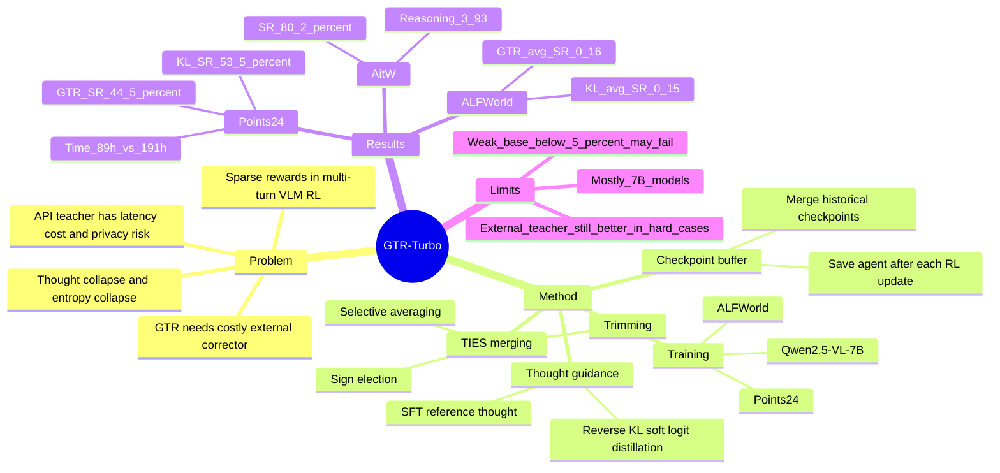

## Summary
GTR-Turbo 解决 multi-turn VLM agent RL 中 sparse reward 和 long-horizon credit assignment 导致的 thought collapse，以及 GTR 依赖昂贵外部 teacher 的可扩展性问题。它把 RL 过程中保存的 historical checkpoints 用 TIES merging 合成一个“free teacher”，再用 SFT thought guidance 或 reverse-KL soft logit distillation 指导后续 PPO，在 Points24、ALFWorld 和 Android-in-the-Wild 上验证了更低成本的 agentic VLM training。

## Problem & Motivation
多轮 VLM agent 训练的问题不是简单“给最终成功奖励再 PPO”即可解决：在 Points24、ALFWorld 这类环境中，reward 稀疏、trajectory 长、action space 大，vanilla RL 容易让 reasoning output 变得重复、模板化和不一致，即论文称为 thought collapse / entropy collapse 的现象。

GTR 通过外部 VLM corrector 给 step-level thought guidance，能缓解这个问题，但代价很重。论文报告在 Points24 上用 GPT-4o corrector 训练 LLaVA-v1.6-mistral-7B 15,000 steps 需要 86h、33.5M tokens、约 \$146.56；换成 Qwen2.5-VL-72B 虽然 token cost 降到约 \$18.59，但训练时间变成 110h、corrector performance 只有 6.5%；Qwen2.5-VL-7B corrector 则无法提供有效 thought guidance。

因此作者要回答的问题是：能否在不依赖 GPT/Gemini 这类 privileged external teacher、不增加人工标注和额外 teacher training 的情况下，仍然获得 process guidance，让 VLM agent 在复杂 visual interactive environments 中稳定自我改进。

## Method
**核心假设：historical checkpoints 本身可以形成 teacher。** GTR-Turbo 在每次 RL update 后保存 agent checkpoint，并维护一个 checkpoint buffer。第 `k` 轮训练时，将此前 checkpoints 合并为 `pi_merged`，用它作为当前 agent 的 teacher。论文的 proof-of-concept 显示，在 Points24 上用 Qwen2.5-VL-7B 训练时，merged checkpoint 的 success rate 和 return 曲线比 current checkpoint 更稳定、更高，因此可以作为后续训练的 reference。

**Model merging 设计。** 论文采用 TIES merging，而不是直接 linear averaging。TIES 包含 trimming、sign election、selective averaging：先保留 top-k magnitude 的参数变化，再对每个参数方向做 sign vote，最后只平均与 elected sign 一致的参数。权重策略上比较了 SMA 和 EMA；主实验使用简单算术平均已经有效，EMA 中 `alpha=0.5` 最好，但过高或过低都会削弱 historical checkpoint 的作用。

**两种 thought guidance。**

1. **GTR-Turbo (SFT)**：用 merged teacher 在同一 observation/context 下生成 reference thought，把 reference thought 存入 thought dataset，并在 PPO action objective 之外增加 SFT loss。它结构上最接近原始 GTR，只是把 GPT/Gemini corrector 换成 merged checkpoint teacher。
2. **GTR-Turbo (KL)**：不让 teacher autoregressively 生成 reference thought，而是对 agent 已生成 thought 的 token logits 计算 teacher/student reverse KL，把 clipped non-negative KL 作为 auxiliary reward 加入 PPO。这个版本只需要一次 forward pass，不需要额外 thought dataset，论文认为它更快，也比 one-hot SFT supervision 更放松，能保留更多 exploration。

**训练与任务。** 主实验用 Qwen2.5-VL-7B，先做一轮 SFT 初始化，再做 RL；Points24 训练 30,000 steps，ALFWorld 训练 20,000 steps，均比前作训练预算更长。Points24 要从图片中识别扑克牌并构造等于 24 的公式；ALFWorld 在论文设置中移除了文本场景描述，只保留 RGB image observation 和 action history，因此更强调视觉识别、long-horizon planning 和 commonsense reasoning。

## Key Results
**Points24.** GTR-Turbo (KL) 在最终评估中达到 **53.5% success rate / 2.39 episode return**，高于 GTR 的 **44.5% / 0.53**、GTR-Turbo (SFT) 的 **48.0% / 1.32**、Qwen2.5-VL-7B-sft 的 **22.0% / -3.2**、GPT-4o + Tool 的 **13.5% / -3.59** 和 RL4VLM 的 **3.5% / -13.3**。按 Table 4 的训练开销，Points24 上 GTR 为 **41% SR / 191h / \$307.78 / 70.35M tokens**，GTR-Turbo (KL) 为 **54% SR / 89h / \$114.81**，训练时间约为 GTR 的 46.6%，额外成本约为 GTR 的 37.3%。

**ALFWorld.** 在视觉 ALFWorld 上，GTR-Turbo (KL) 达到 **0.15 average success rate**，接近 GTR 的 **0.16**，高于 RL4VLM 和 Qwen2.5-VL-7B-sft 的 **0.08**，但低于 GPT-4o 的 **0.42** 和 Qwen2.5-VL-72B 的 **0.32**。按 Table 4，ALFWorld 上 GTR 为 **16% SR / 164h / \$145.76 / 30.94M tokens**，GTR-Turbo (KL) 为 **15% SR / 78h / \$100.62**，说明它主要赢在本地、自举和效率，而不是超过强外部模型本身。

**Android-in-the-Wild.** Appendix C.2 在 AitW 上用 Qwen3-VL-8B-Instruct 测试，GTR-Turbo 达到 **80.2% success rate / 3.93 reasoning score**，高于 PPO 的 **75.0% / 3.26** 和 DigiRL 的 **71.9% success rate**。这说明方法不只限于 Points24 / ALFWorld，也能迁移到 GUI benchmark，但该实验是 appendix 规模，且论文说未做 heavy hyperparameter tuning 和 reward shaping。

**Ablations.** 静态 base model KL regularization 无法像 GTR-Turbo 一样稳定提升，说明 teacher 必须随训练通过 checkpoint merging 更新；Rejection Sampling 无法解决 Points24，因为 agent 很难先产生可模仿的成功轨迹。只指导 thought 比同时指导 thought + action 更好，后者会限制 exploration；TIES merging 优于不使用 TIES 的线性合并；KL estimator 中 clip non-negative part 效果最好，forward KL peak 也高但略弱于 reverse KL；merging interval 到 10 仍有可用结果，说明方法对 merging frequency 有一定鲁棒性。

## Strengths & Weaknesses
**已知亮点。** 方法抓住了一个很实用的杠杆：GTR 的主要瓶颈不是“有没有 dense thought guidance”这个思想，而是 teacher 依赖外部闭源 API、token cost、latency 和隐私风险。GTR-Turbo 把 training trajectory 中已经付出成本得到的 checkpoints 重新利用为 teacher，方法简单，和 PPO / GTR 训练管线兼容，并且 SFT 与 KL 两个版本给出了不同效率-约束 trade-off。

**已知亮点。** 实验不是只报最终 SOTA 数字，而是把核心设计逐项拆开：merged checkpoint vs current checkpoint、static base reference、Rejection Sampling、guidance range、TIES merging、KL estimator、SMA/EMA weighting、merging frequency、Qwen3-VL-8B 兼容性和 AitW 迁移。对理解“为什么 free teacher 有用”比单个 main table 更有信息量。

**已知局限。** 论文明确承认，当 base model 太弱、初始 success rate 低于约 **5%** 时，自我改进路线可能失败，此时仍需要传统 GTR 中更强但昂贵的 external teacher。主实验主要在 **7B** 级模型上完成，作者也说明受资源限制，未来还要验证不同模型规模下是否同样有效。

**已知局限。** 在 ALFWorld 上，GTR-Turbo (KL) 只是接近 GTR（0.15 vs 0.16 average success rate），远低于 GPT-4o 和 Qwen2.5-VL-72B 这类强模型的 zero-shot / API performance；因此不能把它解读为“自举 teacher 已经替代强外部知识”。它更准确的定位是：当外部 teacher 不可用、数据隐私敏感或成本受限时，用本地 checkpoint teacher 尽量保留 GTR 式 process guidance。

**推测。** 这篇对 GUI-agent RL 的潜在价值在于：如果 GUI/desktop 任务中的外部 teacher 昂贵或不可上传屏幕数据，merged checkpoint teacher 可能是一个很现实的 process guidance 替代品；AitW 的 80.2% 结果支持这个方向值得继续看。但 GUI task 的 reward design、真实设备状态漂移和长会话记忆问题没有在主实验中系统展开，不能直接推出它能解决 full desktop automation。

**不知道。** 论文没有给出系统 failure-case taxonomy：例如 ALFWorld 中哪些 task type 仍然失败、Points24 错误来自视觉识别还是算术推理、AitW 中失败是否集中在 grounding、scroll、text input 或 app-state mismatch。正文只显示“Code can be found here”的文字，没有在可读文本中给出可核验 repository URL；DOI 也没有出现。

## Mind Map

## Notes
- 这篇和 GTR 的关系很清楚：GTR 提出 process-guided multi-turn VLM agent RL，GTR-Turbo 解决 GTR 的 teacher scalability。真正的 insight 是“teacher 不一定来自更强模型，也可能来自训练过程中多个较弱 checkpoint 的 ensemble-like merge”。
- 对后续研究的启发：GUI agent / embodied agent 的 RL post-training 可能需要同时比较三类 teacher：external privileged teacher、static base/reference model、dynamic merged checkpoint teacher。否则很难判断提升来自 process guidance 本身，还是来自外部模型的额外知识注入。
- 需要谨慎复现的点是 cost comparison。论文明确说 OpenAI API pricing 和 GPU cost 会随时间变化，不同 provider 价格也不同；因此 Table 4 更适合作为相对效率证据，而不是固定成本结论。
