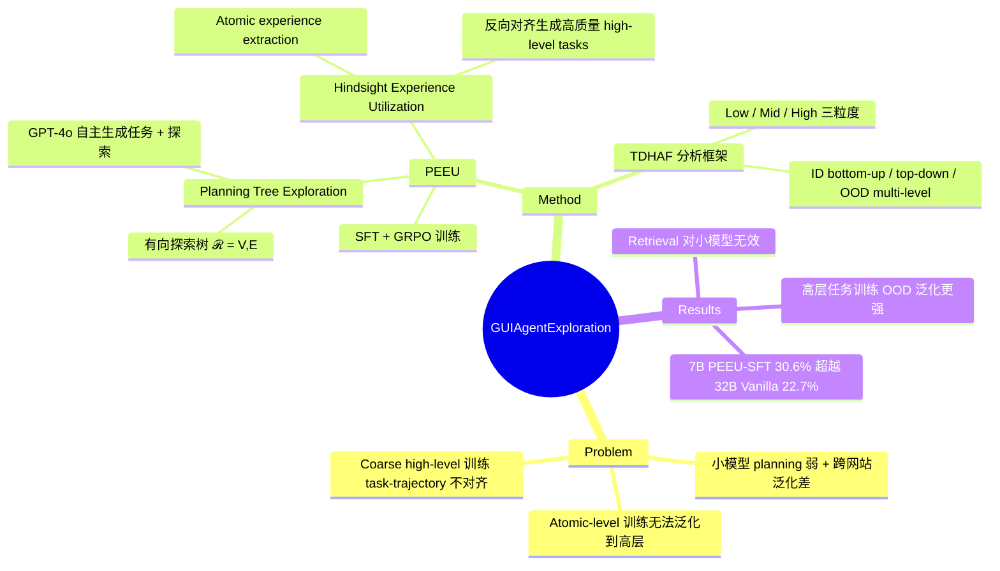

## Summary

提出 PEEU（Planning Experience Exploration and Utilization）框架，通过自主环境探索构建 planning tree，再用 hindsight 反向对齐轨迹与任务来生成高质量高层次训练数据，使 7B 小模型在 WebVoyager 上达到 30.6% 准确率，超越 32B 模型的 22.7%。

## Problem & Motivation

多模态 web agent 依赖 task planning 将复杂任务分解为可执行动作。商业大模型成本高、隐私风险大，而小型开源 MLLM（3B/7B）planning 能力弱、跨网站泛化差。现有后训练方案分两类：(1) 基于 atomic-level 任务训练（click/type/scroll），无法有效泛化到高层复合任务；(2) 基于粗粒度 high-level 任务训练，但任务与轨迹存在 misalignment（如任务要求评分 ≥4.5 但轨迹只到 4 星），且缺乏来自真实探索的严格约束条件。两类方法在相同数据量下均有明显局限。

## Method

**框架：PEEU（Planning Experience Exploration and Utilization）**，分两阶段：

### 阶段一：Planning Tree Exploration
- 给定网站 URL，exploration agent（GPT-4o）与主页交互，自动生成任务列表 $\mathcal{D}$（self-driven task generation）。
- agent 基于任务列表在环境中进行目标驱动探索，构建以主页为根节点的有向探索树 $\mathcal{R}=(V,E)$，树可展开为交错的 observation-action 轨迹序列。

### 阶段二：Planning Experience Utilization（Hindsight）
- **Experience Extraction**：对每步动作前后的视觉观察 $s_t, s_{t+1}$ 用 MLLM 提取 atomic experience $\epsilon_t$，拼接为 trajectory-level experience $\mu$。
- **Hindsight 反向对齐**：用 experience $\mu$ 反向生成更严格约束、更对齐的 high-level 任务 $\tilde{d}$（即任务由轨迹决定，而非反过来），消除 coarse 方法中的 task-trajectory mismatch。
- **训练**：用合成的 $(\tilde{d}, \tau)$ 对做 SFT 或 GRPO 训练，支持 Qwen2.5-VL-3B/7B。

**TDHAF（Task Decomposition Hierarchical Analysis Framework）**：配套分析框架，将任务划分为 low/mid/high 三个粒度层级，从 ID bottom-up、ID top-down、OOD multi-level 三个维度研究组合泛化能力。

实验设置：探索阶段 GPT-4o 做 exploration，最大步长 15；训练在 4×A800 上进行，SFT 用 llama-factory，GRPO 用 verl 框架；两种数据规模（0.1k / 2k trajectories）。

## Key Results

**WebVoyager benchmark（7 个 OOD 网站，trajectory-level success rate）：**

| 模型 & 方法 | Overall |
|:---|:---|
| GPT-4o Vanilla | 59.0% |
| Claude 3 Opus Vanilla | 56.1% |
| Qwen2.5-VL-72B Vanilla | 29.3% |
| Qwen2.5-VL-32B Vanilla | 22.7% |
| Qwen2.5-VL-7B Vanilla | 7.8% |
| Qwen2.5-VL-7B + Atomic-SFT (2k) | 21.7% |
| Qwen2.5-VL-7B + Coarse-SFT (2k) | 19.0% |
| **Qwen2.5-VL-7B + PEEU-SFT (2k)** | **30.6%** |
| Qwen2.5-VL-7B + PEEU-GRPO (0.1k) | 19.9% |

- 7B PEEU-SFT（2k）以 +8.9% 超越 Atomic-SFT，以 +11.6% 超越 Coarse-SFT，并超越 32B 模型（22.7%）。
- Retrieval-based prompt 方法（Atomic-Prompt / Trajectory-Prompt）对小模型无效，甚至低于 base（3.7% vs 7.8%）。

**TDHAF 分析关键发现：**
- 训练低层任务无法泛化到高层：7B low-level 训练在 low-level 测试达 89.6%，但 high-level 测试仅 18.8%。
- 高层任务训练有更强 top-down 和 OOD 泛化：3B high-level 训练的 OOD coverage 33.8% vs low-level 18.9%。

## Strengths & Weaknesses

**亮点：**
- Hindsight 反向对齐思路清晰，从根源上解决 coarse 方法的 task-trajectory misalignment 问题，逻辑自洽。
- TDHAF 框架提供了一套系统性分析 compositional generalization 的方法论，对 web agent 训练范式有诊断价值。
- 以更小模型（7B）超越大模型（32B Vanilla）的实用价值明确。

**局限：**
- **Exploration 依赖商业模型**：探索阶段使用 GPT-4o，成本不低，削弱了"cost-efficient small model"的论点——如果探索和标注都要 GPT-4o，真正的成本优势在哪里？
- **单一 benchmark（WebVoyager）**：泛化性结论主要来自一个 benchmark，且 WebVoyager 是相对老旧的测试集（2024 年），对当前 SOTA 的相对位置缺乏足够上下文。
- **数据泄漏风险**：WebVoyager 的网站在互联网上是公开的，GPT-4o 探索时可能隐式接触过训练相关内容；hindsight 任务生成也由 GPT-4o 完成，探索与评测之间的 independence 存疑。
- **GRPO 收益有限**：在 2k 数据量下 PEEU 只报 SFT 结果（30.6%），未提供 GRPO 对比；0.1k 的 PEEU-GRPO 仅 19.9%，不如 2k SFT，RL 路径的 scaling 行为不清晰。
- **贡献新颖性**：hindsight relabeling 本质上是 HER（Hindsight Experience Replay）的思路在 GUI agent 上的应用，与 AgentTrek、SWEExplore 等自主探索数据采集工作的差异需要更清晰的 positioning。

## Mind Map

## Notes

- **与 AgentTrek（2412）的关系**：AgentTrek 同样是自主探索 + 轨迹合成，PEEU 的关键差异是 hindsight relabeling 提升对齐质量。值得对比两者生成数据质量的 ablation。
- **与 AsyncWebRL（2606）的关系**：AsyncWebRL 走的是异步 online RL 路线，PEEU 走的是 offline exploration + SFT/GRPO。两条路线在数据效率和泛化上的 trade-off 是有趣的研究问题。
- **Hindsight 的本质**：等价于 goal-conditioned RL 中的 HER（Andrychowicz et al., 2017）——"把失败的轨迹重新标注为在另一个目标上的成功"。在 GUI agent 里是否有其他 HER 变体值得探索？
- **TDHAF 的独立价值**：框架本身可以作为评测工具用于其他 web agent 方法，low→high 泛化差距（80.5%→9.1%）是一个值得跨论文追踪的 empirical finding。
