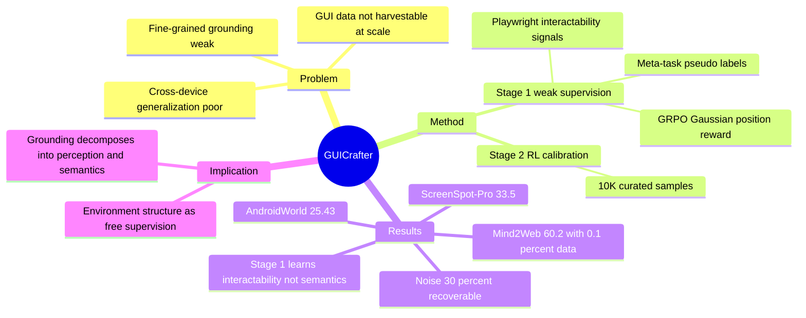

## Summary
GUICrafter 用两阶段 curriculum 解决 GUI agent 数据稀缺：Stage 1 从大规模无标注 screenshot/webpage 中自动提取交互信号（Playwright 识别 clickable/typable/selectable 元素 → meta-task 伪标签），用 GRPO + Gaussian position reward 学 visual grounding；Stage 2 用约 1 万条高质量标注数据做 RL calibration。GUICrafter-3B 以 26.8K 样本（UI-TARS-2B 的 0.1%）在 Mind2Web 达 60.2% 超过 UI-TARS-2B（59.5%），并在 ScreenSpot-Pro、AndroidWorld 上超越 GUI-R1。

## Problem & Motivation
GUI agent 数据无法像文本/图像一样直接从互联网收割：轨迹需要真实交互产生，标注 fine-grained element grounding 成本高。结果是现有 agent 跨设备泛化差、细粒度 grounding 弱——训练数据覆盖不了真实世界 GUI 风格多样性。作者的关键观察是：**网页/APP 本身携带免费的弱监督信号**——DOM/accessibility 结构标明了哪些区域可点、可输入、可选择，这些信号不需要人工即可转成 grounding 监督。

## Method
**Stage 1：Weakly-Supervised GUI Pretraining**

- 数据收集：Web 侧用 MHTML 爬取真实网页并递归跟链模拟真实任务分布；Mobile 侧复用 AndroidControl/AITZ 的截图并自动提取交互元素。
- 弱信号生成：Playwright 等浏览器自动化工具标出 clickable/typable/selectable 元素；对每种 action type 构造 "meta-task"（如 "click any clickable area"）作为伪标签——零人工标注。
- 训练：GRPO，reward 由四部分组成——format reward（JSON 正确性）、action type reward、position reward（**Gaussian**：按到最近交互元素中心的距离连续给分，而非 binary point-in-box）、text reward（token-level F1）。

**Stage 2：High-Quality RL Fine-tuning**

- 数据：LLM 辅助 + 规则过滤 Mind2Web 训练集得 4,966 条，加 GUI-R1-3K（1,829）与 AMEX mobile（3,200），共约 1 万条。
- 同一 GRPO 算法，每样本单条 ground-truth 标注。

## Key Results
- **Mind2Web**：GUICrafter-3B 60.2% avg grounding accuracy，超 UI-TARS-2B（59.5%），数据量 26.8K vs 18.4M（0.1%）；Stage 1 单独贡献 ~12% 提升。
- **ScreenSpot-Pro**：33.5% vs GUI-R1-3B 28.6%；Stage 1 贡献 ~10%。
- **Mobile**：AndroidControl-Low 70.73% SSR；AITW zero-shot 50.89%；AndroidWorld 25.43% ESR vs GUI-R1-3B 14.22%。
- **Ablations**：Stage 1+2 比仅 Stage 2 高 3-4%（curriculum 有效）；Gaussian reward 比 binary reward 高 ~2.3%；meta-task 训练最终效果与人工标注任务相当。
- **噪声鲁棒性**：Stage 1 数据人工抽检 84.9% 完全正确；人为把噪声加到 30% 时 Stage 1 性能 40.5%→36.9%，但 Stage 2 后恢复到 58.3%（vs 59.1%）——弱监督噪声可被后段校准吸收。
- **可扩展性**：Stage 1 数据从 10 到 50K 无饱和，~350K 收敛。
- **失败模式**（Figure 3）：Stage 1 只学会区分 interactive vs non-interactive 区域，不能语义上判断该选哪个交互元素——语义 task grounding 必须靠 Stage 2。

## Strengths & Weaknesses
**亮点**：弱监督信号的来源选得很准。"环境结构本身（DOM/accessibility）标注了 interactability" 与 LUMOS 的 semantic blueprint、ENVS 的环境 oracle 是同一族思想——环境后台信息作为免费监督——但 GUICrafter 把它用到了 pretraining 数据构造而非 runtime affordance。0.1% 数据的对比数字有冲击力，且 84.9% 正确率 + 30% 噪声实验给了弱监督质量一个可信的 bound。

**亮点**：failure 分析诚实且有结构意义。Stage 1 学到的是 "哪里可交互"（interactability prior），不是 "该点哪里"（task-conditioned grounding）——这个分解干净地解释了为什么 curriculum 两段都必要，也印证了 grounding 能力可分层（perception-level vs semantic-level）。

**局限**：与 UI-TARS 的对比不完全公平。UI-TARS-2B 是 18.4M 数据训练的通用 agent 模型，GUICrafter 的 Stage 2 数据（Mind2Web train / GUI-R1-3K / AMEX）与评测 benchmark 分布高度对齐——0.1% 的数字部分来自 in-distribution 校准的效率而非纯粹的弱监督威力。AndroidWorld 25.43% 的绝对值也远低于当前最强 mobile agent（如 ForgeOwl-8B 77.6% Pass@3，虽然模型更大且用了在线交互）。
 
**局限**：meta-task 的监督天花板。"click any clickable area" 只教 interactability，Gaussian position reward 以最近交互元素中心为目标——这可能教出 "吸附到任何按钮" 的 prior，对密集 UI（专业软件、ScreenSpot-Pro 场景）的细粒度区分帮助有限；33.5% 的 ScreenSpot-Pro 也确实还很低。

**局限**：web 弱信号依赖 DOM 可得性。对 canvas-rendered、游戏、远程桌面等无结构界面，该 pipeline 无法提取弱信号——弱监督的覆盖边界即 DOM 边界。

## Mind Map

## Notes
- **对 RL-based GUI Agent Training 方向**：这是 "rule-based RL + 结构化 reward 以 10x 少数据达 SFT 性能" hypothesis 的又一强数据点（0.1% 数据超 UI-TARS-2B），且 Gaussian position reward 是 reward design 子方向的具体实例——连续几何 reward 比 binary hit/miss 高 2.3%，说明 reward 的 shape（不只是 signal 来源）有实际增量。与 [[Papers/2606-QVal]] 的 "增量空间在 signal 使用方式" 判断相容。
- **对 Agent-Facing Environment Runtime 方向**：GUICrafter 与 [[Papers/2606-LUMOS]]、[[Papers/2606-ENVS]] 构成同一思想的三个出口——环境后台结构（DOM/UIA/oracle）分别被用作 **pretraining 监督**（GUICrafter）、**runtime 接口**（LUMOS）、**SFT 监督**（ENVS）。这强化了 AFE 的 framing：环境已有信息的暴露方式（training-time vs run-time）是一个设计维度，而非二选一。
- **对 GUI Grounding Robustness 方向**：Stage 1 的失败模式（学会 interactability、学不会语义选择）提示 grounding 分层——用 [[Papers/2606-DecodableNotGrounded]] 的语言说，interactability prior 可能恰好是 "prior regime" 的来源：模型不看任务语义也能点到 "某个" 按钮。Action Collapse Rate 诊断可以检验：GUICrafter 类模型在 mismatched instruction 下是否仍点击 plausible 交互区域（prior 行为）。
- 数据/代码/模型全开源（github.com/fansunqi/GUICrafter），Stage 1 数据构造 pipeline 可复用于自建 grounding 诊断数据。
