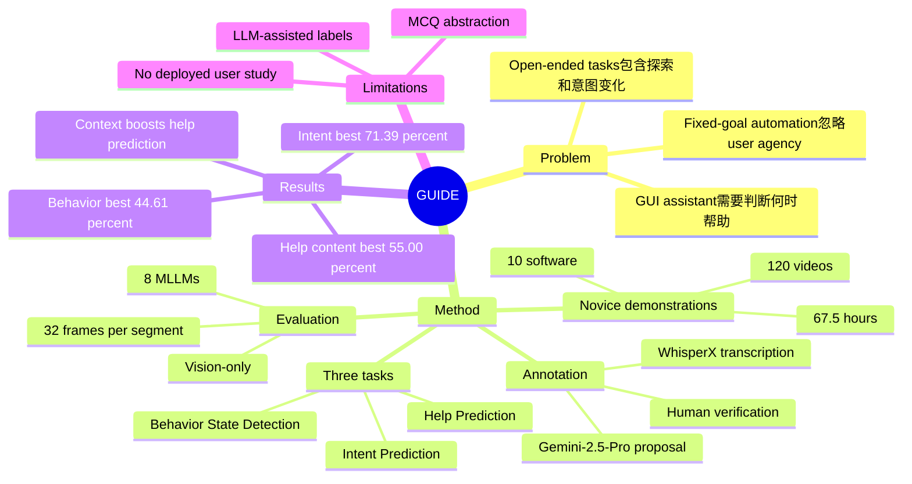

## Summary

GUIDE 提出一个面向 open-ended GUI tasks 的用户理解 benchmark，用 120 个 novice user demonstrations（67.5 小时、10 个软件）评估 MLLM 是否能从 screen recording 中识别 behavior state、预测 immediate intent，并判断是否/如何提供 help。核心贡献不是更强的 GUI automation，而是把 GUI agent 的评估目标从“代替用户完成 fixed goal”转向“理解用户探索过程并提供 context-aware assistance”。

## Problem & Motivation

现有 GUI agent benchmark 多数关注 task automation：给定明确目标后复现专家动作、点击序列或直接生成目标产物。论文指出这种 formulation 对 creative / analytical software workflow 不够贴切，因为真实用户会探索、撤回、比较替代方案，并在过程中修改自己的意图；这些行为对用户形成偏好很重要，但在纯自动化视角下常被当作低效或冗余。

作者要解决的问题是：GUI agent 如何理解用户“正在做什么”“为什么这么做”“是否需要帮助以及需要什么帮助”。这要求模型从视觉界面轨迹中捕捉 hesitation、undo、menu exploration、external help seeking 等细粒度行为线索，而不是只预测下一步 action。重要性在于，如果 agent 不能理解用户状态，过早接管或误判帮助需求会破坏 user agency；但如果能正确识别探索、困惑和意图，就可能成为 collaborative assistant 而不是 automation executor。

## Method

**Dataset collection.** GUIDE 收集 120 个 novice user demonstrations，总计 67.5 小时 screen recordings，覆盖 10 个软件：Photoshop、GIMP、Figma、Canva、PowerPoint、Google Slides、Premiere Pro、CapCut、Google Sheets、Microsoft Excel。任务分布在 photo editing、graphic design、presentation design、video editing、data analysis 五类软件中，每个软件 4 个 open-ended tasks，每个任务由 3 个不同用户完成。参与者被要求边做任务边 think aloud，录制 screen、keyboard/mouse input events 和 voice narration。

**Three-stage benchmark.** GUIDE 把用户协助拆成 Understanding -> Reasoning -> Assisting 三个阶段：

- **Behavior State Detection**：从视觉片段识别用户当前 behavior state。作者构建了 9 类 behavior state taxonomy，归入 Planning、Execution、Problem-Solving、Evaluation 四个阶段。
- **Intent Prediction**：预测用户在当前片段中的 short-term immediate goal，采用 4 选 1 MCQ。
- **Help Prediction**：先做 Help Need Detection（二分类：是否需要 help），再做 Help Content Prediction（4 选 1：需要哪类 help）。

**Annotation pipeline.** 论文用 WhisperX 转写 think-aloud narration，再用 Gemini-2.5-Pro 结合 narration 和 video 生成初始标注，随后由 human annotators 或作者验证和修订。Behavior State Detection 最终均衡采样 9 类各 200 个实例，共 1.8K segments，人工验证 agreement rate 为 96.1%。Intent Prediction 在去重和作者验证后保留 88.68% 数据，得到 1.3K instances。Help Prediction 保留 78.89% 原始数据，得到 1K validated instances，其中 66% 标为 help-needed、34% 标为 no-help-needed；12.5% retained instances 调整了起止时间，以排除用户转向 Google Search 等过于显式的 visual help signals。

**Evaluation setup.** Benchmark evaluation 是 vision-only：模型只看到 screen video，不使用用户 narration audio。每个 segment uniform sample 32 frames，8 个 MLLM 在 zero-shot setting 下评测：Gemini-2.5-Flash、Gemini-2.5-Pro、GPT-4o-mini、GPT-4o、Claude-4.5-Sonnet、Qwen3-VL-8B、InternVideo2.5-Chat-8B、InternVL3-8B。作者还比较了 context-augmented setting，例如给 Intent Prediction 提供 behavior state，给 Help Prediction 提供 behavior state 或 behavior state + intent，并在 online setting 中只给 25%、50%、75%、100% 的前缀视频。

## Key Results

**GUIDE dataset scale.** 相比 VideoGUI（178 videos、7.1h）、UI-Vision（450 videos、4.8h）、AssistGUI（100 videos、<8.3h）、WorldGUI（611 videos、<30.5h），GUIDE 的特点是 120 novice demonstrations、67.5h、10 software，并且 evaluation focus 同时覆盖 Behavior、Intent、Help，而不是只评估 task automation。

| GUIDE task / setting | 主要数字 |
|---|---:|
| Behavior State Detection, video only | 最佳为 Claude-4.5-Sonnet 44.61% accuracy；Gemini-2.5-Pro 42.44%；没有模型超过 45% |
| Behavior State Detection, + previous behavior | 提升较小；InternVideo2.5-8B 从 21.57% 到 27.02%，是最大增幅（+5.45 pp） |
| Intent Prediction, video only | 最佳为 Claude-4.5-Sonnet 71.39% accuracy / 65.44 MBAcc；Gemini-2.5-Pro 67.80% / 64.34 MBAcc |
| Intent Prediction, + behavior state | 提升稳定但有限；Claude-4.5-Sonnet 从 71.39% 到 72.62%，Gemini-2.5-Pro 从 67.80% 到 70.16% |
| Help Need Detection, video only | 最佳为 Gemini-2.5-Pro 69.82% accuracy / 77.42 F1；除 Gemini-2.5-Pro 外，其余模型 recall 都低于 37% |
| Help Need Detection, + behavior state | GPT-4o F1 从 47.73 提升到 90.19（+42.46 pp）；accuracy 从 49.69% 到 87.79% |
| Help Content Prediction, video only | 最佳为 Claude-4.5-Sonnet 55.00% accuracy / 50.78 MBAcc；GPT-4o-mini 只有 31.32% accuracy |
| Help Content Prediction, + behavior state + intent | InternVideo2.5-8B 从 23.67% 到 73.86%（+50.19 pp）；GPT-4o-mini 从 31.32% 到 79.84%（+48.52 pp） |

主要 takeaway：当前 MLLM 对 open-ended GUI workflow 中的用户状态和帮助需求仍然弱，尤其容易漏掉真实 help-needed cases；但结构化 user context（behavior state、intent）显著改善 Help Prediction，说明“先理解用户状态再决定帮助”不是可有可无的辅助信息，而可能是 proactive GUI assistant 的核心中间表示。

## Strengths & Weaknesses

**已知 Strengths.** GUIDE 的 formulation 很贴近 GUI-agent 研究中的一个关键缺口：现有 benchmark 往往把用户目标视为固定输入，而 GUIDE 把用户探索过程本身作为建模对象。数据来自 novice users 而不是专家教程，因此包含 confusion、trial-and-error、external help seeking、decision-making 等更接近真实 assistance 场景的行为。三阶段任务也把 assistance pipeline 拆得比较清楚：先识别 behavior state，再推断 intent，最后预测 help need/content。

**已知 failure cases.** 论文明确报告，模型常把 Frustration 或 Debugging 误判为 Performing Actions 或 Exploration and Decision-Making，说明它们会把 repeated clicks、hesitation、undoing 等 struggle signals 解释成正常进展。Help Need Detection 的 recall 也暴露了同一问题：除 Gemini-2.5-Pro 外，其他模型在 video-only setting 下 recall 都低于 37%，InternVideo2.5-8B 的 F1 只有 0.31。

**已知 Limitations / boundary.** 标注流程依赖 Gemini-2.5-Pro 生成初始 annotations，再经人类验证；虽然论文给出 retention 和 agreement 数字，但这仍意味着 taxonomy 和 label space 部分受 LLM proposal 影响。评估形式也主要是 classification / MCQ，不等同于让 agent 在真实软件里实时生成帮助、被用户采纳并提升任务体验。模型评测是 vision-only，这有利于检验纯视觉推理，但现实 assistant 可能能获得用户语音、文本请求、历史偏好或应用 state API，因此结果不应直接外推到所有 deployed assistant 场景。

**推测.** GUIDE 可能更适合作为 user modeling / assistance decision benchmark，而不是训练完整 GUI action agent 的直接目标函数；它的标签可以作为中间状态监督，用于帮助 agent 在接管、提示、等待之间做 policy decision。另一个潜在价值是为 GUI agent 引入“不要过度自动化”的评估视角：帮助是否合适，取决于用户当前是在探索、执行、debug 还是评估，而不仅是任务是否完成。

**不知道.** 论文正文没有给出 fine-tuning 后的模型结果，也没有报告真实用户研究来验证 predicted help content 是否真的提升用户满意度或效率。也不知道 GUIDE 的 annotation taxonomy 在专业用户、长期项目、企业软件权限约束或多人协作场景中是否仍然覆盖充分。

## Mind Map

## Notes

- 和 GUI automation benchmark 的区别很关键：GUIDE 不问“下一步点哪里”，而问“用户现在处于什么认知/行为状态、要做什么、是否需要帮助”。这更接近 collaborative GUI agents 的前置能力。
- 最值得跟进的方向是把 GUIDE 的 behavior state / intent 作为 structured memory 或 latent state，用在 proactive assistant policy 中：什么时候解释功能，什么时候建议 alternative，什么时候保持安静。
- 需要谨慎的是，Help Content Prediction 的高 context-gain 可能部分来自 label space 被 behavior state 和 intent 强约束；后续最好看 open-ended help generation 或 human preference evaluation。
