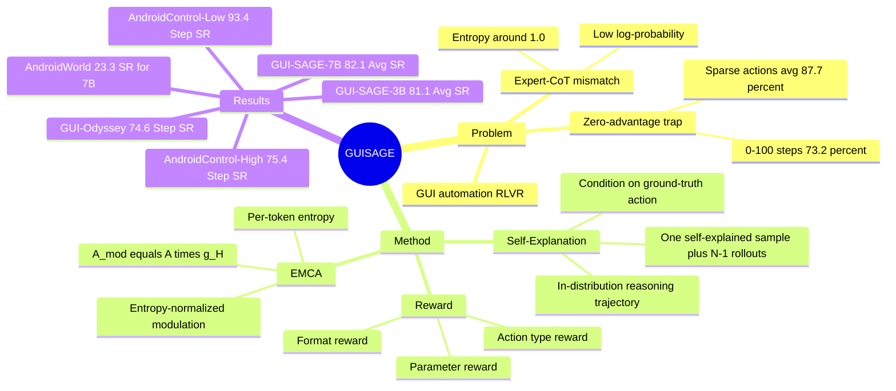

## Summary

GUI-SAGE 针对 GUI automation 中 on-policy RLVR 容易陷入 zero-advantage trap 的问题，提出用 ground-truth action 作为 hint 让当前 policy 生成 self-explanation，从而得到 in-distribution 的正样本学习信号。方法进一步用 Entropy-Modulated Credit Assignment (EMCA) 按预测 entropy 调制 GRPO advantage，在 AndroidControl 和 GUI-Odyssey 上让 GUI-SAGE-3B 达到 81.1% average SR。

## Problem & Motivation

作者关心的是 GUI agent 的 RLVR 训练：GUI 任务通常只给 binary task completion signal，但 action space 同时包含高分辨率坐标、action type 和文本输入，随机探索很难命中正确动作。当任务难度超过当前模型能力时，所有 rollout 都失败，reward 相同导致 advantage 全为 0，论文称为 zero-advantage trap；Table 5 显示 Vanilla-GRPO 在早期 0-100 steps 有 73.2% 样本处于 zero-advantage，0-300 steps overall 仍有 67.9%。

直觉上可以引入更强模型的 expert demonstration，但论文的核心观察是这在 GUI automation 中会造成 distribution mismatch：Qwen2.5-VL-72B 生成的 Expert-CoT 对当前 policy 来说 log-probability 低，并让 rollout entropy 长期维持在约 1.0。作者因此提出：外部知识必须落在当前 policy 的 distributional support 内，否则不是帮助探索，而是在训练中制造混乱。

## Method

GUI-SAGE 有两个主要组件。

1. **Self-Explanation Generation**：给定 GUI task `t`、screen state `s` 和 ground-truth action `a*`，模型从 `pi_theta(c, a | t, s, a*)` 采样 reasoning trajectory `c` 和 action `a`。训练目标从“在巨大 action space 中发现正确动作”改成“解释为什么给定 action 是正确的”。每个 task 采样 `N` 个 responses，其中 `N-1` 个来自普通 on-policy rollout，1 个来自 self-explained trajectory；这样即使 rollout 全失败，也有一个由 ground-truth action 条件化得到的正向学习信号。

2. **Entropy-Modulated Credit Assignment (EMCA)**：对每条 trajectory 计算 per-token entropy 的均值 `H`，在 batch 内归一化得到 `H_norm`，再用 `g_H = exp(-H_norm) / E[exp(-H_norm)]` 调制原始 group-normalized advantage：`A_mod = A * g_H`。直觉是低 entropy 的预测代表更高置信度，正确时应放大学习，错误时也应更强惩罚；高 entropy 的探索则降低权重，减少 noisy gradients。

Reward 由三部分组成：`R_format` 检查 `<think>` 与 `<tool call>` 输出结构，`R_type` 检查 action type 是否匹配，`R_param` 对坐标动作使用 distance-based reward、对 `type` 动作使用 token-level F1。最终 reward 为 `R = w1 * R_format + w2 * (R_type + R_param)`，实验中默认 `w1 = w2 = 1.0`。训练基于 Qwen2.5-VL 和 VLM-R1 框架，使用约 40K AndroidControl / GUI-Odyssey training samples，8 x NVIDIA A100-80G，3 epochs，learning rate 1e-6，train batch size 8，每条 instruction 采样 8 responses，并省略 KL penalty。

## Key Results

- **主结果（Table 2）**：GUI-SAGE-3B 在 AndroidControl-Low 上 Type acc / Step SR = **95.5 / 93.4**，AndroidControl-High 为 **86.4 / 75.4**，GUI-Odyssey 为 **92.1 / 74.6**，三项 Step SR average = **81.1**。GUI-SAGE-7B 进一步达到 AndroidControl-Low **96.0 / 93.7**、AndroidControl-High **87.0 / 76.8**、GUI-Odyssey **93.2 / 75.8**，average SR = **82.1**。
- **对比 baseline（Table 2）**：GUI-SAGE-3B 的 81.1 average SR 高于 InfiGUI-R1-3B 的 **75.5**、AgentCPM-GUI-8B 的 **78.1** 和 UI-Venus-Navi-7B 的 **80.0**；在 GUI-Odyssey Step SR 上，GUI-SAGE-3B 为 **74.6**，高于 InfiGUI-R1-3B 的 **64.7** 和 UI-Venus-Navi-7B 的 **71.5**。
- **AndroidWorld（Table 7）**：在 116 个 dynamically instantiated tasks 上，Qwen2.5-VL-3B / 7B 为 **3.5% / 19.0% SR**，GUI-SAGE-3B / 7B 为 **19.8% / 23.3% SR**。这说明方法在动态真实设备 benchmark 上有增益，但绝对成功率仍不高。
- **Hint format 消融（Table 3）**：在不使用 EMCA、只比较 hint 格式时，Vanilla-GRPO 的 AC-Low / AC-High / Avg SR 为 **89.7 / 70.4 / 80.1**；Action Type Hint 为 **90.8 / 71.9 / 81.4**；Action Parameter Hint 为 **91.2 / 72.4 / 81.8**；完整 Self-Explanation 为 **91.9 / 74.2 / 83.1**。
- **Zero-advantage 分析（Table 4/5）**：Vanilla-GRPO 在 0-100 steps 有 **73.2%** zero-advantage samples，0-300 steps overall 为 **67.9%**；sparse actions 更严重，`long press` **91.3%**、`terminate` **87.6%**、`system button` **84.2%**，平均 **87.7%**。
- **EMCA 与训练策略消融（Table 8）**：Vanilla-GRPO average SR 为 **80.1**，加 EMCA 后 **80.6**；Expert Demonstration 为 **81.2**，加 EMCA 后 **81.9**；Self-Explanation 为 **83.1**，加 EMCA 后 **84.2**，是所有组合中最高。论文据此认为 EMCA 对 in-distribution self-explanation 的增益最大（+1.1）。

## Strengths & Weaknesses

**已知**：
- 贡献点很聚焦：不是泛泛增加 expert data，而是指出 expert-CoT 可能 out-of-distribution，并用当前 policy 自己在 ground-truth action 条件下生成 reasoning 来保持 distribution compatibility。
- EMCA 的设计简单：只用 generation entropy 作为 confidence proxy 调制 advantage，不需要额外 critic 或复杂 reward model；Figure 3/4 的训练曲线支持 self-explanation 相比 Expert-CoT entropy 更稳定，且相比 Vanilla-GRPO 能避免 entropy collapse。
- 消融覆盖了关键假设：hint 信息量、reward weight、Expert Demonstration vs Self-Explanation、EMCA 对不同训练策略的增益、zero-advantage 发生率都有对应表格。
- 局限也很明确：self-explanation 训练依赖 ground-truth action，适合有 action label 的训练设置；它没有解决没有 action label 时的探索问题。
- AndroidWorld 结果提示泛化边界：GUI-SAGE-7B 在该动态 benchmark 上只有 **23.3% SR**，虽然高于 Qwen2.5-VL-7B 的 **19.0%**，但离可靠自动化还很远。

**推测**：
- 这个方法更适合“模型已有基本 GUI grounding 能力，但 RL 初期探索太稀疏”的场景；如果 base model 完全不能理解 screen 或 action schema，self-explanation 可能只是在正确 action 上生成表面解释，未必能转化为 robust policy。
- EMCA 的收益可能依赖 entropy 与真实 sample quality 的相关性；在更强模型或不同 decoding 设置下，低 entropy 也可能代表过早模式坍缩，而不一定代表可靠知识。

**不知道**：
- 论文没有给出 qualitative failure cases；只系统分析了 zero-advantage trap、sparse action 学习困难、Expert-CoT distribution mismatch 和 AndroidWorld 低绝对 SR。
- 不知道方法在 web/desktop GUI、长程多应用任务、无 ground-truth action 的在线环境中是否同样有效。
- 不知道训练数据中 self-explanation 的 reasoning 是否真的被执行时使用，还是主要作为 action-conditioned regularization；论文没有单独剥离 reasoning content quality 与 action hint 的贡献。

## Mind Map

## Notes

- 对 GUI-agent RL 的启发：如果 rollout 太稀疏，直接加更强 expert reasoning 可能不如让当前 policy 在答案提示下“解释自己能理解的正确动作”；关键不是 demonstration quality，而是 demonstration 是否在 policy distribution support 内。
- 对后续研究的疑问：能否把 `a*` 从人工/数据集 ground truth 换成 verifier 或 environment search 得到的 successful action，从而减少对标注轨迹的依赖？EMCA 是否可以和 process reward 或 execution-feedback reward 结合，用于 long-horizon GUI task 的 step-level credit assignment？
