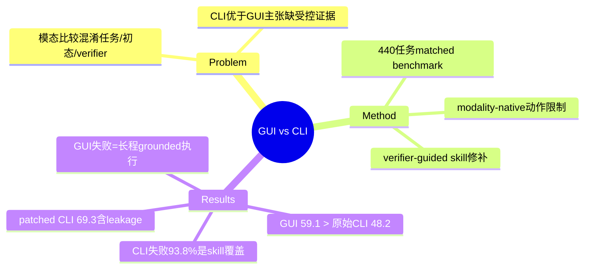

## Summary

首个把交互模态与任务/初态/verifier 解耦的 matched execution-layer benchmark（440 桌面任务 × 18 应用）：受控对照下最强 screen-only GUI agent（59.1%）反而高于最强 original-skill CLI agent（48.2%），但 verifier-guided skill 修补把 CLI 提到 69.3%——结论是两种模态瓶颈不同：GUI 卡在长程 grounded 交互，CLI 卡在 skill 接口覆盖与可扩展性。

## Problem & Motivation

"CLI/API 优于 GUI" 是 agent-friendly interface 讨论中的高频主张，但既有比较普遍混淆了模态与任务集、初始状态、verifier、允许动作空间的差异（多数主张来自 position paper 而非受控实验）。本文的问题定位在 execution layer：把两种模态放进相同目标、相同初态、相同 final-state verifier 的匹配对照里，各自只许用 modality-native 动作，测的是"执行瓶颈在哪"，不是"哪个模态天生更强"。

## Method

**Benchmark 构建**（三阶段）：任务源自 [[Papers/2605-OpenComputer]]，应用入选条件是存在对应 CLI-Anything skill（保证两侧都能操作）；把 GUI 步骤式指令改写为只描述目标结果的 modality-agnostic 任务；人工校验每个任务可同题下发给两侧、由同一 executable verifier 判 final state。共 440 任务、18 应用（GIMP、FreeCAD、LibreOffice、Audacity、Zotero、Chrome 等）、12 workflow 类别。

**两侧动作限制**：GUI 侧 screenshot 输入 + 纯屏幕动作（click/drag/type/scroll/快捷键），禁止 shell 与直接改文件；CLI 侧只能经 CLI-Anything skill 与应用级命令改任务状态，shell 仅用于发现/调用 skill。

**Verifier-guided skill augmentation**（§7.1/A.2）：逐 verifier checkpoint 检查 skill 能否稳定产生 verifier 可读的目标状态（原始覆盖仅 37.6%）→ 对 Partial/Fail 修 skill 代码 → 应用级验证。作者显式警告：修复用了 verifier 信息，patch 后的覆盖是 **verifier-observed coverage completion**，不能解读为对 unseen tasks 的泛化。

## Key Results

| 条件 | 最强模型 | Full pass | 平均时间 |
|:--|:--|:--|:--|
| GUI (screen-only) | GPT-5.4 | **59.1%** | 455.8s |
| CLI (original skills) | Codex GPT-5.5 | 48.2% | 188.1s |
| CLI (patched skills) | Codex GPT-5.5 | **69.3%** | 162.6s |

- **模型间差距大于模态间差距**：GUI 侧 GPT-5.4 59.1 / Claude Opus 4.7 55.9 / Sonnet 4.6 49.1 / Kimi-K2.6 38.6 / EvoCUA-32B 23.9 / Qwen3.5-27B 19.3；CLI 侧 Codex GPT-5.5 48.2 一枝独秀，GPT-5.4 与 Claude Code 均 ~24-25。
- **分类别强烈分化**（GUI / 原始 CLI / patched CLI）：Web 88.2 / 35.3 / 35.3（patch 无效）；CAD & 3D 46.9 / 67.3 / 73.5（CLI 占优）；Spreadsheets 61.1 / 47.2 / 41.7（**patch 后反降**）。
- **失败归因不对称**（每模态人工标注 80 条失败轨迹，Figure 4）：CLI 失败 93.8% 归于 Skill Coverage & Contract Gap（接口没暴露所需操作、或文档与实现不符）；GUI 失败 61.3% Workflow Execution + 38.7% UI Navigation & Control Discovery。
- **Procedural grounding 消融**（176 GUI 任务，Table 4）：把任务重写成带菜单路径的过程式指令，full pass 仅 59.7%→60.2%，但运行时间 −20.7%——过程提示省探索时间、几乎不救成功率。
- 未实测 hybrid GUI+CLI；结论仅提出 "executable task structure 需要在某处被暴露——可见 workflow、验证过的 skill 接口、或混合环境"。

## Evidence Ledger

| Claim ID | Claim | Type | Source locator | Evidence excerpt | Status |
|:--|:--|:--|:--|:--|:--|
| C1 | 440 任务/18 应用/12 类别；两侧同目标同初态同 verifier，各限 modality-native 动作 | benchmark-setting | Abstract; §3 | "matched execution-layer benchmark of 440 desktop tasks… identical goals, states, and final-state verifiers" | source-verified |
| C2 | 最强 GUI（GPT-5.4）59.1% > 最强原始 CLI（Codex GPT-5.5）48.2% | comparison | Abstract; Table 1 | "strongest GUI agent reaches a 59.1% full pass rate, outperforming… 48.2%" | source-verified |
| C3 | skill 修补后 CLI 升至 69.3% | number | Abstract; Table 2 | "verifier-guided skill augmentation raises CLI success to 69.3%" | source-verified |
| C4 | 原始 CLI-Anything skill 仅覆盖 37.6% verifier checkpoints | number | §7.1 | "original CLI-Anything skills achieve 37.6% coverage" | source-verified |
| C5 | patch 用了 verifier 信息，覆盖只是 verifier-observed completion，不保证泛化 | causal-mechanism | §7.1/A.2 | "should be interpreted as verifier-observed coverage completion, not as evidence… generalize" | source-verified |
| C6 | 80 失败轨迹/模态：CLI 93.8% 为 Skill Coverage & Contract Gap；GUI 61.3%/38.7% 两类 | number | Figure 4; §6 | "manually analyze and annotate 80 randomly sampled failed trajectories per modality" | source-verified |
| C7 | 分类别（GUI/原始/patched）：Web 88.2/35.3/35.3；CAD&3D 46.9/67.3/73.5；Spreadsheets 61.1/47.2/41.7 | number | Tables 1-2 | per-category rows | source-verified |
| C8 | 平均时间 GUI 455.8s vs CLI 188.1s，patched 162.6s | number | Tables 1-2 | "455.8"; "188.1"; "162.6" | source-verified |
| C9 | 过程式重写（176 GUI 任务）：59.7%→60.2%，时间 −20.7% | number | Table 4; §7.2 | "59.7% → 60.2%"; "397.0s → 314.8s" | source-verified |
| C10 | 未实测 hybrid；仅结论层建议 executable task structure 需被暴露 | sota-novelty | Conclusion | "robust agents need executable task structure to be made available somewhere" | source-verified |
| C11 | GUI 侧 6 模型、CLI 侧 Codex/Claude Code 4 变体，全部分数见 Table 1 | benchmark-setting | Table 1 | model list with scores | source-verified |
| C12 | 任务源 OpenComputer；应用入选条件 = 存在 CLI-Anything skill | benchmark-setting | §3.2 | "start from tasks in OpenComputer… select applications for which corresponding CLI-Anything skills are available" | source-verified |

## Strengths & Weaknesses

**Strengths**：
- 第一个真正把模态与任务/初态/verifier/动作空间解耦的对照——直接证伪"CLI/API 无条件优于 GUI"（该主张此前几乎全部来自 position paper，见 [[Reports/2026-07-27-WebAgent-RL-and-Context-Landscape]] §4）。
- 失败归因把两侧瓶颈定位到**不同层**：GUI 是执行可靠性问题（模型能力），CLI 是接口覆盖问题（生态建设）——93.8% vs 61.3%/38.7% 的不对称是本文最有信息量的数字。
- 对 skill 修补的 leakage 有罕见的诚实披露（C5），37.6% 原始覆盖率本身就是对 "skill 生态已可用" 的一次测量否定。

**Weaknesses / 边界**：
- patched 69.3% **不是公平模态对照**（用了 verifier 信息修 skill），只能读作"覆盖补齐后的上界估计"；Spreadsheets patch 后反降说明修补本身会引入接口回归。
- 应用入选要求存在 CLI-Anything skill → 样本偏向"CLI 侧至少有基础覆盖"的应用，真实长尾应用的 CLI 劣势可能被低估。
- 未测 hybrid，而 [[Papers/2606-WeaveBench]]（hybrid GUI+CLI+Code）与 [[Papers/2607-StateAct]]（state-first + bash 消融）已给出模态互补证据——本文的 matched 设置恰好是补 hybrid 因果对照的理想基座，但作者停在讨论层。
- 失败 taxonomy 单标签粗分类（作者自认）；GUI 子类无更细百分比。

**对领域**：与 [[Papers/2606-WeaveBench]]、[[Papers/2607-StateAct]] 三方收敛到同一判断——GUI 与 code/CLI 模态互补、瓶颈异质；对 Agent-Facing Environment Runtime 方向，C4/C6 把 "skill 接口覆盖" 量化为 CLI 侧第一瓶颈，支撑 "executable task structure 应作为 environment affordance 暴露" 的论证方向（affordance 的接口覆盖率是可测量对象）。

## Mind Map

## Notes

- 入队来源：[[Reports/2026-07-27-WebAgent-RL-and-Context-Landscape]] §6 证伪型对照 top-3 之一（rationale："检验 CLI/API 优于 GUI 的主张"）。检验结果：该主张的无条件版本被否定，成立形式收窄为"在 skill 覆盖充分的类别（CAD/Game）CLI 占优，且快 2.4×"。
- 对 AFE 的直接启发：skill/affordance 的 **coverage 测量协议**（verifier checkpoint 覆盖率 37.6%→100% 的分级 Pass/Partial/Fail 审计）本身可复用于 agent-facing affordance 的暴露完整性审计。
- 待补：Beyond Browsing (2410.16464, API-based web agents) 的原始三路线对照仍在 queue 外（07-27 报告 §6 列为缺失），若 digest 可补上 web 域的对应证据。
