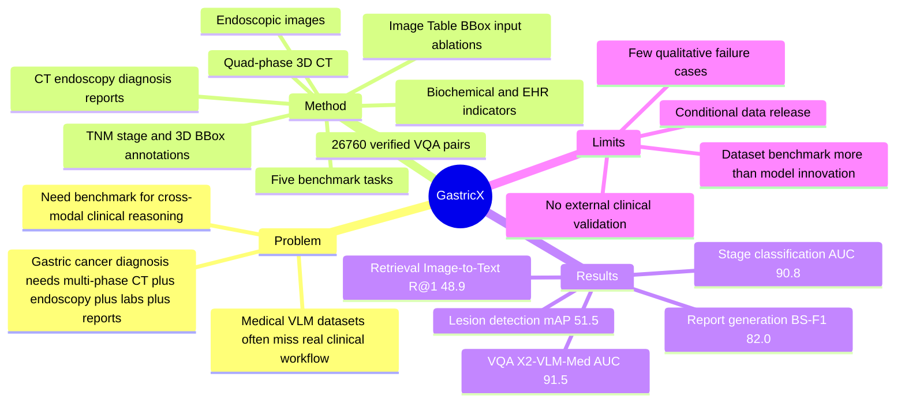

## Summary
Gastric-X 是一个面向 gastric cancer analysis 的 multimodal medical VLM benchmark，把 multi-phase 3D CT、endoscopic image、biochemical indicators、clinical reports、TNM stage 和 3D lesion BBox 对齐到 patient-level。它的主要价值不是提出新模型，而是给 VQA、report generation、cross-modal retrieval、disease stage classification 和 lesion detection 提供一个更接近真实临床证据链的评测场景。

## Problem & Motivation
现有 medical VLM benchmark 多集中在 2D X-ray / CT image 与 free-text report 的配对，难以覆盖真实 gastric cancer 诊断中跨 modality、跨 phase、跨结构化化验指标的推理过程。作者指出 gastric cancer 诊断需要整合 multi-phase 3D CT、endoscopy、laboratory tests、patient history 和 diagnostic reports，而仅靠单一影像模态会让模型更容易依赖表面相关性。Gastric-X 的 problem formulation 是：构造一个能够模拟 clinician evidence integration 的 benchmark，用来测试 VLM 是否能把空间肿瘤特征、biochemical signals 和文本报告联系起来。这个问题与通用 VLM 的 multimodal reasoning 相关，但医学场景、标注和安全约束都更强。

## Method
**Dataset Composition.** Gastric-X 包含约 1.7K patient cases；每个 case 对齐 quad-phase CT scans（non-contrast、arterial、venous、equilibrium）、endoscopic image、structured biochemical / EHR indicators、CT report、endoscopy report、diagnosis report、disease stage 和 lesion annotations。论文报告总量为 **7.1K CT scans / 83.48K CT slices / 1.7K endoscopic images**。

**Annotations.** 数据集为每个 CT phase 提供 3D BBox，覆盖 tumor core、regional lymph nodes / perigastric lesions 和 stomach region。按论文描述，4 phases、3 BBoxes per phase、1.74K patients 形成 **21,408 BBoxes**。此外，报告被转成 **26,760 VQA pairs**，并由两名临床专家进行 sentence-level double-blind verification；appendix 中报告 lesion-focused prompts 的 validity 为 **92.4%**，staging-focused 为 **88.1%**，enhancement-phase 为 **84.7%**，localization 为 **79.3%**，Yes/No factual 为 **90.5%**。

**CT Standardization.** Appendix 给出 preprocessing：HU clipping window 为 **[-100, 300]**，随后 per-volume z-score normalization、phase-wise histogram matching；所有 phase resample 到 **1.0 x 1.0 x 1.0 mm3** isotropic spacing。不同大小 CT volume 被 crop / pad 到 **288 x 288 x 192**，arterial 和 delayed phases rigidly registered 到 venous phase，约 **3-4%** corrupted / missing metadata / excessive misalignment volumes 被过滤。

**Benchmark Tasks.** Gastric-X 设定五个任务：Visual Question Answering、report generation、cross-modal retrieval、disease stage classification、lesion detection。作者比较 general VLMs（LLaVA-1.5-7B、BLIP-2、X2-VLM）与 medical VLMs（LLaVA-Med v1.5、Med-Flamingo、MedVInT），并把 X2-VLM 改成 X2-VLM-Med：视觉 encoder 用 3D Swin Transformer，text encoder 用 MedBERT。输入 ablation 包括 Image Only、Image + Table、Image + BBox、Image + Table + BBox；Table 信息不是整表输入，而是抽取 abnormal values 并转成简短文本描述，BBox 以 CT slice overlay 形式作为 spatial prior。

## Key Results
- **Gastric-X VQA**：在 Image + Table + BBox 设置下，X2-VLM-Med 达到 **Precision 77.8 / Accuracy 84.6 / F1 79.9 / AUC 91.5%**，优于 Med-Flamingo 的 **71.0 / 78.9 / 73.5 / 86.5%** 和 MedVInT 的 **68.0 / 75.8 / 70.1 / 85.4%**。同一模型从 Image Only 的 **AUC 85.3%** 提升到 Image + Table + BBox 的 **91.5%**，是论文中最直接的 modality ablation 证据。
- **Gastric-X report generation**：X2-VLM-Med 在 Image + Table + BBox 下达到 **ROUGE-L 62.3 / BLEU-4 34.5 / METEOR 41.6 / BERTScore-F1 82.0**。Image Only 下同一模型为 **49.5 / 24.1 / 29.6 / 68.7**，说明 Table 和 BBox cue 对报告生成指标有明显增益。
- **Gastric-X cross-modal retrieval**：X2-VLM-Med 在 Image-to-Text 上达到 **R@1 48.9 / R@5 80.7 / R@10 88.2 / MedR 4.9 / mAP 63.1**；Text-to-Image 上达到 **R@1 47.5 / R@5 79.3 / R@10 87.4 / MedR 5.2 / mAP 61.7**。Med-Flamingo 是第二梯队，Image-to-Text **R@1 42.8 / mAP 57.9**，Text-to-Image **R@1 41.5 / mAP 56.8**。
- **Gastric-X disease stage classification**：X2-VLM-Med 在 Image + Table + BBox 下达到 **Precision 83.9 / Recall 82.6 / F1 83.2 / AUC 90.8**。强 baseline Swin Transformer 同设置为 **83.4 / 82.0 / 82.7 / 90.1**，论文强调 X2-VLM-Med 的 AUC 相比 Swin 高 **0.7**，但不是大幅领先。
- **Gastric-X lesion detection**：X2-VLM-Med 在 COCO-style evaluation 下达到 **AP@0.5 70.4 / AP@0.75 56.4 / F1@0.5 68.1 / mAP 51.5 / Loc. Acc. 79.6**。MedVInT 的 **AP@0.5 72.1** 高于 X2-VLM-Med，但 X2-VLM-Med 在 **AP@0.75、F1@0.5、mAP、Loc. Acc.** 上最好；Faster R-CNN baseline 为 **AP@0.5 64.1 / mAP 43.2 / Loc. Acc. 70.4**。

## Strengths & Weaknesses
**已知 Strengths.**

1. **Benchmark formulation 更接近临床证据链。** 论文不是只做 image-report matching，而是把 CT phases、endoscopy、biochemical table、reports、stage 和 lesion BBox 对齐；这比多数单模态 medical VLM benchmark 更适合测试 cross-modal evidence integration。
2. **任务覆盖比较完整。** 五个任务分别测问答、文本生成、image-text retrieval、stage classification 和 localization，比单一 VQA 或 report generation benchmark 更能暴露模型能力差异。
3. **modality ablation 给出一致信号。** VQA、report generation、classification 中 Image + Table + BBox 通常优于 Image Only，支持作者关于 structured biochemical information 和 spatial cue 有用的 claim。
4. **VQA 构造有临床验证流程。** Appendix 明确说明候选问题来自多个 LLM，再经过自动过滤、source-report fidelity check 和两名临床专家 double-blind verification；prompt validity table 也暴露了 localization prompts 更容易出现 ambiguity。

**已知 Weaknesses / Limitations.**

1. **模型创新有限。** 论文核心贡献是 dataset / benchmark；X2-VLM-Med 主要是把 3D Swin Transformer 和 MedBERT 接入 X2-VLM，并用 overlay BBox / abnormal-table text 做轻量适配，不是新的 VLM architecture。
2. **外部泛化证据不足。** 论文没有报告跨机构外部测试、跨癌种迁移、跨 scanner / protocol 的 robustness 分析，也没有 clinician reader study；因此不能把 benchmark performance 直接等同于 clinical deployment readiness。
3. **failure case 展示不足。** 正文给出总体表格和 modality trend，但没有系统展示 VQA hallucination、stage confusion、lesion miss / false positive 等 qualitative failure cases。
4. **数据开放仍有条件。** 论文说 dataset 已 IRB approval、会在 acceptance 后公开，demo subset 放 Hugging Face，完整数据通过 project webpage 分发且需要 consent form，并采用 CC BY-NC-ND 4.0；这意味着复现门槛与可再分发性仍受限制。
5. **部分数字和命名存在小不一致。** 文中有 Table 2 / Table 3a / Table 3b 的引用不完全一致，Table 1 中 release 写作 2025，而 paper header 是 arXiv v2 2026-03-26；这些不影响主要结论，但后续引用 metadata 时要以最终 CVPR / arXiv 版本核对。

**推测.** 对 GUI-agent / embodied research 的间接启发是：把 expert workflow 拆成多源 evidence alignment、spatial prior、structured table cue 和 task-specific benchmark，比单纯扩大 image-text pretraining 更能暴露模型在真实 workflow 中的短板。但这是跨域类比，论文没有证明 Gastric-X 的结论能迁移到 GUI grounding、robotics 或 agentic settings。

**不知道.** 论文没有给出 DOI，也没有给出明确 code repository URL；abstract 只给出 Hugging Face dataset link，conclusion 说会 release accompanying experimental code。论文也没有说明完整数据发布后的下载审批周期、最终 leaderboard / evaluation server 形式，或标注者一致性指标（如 inter-rater agreement）。

## Mind Map

## Notes
- **我的判断**：rating=3。它和 GUI-agent / agentic research 没有直接关系，但对 VLM 的 multimodal benchmark design、medical workflow grounding、structured evidence integration 有参考价值。
- **最值得借鉴的点**：不是“medical VLM”本身，而是把真实专家流程拆成 synchronized modalities 和多任务 evaluation；这类 benchmark design 思路可以迁移到 screen / GUI / embodied 场景。
- **需要后续查证**：最终 CVPR camera-ready 是否有 DOI、完整 dataset / code 是否已经开放、是否存在更严格的 external validation 或 hidden-test evaluation protocol。
