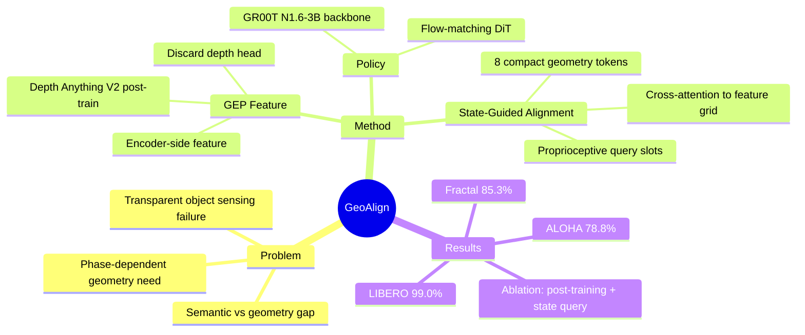

## Summary
GeoAlign 提出 state-guided spatial alignment 机制，通过机器人本体状态查询 RGB-derived geometry feature grid，为 VLA action decoder 生成紧凑、phase-dependent 的 geometry tokens。核心思路：用 RGB-D 监督 post-train Depth Anything V2，丢弃 depth head，只用 encoder-side feature 作为 policy conditioning。

## Problem & Motivation
现有 VLA 模型优化 semantic grounding，但 executable manipulation 需要 geometry-aware spatial alignment。例如：tight clearance insertion、precise alignment、contact-sensitive motion、transparent/annular object handling——这些场景 policy 可能正确识别物体但无法执行动作。

两条现有路线：
1. **强化感知侧**：SpatialVLM、RoboSpatial、DepthVLA 等通过 depth-aware module、3D context 增强 spatial understanding，但依赖 measured depth 会继承 sensing failure（透明/薄结构物体）
2. **空间 action generation**：Transporter、CLIPort、Act3D、3D Diffusion Policy 等直接输出 spatial action，但对于 continuous VLA action head（diffusion/flow matching），如何 dynamic select execution-relevant local geometry 并保持 compact conditioning interface 是 open challenge。

## Method
**两阶段 pipeline**：

### Stage 1: Geometry Post-Training
- 初始化 geometry branch 从 Depth Anything V2-Small
- 用 robot-domain RGB-D 数据 post-train，metric depth supervision (SiLog loss)
- **关键设计**：post-train 后 discard depth head，只用 encoder-side GEP (Geometry-Enhanced Post-Trained) features
- 输出 5,476 spatial tokens per view (N * 5476 for N views)

### Stage 2: Policy Training & Rollout
- RGB + language 通过 Eagle-Block2A-2B VLM → semantic tokens $Z_t^{vlm}$
- Frozen geometry branch 从同一 RGB → GEP feature grid $\Phi_t^{geo}$
- **State-Guided Spatial Alignment**：
  - proprioceptive state $s_t$ → state embedding $h_t$
  - MLP 生成 K=8 query slots $Q_t$ (带 learned positional embedding)
  - Cross-attention: $Q_t$ queries $\Phi_t^{geo}$ → 8 compact geometry tokens $Z_t^{geo}$
- Concatenate: $C_t = [Z_t^{vlm}; Z_t^{geo}]$ → Isaac-GR00T N1.6-3B DiT action head (flow matching)

**核心 insight**：depth supervision 用于 shape geometry representation，但 policy rollout 时不用 predicted depth map，只用 encoder-side feature。同时，同一 RGB 场景在 reaching/aligning/inserting/releasing 不同阶段需要不同 local geometry，proprioceptive state query 可以动态选择 phase-relevant geometry。

## Key Results

### Simulation
| Benchmark | RGB-only | GeoAlign | Gain |
|-----------|----------|----------|------|
| LIBERO (avg) | 97.0% | **99.0%** | +2.0% |
| LIBERO Spatial | 97.65% | **100.0%** | +2.35% |
| LIBERO Long | 94.35% | **96.6%** | +2.25% |
| SimplerEnv-Fractal | 79.6% | **85.3%** | +5.7% |
| - Pick Coke Can | - | **100.0%** | - |
| - Move Near | - | **85.5%** | - |
| - Open/Close Drawer | - | **70.3%** | - |

### Real-World ALOHA (8 tasks)
| Task | RGB-only | π0.5 | GeoAlign |
|------|----------|------|----------|
| Clear tape | 20.0% | 25.0% | **35.0%** |
| Transparent bottle | 35.0% | 40.0% | **75.0%** |
| Tape-roll insertion | 40.0% | 45.0% | **65.0%** |
| Plate front | 80.0% | 90.0% | **90.0%** |
| Plate behind | 85.0% | 85.0% | **95.0%** |
| Plate left | 80.0% | 80.0% | **90.0%** |
| Plate right | 85.0% | 90.0% | 85.0% |
| Plate top | 95.0% | 85.0% | **95.0%** |
| **Avg** | 65.0% | 67.5% | **78.8%** |

### Ablation (LIBERO)
| Variant | Success |
|---------|---------|
| GeoAlign (full) | **99.0%** |
| w/o post-training | 95.9% |
| w/o spatial querying | 91.6% |
| w/o state queries | 96.2% |
| w/ unfrozen encoder | 95.93% |

**Key findings**：
- Post-training 贡献 ~3% (99.0 → 95.9)
- Spatial querying 贡献 ~7% (99.0 → 91.6)，largest gap
- State queries vs learned queries: ~3% (99.0 → 96.2)
- Frozen encoder 优于 unfrozen

## Strengths & Weaknesses

### Strengths
1. **RGB-derived geometry**：规避 measured depth 在 transparent/thin-structured object 上的 sensing failure
2. **State-guided dynamic selection**：同一场景不同阶段（reaching vs inserting）需要不同 geometry，proprioceptive query 实现 phase-dependent selection
3. **Compact token interface**：只用 8 geometry tokens，保持 DiT conditioning 效率
4. **Ablation 清晰**：两个设计 (post-training + state query) 都有 controlled experiment 验证贡献
5. **Real-world 验证完整**：ALOHA 8 tasks，transparent/annular geometry-critical settings

### Weaknesses
1. **不 explicit model collision/reachability/contact constraints**：geometry tokens 来自 RGB-derived feature，视觉覆盖和 camera 配置受限
2. **无 persistent scene memory**：每个 action chunk 基于 current observation + state，非长期 horizon 的 spatial memory
3. **Drawer task 性能较低**：Open/Close Drawer 70.3%，说明 constrained drawer manipulation 未完全解决
4. **依赖 robot-domain depth supervision**：需要 RGB-D 数据集 post-train，增加数据需求
5. **未测试跨 embodiment**：只在 single robot platform 验证

## Mind Map

## Notes
- 与 [[2406-OpenVLA]]、[[2503-GR00TN1]] 同属 VLA 系列，GeoAlign 专注 geometry conditioning
- 与 [[2401-SpatialVLM]] 目标类似（spatial reasoning），但路径不同：SpatialVLM 强化 VLM spatial understanding，GeoAlign 强化 action decoder geometry input
- 与 [[2303-DiffusionPolicy]] 不同：DP 用 3D point cloud input，GeoAlign 用 RGB-derived feature
- Transparent object handling 是亮点，Clear tape 20→35%、Transparent bottle 35→75% 改善显著
- State-guided query 机制是否可推广到其他 VLA backbone？