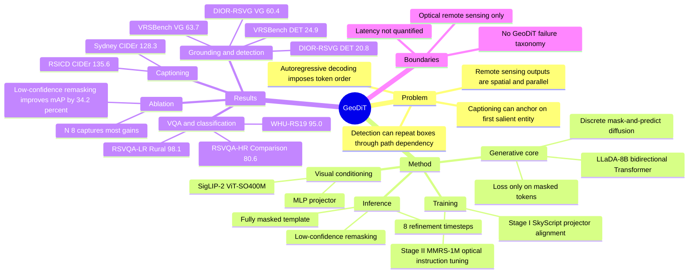

## Summary

GeoDiT 把 remote sensing VLM 的 text generation 从 autoregressive token-by-token 过程改成 discrete diffusion / mask-and-predict 的 parallel iterative refinement：用 SigLIP-2 visual backbone、MLP projector 和 LLaDA-8B bidirectional Transformer 生成 caption、VQA answer、classification label 与 box-like structured text。论文在 captioning、visual grounding、object detection、VQA 和 scene classification 多个 optical remote sensing benchmark 上报告 SOTA，尤其在 object-centric CIDEr 与多目标定位任务上收益明显；但证据主要来自光学遥感数据，缺少 GeoDiT 自身 failure cases、真实 latency/cost 与跨传感器泛化分析。

## Problem & Motivation

论文的核心问题是：geospatial understanding 里很多输出本质上是并行、空间化、对象中心的结构，而主流 autoregressive RS-VLM 被迫按线性 token 顺序生成。作者认为这种结构错配会在两类任务中暴露：captioning 容易被第一个 salient entity 锚定，难以平衡整幅遥感图的多个对象；multi-object detection / grounding 中，前一个 box 的生成会影响后一个 box，可能形成重复坐标或局部收敛。

这个问题重要，是因为遥感图像常用于 deforestation monitoring、infrastructure tracking、urban dynamics 等需要快速把原始 satellite imagery 转成 actionable insight 的场景。已有两条主线分别是 two-tower contrastive RS-VLM 与 autoregressive VLM；前者适合 retrieval-style tasks，缺少生成能力，后者能做 SC / VQA / VG 等任务，但在需要结构化、多对象、非叙事输出时有 path dependency。

作者的 first-principles claim 是：如果数据语义天然是并行场，那么生成过程也应先建立全局结构，再逐步细化局部 token / coordinate，而不是从左到右承诺每个 token。

## Method

**Architecture.** GeoDiT 由 visual conditioning backbone 和 generative core 两部分组成。Visual backbone 使用 pre-trained SigLIP-2 (ViT-SO400M)，把输入图像转成 patch embeddings，hidden dimension 为 `Dv = 1152`；一个两层 MLP projector 加 GELU 将视觉特征投到 generative core 的 `d = 4096` hidden space。Generative core 初始化自 LLaDA-8B，是 32-layer bidirectional Transformer，32 attention heads，用 discrete mask-and-predict diffusion 生成文本。

**Discrete diffusion objective.** 给定 ground-truth text `T0`，训练时随机采样 timestep `t`，按概率 `t` 把 token 替换成 `[M]`，模型在 image condition 与未 mask 文本上下文下恢复原 token。Loss 只作用在 masked positions；输入序列是 visual condition vectors 与 partially masked text embeddings 的 concat。论文强调这里不是 Gaussian diffusion over continuous latents，而是面向离散 text tokens 的 mask-and-predict diffusion。

**Two-stage training.** Stage I 做 vision-language alignment：冻结 vision encoder 和 generative Transformer，只训练 MLP projector，在 SkyScript 上训练 1 epoch，global batch size 96，AdamW，peak learning rate `1e-3`，无 weight decay。Stage II 做 full instruction tuning：解冻所有模块，在 MMRS-1M 的 optical subset 上 end-to-end 训练 1 epoch，global batch size 24，peak learning rate `1e-5`，同样无 weight decay。Table 1 中训练/评估数据均标为 optical，覆盖 captioning、VQA、classification、detection、visual grounding 和 region-level captioning 等任务。

**Inference.** 推理从固定长度的 fully masked template 开始，模型每一步预测完整序列，再用 low-confidence remasking 保留高置信 token、重新 mask 低置信 token，重复迭代直到得到最终文本。默认 `N = 8` inference timesteps；max length 对 image captioning 为 16 tokens，对 object detection 为 32 tokens，其他任务为 8 tokens；所有结果使用 greedy decoding，且不使用 classifier-free guidance。

## Key Results

**Image Captioning.** Table 2 报告 GeoDiT 在四个 captioning benchmark 上取得最高或并列最高结果：UCM-Captions 为 BLEU-4 44.7、METEOR 32.9、CIDEr 73.8；RSICD 为 28.6 / 26.8 / 135.6；NWPU-Captions 为 62.2 / 28.9 / 77.4；Sydney-Captions 为 47.2 / 40.8 / 128.3。作者特别强调 CIDEr：RSICD 上 GeoDiT 的 CIDEr 135.6 相比最强 baseline EarthDial 115.3 是 17.6% relative improvement；Sydney-Captions 上 128.3 相比 EarthDial 113.0 是 13.5% relative gain。

**Visual Grounding / Object Detection.** Table 3 中 GeoDiT 在 DIOR-RSVG、VRSBench、AVVG、RSVG 的 VG / DET 指标分别为 60.4 / 20.8、63.7 / 24.9、21.7 / 11.4、43.2 / 18.7，均为表中最高。VRSBench 上，GeoDiT 的 VG 63.7 高于 GeoChat 56.3、Qwen2.5-VL 45.2、VHM 33.9；DET 24.9 高于 Qwen2.5-VL 19.6 与 LLaVA-1.5 3.8。Figure 4 的 qualitative comparison 显示 autoregressive baseline 会生成多个重叠或重复 box，而 GeoDiT 避开了这种 sequential error loop。

**VQA / Classification.** Table 4 中 GeoDiT 在 RSVQA-LR 的 Rural / Presence / Comparison 子任务分别达到 98.1、91.1、90.2；在 RSVQA-HR 的 Area / Comparison 为 37.6、80.6；classification 上 AID 为 81.2，WHU-RS19 为 95.0。论文称这些 sub-task / dataset 上均建立新的 SOTA；其中 WHU-RS19 95.0 略高于 GPT-4V 的 94.7 和 VHM 的 91.8。

**Ablation: remasking strategy.** Table 5 比较 random remasking 与 low-confidence remasking。Low-confidence remasking 在 RSICD 上 BLEU-4 从 27.3 到 28.6、CIDEr 从 121.8 到 135.6；DIOR-RSVG mAP@0.5 从 15.5 到 20.8；AID accuracy 从 63.4 到 67.6。论文给出的相对提升分别是 BLEU-4 +4.76%、CIDEr +11.3%、mAP +34.2%、accuracy +6.21%，说明收益在 bounding box coordinate 和 object noun 这类高精度结构元素上最大。

**Ablation: inference timesteps.** Table 6 显示从 `N = 1` 到 `N = 8`，RSICD CIDEr 从 65.8 提到 135.6，DIOR-RSVG mAP@0.5 从 7.5 提到 20.8，AID accuracy 从 76.5 提到 81.2；`N = 16` 只进一步到 CIDEr 136.2、mAP 21.1、accuracy 81.3。作者因此采用 `N = 8` 作为默认设置，认为它在 structured output quality 和额外推理成本之间更平衡。

## Strengths & Weaknesses

**已知 Strengths.** 论文的 taste 在于把遥感生成的失败归因到 generative process 与 data structure 的错配，而不是简单堆更大 autoregressive model。GeoDiT 的 parallel refinement 与 remote sensing 场景中的 unordered object set、multi-object localization、coarse-to-fine scene description 有直接结构对应；captioning 的 CIDEr、VG/DET 的 mAP/Acc@0.5、remasking ablation 和 timestep ablation 都支持这一机制解释。

**已知 Strengths.** Baseline 覆盖 commercial autoregressive VLM（GPT-4V、Claude-4）、general diffusion VLM（LLaDA-V、LaVida、MMaDA）和 remote-sensing autoregressive VLM（GeoChat、VHM、EarthDial 等）。这让结果不是只和弱模型比较；尤其是 general diffusion VLM 在 VG/DET 表中几乎为 0，而 GeoDiT 显著提升，说明关键不只是“用了 diffusion”，还包括遥感领域 grounding 与 instruction tuning。

**已知 Boundaries.** 论文没有从零提出新的 Diffusion Transformer 架构，而是把 LLaDA-8B 作为 bidirectional mask-and-predict backbone，并系统性地把它适配到 geospatial domain。这个选择务实，但也意味着“diffusion paradigm 更好”的结论仍与 backbone、训练数据、domain tuning 共同耦合；文中没有一个完全 architecture-matched、same data、same backbone 的 autoregressive counterpart 来隔离生成范式的因果贡献。

**已知 Boundaries.** Table 1 标注的训练/评估数据类型都是 optical，Stage II 也明确使用 MMRS-1M optical subset；因此论文没有证明 GeoDiT 对 SAR、multispectral、hyperspectral 或 multi-sensor Earth observation 的泛化。论文也没有给出 GeoDiT 自身的系统性 failure analysis；qualitative analysis 主要展示 autoregressive baseline 的重复 box 失败，以及 GeoDiT 的 hierarchical token finalization。

**已知 Limitations.** 迭代式推理天然增加 computation，但论文只报告 timestep ablation，没有给出 wall-clock latency、throughput、显存或 deployment cost。`N = 8` 被认为是质量和成本的折中，但具体成本不知道。另一个缺口是结果主要基于自动指标；captioning 的 BLEU/METEOR/CIDEr 与遥感专业可用性之间的关系没有通过 human evaluation 或 downstream decision task 验证。

**推测.** 对 GUI agent / embodied agent 的启发不是遥感任务本身，而是“非叙事、对象集合式输出不一定适合 autoregressive decoding”。GUI screen parsing、多元素 grounding、structured action precondition extraction 也可能受益于 parallel refinement 或 confidence-based remasking；但论文没有评估 GUI、web、robotics 或 closed-loop agent task，所以这只能作为 representation / decoding design insight。

**不知道.** 论文没有给出 DOI。也不知道 code release 是否完整包含训练数据处理、instruction format、evaluation scripts 与模型权重；paper 只写 resources 在 GitHub。GeoDiT 在极密集小目标、低质量影像、跨区域 domain shift、长文本 report generation 和真实 geospatial analyst workflow 中是否保持同样优势，论文没有回答。

## Mind Map

## Notes

这篇论文最值得记住的点是：structured vision-language generation 可以被看成“同时求解一个语义场”，而不是“把图像翻译成一句话”。如果输出对象之间没有天然顺序，autoregressive 的历史依赖就可能成为 inductive bias bug；GeoDiT 的贡献是把这个问题在遥感 caption / grounding / detection 上做成了可验证的系统。

需要谨慎的是，论文的结论强依赖自动 benchmark 与遥感 optical domain。对于 GUI agent 或 embodied agent，真正有价值的是 decoding paradigm 的问题形式：当任务需要同时定位多个 UI 元素、对象、区域或约束时，parallel iterative refinement 可能比一次性坐标串生成更稳；但这一步迁移仍需新的 benchmark 和 failure analysis。

后续可追的问题：能否构造一个 same backbone / same data 的 autoregressive-vs-diffusion 对照，隔离 generation paradigm 的贡献？能否把 low-confidence remasking 和 verifier / planner 结合，让 uncertain object tokens 或 boxes 触发额外 perception 或 active view selection？
