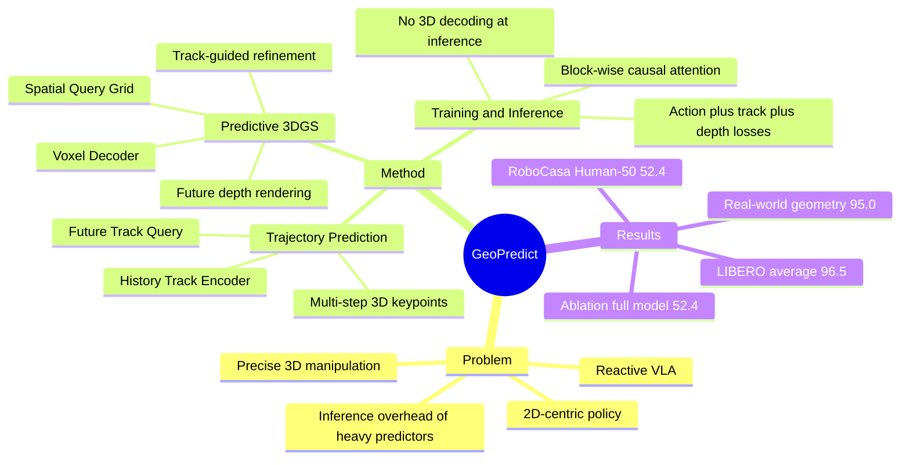

## Summary
GeoPredict 解决 VLA manipulation 中 policy 过于 reactive、2D-centric，难以处理精确 3D 几何和长时序物理一致性的问题。它在 π0 continuous-action VLA 上加入 trajectory-level kinematic prediction 和 predictive 3D Gaussian geometry 两类训练时监督，使 transformer 学到未来 robot motion 与 workspace geometry 的结构先验，但推理时不执行 voxel decoder / depth rendering。

## Problem & Motivation
现有 VLA 继承 VLM 的语义和视觉泛化能力，但通常从当前 2D observation 直接映射到 action，缺少显式 3D spatial modeling 和 future-aware dynamics，因此在 object pose、clearance、end-effector motion 等几何敏感任务上不稳定。

已有 future prediction 方法会预测 RGB、depth、point-based representation 或 latent dynamics，但作者指出这些方法常停留在 2D / view-independent 信号，不能严格保证 multi-view / 3D geometric consistency；而直接把复杂 3D prediction 放到 inference path 又会增加控制开销。

本文的核心动机是：把 future robot kinematics 和 future scene geometry 作为 training-time auxiliary supervision 注入 VLA，而不是在部署时依赖重型 3D decoder，从而在保持推理效率的同时提升几何敏感操作能力。

## Method
GeoPredict 基于 π0：VLM backbone 使用 PaliGemma / SigLIP，action expert 通过 conditional flow matching 生成连续 action chunk。任务设置中 action horizon 为 H=50，每个 action 是 7-DoF end-effector command，包括 translation offset、rotation offset 和 gripper state。

**1. Trajectory-Level Kinematic Prediction**
- Track Encoder 跟踪 K 个 3D robot keypoints：LIBERO / RoboCasa 使用 7 joints + 1 end-effector，real-world setup 使用 6 joints + 1 end-effector。
- 对每个 keypoint 的历史 3D trajectory，用 shared learnable history query 对 MLP-embedded trajectory 做 cross-attention，压缩成 history track token。
- K 个 learnable Future Track Query 与 instruction、multi-view images、history tokens 一起进入 transformer，再用 shared MLP + temporal positional encoding 预测 t 到 t+H 的 multi-step 3D keypoint trajectories。
- 训练目标是所有 keypoint / timestep 上的 MSE track loss；这些未来轨迹也用于下一步的 track-guided Gaussian refinement。

**2. Predictive 3D Gaussian Geometry**
- 先把 1.6m x 1.6m x 1.0m workspace 以 v=0.04m voxelize，并下采样成 coarse 3D spatial query grid；每个 query 加 3D sinusoidal positional encoding。
- Transformer 后的 spatial embeddings 经 3D voxel decoder 预测 future timesteps 的 voxel feature volume，再映射成 3D Gaussian primitives。作者只建模 geometry，省略 color coefficients。
- Track-guided refinement 用预测的 future keypoints 标出 robot 未来会经过的 voxel，在这些 voxel 中生成额外细粒度 Gaussian primitives，把容量集中到 end-effector、joints 和 interaction region 附近。
- 3DGS 通过 differentiable alpha compositing 渲染 future depth maps，并用 workspace mask 下的 L1 depth loss 监督；depth supervision 只施加到两个 224 x 224 environment cameras。

**3. Attention / Training / Inference**
- Token 被组织为 block-wise causal hierarchy：2D Token、3D Token、3D Query、State Token、Action Noise。每个 block 内双向 attention，跨 block 只能 attend 到自身及前序 block。
- 总 loss 为 action flow-matching loss、track loss、depth rendering loss 的加权和，论文中三个 loss weights 都设为 1.0。
- 推理时仍处理 text、image、history track tokens 和 3D queries，并缓存 KV 供 action denoising 使用；关键点是 predictive 3D Gaussian geometry 的 voxel decoder 和 depth-rendering module 不在 inference 时运行。

## Key Results
主要指标是 Task Success Rate (%)。

| Benchmark / Setting | GeoPredict | Baseline / Comparator | 结果含义 |
|---|---:|---:|---|
| RoboCasa Human-50, 24 sub-tasks | 52.4 | π0 fine-tuned baseline 42.3 | +10.1 points；同时高于 GWM 39.2、BC-Transformer 28.8 |
| LIBERO Average | 96.5 ± 0.6 | UniVLA 95.2；π0 reproduced 93.9 ± 0.4 | 超过表中所有比较方法；Long suite 为 94.0 ± 1.0，高于 π0 的 87.6 ± 1.1 |
| LIBERO-Spatial / Object / Goal / Long | 98.0 / 98.2 / 95.7 / 94.0 | π0 reproduced 96.6 / 97.2 / 94.2 / 87.6 | 最大提升出现在 Long suite |
| Real-world DISCOVER arm: Spatial | 85.0 | π0 baseline 60.0 | +25.0 points |
| Real-world DISCOVER arm: Geometry | 95.0 | π0 baseline 50.0 | +45.0 points；测试包含 unseen object sizes 和 rectangular prism orientations |
| Real-world DISCOVER arm: Robustness | 90.0 | π0 baseline 35.0 | +55.0 points；测试含训练未见的 task-irrelevant background objects |

**Ablation on RoboCasa**

| Variant | Average SR |
|---|---:|
| π0 baseline | 42.3 |
| + History Track Encoder | 44.8 |
| + Future Track Query / Ltrack | 47.2 |
| + Future Depth from initial Gaussians | 49.4 |
| + Ltrack + Ldepth without track-guided refinement | 50.5 |
| Full GeoPredict with refined Future Depth | 52.4 |

**Depth rendering ablation**

| Variant | Time / Epoch | Average SR |
|---|---:|---:|
| NG=4, color reconstruction | 12.3h | 49.2 |
| NG=4, depth only | 12.0h | 49.4 |
| NG=8 global initial Gaussians | 19.1h | 51.4 |
| NG=4, refined NG'=8 | 15.5h | 51.1 |
| NG=4, refined NG'=64 | 15.7h | 52.4 |

关键结论：color reconstruction 没有带来收益，depth-only 足够；把全局 initial primitives 从 NG=4 增到 NG=8 会显著增加训练时间，而 track-guided refinement 能以更低训练开销接近或超过它。

## Strengths & Weaknesses
**已知**
- 贡献点清晰：不是把 3DGS decoder 放到 inference path，而是把 future kinematics + future 3D geometry 作为 training-time predictive supervision，用于塑造 VLA 内部 representation。
- 实验覆盖 simulation 和 real-world：RoboCasa Human-50、LIBERO 四套件、DISCOVER real-world 三类设置都有成功率结果。
- Ablation 支撑核心设计：history track、future track、future depth、track-guided refinement 都有逐步增益；depth rendering ablation 说明 track-guided capacity allocation 比简单提高全局 Gaussian density 更高效。
- 论文在结论中承认 scaling challenge：需要 multi-view RGB-D 和 camera extrinsics；作者认为现代数据集和 commodity hardware 中 calibrated depth 越来越可得，但这仍是部署条件。

**局限 / Failure Case**
- 论文没有给出系统性的失败案例分类，也没有展示失败轨迹；因此不知道失败主要来自 grasp、placement、collision、视觉混淆还是 action horizon。
- RoboCasa 子任务仍有明显低分项，例如 GeoPredict 在 PnP CTC2 为 8.8、TFS 为 13.2，说明方法并未解决所有 long-horizon kitchen manipulation。
- 方法依赖未来 depth supervision、multi-view cameras 和 calibration；若只有 monocular RGB、depth noisy、camera extrinsics 不稳定，性能是否保持，论文未验证。
- 训练成本不低：主配置使用 8 NVIDIA H20、batch size 32、40,000 iterations；3DGS depth supervision 虽不进 inference，但会增加训练复杂度。

**推测**
- 对 embodied VLA 的启发大于对纯 GUI agent：它展示了“训练时预测物理未来，推理时保留轻量 policy”的路线，可能适用于需要 spatial grounding 的 screen / web agent，但论文没有测试 GUI 或 web/mobile interaction。
- 与直接把 world model 用于 rollout 相比，这种 auxiliary predictive supervision 可能更容易落地到 real-time control，因为部署时避开了显式 3D decoding；但实际 latency 增量只从论文描述推断，缺少端到端控制频率数据。

**不知道**
- 是否能跨 embodiment 泛化：论文只报告 RoboCasa / LIBERO / DISCOVER setup，未给出跨机器人 morphology 的实验。
- 是否能在没有 depth labels 的数据上工作：文中 geometry module 依赖 future depth rendering supervision，没有讨论 self-supervised 或 RGB-only 替代。
- code 未在论文正文中给出；只看到 project page URL。

## Mind Map

## Notes
- 与 GeoAlign 的共同点是都把 geometry 作为 VLA 的关键缺口；不同点是 GeoAlign 强调 current RGB-derived geometry conditioning，而 GeoPredict 强调 future kinematics / future 3D geometry 的 predictive supervision。
- 与 GWM 等 3D world-modeling 路线相比，GeoPredict 的取舍是把 3DGS 放在训练监督侧，而非让 action inference 依赖显式 world model rollout。
- 对后续研究最值得追问的是：是否可以把 future geometry supervision 从 calibrated RGB-D 扩展到 weaker supervision，并同时保留本文的 inference-time efficiency。
