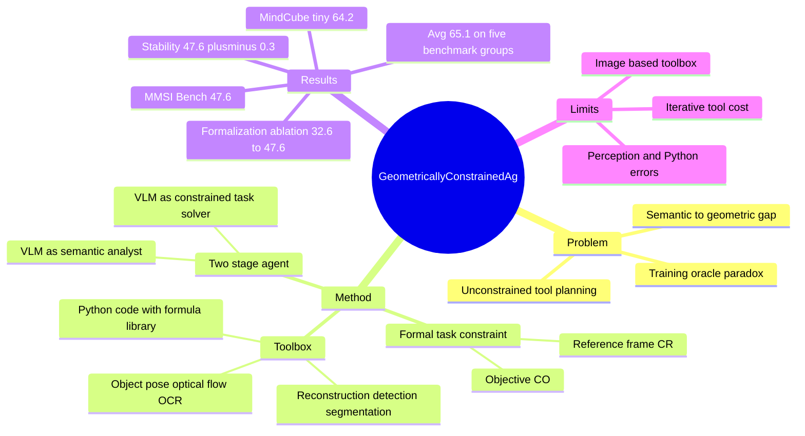

## Summary
GCA 解决 VLM spatial reasoning 中的 semantic-to-geometric gap：VLM 擅长语义解释，但在高精度几何、参考系和视角变换上容易在 lossy semantic space 中做错。方法是 training-free agentic paradigm，先让 VLM 把问题 formalize 成 formal task constraint $C_{task}=(C_R, C_O)$，再在该约束下调用检测、分割、3D reconstruction、object pose、Python code 等工具做 deterministic geometric computation。Table 1 报告 GCA 在多个 spatial reasoning benchmark 的 Avg 为 65.1，高于 foundation VLM、training-based spatial VLM 和 tool-integrated agent baselines。

## Problem & Motivation
论文的核心问题是：VLM 能理解“坐在沙发上”“某物在北边”这类语义，但把视觉信息压缩到文本语义空间后，细粒度几何细节会丢失或扭曲，因此 reference frame、orientation、egocentric perspective 等高精度空间推理会失败。

作者把现有路线分成两类，并指出各自边界。Training-based spatial VLM 依赖大规模空间数据和 oracle 生成逻辑，但这些 oracle（如 GPT-4o）本身也会在 spatial reasoning 上犯错，形成作者称为 “oracle paradox” 的问题。Tool-integrated methods 能把最后的几何计算交给外部工具，但 VLM 在 plan 阶段仍然不受约束，可能在调用工具前就把问题定义错，例如把“坐在沙发上”的视角错误默认成 camera viewpoint。

因此，论文想解决的不是“让 VLM 直接学会精确几何”，而是把 VLM 的角色限制在它较强的语义解释上：先定义一个可验证、可计算、不可随意改写的几何约束，再让工具链在这个约束内求解。

## Method
GCA 的核心是 formal task constraint $C_{task}$，它把 VLM 推理拆成两阶段：

**Stage 1: Task Formalization.** VLM 作为 semantic analyst，把自然语言 query 和 visual context 转成 $C_{task}=(C_R, C_O)$。$C_R$ 是 Reference Frame Constraint，定义最终答案所依赖的坐标系；$C_O$ 是 Objective Constraint，定义在该坐标系下要测量什么。论文把 reference frame 归纳为三类：object-based frame（如 washing hands 隐含面向 sink）、camera-based frame（如 “from viewpoint of Figure 1”）、direction-based frame（如 oven north of sink 用两个物体 centroid 的方向定义 north）。

**Stage 2: Constrained Geometric Computation.** VLM 转为 constrained task solver，在 $C_{task}$ 的不可变约束下做 ReAct-style tool orchestration。它需要先获取满足 $C_R$ 和 $C_O$ 的几何变量，再通过 code tool 做最终计算；中间可根据检测框、可视化反馈和多候选对象做 ambiguity resolution。

Toolbox 包括 3D Reconstruction（VGGT）、Object Detection、Segmentation、Object Orientation、Scene Alignment、OCR、Optical Flow、Utility Tool 和 Python Tool。实现细节里还给出 8 个 API：`reconstruct`、`detect`、`project box to 3d points`、`predict obj pose`、`estimate scale`、`ocr`、`analyze motion`、`code`。

一个关键设计是 Knowledge-Augmented Code Generation：code generator 不完全依赖 VLM 从记忆里写几何公式，而是根据变量类型注入固定、验证过的公式库，例如 world-to-camera transformation、object-to-world transformation、cardinal direction projection 等。这使最终计算更接近 deterministic computation，而不是 black-box guess。

## Key Results
**Main comparison.** Table 1 覆盖 MMSI-Bench、MindCube-tiny、OmniSpatial、SPBench、CV-Bench。表中 GCA 的 Avg 为 65.1，高于 Gemini-2.5-Pro 58.5、Qwen3-VL-Thinking 54.4、GLM-4.5V 52.5、GPT-4o 47.6、SpatialLadder 51.2、RoboBrain-2.0 49.1、TIGeR 47.3。正文 SOTA paragraph 写 “average accuracy of 64.8%”，与 Table 1 的 65.1 存在小不一致；这里以表格数值为主。

**Benchmark details.** 在 MMSI-Bench，GCA All 为 47.6，高于 Gemini-2.5-Pro 36.9、Qwen3-VL-Thinking 32.6、TIGeR 27.8；其中 PR./Attr./Mot./MSR 分别为 52.8/45.0/44.7/38.0。在 MindCube-tiny，GCA All 为 64.2，高于 Gemini-2.5-Pro 57.5、Qwen3-VL-Thinking 47.3、SpatialLadder 42.3。在 OmniSpatial，GCA All 为 65.1，高于 Gemini-2.5-Pro 55.8 和 TIGeR 49.8。在 CV-Bench，GCA All 为 86.9，只比 Qwen3-VL-Thinking 86.8 略高，说明它的优势主要不在这个较饱和 benchmark 上。

**Formalization ablation.** Figure 4 在 MMSI-Bench 上比较 Baseline (CoT-Only) 32.6、Tool (Uncon.) 40.1、Tool (Prompt) 41.9、GCA 47.6、Oracle (Anno.) 49.5。弱提示“注意 reference frame 和 objective”只能从 40.1 到 41.9，而 formal $C_{task}$ 到 47.6，说明约束不是普通 prompt hint，而是在改变 agent 的 problem formulation。

**Component ablation.** Table 2 显示，从 CoT-only 32.6 开始，Tool Integration 到 36.8，加入 KACG 到 38.7，加入 Feedback 到 40.1，最后加入 $C_{task}$ 到 47.6。Appendix Table 3 进一步显示，移除 objective constraint 后 MMSI-Bench 为 46.4，只掉 1.2；移除 reference frame constraint 后为 41.0，掉 6.6，支持作者的判断：当前 spatial reasoning 的主要歧义在 $C_R$。

**Generalization and stability.** Figure 5 报告 GCA 在不同 foundation VLM 上平均带来约 37% relative improvement；其中 Gemini-2.5-Pro 在 MMSI-Bench 从 36.9 到 55.0（+49%），GPT-4o 的提升为 +19%。稳定性实验在完整 MMSI-Bench 上做 10 次独立 run，结果为 47.6 ± 0.3，说明该 agentic framework 的随机性相对可控。

**Failure attribution.** Figure 6 把错误归因到 Task Formalization 30%、Python Tool 25%、Others 21%、Orientation 11%、Reconstruction 8%、Detection 5%。已知 failure cases 包括：top-down view 中 “down” 应指 gravity down，但 VLM 错默认成 camera down；VGGT 不能接受 “each shot after rotating 60 degrees” 这样的 textual input，导致 camera order 建模错误；Python Tool 会遗忘 coordinate transformation 或缺少主方向判定逻辑。

## Strengths & Weaknesses
**已知 strengths.** 这篇的 formulation 很清楚：不是继续让 VLM 在 lossy semantic space 中“想象几何”，而是把 spatial reasoning 拆成 semantic formalization 和 constrained geometric computation。这个拆分与实验吻合，尤其 Figure 4 / Table 2 说明普通 tool-use 和 prompt hint 不够，真正的增益来自 formal task constraint。

**已知 strengths.** 实验覆盖范围比较扎实：baseline 包括 foundation VLMs、training-based spatial VLMs 和 tool-integrated agents；benchmark 包括 multi-image spatial intelligence、mental 3D modeling、perspective taking、single/multi-view spatial reasoning 和 CV-Bench。Appendix 还给出子约束 ablation、10-run stability、tool API、prompt、failure attribution，使 claim 比单表 SOTA 更可审计。

**已知 weaknesses / limitations.** 方法代价比 simple end-to-end CoT 更高，因为需要 iterative tool calls 和多次 VLM interaction；论文自己也把这列为 limitation。当前 toolbox 主要面向 image-based spatial reasoning，作者明确提出未来要加入 temporal reasoning 和 motion tracking tools，才能覆盖更广泛的 spatial intelligence tasks。

**已知 weaknesses / limitations.** GCA 仍然强依赖底层 perception / geometry tools。Figure 6 显示 detection、orientation、reconstruction 合计约 24% 错误，Python Tool 还有 25% 错误；因此它的 verifiability 不等于 guaranteed correctness。CV-Bench 上 GCA 只比 Qwen3-VL-Thinking 高 0.1，也说明在较简单或饱和任务上，复杂 agentic pipeline 的边际收益有限。

**推测.** GCA 对 GUI Agent 有方法论启发：GUI spatial grounding 也常需要先固定 reference frame、viewport、element coordinate 和 objective，再调用 OCR/detection/DOM/tool 做计算；但论文没有评测 GUI、web 或 desktop agent benchmark，所以这只是迁移假设。

**不知道.** 论文没有给出明确 code repository，只在首页处给出 project homepage。也不知道 GCA 在真实机器人闭环执行、动态视频环境、长程导航、含可变 reference frame 的任务上表现如何；Appendix 讨论了 dynamic/time-varying reference frame 和 abstract region reference frame，但没有给出实验证据。

## Mind Map

## Notes
这篇最值得保留的 insight 是：spatial reasoning 的 bottleneck 不只是“有没有 3D tools”，而是 VLM 在使用工具前是否已经把问题定义到正确 reference frame 上。Tool-integrated agent 如果没有先 formalize `what to solve`，很容易把错误计划交给正确工具执行，结果仍然错。

对后续研究，我会重点追两个问题。第一，$C_R$ 是否可以从 reference frame 扩展为更一般的 task-state contract，用于 GUI agent 的 viewport、scroll offset、active window、element frame 和 interaction objective。第二，GCA 的中间产物能否作为 process reward 或 verifier signal，训练一个更便宜的 end-to-end spatial VLM，而不是永远依赖高成本 tool loop。
