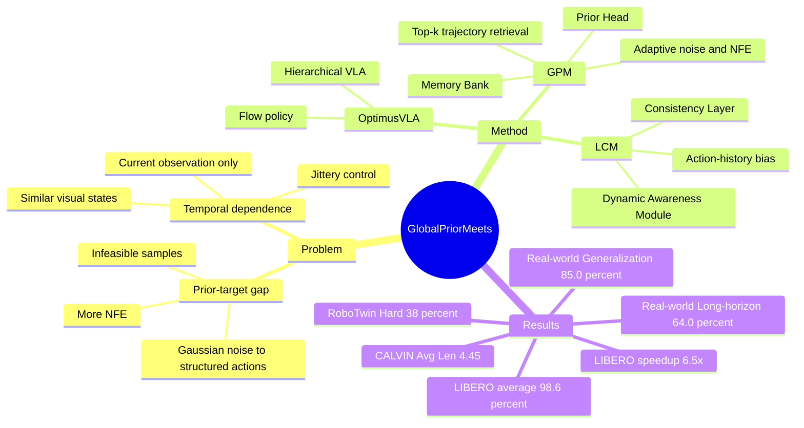

## Summary

OptimusVLA 针对 hierarchical VLA 中 action generation 的两个瓶颈：Gaussian / isotropic noise prior 到结构化动作分布的 prior-target gap 会增加 NFE 和 infeasible samples，单帧 observation conditioning 又缺少 task progress 与 temporal consistency。它用 Global Prior Memory 从语义相似轨迹检索 task-level prior 作为生成起点，并用 Local Consistency Memory 根据已执行 action history 注入 consistency bias，在 LIBERO、CALVIN、RoboTwin 2.0 和真实机器人实验中同时提升 success rate 与 inference efficiency。

## Problem & Motivation

作者关注的是 hierarchical Vision-Language-Action models 的低层 action generation，而不是高层语言理解本身。论文指出，主流 diffusion / flow-matching policy 通常从 Gaussian noise 生成 action chunk；由于 source distribution 与目标 action distribution 的差距很大，模型需要更多 denoising / flow steps，并且随机初始点可能落入 kinematically invalid action regions。

第二个问题是 temporal dependence：OpenVLA、π0 / π0.5 这类 VLA policy 主要 condition on current observation，遇到视觉上相似但 task phase 不同的状态时，可能无法判断任务是否已经推进到下一阶段。直接拼接 long observation history 会增加 latency / memory，并可能偏离 VLA 预训练时的 single-frame distribution；因此作者希望用更轻量的 memory 机制补足 progress awareness 和 trajectory consistency。

## Method

**Overall architecture.** OptimusVLA 仍是 hierarchical VLA：Vision-Language backbone 先把当前 observation 和 instruction 编码成 multimodal representation，flow policy 再生成 action chunk。新增模块是 Global Prior Memory (GPM) 和 Local Consistency Memory (LCM)：GPM 改变 generative process 的起点，LCM 在 action space 中提供局部一致性约束。

**Global Prior Memory (GPM).** GPM 把 prior initialization 视为 retrieval problem。Prior Head 用轻量 MLP 将 multimodal representation 投影为 retrieval token；Memory Bank 存储 task embedding 与完整 trajectory 的 key-value pairs，并按 cosine similarity 检索 top-k 相似轨迹。对检索到的 trajectory，GPM 用 sliding window 抽取 action blocks，再用 softmax similarity weights 构造 task-level Gaussian prior \(N(\mu, \mathrm{diag}(\mathrm{Var}))\)。Prior-Aware Sampler 进一步根据 global similarity 自适应设置 noise scale \(\lambda\) 和 NFE \(N\)：相似度越高，采样噪声和需要的 function evaluations 越少。

**Local Consistency Memory (LCM).** LCM 是 action-history working memory，不反复调用 heavy VLM。Consistency Layer 对上一段 action chunk 做 self-attention，建模 chunk 内 inter-action dependencies；Dynamic Awareness Module 使用 Mamba-based structure 更新 internal state，预测下一步的 consistency bias \(B_t\)。最终 policy input 是 GPM 采样得到的 prior action \( \hat{X}_t \) 加上 LCM bias，即 \(X_t = \hat{X}_t + B_t\)，再交给 flow policy 输出 action chunk。

**Training.** 训练分三阶段：先按 π0.5 的架构和 protocol 预训练 hierarchical VLA；再用 InfoNCE objective 训练 Prior Head 学习 task-discriminative retrieval representation；最后 freeze GPM，训练 LCM 预测 global prior mean \(\mu_t\) 与 ground-truth action chunk \(A_t^*\) 之间的 residual bias。实现上，OptimusVLA 从 π0.5 weights 初始化，加入 GPM / LCM 后总参数量为 3.6B，并在 8× NVIDIA A800 上以 global batch size 512 训练 30,000 steps。

## Key Results

**Simulation benchmarks.**

| Benchmark / setting | OptimusVLA | 对比基线与数字 |
|---|---:|---|
| LIBERO average success rate, 500 rollouts per suite | 98.6% | π0.5 96.9%, OpenVLA-OFT 97.1%, MemoryVLA 96.7% |
| LIBERO suite SR | Spatial 99.6%, Object 99.8%, Goal 98.4%, Long 96.4% | LIBERO-Long: π0.5 92.4%, MemoryVLA 93.4%, OpenVLA-OFT 94.5% |
| LIBERO-Long NFE | 3.2 | π0.5 uses 10.0 NFE |
| CALVIN ABC → D Avg. Len | 4.45 | π0 3.92, π0.5 4.26；论文称相对 π0 提升 13.5% |
| CALVIN success by track | 1/5 97.6, 2/5 93.2, 3/5 88.8, 4/5 85.7, 5/5 78.1 | π0.5: 94.4, 88.4, 85.3, 80.1, 76.1 |
| RoboTwin 2.0 Hard average SR, 100 rollouts | 38% | π0.5 29%, π0 25%, RDT 20%, ACT 2%, DP 1%, DP3 11% |
| RoboTwin 2.0 Stack Bowls Two | 58% | RDT 30%, π0 41%, π0.5 49% |

**Real-world evaluation.** 在 GALAXEA R1 Lite 14-DoF bimanual robot 上，OptimusVLA 在 Generalization Tasks 达到 85.0% average success rate，在 Long-horizon Tasks 达到 64.0%。论文称它分别超过 π0 42.9% 和 52.4%，并给出 2.9× real-world inference speedup。

**Efficiency.** Figure 5 报告 OptimusVLA 相比 π0.5 在 LIBERO 上达到 6.5× faster inference time 和 3.1× fewer NFEs，同时保持最高任务表现。Training efficiency 上，OptimusVLA 在 LIBERO-Goal 用 18,000 steps 达到 97.6% success rate，而 π0.5 需要 26,000 steps 才达到相近水平。

**Ablation.**

| Setting | LIBERO-Long | CALVIN Avg. Len | Real-world Generalization |
|---|---:|---:|---:|
| GPM + LCM | 96.4 | 4.45 | 85.0 |
| w/o GPM | 93.2 (↓3.3%) | 4.28 (↓3.8%) | 77.0 (↓9.4%) |
| w/o LCM | 94.8 (↓1.7%) | 4.38 (↓1.6%) | 79.5 (↓6.5%) |
| w/o both | 92.4 (↓4.1%) | 4.26 (↓4.3%) | 75.0 (↓11.8%) |

Memory Bank ablation 显示 GPM 依赖 memory richness 与合适的 retrieval breadth：LIBERO-Long 上 Num=6500, k=8 得到 96.4 SR；同样 Num=6500 但 k=1 下降到 92.6，Num=130, k=8 为 93.6。作者解释为：只存或只取少量 trajectory 会让 prior 过于 deterministic 或 overfit 到单一 retrieved trajectory，而较大的 k 能构造更稳健的 Gaussian mixture prior。

## Strengths & Weaknesses

**已知 Strengths.** 这篇论文的问题抓得比较准：在 VLA 已能做 perception / language grounding 的前提下，action generation 的 source-target distribution gap 和 temporal consistency 才是效率与鲁棒性的关键瓶颈。GPM 的贡献不是简单把历史轨迹拼进上下文，而是把检索到的相似 trajectory 变成 flow policy 的 task-level prior；LCM 也不是长视频记忆，而是在 action space 上维护轻量的 progress-aware consistency constraint。消融实验能清楚分开 GPM 与 LCM 的作用：去掉 GPM 对 real-world Generalization 的伤害最大，去掉 LCM 则主要损失 temporal consistency 和 long-horizon stability。

**已知 Weaknesses / boundary.** 方法依赖 Memory Bank 中存在语义相似且动作分布有参考价值的 trajectories；Table 5 已经显示 memory 数量和 top-k retrieval 选择会明显影响结果。论文的真实机器人实验有价值，但每个 Generalization task 50 rollouts、每个 Long-horizon task 25 rollouts，规模仍比仿真小。RoboTwin 2.0 Hard 虽然平均 rank 第一，但绝对成功率仍低：例如 Place Bread Skillet 只有 4% SR，说明 clutter / domain randomization / precise manipulation 下任务仍远未解决。

**已知 failure cases / negative evidence.** 论文没有系统报告 OptimusVLA 自身的失败案例 taxonomy；定性分析主要展示 π0.5 在 Gaussian prior 和 similar observations 下的问题。最直接的 negative evidence 来自 RoboTwin 2.0 Hard：OptimusVLA 在 Place Bread Skillet 只有 4%，Dump Bin Bigbin 为 35% 且低于 DP3 的 53%，Place Container Plate 为 37% 且低于 π0 的 45%。这些数字说明 GPM/LCM 并不是对所有 manipulation task 都单调优于所有基线。

**推测.** GPM 更可能在“相似任务共享 action manifold”的场景中有效；当 instruction / scene semantics 相似但所需动作因 geometry、tool dynamics 或 contact condition 大幅改变时，retrieved prior 可能成为错误 bias。LCM 的 action-history bias 对 bimanual / long-horizon manipulation 有自然优势，但它是否能处理需要显式 world state memory 的任务，论文没有直接证明。

**不知道.** 论文正文没有给出 arXiv id、DOI 或代码仓库链接；首页只给出项目页。也不知道 Memory Bank 中存在 noisy / adversarial trajectories 时 GPM 如何退化，或在完全没有相似 trajectory 的 open-set task 上 adaptive noise / NFE 是否足够保守。

## Mind Map

## Notes

- 已知：这篇的 memory 不是 observation replay，而是 action-generation memory。GPM 负责 global prior alignment，LCM 负责 local temporal consistency；两者都服务于低层 action chunk generation。
- 推测：对 GUI agent / computer-use agent 的启发是，可以把“下一步动作生成”中的先验也做成 retrieval-augmented prior，而不是只把 memory 当作 language context；但本文没有测试 GUI 或 web/mobile agent。
- 不知道：项目页是否包含公开代码、训练数据或完整 appendix 细节需要另查；仅凭论文正文不能确认。
