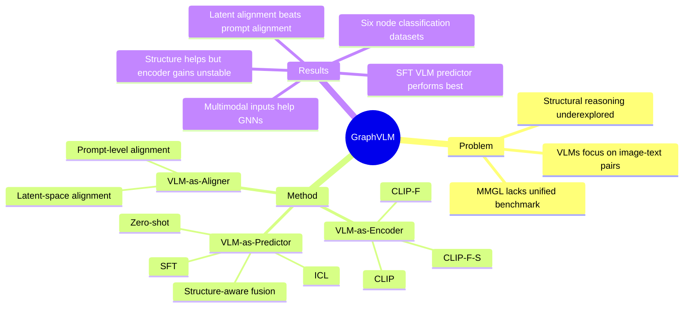

## Summary
GraphVLM 是一个面向 multimodal graph learning 的 VLM benchmark，系统比较 VLM-as-Encoder、VLM-as-Aligner、VLM-as-Predictor 三种使用范式。核心结论是：在六个 text+image attributed graph node classification 数据集上，fine-tuned VLM-as-Predictor 最强，latent-space fusion 通常比 prompt-level fusion 更稳定，但结构信息对 encoder 范式并不总是有效。

## Problem & Motivation
现有 VLM 主要处理 image-text pairwise alignment，较少评估它们能否利用显式 graph structure 做 multimodal relational reasoning。作者关注的 multimodal graph learning 场景里，每个 node 有文本和图像属性，edges 表示 co-purchase、co-comment 等关系，目标是 node classification。

论文指出两个具体缺口：第一，已有 MMGL benchmark 和方法比较碎片化，GNN-based、LLM-based、VLM-based 方法缺少统一 evaluation pipeline；第二，VLM 往往只被当作 zero-shot predictor 或 feature extractor，尚未系统测试其作为 trainable graph learning backbone、modality aligner、structure-aware encoder 的潜力。

这个问题对 VLM 研究有参考价值：它把"多模态理解"从单样本视觉语义扩展到 graph-structured multimodal context，但它不是 GUI-agent 或 embodied task，结论不能直接外推到屏幕操作或物理交互。

## Method
**Benchmark setting.** GraphVLM 聚焦 text + image multimodal graph 的 node classification。六个数据集来自 Amazon co-purchase networks 和 Reddit social network：Movies、Toys、Grocery、Arts、CDs、Reddit。节点对应商品或帖子，边对应 co-purchased / co-commented 关系，split 为 60% train、20% validation、20% test。

**VLM-as-Encoder.** 这一范式把 VLM/PVLM 当作 node feature encoder，再交给 GNN 或 MLP。作者比较三类 encoder：原始 CLIP text+image embedding；在每个 MMG 数据集上用 contrastive learning fine-tune 的 CLIP-F；以及把 1-hop neighbor 随机采样进 contrastive objective 的 structure-aware CLIP-F-S。下游模型包括 MLP、GCN、GraphSAGE、MMGCN、MGAT 和 UniGraph2。

**VLM-as-Aligner.** 这一范式服务 GraphLLM。作者设计两种 multimodal adaptation：prompt-level alignment 用 Qwen-VL 生成 image description，再把原文本和图像描述合成输入；latent-space alignment 用 CLIP text-image embeddings 替换或增强原始 node representation，让 GraphLLM 在 embedding level 接收多模态信号。被评估的 GraphLLM 包括 GraphPrompter、LLaGA、GraphGPT、GraphTranslator 和 MLaGA。

**VLM-as-Predictor.** 这一范式直接 fine-tune VLM 作为 node classifier。作者测试 LLaVA-1.5-7B、Qwen-VL-7B、Qwen2.5-VL-7B，并比较 zero-shot、in-context learning、supervised fine-tuning。结构信息注入有两条路径：prompt-level fusion 把 anchor node 的 top-3 similar 1-hop neighbors 的文本/图像属性放入 prompt；latent-space fusion 则把 neighbor image patch embeddings 和 text token representations 聚合后注入 latent space。

## Key Results
- **GraphVLM benchmark / Table 5.** 六个数据集规模分别为 Movies 16,672 nodes / 218,390 edges / 19 classes，Toys 20,695 / 126,886 / 18，Grocery 84,379 / 693,154 / 20，Arts 28,195 / 197,428 / 7，CDs 36,272 / 844,878 / 15，Reddit 99,638 / 1,167,188 / 50。CDs 的平均 degree 为 47，Grocery 为 16，Toys 为 12。
- **VLM-as-Encoder / Figure 2, Table 2.** multimodal input 对 GNN-based methods 有稳定收益；在 MLP 上，text+image 比 text-only 高 +5.18%，比 image-only 高 +13.61%。Table 2 中 GNN/MLP encoder 设置的最好结果包括 Movies 47.88%（GCN + CLIP-F）、Toys 77.77%（GraphSAGE + CLIP）、Grocery 86.05%（GraphSAGE + CLIP）、Arts 88.92%（MMGCN + CLIP）、CDs 55.70%（MGAT + CLIP-F-S）、Reddit 81.74%（MGAT + CLIP-F-S）。
- **VLM-as-Aligner / Table 3.** multimodal alignment 提升 GraphLLM，且最好结果都来自 multimodal baselines：Movies 50.61%、Grocery 86.83%、CDs 56.29% 由 LLaGA + latent-space alignment 取得；Toys 80.00%、Arts 89.79% 由 MLaGA + latent-space alignment 取得。作者明确指出 latent-space alignment 整体优于 prompt-level alignment，prompt-level 可能因把视觉压缩成单一文本通道而损失信息或引入噪声。
- **VLM-as-Predictor / Table 4.** fine-tuning 是最大增益来源。Qwen-VL-7B 在 Movies 上从 zero-shot 12.56% 提升到 SFT 54.18%，约 4.3x；作者报告 Qwen-VL-7B 在所有数据集上有 +21.48% 到 +44.61% 的绝对提升。overall best 数字为 Movies 54.21%（Qwen2.5-VL-7B SFT）、Toys 82.56%（Qwen2.5-VL-7B SFT）、Grocery 88.53%（Qwen2.5-VL-7B prompt fusion）、Arts 93.62%（Qwen2.5-VL-7B vision prompt fusion）、CDs 59.82%（Qwen-VL-7B text+image latent fusion）、Reddit 86.67%（Qwen-VL-7B text+image latent fusion）。
- **Structure and fusion ablations / Table 4, Figure 5.** structure-aware SFT 比 structure-aware ICL 强，作者报告额外 accuracy gain 为 +15.37% 到 +29.20%。在 Qwen-VL-7B 的相同 neighbor modality 设置下，latent-space fusion 在 18 个 case 中赢了 15 个；但 structure-aware encoder 只在三个数据集上带来提升，且在稀疏 graph 如 Toys、Grocery 上可能不稳定或负收益。
- **Efficiency trade-off / Table 8.** VLM-based 方法效果强但计算成本高：Movies 上 Qwen-VL / Qwen2.5-VL training 约 5h、inference 约 20min；GNN-based models training 约 2-3min、inference 约 10-20s。GraphGPT training 约 60min、inference 约 30min。

## Strengths & Weaknesses
**已知的强点。** 论文价值主要在 benchmark formulation 和横向比较，而不是提出一个复杂模型。它把 VLM 的角色拆成 Encoder / Aligner / Predictor，并在同一批数据集上比较 GNN-based、GraphLLM-based、VLM-based 方法，使"VLM 到底应放在 multimodal graph pipeline 的哪个位置"这个问题更可证伪。实验也不只报主表：SFT vs zero-shot / ICL、prompt-level vs latent-space fusion、structure-aware vs non-structure-aware、encoder fine-tuning、efficiency trade-off 都有对应分析。

**已知的局限。** 任务只覆盖 text+image node classification，没有 edge prediction、link prediction、graph-level reasoning 或 open-ended reasoning。数据主要来自 Amazon 和 Reddit，graph relation 是 co-purchase / co-comment，未证明能迁移到 scientific knowledge graph、GUI transition graph、robot scene graph 等更异质结构。UniGraph2 的 shortest-path distance module 因 O(n^3) complexity 被省略，这对其原始方法的公平性可能有影响。VLM-as-Predictor 的训练和推理成本明显高于 GNN-based baselines。

**失败模式 / 边界。** prompt-level alignment 没有稳定优于 latent-space alignment，作者归因于视觉信息转文本时的信息瓶颈、噪声和 context length 限制。structure-aware encoder 也不是稳定收益，说明把结构压到单一 node embedding 可能不足以表达复杂 neighborhood context。zero-shot VLM 在 node classification 上很弱，例如 Qwen-VL-7B 在 Movies 只有 12.56%，说明 VLM 的通用多模态能力并不会自动转化为 graph-aware prediction。

**推测。** 对 GUI-agent / embodied research 的可迁移启发不是具体 benchmark，而是方法论：如果 UI state、scene graph 或 memory graph 同时含视觉、文本和关系边，那么 latent-space structural fusion 可能比把邻居节点全部写进 prompt 更稳。但这是跨领域推测，论文没有在 GUI 或 embodied benchmark 上验证。

**不知道 / 未证实。** 论文没有给出 DOI。它报告代码公开于 GitHub，但笔记未验证仓库内容是否完整可复现。作者声称 VLM-as-Predictor 是 MMGL 的 strong foundation，但目前证据限定在六个 node classification 数据集和三类 7B VLM backbone，尚不知道更大模型、动态图、多跳 reasoning 或真实 agent state graph 上是否保持同样排序。

## Mind Map

## Notes
这篇论文更新了一个判断：VLM 做 structured multimodal reasoning 时，"把视觉描述转成文本再塞进 prompt"未必是最稳路径，latent representation 层面的结构注入可能更重要。对 GUI-agent 方向，值得借鉴的是它把 VLM 角色拆开的方式：screen encoder、state aligner、action/state predictor 应分开评测，而不是只看端到端成功率。

一个后续问题是如何把 GraphVLM 的 node classification setting 改成 agent-relevant graph：节点可以是 UI element、web page state、memory slot 或 observed object，边可以是 spatial relation、navigation transition、temporal dependency 或 tool-call dependency。真正关键的 benchmark 不是让 VLM 给节点分类，而是测试它能否在 graph-structured multimodal context 中做可执行决策。
