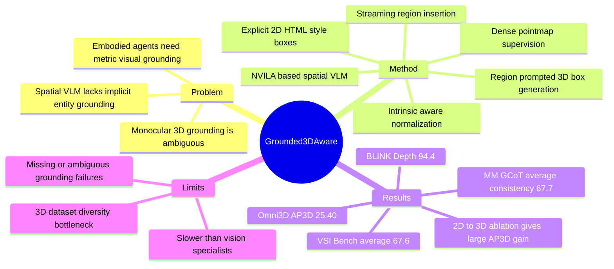

## Summary
GR3D 是一个面向 spatial VLM 的 grounding-first 框架，把 explicit 2D grounding、implicit 2D grounding 和 monocular 3D grounding 放进同一个 generative VLM 流程中。它的核心想法是让模型在生成 CoT 时动态定位文本提到的实体、插入 region token，再基于该局部视觉证据做 3D box / point / spatial reasoning。

## Problem & Motivation
作者要解决的是 VLM 在物理空间任务中的 grounding 缺口：模型不仅要识别物体，还要知道物体在哪里、相互距离/方位如何，以及语言中的实体到底对应哪个 image region。论文指出两个主要限制：第一，很多 spatial VLM 只能处理显式的 “point to X” 式 grounding，缺少在 free-form reasoning 中自动把实体 mention 对齐到 region 的机制；第二，monocular 3D grounding 本身是 ill-posed，单张图里 scale、depth、camera intrinsics 与实例消歧纠缠在一起。

这对 embodied / VLA / GUI-like spatial agent 有直接相关性：如果模型不能把语言目标稳定地落到视觉区域和 metric space，后续 action grounding、navigation、manipulation 都会变脆。论文的立场是，grounding 不只是一个附属检测任务，而是增强 spatial understanding 的 inductive bias。

## Method
**Base model.** GR3D 基于 NVILA-8B-Lite / NVILA-Lite 8B 构建，沿用 SR-3D 的 spatial VLM 思路：视觉 token 加入 pixel coordinate 和 relative depth positional cues，保持空间局部性；region prompt 通过 pooling 指定 2D box 内的 features 得到 region token。实现细节里，vision encoder 使用 SigLIP，输入分辨率 448，patch size 14；stage 1 冻结 vision encoder，训练其他模块。

**Explicit 2D grounding.** 模型直接用 language head 生成 HTML-style 2D box，例如 `<bbox>[x1, y1, x2, y2]</bbox>`，不引入额外 detection head。这让 grounding 输出和普通语言生成接口一致。

**Implicit 2D grounding / streaming region insertion.** 在 CoT 生成过程中，当模型提到某个实体时，先生成对应 2D box，再把该区域编码成 region token 插入当前 text stream。训练时 box 坐标作为文本序列 teacher forcing，region token 来自 ground-truth region 且 detached；推理时模型 autoregressively 预测 box、编码预测 region、继续生成后续 reasoning。这个机制把 “先找对象，再推理关系” 放进一个连续生成流，而不是外部两阶段 pipeline。

**Monocular 3D grounding via region prompt.** 给定 grounded 2D region，模型把 region token 当作 3D inference query，生成 camera-view 3D box。3D box 用文本格式表示 center `(xc, yc, zc)`、size `(w, h, l)` 和 normalized Euler angles `(pitch, roll, yaw)`。为缓解 focal length 差异，论文用 intrinsic-aware normalization 按 `fx` 重新缩放输入宽高，使不同数据集的 field of view 更一致。

**Supervision and data.** 训练数据包括 97K grounded CoT samples、780K 3D detection samples（Omni3D + EmbodiedScan）和 272K pointmap reconstruction samples（DepthLM）。implicit grounding 数据从 RefSpatial 开始，用 Florence-2 为 textual mentions 生成候选 2D boxes/class labels，再用 VLM verification 和 rephrasing 去掉不匹配或歧义样本。3D 监督包括 region-to-3D、text-to-3D，以及从 depth / predicted depth 采样 surface points 做 dense point-to-3D supervision。

## Key Results
**Omni3D 3D detection.** GR3D-8B 的 overall AP3D 为 25.40，高于 DetAny3D w/ Cube R-CNN 的 24.92、Cube R-CNN 的 23.26、OVMono3D w/ Cube R-CNN 的 22.98。按 dataset 看，GR3D 在 SUN-RGBD mAP 31.64（DetAny3D 18.96）、ARKitScenes mAP 52.52（DetAny3D 46.13）上优势明显；Objectron mAP 54.32 略低于 DetAny3D 的 54.42，KITTI / nuScenes 仍低于 Cube R-CNN 的 32.50 / 30.06。

**2D grounding / detection.** 在 Omni3D 的 2D detection 评估中，GR3D-8B 在 SUN-RGBD / ARKitScenes / Objectron / Hypersim 分别得到 38.86 / 46.17 / 51.66 / 28.53 mAP，高于 Qwen3-VL-8B 的 8.06 / 22.44 / 30.06 / 3.08；但在 KITTI / nuScenes 上为 20.49 / 22.16，低于 Cube R-CNN 的 36.14 / 34.64。补充实验里，RefSpatial 上 GR3D-8B 得到 Location 63.0、Placement 50.0、Unseen 41.5；RoboRefer-8B 为 52.0 / 53.0 / 37.7。

**Spatial reasoning and VQA.** BLINK-Depth 上 GR3D-8B 得到 94.4% accuracy，高于 SR3D-8B 的 90.3、SpatialRGPT-8B 的 87.9、GPT-4V-Turbo 的 66.9、GPT-4o 的 64.5。Table 3 中，Stage 1 spatial pretraining 把 NVILA-Lite-8B 的 BLINK Depth 从 73.38 提到 87.90，SAT 从 62.60 提到 76.00，ERQA 从 36.25 提到 40.25；Stage 2 detection CoT finetuning 后 SAT 降到 70.60、ERQA 降到 38.50，但 ChartQA / POPE / AI2D 与 Stage 1 接近。

**Implicit grounding CoT.** MM-GCoT 上，GR3D-8B average AccA / AccG / Cons. 为 78.3 / 74.2 / 67.7，高于 LLaVA-GCoT-7B 的 74.5 / 63.3 / 58.1，也高于 Qwen2.5-VL-7B answer-first 的 73.1 / 64.3 / 56.8。论文用这个结果支持一个较强 claim：插入的 grounding 不只是可视化解释，而是与答案正确性有更高一致性。

**Ablations.** Table 5 显示，2D grounding followed by 3D prediction 是最大贡献项：SUN-RGBD AP3D 从 direct 3D 的 20.27 提到 29.87，KITTI AP3D 从 6.22 提到 10.03。加入 spatial pretraining 后，KITTI AP3D 从 10.03 提到 14.35；再加入 intrinsic normalization 后，SUN-RGBD / KITTI AP3D 从 30.95 / 14.35 提到 31.64 / 14.75，属于小但一致的增益。pointmap reconstruction 的 scaling figure 显示更多 pointmap supervision 会提升 SUN-RGBD 的 3D detection 指标，但正文未给出表格化精确数值。

**Multi-view supplement.** 在按 SR-3D 设置 finetune 后，GR3D-8B 在 VSI-Bench 上 average 67.6，高于 SR-3D-8B 的 62.9 和 LLaVA-Video-72B 的 40.9。ScanRefer adaptation 中，GR3D-8B 得到 @0.25 / @0.5 = 52.0 / 46.1，高于 Qwen3-VL-8B 的 37.7 / 33.2。

## Strengths & Weaknesses
**已知的亮点。** 第一，方法把 2D entity resolution 和 3D inference 显式解耦，但又通过 streaming region insertion 保持在单个 generative VLM 内，设计上比纯 direct 3D text generation 更可解释。第二，ablation 支持 2D→3D decomposition 的必要性，尤其 SUN-RGBD 和 KITTI 的 AP3D 提升很大。第三，dense pointmap supervision 是合理的 scaling 方向，因为 3D box annotation 稀缺，而 depth/point supervision 可以提供更密的几何信号。第四，论文没有只报主表，还给了 MM-GCoT consistency、intrinsics error、data noise、latency 和 failure case。

**已知的局限。** 论文明确承认两点：GR3D 比 vision specialist 慢，因为使用 LLM backbone、两阶段 2D-first pipeline，并以 autoregressive text 生成 3D boxes；现有 3D detection datasets 覆盖的环境、camera configurations 和 object categories 仍窄，限制了 3D supervision 的多样性。延迟上，GR3D-8B 为 2.72s，慢于 DetAny3D 的 0.98s，但接近 VST-7B 的 2.76s、快于 Qwen3-VL-8B 的 3.23s；每个 inserted region 额外开销约 0.01s。

**失败模式。** 作者说没有观察到频繁 hallucinated 2D boxes，主要失败来自 missing 或 ambiguous 2D grounding，这会传导到错误 3D prediction。数据噪声也很敏感：使用 noisier corpus 会让 MM-GCoT grounding accuracy 从 74.2 降到 62.8；人工抽查 200 个 filtered corpus instances 时，generated boxes 的准确率为 95.5%。GeoCalib 估计 focal length 替代真实 intrinsics 会让 Omni3D 六数据集平均 mAP 下降 1.2。

**我不完全买账的地方。** 已知：GR3D 在 indoor 3D detection 和 region-level spatial reasoning 上证据强；但 outdoor KITTI / nuScenes 仍弱于 Cube R-CNN，说明它还不是全面替代 specialist detector。推测：对 embodied agent 更有价值的可能不是当前 3D box AP 本身，而是 “语言 mention -> grounded region -> metric reasoning” 这个可组合接口。不知道：这种 implicit grounding 在长程交互、连续视频、真实 robot closed-loop control 中是否仍稳定，因为论文主要报告 benchmark inference，而不是 action-loop 成功率。

## Mind Map

## Notes
rating=4。它不是 GUI agent paper，但对 VLM / embodied spatial reasoning 很重要：它把 grounding 作为生成过程中的可调用视觉证据，而不是只在输入或输出端附加坐标。对 GUI agent 的间接启发是：复杂界面任务也可能需要类似的 streaming grounding，把自然语言计划中提到的 UI/entity 动态落到 visual region 后再继续推理；这只是类比，不是论文实验结论。

后续值得追的问题：
- implicit grounding 的 region token 如果换成 UI element token / accessibility node，是否能减少 GUI CoT 中的对象漂移？
- 2D→3D decomposition 的成功是否主要来自更好的 instance disambiguation，还是来自 region feature pooling 带来的 visual denoising？
- pointmap supervision 对 spatial VLM 的泛化收益能否迁移到 action affordance 或 navigation waypoint prediction？
