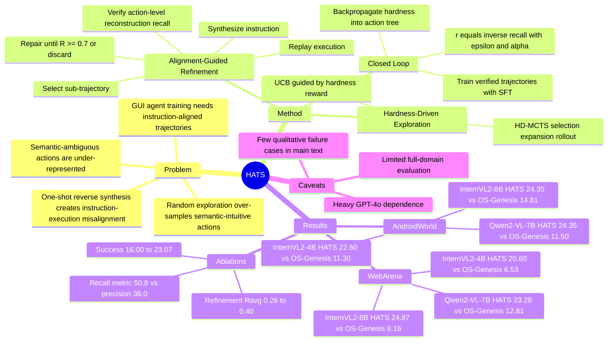

## Summary
HATS 把 GUI agent 轨迹合成中的核心瓶颈定义为 semantic-ambiguous actions 覆盖不足和 instruction-execution misalignment，并用 hardness-driven exploration + alignment-guided refinement 的闭环 HD-MCTS 来合成更难、更对齐的训练轨迹。实验显示，在同样 1K trajectory synthesis budget 下，HATS 在 AndroidWorld 和 WebArena 上稳定优于 OS-Genesis、Task-Driven Generation、Self-Instruct 等数据合成 baseline。

## Problem & Motivation
GUI agents 需要高质量、instruction-aligned trajectories 来学习从屏幕状态到动作的长程操作，但人工采集目标和轨迹成本高，task-driven pipelines 还会产生不一致的 traces。OS-Genesis 这类 reverse task synthesis 通过随机 UI exploration 先探索再反向生成任务说明，减少了人工 goal authoring；但论文指出，uniform random walk / shallow BFS 会让超过 70% 的 traces 塌缩到 trivial semantic-intuitive actions，例如 open menu、tap back。

作者把被忽略的关键数据类型称为 semantic-ambiguous actions：动作含义依赖 context、sequence precondition 或视觉细节，例如相同 plus icon 在不同上下文触发不同功能，或某个操作必须先完成前置步骤才成功。已有 pipeline 的问题有两层：一是很少采到这些高价值交互；二是即便采到，one-shot instruction generation 也容易漏掉上下文，导致 synthesized instruction 与实际执行轨迹不一致，形成 noisy supervision。

## Method
**核心定义.** HATS 把 hardness 定义为 action 的 semantic ambiguity 程度，而不是传统 task reward。环境被表示为 action tree；状态是 screenshot + optional UI tree，动作集合包括 TAP、TYPE、SCROLL、BACK、LONG-PRESS、SWIPE，trajectory 记录 state-action sequence。

**Hardness-Driven Exploration.** HATS 沿用 OS-Genesis 的 interaction-driven discovery，但把 random exploration 换成 Hardness-Driven Monte Carlo Tree Search。Selection 阶段用 UCB 在 action tree 上选择分支，其中 Q value 不是环境 reward，而是后续 refinement 反馈得到的 hardness reward；Expansion 执行未访问动作并扩展节点；Simulation Phase I 做 bounded-depth rollout，产生 candidate exploration trajectory。

**Alignment-Guided Refinement.** Refinement 模块把 noisy Exploration Sequence 变成 Verified Trajectory。流程是：从 rollout 中选取语义连贯的 sub-trajectory 作为 Reference Sequence A；用 prompt-driven VLM 合成 instruction I；从 A 的起始状态 replay instruction 得到 Execution Sequence B；用 action-level reconstruction recall 衡量 B 是否覆盖 A 中的 intended actions。若 R(A, B) < Rmin 或执行失败，就向 instruction 注入缺失上下文并重新执行，直到 R(A, B) >= 0.7 或达到 Fmax；通过验证的 instruction-trajectory pair 才进入训练 corpus，否则丢弃，并把 misalignment 作为 hardness signal。

**Closed loop.** Hardness reward 定义为 `r(A,B) = (R(A,B) + epsilon)^(-alpha)`，默认 `epsilon=0.01, alpha=1`。直觉是：instruction 越难复现 reference behavior，说明该 GUI interaction 越 ambiguous、越值得探索；这个 hardness reward 会沿 MCTS path backpropagate，更新 Q(v,a) 和 N(v,a)，从而让下一轮 exploration 更偏向难对齐但信息量高的 UI 区域。

**Training / implementation.** 实验使用 InternVL2-4B、InternVL2-8B、Qwen2-VL-7B 三个 VLM backbone，GPT-4o 用于 instruction synthesis 和 reward modeling；所有方法在相同 SFT setting 下训练，输入包括 screenshots 和 a11ytree。HATS 与 OS-Genesis 使用相同的 1K trajectory synthesis budget，额外开销由 HD-MCTS iteration budget 和 replay-refine 的 Fmax 控制。

## Key Results
**AndroidWorld.** 在 InternVL2-4B 上，HATS overall success rate 为 22.60%，OS-Genesis 为 11.30%，Task-Driven w. Self-Instruct 为 6.09%，Task-Driven 为 7.90%，Zero-Shot 为 1.02%；其中 S&C 类别 HATS 38.46% vs OS-Genesis 11.11%，P&W 类别 8.64% vs 3.64%。在 InternVL2-8B 上，HATS overall 24.35% vs OS-Genesis 14.81%；在 Qwen2-VL-7B 上，HATS overall 24.35% vs OS-Genesis 11.50%。论文同时报告 GPT-4o Zero-Shot reference baseline 在 AndroidWorld overall 为 45.22%，所以 HATS 的 claim 是提升开源 VLM agent 的合成训练效果，而不是超过 GPT-4o reference agent。

**WebArena.** 论文只评估 Gitlab、Maps、Reddit 三个 representative domains。InternVL2-4B 上，HATS overall 20.60% vs OS-Genesis 6.53%；InternVL2-8B 上，HATS 24.87% vs OS-Genesis 8.16%；Qwen2-VL-7B 上，HATS 23.28% vs OS-Genesis 12.81%。在 InternVL2-4B 的 Gitlab / Maps / Reddit 分项中，HATS 分别为 22.73% / 20.19% / 17.92%，OS-Genesis 分别为 7.94% / 7.50% / 3.13%。

**Hardness metric ablation.** Table 3 显示默认 `epsilon=0.01, alpha=1` 的 success rate 为 50.8%；同样 epsilon 下，`alpha=0.5` 为 22.7%，`alpha=2.0` 为 39.2%。当 `epsilon=0.10` 时，`alpha=0.5/1.0/2.0` 分别为 13.8% / 40.0% / 37.9%。Table 4 中，基于 recall 的 action-level alignment metric 对应 success rate 50.8%，precision 替代版为 36.0%，支持作者关于“missing intended steps 是 ambiguous GUI workflow 主失败模式”的判断。

**Exploration / refinement ablation.** HATS 把 AndroidWorld 中较难的 P&W category 采样比例从 baseline 的 31.2% 提高到 46.6%，把较容易的 S&U 从 30.8% 降到 18.9%。多轮 refinement 在 AndroidWorld 上把 average action-level reconstruction recall 从 one-shot 的 0.26 提高到 Round 3 的 0.40，success rate 从 16.00% 提高到 23.07%；但 Round 1 反而降到 Ravg 0.19、success 15.56%，说明 refinement 不是单调无风险，早期 correction 可能引入新的不稳定，Round 2/3 才恢复并超过 one-shot。

## Strengths & Weaknesses
**已知（paper evidence）.**

1. HATS 的主要价值在于把 GUI trajectory synthesis 从“随机探索 + one-shot 反向描述”改成“针对 semantic ambiguity 的闭环采样 + replay verification”。这个 formulation 比单纯扩大轨迹数量更接近 GUI agent 当前的数据瓶颈。
2. 实验覆盖 AndroidWorld 和 WebArena，并在 InternVL2-4B、InternVL2-8B、Qwen2-VL-7B 三个 backbone 上一致超过 OS-Genesis，说明效果不是单一模型偶然性。
3. Ablation 不只看 downstream SR，也看 action-level reconstruction recall、hardness parameter、recall vs precision metric、category/action distribution shift，能支撑“hardness signal 确实改变采样分布并改善 alignment”的机制解释。
4. 论文明确承认 noisy supervision 对 GUI agent 很敏感：baseline reproduction 中，加入 Self-Instruct data 有时会让 Task-Driven performance 下降，这与 HATS 强调 verification 的动机一致。

**推测（我的判断）.**

1. 这篇工作的可复用 insight 可能不是具体的 HD-MCTS，而是把“alignment failure”转成 curriculum / exploration reward：越难用 instruction replay 复现的 GUI 行为，越值得被采样、修复和训练。
2. 对 GUI agent 训练来说，semantic ambiguity 可能比 action diversity 更关键。HATS 的 P&W/S&U 分布变化暗示，难度感知采样可以避免 dataset 被 easy UI operations 填满。
3. HATS 与 OS-Genesis 的关系更像 data engine upgrade，而不是 agent architecture breakthrough；如果未来有更强的 executor 或 verifier，hardness reward 的形式可能需要重估。

**不知道 / 局限.**

1. 论文主文没有给出完整 qualitative failure cases：例如哪些 HATS trajectory 被 refinement 丢弃、哪些 ambiguous action 仍无法对齐、失败是否集中在特定 UI 类型。
2. 多个关键模块依赖 GPT-4o prompt-driven VLM，包括 instruction synthesis、reward modeling 和第三方 ambiguity auditing；成本、judge bias、model-version sensitivity 没有在主文中充分量化。
3. Hardness proxy 依赖 replay recall，可能把“真实语义歧义”和“executor/VLM 本身不稳定”混在一起。低 R(A,B) 不一定总是高价值 ambiguity，也可能是模型执行能力差或环境 nondeterminism。
4. WebArena 为节省计算只评估 Gitlab、Maps、Reddit 三个 domain；AndroidWorld component analysis 也使用 representative subset。因此结果支持 mobile/web GUI trajectory synthesis，但还不能直接外推到完整 desktop OSWorld 或真实跨应用办公流。
5. Category-level coverage 对比没有直接用 OS-Genesis training data，因为 OS-Genesis 不提供 category-labeled training data；论文用 Task-Driven w. Self-Instruct 作为 category-level comparison baseline，这使“相对 OS-Genesis 的采样分布变化”证据不完全直接。

## Mind Map

## Notes
- **我的判断**：rating=4。它和 GUI-agent 数据合成方向高度相关，问题 formulation 清楚，实验数字强于 OS-Genesis；但主文对失败案例、成本、verifier bias 和 full-domain generalization 的交代还不够，使它更像重要的 data pipeline paper，而不是完整解决 GUI agent generalization。
- **和研究方向的关系**：HATS 可以作为 GUI trajectory synthesis 的一个新 baseline，也能启发 agentic-RL / curriculum learning：把环境中的 instruction-execution mismatch 转化为可优化的探索信号。
- **值得跟进的问题**：能否不用 GPT-4o 做 verifier，而用小模型或 learned verifier 估计 hardness？能否把 hardness reward 和 online RL / self-improvement 结合？semantic ambiguity 的三类标签（context / sequential / visual）能否变成更细的 data mixture control，而不是只作为 audit 指标？
- **谨慎点**：不要把 HATS 的 benchmark gain 解读成“语义歧义已解决”。论文证明的是，在给定 1K 合成预算和三类 VLM backbone 下，闭环 hardness-aware synthesis 比 OS-Genesis 等 baseline 更有效；它没有证明该方法能覆盖所有真实 GUI workflows，也没有证明 hardness proxy 与人类定义的任务难度完全一致。
