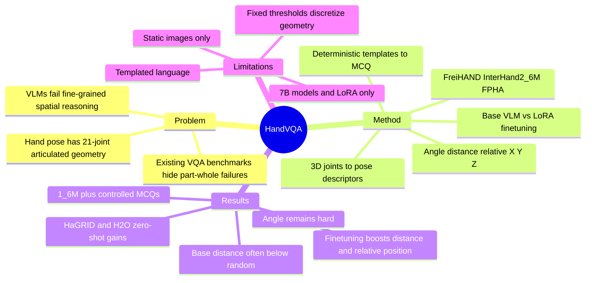

## Summary
HandVQA 是一个把 3D hand joint geometry 转成 VQA 的诊断 benchmark，用 FreiHAND、InterHand2.6M 和 FPHA 生成 1.6M+ controlled multiple-choice questions，专门测 VLM 对手部 angle、distance、relative position 的 fine-grained spatial reasoning。论文的核心结论是：base VLM 在这些几何关系上接近随机或低于随机，LoRA finetuning 能显著改善 distance / relative position，但 angle 仍是主要瓶颈，并且学到的 3D hand spatial knowledge 可零样本迁移到 gesture recognition 和 hand-object interaction recognition。

## Problem & Motivation
现有 VLM 在通用 VQA benchmark 上表现强，但论文指出这不代表它们真正掌握了几何空间关系；已有空间推理评测中，简单 left / right 等关系也会暴露明显失败。手部是更困难的 case：单手有 21 个 joints，动作语义往往取决于 finger curl、fingertip distance、front / behind 等细粒度结构。

这个问题对 embodied agent、AR/VR 和 robot-assisted surgery 等场景有直接意义，因为手势或手-物交互理解错误可能导致 action intent 判断错误。作者认为已有 benchmark 多关注 object-level 或 inter-object relations，而 HandVQA 聚焦 single object 内部的 part-whole geometry：手部 joint kinematics。

## Method
**Benchmark construction.** HandVQA 从 FreiHAND、InterHand2.6M、FPHA 的 3D hand joint annotations 出发，构造五类 pose descriptors：joint angle、joint-pair distance，以及 X / Y / Z 三个轴上的 relative position。aligned relative-position cases 会被排除，因为作者认为视觉上有歧义。

**Pose descriptor extraction.** 对 angle，作者按阈值离散成 `bent completely inward`、`bent inward`、`bent slightly inward`、`straight` 四类；对 distance，按 `d < 0.1`、`0.1 <= d < 0.3`、`d >= 0.3` 离散成 close / spread / spread wide；对 relative position，按每个轴的 `-0.15` 和 `0.15` 阈值离散成 left/right、below/above、behind/in front 等类别。

**Text and MCQ generation.** pipeline 分三步：`Fpose` 计算连续几何量并离散化，`Ftext` 用 deterministic sentence templates 把 joint names 和 category labels 填成自然语言陈述，`Fmcq` 把正确句子和 distractors 组成 multiple-choice question。每张图在过滤前最多可产生 107 个 MCQs；为了可扩展性，作者每个 descriptor type 随机采样 5 个 joint 或 joint-pair instances，因此每张图生成 25 个 MCQs。

**Evaluation setup.** 主实验报告三类 7B VLM：DeepSeek Janus Pro 7B、LLaVA Mistral 7B、Qwen 2.5 VL 7B Instruct，并比较 base model 与 LoRA finetuned model。angle / distance 用 accuracy 和 MAE，relative position X/Y/Z 用 accuracy；作者只评估 7B models，原因是 GPU resource constraints。

**Transfer setup.** 为测试 HandVQA 是否只是诊断集，作者把 HandVQA finetuning 后的模型零样本用于两个新任务：HaGRID gesture recognition 和 H2O hand-object interaction recognition。HaGRID 被转成 33,500 个 MCQs；H2O 用 test split 构造 MCQ benchmark，每个问题采样 4 张 video frames。

## Key Results
- **HandVQA benchmark scale**：由 FreiHAND、InterHand2.6M、FPHA 构成，包含 1.6M+ controlled MCQs，覆盖 angle、distance、relative position X/Y/Z 五类 hand spatial descriptors。
- **Base models 在 distance 上常低于随机**：distance 是 3-way classification，随机约 33.3%。LLaVA Mistral 7B base 在 InterHand2.6M / FreiHAND / FPHA 上只有 16.20 / 13.18 / 13.57 accuracy；Qwen 2.5 VL 7B Instruct base 为 19.58 / 20.48 / 18.03。作者的 confusion analysis 还指出 Qwen 在 ground truth 为 `spread` 时 93% 预测 `close`，在 ground truth 为 `spread wide` 时 91.3% 预测 `close`。
- **LoRA finetuning 大幅改善 distance 和 relative position**：LLaVA Mistral 7B 在 InterHand2.6M 上 finetune 后，distance accuracy 达到 90.79、MAE 0.094；relative position X/Y/Z accuracy 达到 97.14 / 98.77 / 96.82。即使最低的 finetuned distance result，Qwen 在 FPHA 上也有 80.88 accuracy。
- **Angle 仍是主要瓶颈**：fine-tuned angle accuracy 多数低于 70，最高是 LLaVA Mistral 7B 在 InterHand2.6M 上的 74.35 accuracy、0.263 MAE。作者将其解释为 joint angle 更细致、更代表 hand pose，而 LoRA finetuning 冻结 vision encoder 可能限制了这种能力。
- **Relative position base 接近二分类随机**：base models 在 X/Y/Z relative position 上大多接近 50 accuracy，例如 Qwen base 在 InterHand2.6M 上为 48.98 / 49.78 / 49.33；finetuning 后 Qwen 在同一数据集达到 94.90 / 97.49 / 94.11。
- **Zero-shot transfer 到新任务**：在 HaGRID gesture recognition 上，LLaVA Mistral 7B 从 57.42 提升到 69.58，Qwen 2.5 VL 7B 从 71.86 提升到 82.19。在 H2O hand-object interaction recognition 上，Qwen 从 80.26 提升到 82.89；LLaVA 未在该视频任务上评估，因为它缺少 temporal sequence support。

## Strengths & Weaknesses
**已知亮点。** HandVQA 的贡献不只是多做一个 VQA set，而是把 3D hand annotations 显式映射成可控、可诊断的语言问题。这个 design 避免了许多通用 VQA benchmark 里 world knowledge、language prior 和 object prior 的混淆，让错误更直接地指向 joint-level spatial grounding。

**已知亮点。** paper 的 baseline / training 对比有清晰信号：base VLM 在 distance、relative position 上接近随机或低于随机，finetuning 后能达到 80%-98% 区间；但 angle 没有被同样解决。这说明 HandVQA 可以作为 training resource，但也暴露了当前 vision encoder + LoRA 路线在 fine-grained geometry 上的瓶颈。

**已知 failure cases。** 作者明确报告了若干 shortcut 行为：Qwen 在 distance 上高频回答 `close`；base models 在 angle 上倾向选择 `bent slightly inward`；base models 对 FPHA 的 egocentric viewpoint 表现更差，作者将其归因于 VLM 对 allocentric view 的 bias。这些失败比单个 aggregate accuracy 更有信息量。

**已知局限。** HandVQA 使用固定阈值把连续 3D geometry 离散化，作者也承认这是对 continuous 3D space 的 simplified view；未来可以用 adaptive 或 learned mappings。语言侧也主要依赖 templated phrasing，当前还没有证明模型能在更丰富 paraphrase、comparative expression 或 explanation setting 下保持同等能力。

**已知局限。** benchmark 当前针对 static images；作者把 video 扩展列为未来方向，因为 motion cues 和 contact dynamics 对 hand-object interaction 很关键。实验也只覆盖 7B models，且主要是 LoRA finetuning；论文没有做 full-model finetuning、不同 vision encoder、不同数据规模的系统 ablation。

**推测。** 对 embodied / VLA 研究来说，这篇论文提示一个可行方向：用 3D annotation 生成细粒度 spatial-language supervision，可能比只扩大通用 image-text instruction data 更能补上 physical reasoning 的短板。但 paper 没有直接评估 grasp planning、dexterous control 或 VLA action success，所以这个连接仍是推测。

**不知道。** 正文没有给出 project release 的实际许可、数据下载细节、完整 supplementary 的 cross-dataset confidence analysis 细节，也不知道 HandVQA finetuning 是否会在非模板化问法、开放式回答、连续坐标估计或真实机器人闭环中保持同样收益。

## Mind Map

## Notes
- **我的判断**：rating=4。它和 GUI-agent 没有直接关系，但对 VLM spatial reasoning、embodied perception、hand-object interaction 都很相关；价值在于把 fine-grained geometry failure 做成了可测、可训练、可迁移的 benchmark。
- **对后续研究的启发**：可以把 HandVQA 的思路迁移到 GUI grounding 或 embodied scenes：从结构化标注生成受控 spatial QA，用来诊断模型是否真正理解 relative position、occlusion、contact、affordance，而不是只会背 benchmark prior。
- **需要谨慎引用的点**：论文说 HandVQA teaches transferable 3D knowledge，但现有 evidence 只覆盖 HaGRID 和 H2O 两个 downstream tasks，且 H2O 只报告 Qwen；不能直接外推到机器人控制或所有 VLM architectures。
- **Ablation 状态**：正文里最像 ablation 的是 base vs LoRA finetuned、不同 descriptor types、不同 datasets 和 zero-shot transfer；没有看到针对 threshold choice、template diversity、data scale、vision encoder unfreezing 的 component ablation。
