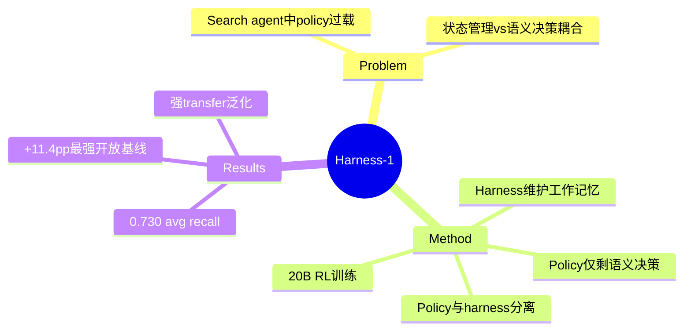

## Summary

Harness-1 将 search agent 的状态管理从 policy 转移到 harness 层：RL 训练时，harness 维护 candidate pool、evidence links、verification records 等环境端工作记忆，policy 仅保留语义决策（搜索什么、保留/丢弃哪些文档、验证什么、何时停止）。20B 模型在 8 个检索 benchmark 上达到 0.730 avg recall，+11.4pp 超越最强开放基线。

## Problem & Motivation

Search agent 训练时存在角色错位：policy 需要同时处理语义搜索决策（搜索什么）和例行状态管理（记忆已见内容、哪些证据有用、哪些约束已检查）。后者是可恢复的 bookkeeping，不应占用 policy 的 RL 优化空间——这导致 policy 被迫同时优化两个本质不同的问题。

## Method

> [未获取全文，仅基于 abstract]

**核心设计**：状态管理从 policy → harness 的分离

**Harness 维护的环境端工作记忆**：
- Candidate pool（候选文档池）
- Importance-tagged curated set（重要性标记的精选集）
- Compact evidence links（紧凑证据链接）
- Verification records（验证记录）
- Compressed & deduplicated observations（压缩去重观察）
- Budget-aware context rendering（预算感知的上下文渲染）

**Policy 仅负责**：
- 语义搜索决策（搜索什么 query）
- 文档保留/丢弃决策
- 验证决策（什么需要检查）
- 停止决策（何时停止）

**20B search agent** + RL 训练在上述 stateful harness 内进行。

## Key Results

> [未获取全文，仅基于 abstract]

- 8 个检索 benchmark（web、finance、patents、multi-hop QA）：**0.730 avg curated recall**
- 比最强开放 search subagent **+11.4pp**
- Held-out transfer benchmark：泛化能力强

## Strengths & Weaknesses

**Strengths**：
- **Clean separation of concerns**：first-principles 视角，bookkeeping 不应占用 RL budget
- **+11.4pp 提升**：开放基线中显著改进
- **泛化性好**：held-out benchmark 上仍有提升

**Weaknesses**：
- **Domain-specific**：专注 search agent，未必直接迁移到 GUI agent
- **Harness engineering 成本**：设计合适的状态模型需要领域知识
- **20B 模型规模**：对某些部署场景可能偏重

**Impact**：为 agent harness 设计提供了"分离 concerns"的范式参考。GUI agent 的 harness 设计可借鉴类似思路——将状态管理从 policy 解耦。

## Mind Map

