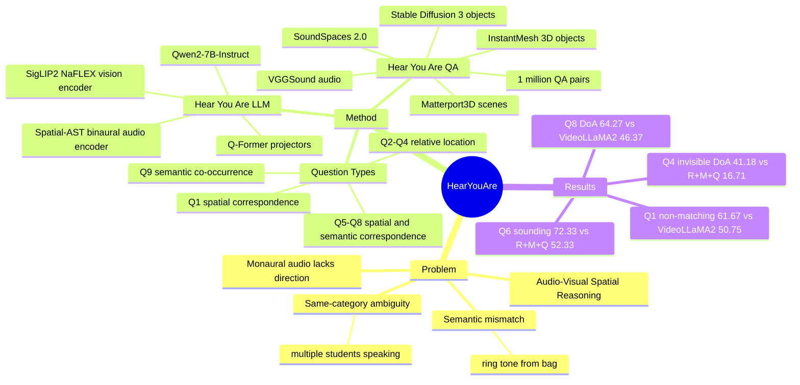

## Summary
这篇论文定义 Audio-Visual Spatial Reasoning：模型需要在视觉场景和 binaural spatial audio 之间推理空间关系，而不是只做语义或时间对齐。作者构建 Hear You Are QA，包含 1 million question-answer pairs，并提出 Hear You Are LLM，用 panoramic vision encoder、spatial audio encoder、Q-Former projector 和 Qwen2-7B-Instruct 进行多模态问答。核心证据是：在需要空间消歧的 Q1 non-matching 和 Q8 DoA 上，R+B+Q 明显优于 monaural/audio-visual baselines，说明 binaural audio 对复杂 audio-visual grounding 不是可有可无的信号。

## Problem & Motivation
已有 audio-visual learning 多数关注 sound source localization、source separation 或 audio-visual synchronization，常用 monaural audio，因此主要学习声音与视觉外观的 semantic correspondence 或事件的 temporal alignment。论文指出这会漏掉一个关键能力：当声音和视觉对象语义不匹配，或多个视觉对象都和同一声音类别匹配时，模型必须利用 spatial audio 来判断声音真正来自哪里。

作者给出的两个典型动机很清楚：手机铃声可能来自一个视觉上并不“会响”的 bag；课堂里多个学生都可能对应 speech，只有空间听觉能区分是谁在提问。这使任务从“找到和声音语义匹配的物体”升级为“理解声音位置、视觉对象位置以及二者之间的空间关系”。对 embodied AI 和 multimodal agents 来说，这类能力比单纯 audio label 或 visual detection 更接近真实交互场景。

## Method
Hear You Are QA 的构造基于模拟环境。作者使用 SoundSpaces 2.0 渲染 spatial audio，场景来自 Matterport3D，划分为 72 train / 9 validation / 9 test scenes；音频来自 VGGSound，手动过滤掉户外或难以绑定单一视觉对象的类别。由于现有 3D object datasets 中可发声类别有限，作者从 VGGSound 选 150 类、ImageNet 选 40 类，用 Stable Diffusion 3 生成每类 2D images，再用 InstantMesh 转成 3D objects；每个 sounding object category 保留 32 train / 4 validation / 4 test images。

每个 audio-visual scene 包含一个 360 panoramic image 和对应 binaural audio。视觉上，作者把 18 张 horizontal FoV 为 20 degrees 的图像 stitch 成 224 x 812 panorama，并让图像中心对齐 agent 的 front-facing direction。每个场景只有一个 sound source；根据 question scenario，sound source 可以绑定到语义匹配的 VGGSound object、随机不匹配 object，或空位置。为了降低 rendering artifacts 成为捷径的风险，作者还随机插入最多 3 个与 main visual objects 类别不同的 distractor objects。

问题设计覆盖 9 类 base questions，分为四组：Spatial Correspondence (Q1)、Relative Location (Q2-Q4)、Spatial and Semantic Correspondence (Q5-Q8)、Semantic Co-occurrence (Q9)。关键设计是故意包含 counterfactual 或 ambiguous cases：例如 Q1 有 sound 与 visual object 语义不匹配但空间对齐的样本；Q8 中多个同类 visual objects 都与 audio category 匹配，必须用空间信息判断哪个对象在发声。base questions 由 handcrafted rules 根据场景参数填充答案，再用 ChatGPT-4o paraphrase 成更自然的问法。

Hear You Are LLM 由 vision encoder、audio encoder、modality-specific projectors 和 LLM 组成。视觉端使用 SigLIP2 NaFLEX 处理 panoramic image，保留 spatial patch tokens，并用 LoRA fine-tune patch embedding 和 attention layers；音频端使用 BAT 中的 pretrained Spatial-AST binaural audio encoder，输入 binaural spectrogram，训练过程中保持 frozen。两个模态都用 Q-Former projector 映射到 LLM hidden dimension，audio query tokens 为 64，vision query tokens 为 128；LLM backbone 是 Qwen2-7B-Instruct。

训练前作者先做 unimodal warm start。视觉 encoder/projector 用分类和定位辅助问题训练，例如给定坐标问 visual objects、给定类别预测 azimuth/elevation/distance；音频 encoder/projector 用 analogous sound classification 和 sound localization questions 训练。最终 end-to-end training 输入为单张 224 x 812 panorama、10-second 32 kHz binaural waveform 和 text question，训练 3 epochs，8 A5000 GPUs，有效 batch size 128，image encoder 和 LLM backbone LoRA rank 为 16，训练约 3 days。

## Key Results
Hear You Are QA 的 sound source localization evaluation 上，Ours (R+B+Q) 在 Q1 class / aligned / non-matching 分别为 52.69 / 77.61 / 61.67，VideoLLaMA2 (R+M+Q) 为 51.01 / 77.44 / 50.75，ACL-SSL (R+M) 为 40.56 / 32.83 / 10.61，ISSL (R+M) 为 26.97 / 28.83 / 12.94。最关键的是 Q1 non-matching：当声音类别和视觉对象语义不匹配时，Ours 比 VideoLLaMA2 高 10.92 points，比 ACL-SSL 高 51.06 points，说明语义 shortcut 不够。

在需要在多个同类视觉对象间消歧的 Q8 上，Ours 的 Q8 DoA accuracy 为 64.27，VideoLLaMA2 为 46.37，ACL-SSL 为 24.33，ISSL 为 21.0；Question Only 只有 7.61。Q8 class accuracy 上 VideoLLaMA2 为 75.33，高于 Ours 的 70.27，但 DoA 明显落后，说明 monaural audio 和 vision 可以识别声音类别，却不能可靠区分哪个同类对象在发声。

Table 4 的 modality ablation 进一步支持 binaural audio 的必要性。Q4 visible audio 中，R+B+Q 的 DoA accuracy / Avg. DoA error 为 65.68 / 15.41 degrees，R+M+Q 为 59.03 / 20.21 degrees；到了 Q4-invisible audio，R+B+Q 为 41.18 / 39.81 degrees，R+M+Q 退化到 16.71 / 69.25 degrees。也就是说，当 source 不可见时，vision + monaural 的空间线索明显不足。

Q5/Q6 的对照揭示了视觉歧义对模型的影响。Q5 只有一个视觉对象和声音语义匹配时，R+M+Q sounding accuracy 为 64.54；Q6 有两个视觉相似且同类匹配对象时，R+M+Q 降到 52.33。相比之下，R+B+Q 在 Q5/Q6 上分别为 75.60 / 72.33，B+Q 分别为 59.48 / 59.33，说明 binaural audio 对“多个同类对象谁在发声”的判断更稳定。

Warm-start unimodal performance 中，audio encoder 的 detection accuracy / mean angular error / distance error 为 0.575 / 38.01 degrees / 0.476 m，vision encoder 为 0.633 / 26.89 degrees / 0.332 m。这提供了一个上限背景：视觉单模态在该合成设置中定位更准，但 audio 模态提供了不可由 monaural audio 替代的 directional cue。

## Strengths & Weaknesses
已知亮点：任务定义比普通 sound source localization 更接近真实 multimodal reasoning。论文不是只问“声音是什么”或“图中哪个物体会发声”，而是系统构造了 semantic mismatch、same-category ambiguity、relative location、invisible source 等设置，使 spatial audio 的价值可以被实验隔离出来。

已知亮点：baseline 选择覆盖了 non-LLM sound localization 和 MLLM。ISSL、ACL-SSL 代表 audio-visual sound source localization，VideoLLaMA2 代表 language-model-based audio-visual reasoning；作者还把 VideoLLaMA2 的 vision/audio encoders 换成与本方法一致的 SigLIP2 NaFLEX 和 Spatial-AST，并用同一 LLM backbone fine-tune，这让“是否使用 binaural spatial audio”成为更清晰的比较因素。

已知亮点：ablation 提供了比主结果更有信息量的证据。尤其是 Q4-invisible audio、Q6、Q8 这些场景显示，vision 或 monaural audio 可以处理语义相对简单的问题，但在不可见声源或多个同类视觉对象时明显退化；这比单纯平均 accuracy 更能说明任务的边界。

已知局限：数据完全依赖 simulation。SoundSpaces 2.0、Matterport3D、Stable Diffusion 3、InstantMesh 让 dataset 可扩展并有精确 ground truth，但也带来 sim-to-real gap；论文没有报告真实 binaural recording 或真实机器人/agent 部署实验，因此不能确认这些结果能直接迁移到真实麦克风、真实房间声学和动态人类场景。

已知局限：模型一次输入单张 panorama 和 10-second audio，并没有执行动作、主动转头、移动或多轮交互。对 embodied agent 来说，这篇论文更像 perception/reasoning benchmark，而不是完整的 interactive agent benchmark。

已知局限：论文没有给出定性的 failure cases 或 error taxonomy，也没有报告不同 object category、room type、source distance、reverberation condition 下的细分错误。因此我们知道 binaural audio 在 Q6/Q8 等聚合任务上有效，但不知道模型最常失败于哪类空间关系、哪类声音或哪类视觉混淆。

推测：这项工作的最大启发是把 audio spatial cue 当作可和 vision token 一起被 LLM 消化的 grounding signal，而不是只做前置 localization。这个思路可能能迁移到 embodied navigation、mobile manipulation 或 assistive agents 中的“看不见但听得见”的目标定位，但论文没有测试 action-conditioned 或 closed-loop setting，所以这只是方向性推测。

不知道：代码和数据集的实际开放地址尚未在论文中给出；正文只写了 will open source both the dataset and the training code。不知道模型在真实录音、噪声、多声源同时存在、moving source、非室内场景、或更强 LLM backbone 下是否保持同样结论。

## Mind Map

## Notes
这篇论文对 GUI-agent 的直接相关性不高，因为没有 screen grounding 或 tool/action loop；但对 multimodal agent 的 spatial grounding 很有价值。最值得保留的 insight 是：当语义证据冲突或过多时，空间信号会从辅助 cue 变成 disambiguation 的主证据。

后续可以和 `spatial-reasoning` 下的 3D/VLM benchmark 对照：很多 VLM spatial reasoning 只用 vision，而这篇把 binaural audio 作为另一个空间坐标来源。一个值得继续追的问题是：如果 agent 能主动移动/转头，是否需要显式 spatial memory 来融合连续的 audio-visual observations，还是单帧 panorama + 10 秒音频已经足够覆盖大部分室内定位问题？
