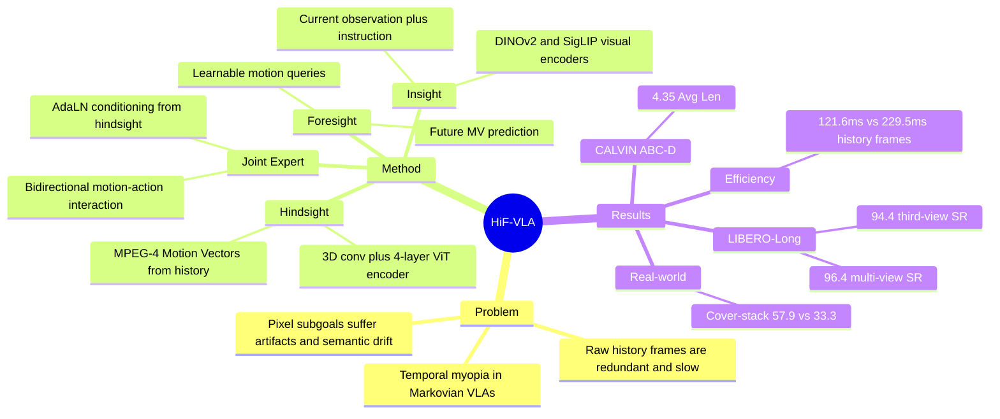

## Summary

HiF-VLA 针对 VLA 的 temporal myopia：多数模型只看当前 observation，或用 raw history frames / pixel-level future subgoals 扩展上下文，代价高且冗余。论文用 Motion Vectors 作为低维 motion representation，把 past dynamics 的 hindsight、current observation 的 insight、future motion 的 foresight 统一到 Hindsight-Modulated Joint Expert 中，在 LIBERO-Long、CALVIN ABC-D 和真机 long-horizon manipulation 上提升成功率，同时比直接堆历史帧更高效。

## Problem & Motivation

已知：作者指出多数 VLA 默认近似 Markov decision process，只根据当前 observation 和 language instruction 预测 action chunk；这在 long-horizon manipulation 中会丢失连续动作之间的 temporal dependency，导致 trajectory fragmentation 和 task-level coherence 下降。

已知：已有两类缓解方案都有明显代价。History-frame stacking 能引入过去信息，但输入包含大量静态像素冗余，计算和 inference latency 随 history length 增长；pixel-level subgoal / visual CoT 能引入 future guidance，但未来图像预测容易出现 local distortions 与 semantic drift。

作者的核心动机是把 history 和 future 都从 "pixel state" 改写成 "state change"：Motion Vectors 来自 H.264 / MPEG-4 等视频编码，直接描述 macroblock 的位移，既保留 inter-state dynamics，又过滤大量静态背景信息。因此 motion 被用作连接 hindsight 与 foresight 的 compact temporal primitive。

## Method

HiF-VLA 的输入沿用 OpenVLA-OFT 风格：当前 observation 进入 DINOv2 和 SigLIP visual encoders，VLM backbone 采用 Prismatic-7B，并用 OpenVLA 权重初始化。模型默认预测长度为 `n=8` 的 action chunk 和 future motion；hindsight window 默认也是 8，训练在 LIBERO 上 150k steps、CALVIN 上 80k steps。

**Hindsight Prior Acquisition**：模型不把历史 RGB frames 直接塞进 VLM，而是用 MPEG-4 抽取历史窗口内的 Motion Vectors。每个 MV 以 16x16 macroblock layout 表示为 `(H//16) x (W//16) x 2` 的位移场；历史序列经过 spatial-temporal convolution、4-layer ViT hindsight encoder 和 projection，得到 hindsight tokens。

**Foresight Reasoning with Insight**：模型在 VLM embedding space 中加入 learnable foresight motion queries 和 empty action tokens。VLM 以当前 observation、instruction、foresight tokens、action tokens 为输入，并行产生 future motion latent tokens 与 action latent tokens；目标不是生成 future RGB frame，而是预测未来 Motion Vectors。

**Hindsight-Modulated Joint Expert**：hindsight tokens 不直接作为 VLM prompt，而是作为 conditional prior 通过 AdaLN 调制 foresight stream 与 action stream。Joint Expert 在 shared temporal latent space 内用 joint attention 交互 motion/action 两条流，同时保留 separate FFNs；训练目标是 `L_all = L_A + lambda * L_MV`，其中 action 与 motion 都用 L1 loss，`lambda=0.01`。

我的理解：这篇的 world-model 成分不是完整的 video/world generation，而是一个 motion-centric World Action Model：只建模对 action generation 有用的 visual dynamics。它的简洁性来自 representation choice，而不是额外堆更大 temporal transformer。

## Key Results

- **LIBERO-Long**：third-view setting 下，HiF-VLA 平均成功率 94.4%，高于 OpenVLA-OFT* 的 91.0%、MemoryVLA 的 93.4%、OpenVLA 的 54.0%；multi-view setting 下，HiF-VLA 达到 96.4%，高于 OpenVLA-OFT* 的 94.0%、UniVLA* 的 90.0%、Seer 的 87.7%。
- **CALVIN ABC-D**：以 5 条连续 instruction 的 average completed task length 评估，HiF-VLA 达到 4.35，高于 VPP 4.33、Seer 4.28、RoboVLMs 4.25、OpenVLA-OFT 4.10；其中第 1-5 步成功率分别为 98.5 / 94.1 / 88.1 / 81.4 / 73.1。
- **Efficiency / redundancy on LIBERO-Long**：Table 3 中 baseline 为 30.8GB peak memory、72.9ms latency、91.0 Avg SR；直接加 history frames 变成 63.6GB、229.5ms、90.4 Avg SR。HiF-VLA 的 hindsight+foresight 变体为 32.2GB、121.6ms、93.2 Avg SR，说明 motion representation 比 raw frame history 更省 memory/latency，并且成功率更高。
- **LIBERO full benchmark**：supplementary Table 4 中，HiF-VLA 在 LIBERO-Spatial / Object / Goal / Long 上分别为 98.8 / 99.4 / 97.4 / 96.4，Average 98.0；OpenVLA-OFT 为 97.6 / 98.4 / 97.9 / 94.5，Average 97.1。
- **Ablation**：multi-view setting 下，`lambda=0.01` 得到 96.4 SR，高于 0.1 的 94.4、0.05 的 95.2、0.001 的 95.6；Joint Expert depth=6 得到 96.4，高于 depth=2 的 95.2、depth=4 的 95.6、depth=8 的 95.2；hindsight/foresight length `(8,8)` 为 96.4，`(8,16)` 降到 94.6，`(16,16)` 为 95.2。
- **Motion representation ablation**：third-view setting 下，用 Motion Vectors 同时表示 hindsight+foresight 得到 94.4 SR；换成 proprioceptive state 的 S+S 为 92.0，S+M 为 92.6。Bidirectional joint interaction 的 Bi-[M|A] 为 94.4，而 decoupled causal variant 只有 87.4。
- **Optical flow vs Motion Vectors**：RAFT optical flow 与 MVs 成功率接近，Flow 为 94.2、MVs 为 94.4；但 4-frame history 下 flow-based inference 需要 186.8ms，MV-based 只需 121.6ms，8-frame history 下 MVs 可减少最多 78% latency overhead。
- **Real-world long-horizon tasks**：AgileX Piper + RealSense D435 + wrist camera 上，每个任务 100 demos、20 trials 评估。HiF-VLA 在 Place blocks on the plates 为 65.0 vs OpenVLA-OFT 62.5；Cover block and stack bowls 为 57.9 vs 33.3；Press buttons in order 为 34.2 vs 17.4。

## Strengths & Weaknesses

**已知（论文证据）**

1. Representation choice 很干净：Motion Vectors 把 history/future 都转成 low-dimensional dynamics，避免 raw RGB history 的冗余，也避免 future RGB generation 的 artifact 问题。
2. Baseline 覆盖较强：LIBERO-Long 对比 OpenVLA、OpenVLA-OFT、MemoryVLA、UniVLA、Seer；CALVIN ABC-D 对比 OpenVLA-OFT、RoboVLMs、Seer、VPP、π0 等。
3. Ablation 不只报 component gain，也检验了 motion vs proprioceptive state、bidirectional vs causal、MVs vs optical flow、hindsight length、Joint Expert depth 和 loss weight。
4. 真机实验给了 long-horizon primitives 的压力测试，尤其 Press buttons in order 中视觉状态差异小，能体现 temporal memory 的价值。

**局限（论文承认或实验暴露）**

1. 论文明确承认当前 motion representation 依赖估计精度，在 highly dynamic scenes 中可能对 noise 敏感。
2. failure cases 主要落在 spatial geometry / 3D perception：错误空间判断导致 gripper 提前打开，机械臂未抬到合适高度导致 stacking 失败，错误 depth estimation 导致按钮未完全按下。
3. Table 3 显示 HiF-VLA 相比 vanilla baseline 仍有 latency 增加：hindsight+foresight 为 121.6ms vs baseline 72.9ms；它的优势是相对 raw history frames/subgoal 更高效，不是零成本。
4. 真机实验每个任务单独训练模型，并且只有 3 个任务；这支持 practical effectiveness，但还不足以证明跨任务或跨机器人泛化。

**推测（我的判断）**

HiF-VLA 的关键启发不是 "motion vector 一定是最佳表示"，因为 optical flow 的 SR 几乎相同；更重要的是把 temporal reasoning 的 interface 限定在 compact dynamics token 上，并把 history 作为 decoder-side condition，而不是污染 VLM 的 language-vision alignment。

**不知道 / 未回答**

论文没有回答大规模 internet video pretraining 是否能显著增强这种 motion understanding，也没有系统测试跨 embodiment 迁移。它也没有给出复杂 3D 几何场景中 MV 表示与显式 3D representation 结合后的收益。

## Mind Map

## Notes

对 GUI-agent / computer-use 的迁移启发：历史 screen frames 也可能有大量静态冗余，真正需要建模的是 state transition 与 affordance change。这里的 "motion as temporal primitive" 可以抽象成 "change representation as memory"，但这只是方法启发，不是本文实验结论。

