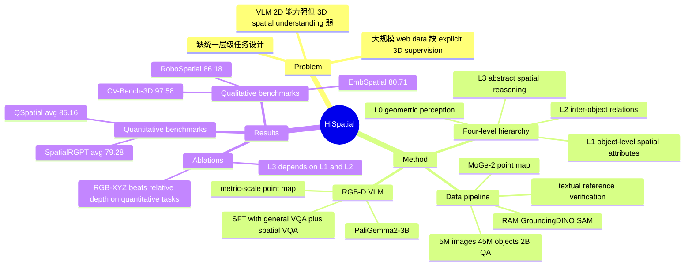

## Summary
HiSpatial 把 VLM 的 3D spatial understanding 拆成从几何感知到抽象推理的四级层级任务，并用约 5M images、45M objects、2B QA pairs 做 SFT。方法还给 PaliGemma2-3B 加入 metric-scale 3D point map 分支，在多个 spatial benchmark 上优于大量 general VLM 与 spatial specialist baselines，但作者也承认复杂 reasoning、自然语言多样性、多视角/视频场景仍未解决。

## Problem & Motivation
现有 VLM 在 2D VQA、captioning、grounding 上进步明显，但从单张 2D 图像推断 3D structure、object properties、inter-object relations 和高层 spatial reasoning 仍然困难。已有 spatial VQA SFT / RFT 工作覆盖了一些定性或定量任务，但缺少统一的层级任务设计，也缺少对不同空间能力之间依赖关系的系统分析。数据侧同样有 gap：带 3D annotation 的数据多局限在 indoor scenes，大规模 web images 又缺 explicit 3D supervision。本文的核心动机是：用一个可扩展的数据构造 pipeline，把低层几何、对象属性、对象关系和抽象空间推理组织成可训练、可消融的层级结构。

## Method
### 1. Four-level hierarchy
论文把 3D spatial intelligence 定义为四个逐级依赖的 VQA level：

- **Level 0: Basic geometric perception**：pixel-wise 3D point querying 和 pairwise depth ordering，要求模型从 2D pixel 直接感知深度/3D coordinates。
- **Level 1: Object-level spatial understanding**：object localization、object orientation estimation、object size estimation，把语义对象与 3D position / size / orientation 绑定起来。
- **Level 2: Inter-object relational understanding**：relative direction estimation、relative distance estimation、relational comparison，关注多个对象之间的方向、距离、大小/位置/朝向比较。
- **Level 3: Abstract spatial reasoning**：perspective taking、spatial object counting、spatial problem solving，要求模型在对象关系之上做 viewpoint imagination、约束计数和多步计算。

### 2. Spatial VQA data construction
数据 pipeline 分三步：先抽取 spatial information，再生成/验证 textual reference，最后按任务模板合成 QA。对于没有标注的 web images，作者使用 MoGe-2 估计 metric point map 和 camera intrinsics，用 RAM + GroundingDINO + SAM 得到类别、2D boxes 和 masks，再用 OrientAnythingv2 估计 orientation，并用 Perspective Fields 建立 gravity-aligned world coordinate system；如果数据有 ground-truth 3D annotation，则跳过估计 pipeline。

对象 textual reference 来自 Describe Anything、Qwen2.5-VL 和 Qwen3-VL。为降低 reference ambiguity，作者让 VLM 用生成的描述重新定位对象，并通过 predicted box / mask 与原始对象的 IoU 做验证；补充材料中 web data reference 的保留阈值是 mask IoU > 0.7，失败时回退到 “object class + colored bbox” 的视觉提示。

训练数据来自三个 source：KosMos-2/COYO-700M 中筛出的 3.8M in-the-wild images、Objects365 的 1M images，以及 CA-1M 中采样的 200K indoor frames。总规模约为 **5M images、45M objects、2B QA pairs**；其中 Level 3 spatial problem solving 只有 49,322 QA，训练采样占比 0.57%，明显小于 Level 2 relative direction 的 510,297,825 QA / 26.09% sampling ratio。

### 3. RGB-D VLM finetuning
模型基于 **PaliGemma2-3B-Mix-448**，即 SigLIP vision encoder + Gemma-2 language model。作者给 RGB 图像额外输入一个 metric-scale point map：每个 pixel 的 3D coordinates 加 validity mask，经过 sinusoidal positional encoding 和 learnable Conv2D patchify layer 后，与 RGB visual features concat，再经 linear projector 变成 fused visual tokens。

训练目标是标准 VLM SFT cross-entropy。实现上 visual encoder frozen，point map patchify layer、fused-token projector 和 LLM end-to-end finetune；训练最多 70K iterations，batch size 256，general VQA 与 spatial VQA 的 sampling ratio 为 1:7。默认推理使用 MoGe-2 估计 point map；若 benchmark 有 GT depth / point map，作者会用 Prior Depth Anything densify sparse or low-resolution GT depth 再输入模型。

## Key Results
论文报告的主要结果如下，均为 accuracy / success rate：

- **SpatialRGPT-Quantitative**（Level 1/2）：HiSpatial-3B RGB-XYZ avg **79.28**，高于 HiSpatial-3B-RGB **72.43**、MM-Spatial-3B **68.70**、SpatialRGPT-8B **56.22**、GPT-5 **40.47**；使用 GT point map 时 avg 到 **81.46**。
- **QSpatial-Bench**：HiSpatial-3B RGB-XYZ avg **85.16**，高于 HiSpatial-3B-RGB **76.01**、GPT-5 **68.45**、InternVL3.5-8B **57.94**、PaliGemma2-3B **32.84**。
- **Qualitative spatial benchmarks**：HiSpatial-3B RGB-XYZ 在 EmbSpatial / RoboSpatial / CV-Bench-3D / CV-Bench-2D Relation / 3DSRBench 上分别为 **80.71 / 86.18 / 97.58 / 95.69 / 63.81**。需要注意，CV-Bench-2D Relation 并非全表最高：RoboRefer-8B-SFT 为 **96.90**，高于 HiSpatial-3B RGB-XYZ。
- **Custom benchmark**：HiSpatial-3B 在 Object-to-Camera Distance (L1)、Object Direction (L2)、Spatial Problem Solving (L3) 上分别为 **92.18 / 67.21 / 47.44**；GPT-5 对应为 **47.19 / 59.27 / 33.33**，Qwen3VL-8B 为 **12.70 / 22.52 / 25.64**，RoboRefer-8B-SFT 为 **58.63 / N/A / 26.92**。
- **General VQA retention**：相对 base PaliGemma2-3B，HiSpatial 在 MMBench **49.86 → 69.67**、POPE **87.00 → 87.97**、SEED **48.32 → 63.51**、RealWorldQA **47.76 → 58.95**；论文据此认为 spatial SFT 没有破坏 general VQA ability。
- **Inter-level dependency ablation**：完整训练的 Level 2 avg 为 **81.21**，去掉 L0&L1 后降到 **79.69 (-1.52)**；Level 3 avg 为 **56.29**，去掉 L0&L1 后为 **48.15 (-8.14)**，去掉 L1&L2 后为 **41.78 (-14.51)**。这支持作者的 claim：高层 spatial reasoning 依赖较低层或中间层任务提供的能力。
- **Auxiliary 3D input ablation**：RGB-only 为 qualitative **83.70** / quantitative **74.16**；RGB+relative depth 为 **84.29 / 75.26**；RGB+XYZ point map 为 **84.79 / 82.02**；GT point map 在 quantitative 上进一步到 **82.79**。关键提升主要来自 quantitative spatial estimation，而不是 qualitative 指标。

## Strengths & Weaknesses
### 已知
- 层级 taxonomy 是本文最有价值的部分：它不只把 spatial QA 做大，而是把 Level 0 到 Level 3 的任务依赖关系用 ablation 量化出来。
- 数据 pipeline 很工程化但覆盖广：从 web images、Objects365、CA-1M 组合出 2B QA，并通过 grounding / IoU verification 减少 textual reference ambiguity。
- Metric-scale point map 明显优于 relative depth，尤其在 quantitative tasks 上从 75.26 提升到 82.02，这比 qualitative gain 更说明 3D metric scale 的作用。
- Baseline 选择覆盖 proprietary models、open-source general VLMs 和 spatial specialist models；但结果不是每个 benchmark 都赢，例如 CV-Bench-2D Relation 低于 RoboRefer。

### 局限
- 作者明确承认 Level 3 仍主要覆盖相对基础的 spatial reasoning，不全面覆盖复杂 reasoning；当前 dependency analysis 也只是起点，未细分任务间更细粒度的互相促进或干扰。
- 训练数据具有 procedural generation 特征，可能让模型依赖固定 instruction patterns；作者也指出真实场景中高度多样、非正式语言的 robustness 仍需提升。
- 模型只支持 monocular input；多视角场景、temporal dynamics 和 video spatial reasoning 都留作未来工作。
- Custom Level 3 spatial problem-solving test 只有 78 questions，且自由答案用 GPT-4.1 辅助判断，numeric answer 以 25% relative error 为正确阈值；这能提高评估可操作性，但也意味着高层推理结论不应被过度外推。
- Web data preprocessing 明确过滤 GUI、chart、table、blueprint、code snippets，因此本文结果不能直接当作 GUI-agent screen understanding 的证据。

### 推测
- 对 embodied / VLA 方向，最可迁移的 insight 不是 “再做一个 spatial dataset”，而是用任务层级控制训练数据比例，并用 inter-level ablation 检查低层几何能力是否真的支撑高层任务。
- RGB-XYZ 对 quantitative tasks 的大幅提升说明 metric 3D representation 对机器人距离/尺寸估计可能有价值，但本文没有做 closed-loop manipulation 或 navigation 实验。

### 不知道
- 不知道该 hierarchy 在更大模型、multi-view/video VLM、或 action-conditioned VLA 上是否保持同样的 inter-level dependency。
- 不知道自动生成 QA 中残留的 reference / depth / orientation 错误对训练上限的影响有多大；论文提供 verification pipeline，但没有给出完整噪声率分解。
- 正文只给出项目页，没有说明代码仓库或数据是否完整开放。

## Mind Map

## Notes
这篇更像一篇 “spatial data + task taxonomy + RGB-D input branch” 的系统论文，而不是新模型结构论文。对后续研究，最值得复用的是它的 **层级任务定义 + dependency ablation protocol**：如果要做 embodied reasoning 或 GUI/3D hybrid agent，应该验证不同低层感知任务是否真的支撑高层 planning/reasoning，而不是只报告一个混合 benchmark average。
