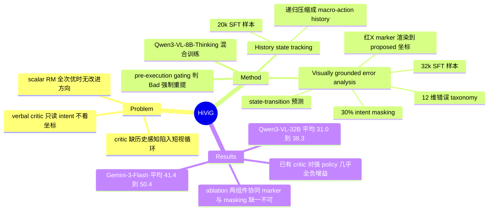

## Summary

HiViG 训练一个 8B 多模态 critic（Qwen3-VL-8B-Thinking 底座，52k SFT 样本），在 CUA 每步执行前做两件事：把历史递归压缩成 macro-action history 供 policy 追踪任务进度，以及在截图上渲染红 "X" 标记 policy 提出的原始坐标做视觉验证，判 "Bad" 则强制 policy 重提动作。在 WebArenaLitev2 / AndroidLab / WindowsAgentArena 上把 Qwen3-VL-32B 平均 SR 从 31.0 提到 38.3（+7.3）、Gemini-3-Flash 从 41.4 提到 50.4（+9.0），而所有已有 critic baseline 增益接近零或为负。

## Problem & Motivation

现有 CUA critic 有两个结构性缺陷。第一，**缺历史感知**：policy 不追踪已完成的动作，容易陷入 short-sighted decision loop（重复点击、redundant 操作）；第二，**缺视觉锚定**：已有 verbal critic 过度依赖 policy 的文字化 intent（如 "click on X"），不核对实际像素坐标是否落在合法 UI 元素上，导致 spatial / reasoning error 绕过 pre-execution 评估。此外作者指出 scalar reward model 的固有局限：当所有候选动作都是次优时，标量分数给不出改进方向，verbal critique 才能提供可执行的修正信号。

## Method

**Critic 的双任务设计**——一个模型混合训练两种能力：

1. **History state tracking（历史压缩）**：不是保留全 screenshot 序列，而是把过往交互**递归压缩成 macro-action history**——多步已达成子目标的文字记录（如 "Successfully opened the Downloads directory"）。每步执行后，critic 根据上一执行元组更新该记录，供 policy 在下一步 planning 前读取，追踪全局进度、避免冗余决策。
2. **Visually grounded error analysis（视觉锚定评估）**：policy 提出动作后，在当前截图上**渲染红 "X" 标记到 proposed 的精确坐标**，critic 基于该 marked observation 做三段推理：(a) 核对执行坐标与截图 UI 元素是否匹配；(b) 预测该动作会引发的 visual state-transition（因果效果）；(c) 评估动作与任务指令的对齐度。输出 Good/Bad 判定；若 Bad，则归类到 12 维错误 taxonomy（grounding error、hallucination、termination misjudgment、procedural prerequisite neglect 等）之一并生成 verbal explanation。

**部署方式（step 级 pre-execution gating，非 best-of-N reranking）**：判 Good 直接执行；判 Bad 则把错误类别 + verbal 解释回传给 policy，强制其 refine 后重提，循环直至通过。Policy 本身完全 frozen，HiViG 是纯 test-time 外挂。

**训练数据（52k SFT，源自 ScaleCUA 多平台轨迹）**：20k history state tracking + 32k visually grounded error analysis。构造流程三步：(1) 用 MLLM annotator 从相邻截图提取 verbalized state-transition（动作的实际因果效果）；(2) 按 12 维错误 taxonomy 系统性扰动 expert action 合成 plausible negative；(3) 生成带 visual marker 的 step-by-step rationale，其中 **30% 样本做 intent masking**（隐藏 policy 的文字意图，逼 critic 只看像素证据）。

**训练细节**：Qwen3-VL-8B-Thinking，混合数据 1 epoch，LlamaFactory + 8×H100 约 4 小时，peak lr 5e-6，batch size 256。

## Key Results

三 benchmark（web/mobile/desktop）× 两个 frozen policy，对比 scalar PRM（OpenCUA、SE-WSM）、zero-shot verbal critic（CGI，Qwen3-VL-8B/32B）、专训 critic（GUI-Critic-R1）：

| Policy | 设置 | WALv2 | ALab | WAA | Avg |
|:--|:--|:--|:--|:--|:--|
| Qwen3-VL-32B | base | 13.0 | 44.2 | 35.7 | 31.0 |
| Qwen3-VL-32B | 最强 baseline (CGI-32B) | 16.9 | 46.9 | 33.7 | 32.5 |
| Qwen3-VL-32B | **+HiViG** | **25.3** | **51.5** | **38.0** | **38.3** |
| Gemini-3-Flash | base | 30.5 | 58.0 | 35.8 | 41.4 |
| Gemini-3-Flash | GUI-Critic-R1 | 22.1 | 53.6 | 32.5 | 36.1 |
| Gemini-3-Flash | **+HiViG** | **45.5** | **61.6** | **44.2** | **50.4** |

- Abstract 的 "+5.8% / +9.0%" 是相对**最强 baseline** 的口径；相对 base agent 是 +7.3 / +9.0。
- **已有 critic 几乎全军覆没**：对 Gemini-3-Flash，OpenCUA (41.0)、SE-WSM (40.9)、CGI-32B (41.2) 全部低于 base (41.4)；GUI-Critic-R1 更是拖到 36.1（WAA 上 -3.3）。对 Qwen 侧最好的 CGI-32B 也只 +1.5。
- 难任务类别提升最猛：WALv2 Map 类 3.9→23.1（Qwen），WAA Office 类 4.7→23.3（Gemini）。

**Ablation（WebArenaLitev2）**：
- 组件分离：仅 error analysis 21.4/35.1（Qwen/Gemini），仅 history tracking 23.4/42.9，合并 25.3/45.5——两者独立有效且有协同。
- 视觉锚定手段：去掉 visual marker 只留 intent masking，WALv2 25.3→20.8；去掉 intent masking 只留 marker，ALab 51.5→47.1——marker 管空间锚定，masking 管打破文字依赖，缺一不可。
- Intent masking 比例：0%/30%/50% → 36.2/38.4/37.7（两 benchmark 均值），30% 最优。
- 训练时不给 ground-truth state-transition（让 critic 自己猜）：WALv2 25.3→20.8。
- 混合训练单模型（25.3）优于两个分开训练的 8B 专家（23.4）。

## Strengths & Weaknesses

**已知的强点**：(1) 视觉锚定的实现极简且有效——在截图上画一个红 "X" 就把 critique 从 "评价 policy 说了什么" 变成 "核对 policy 实际点在哪"，intent masking ablation（去掉后 ALab -4.4）证明已有 verbal critic 确实在偷懒读文字而非看图。(2) baseline 对照有信息量：五种已有 critic 对强 policy（Gemini-3-Flash）全部无效或有害，说明 "拿个 VLM 当 judge" 的通行做法在 CUA 上不成立，critic 必须专门训练且训练信号要对准 spatial 证据。(3) 完全 test-time、policy-agnostic，8B critic 能给 32B/闭源 policy 带来 7-9 点平均增益，性价比高。

**已知的边界**：(1) critic 判 "Bad" 后只是让 policy 重提，循环 gating 的推理开销（每步至少一次 8B critic call，Bad 时多轮）论文未报告 latency / cost。(2) 12 维错误 taxonomy 是人工预定义的，作者自己承认界面演化会产生新错误类别，需要迭代扩展——taxonomy 先验的老问题。(3) macro-action history 由 critic 生成，若压缩时错标 "已完成"，错误会污染后续所有决策（与 TSR 的 error propagation 同病），论文未评测 history 本身的准确率，只有端到端 SR。(4) 训练数据的 negative 全部来自对 expert action 的合成扰动，真实 policy 的错误分布是否被覆盖未验证。

**推测**：state-transition prediction 那条 ablation（不给 GT 掉 4.5 点）暗示 critic 的核心能力其实是一个轻量 world model——判断 "这一步点下去会发生什么"，这可能是比 error taxonomy 更本质的组件。

**不知道**：critic 自身在 step 判定上的 accuracy / F1（论文主推端到端 SR，未在 OS-Critic Bench 类静态 benchmark 上报数）；gating 循环的最大重试次数与失败兜底策略；对 OSWorld / AndroidWorld 等更常用 benchmark 的可迁移性。

## Mind Map

## Notes

- 与 [[Papers/2606-OSOracle]] 对照：OS-Oracle 也是合成 negative + 训 7B critic + pre-execution gating，但其视觉验证靠 IEL 类 negative 数据隐式学，无显式坐标渲染；且其 dynamic eval 增益只有 +1.6/+1.8（AndroidWorld/OSWorld），HiViG 的 +7.3/+9.0 明显更强——差异可能来自 visual marker + 历史压缩 + verbal feedback 回传（OS-Oracle 只 regenerate 最多三次）。注意二者 benchmark 不重叠，不能直接比。
- 与 [[Papers/2607-TSR]] 对照：TSR 的 state updater 是 training-free prompted LLM，只维护状态不评动作；HiViG 把状态维护和动作评估合进一个 trained critic，且 ablation 显示两任务协同（混训 25.3 > 分开 23.4）——这是对 TSR "状态跟踪与 transition 验证应该分开还是合并" 问题的一个回答。
- 与 [[Papers/2605-BBCritic]] 对照：BBCritic 批评 binary critic 丢失动作层次（affordance collapse），走连续对齐分数路线；HiViG 保留 binary 判定但用 verbal explanation + 错误分类补偿信息量。两条路线正交，HiViG 的 "全次优时 scalar 无改进方向" 论点与 BBCritic 的动机部分呼应。
- 对 [[Ideas/MismatchTriage-LongHorizonRecovery-GUI]] 的影响：HiViG 的 12 维 taxonomy + 条件化 verbal feedback 已部分占据 "错误分类 → 差异化响应" 的空间，但它只做 pre-execution 拦截，不做 post-execution 的 mismatch 归因与恢复，且 taxonomy 是先验而非干预有效性聚类——差异化位置仍在。
