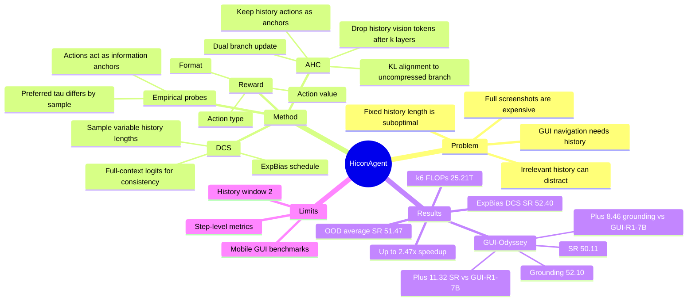

## Summary

HiconAgent 把 GUI agent 的历史上下文使用问题放进 RL 训练，提出 History Context-aware Policy Optimization (HCPO)：用 Dynamic Context Sampling 让策略在训练中见到不同长度历史，再用 Anchor-guided History Compression 在早期融合后丢弃历史截图、保留历史动作 anchor，并通过完整历史分支做 alignment。HiconAgent-3B 在 GUI-Odyssey 上达到 52.10 grounding / 50.11 step successful rate，超过 GUI-R1-7B 的 43.64 / 38.79，同时报告最高 2.47x computational speedup 和约 60% FLOPs reduction。

## Problem & Motivation

GUI navigation 是一个顺序决策问题：agent 需要根据当前 screenshot、自然语言 instruction 和过去若干步的 observation/action 生成下一步 action。论文指出现有 RL-based GUI agents 通常只保留 history actions、丢弃 history observations，这降低了成本，但会丢失解决歧义、维持 temporal consistency 和 grounding 相似元素所需的视觉线索。

反过来，直接拼接完整历史截图也不理想。由于高分辨率 screenshot 带来大量 visual tokens，而 attention 复杂度随序列长度上升，完整历史会显著增加计算开销；更重要的是，作者的 rollout 分析显示 longer history 并不总是更好，有些样本在较短历史下 reward 更高，说明无关历史会干扰决策。核心问题因此不是“要不要历史”，而是如何在训练中让 agent 学会有效、可压缩地利用历史。

## Method

**Empirical probes.** 论文先做两个诊断实验来支撑方法设计。第一，在训练集上固定 base model 权重，对每个样本用 history length $\tau \in \{0,1,2\}$ 做 8 次 rollout，并按 mean reward 找 preferred $\tau$；结果显示不同样本和 action type 偏好的历史长度不同，而且短历史有时优于长历史。第二，作者在 Qwen2.5-VL-3B 上做 layer-wise token-drop analysis：在不同深度 $k$ 后分别丢弃 history actions、history images 或二者，发现浅层丢弃 history actions 的损害明显大于丢弃 history images，说明 action tokens 是把历史视觉信息传递到后续层的 information flow anchors。

**Dynamic Context Sampling (DCS).** DCS 作用在 sampling phase。训练时不固定输入历史长度，而是为每个 group rollout 采样多个截断历史版本 $H_t^i$，其中 $\tau_i \leq \tau$。作者没有采用简单 uniform sampling，因为实验中 uniform 会让短历史 response quality 随训练退化；最终使用随训练步数变化的 exponential-biased distribution：早期近似 uniform 以鼓励探索，后期逐渐偏向更大的 $\tau$，从随机探索平滑过渡到 full-context history。为了维持 train-inference consistency，采样得到的 response 会和 full history context 组合起来计算 logits 做优化。

**Anchor-guided History Compression (AHC).** AHC 作用在 update phase。它使用双分支训练：uncompressed branch 使用完整历史 $\{I,H_t,s_t\}$，compressed branch 在前 $k$ 层完成早期融合后丢弃 history vision tokens $V_{his}$，只保留 history action tokens $A_{his}$ 作为 anchor。两个分支共享 sampled responses 和 group-wise advantages；compressed branch 也用 GRPO-style objective 更新，同时通过 KL alignment 贴近 detach 后的 uncompressed branch 输出。最终 loss 是 uncompressed policy loss、compressed policy loss 和 alignment loss 的加权和。

**Reward and setup.** GUI action 被拆成 action type 和 value，reward 由三部分相加：format reward、action type exact-match reward、action value reward。value reward 对无值动作、文本动作、离散动作和坐标动作分别处理，坐标动作用预测与标注坐标的 Euclidean distance 给连续 reward。HiconAgent-3B 基于 Qwen2.5-VL-3B，在 3K unfiltered AMEX steps 上训练；主实验 history window size 设为 2，默认 compression layer 为 $k=6$。

## Key Results

**Main benchmarks.** 论文在 AndroidControl-High、AITW 和 GUI-Odyssey 上做 OOD evaluation，核心指标包括 Type、Grounding 和 step successful rate (SR)。

| Benchmark / setting | Model | Grounding | SR |
|---|---:|---:|---:|
| AndroidControl-High, RFT | GUI-R1-7B | 65.56 | 51.67 |
| AndroidControl-High, RFT | HiconAgent-3B | 65.51 | 52.40 |
| GUI-Odyssey, RFT | GUI-R1-7B | 43.64 | 38.79 |
| GUI-Odyssey, RFT | HiconAgent-3B | 52.10 | 50.11 |

在 GUI-Odyssey 上，HiconAgent-3B 相对 GUI-R1-7B 提升 +8.46 grounding 和 +11.32 SR；在 AndroidControl-High 上，grounding 基本持平（65.51 vs 65.56），SR 略高（52.40 vs 51.67）。跨 AndroidControl-High、AITW、GUI-Odyssey 的 average SR 中，HiconAgent-3B 为 51.47，高于 infiGUI-3B 的 50.25、GUI-R1-7B 的 48.59、UI-shift-7B 的 46.43 和 OS-Atlas-7B 的 32.72；论文强调 HiconAgent 只使用 3K unfiltered samples，而若干对比模型使用更大或过滤后的数据。

**DCS ablation on AndroidControl-High SR.** 固定 $\tau=2$ 且不用 DCS 的 HCPO 得到 51.03 SR。uniform sampling 若仍只用 $\tau=2$ 做 update，会降到 50.53；若强制把 $\{0,1,2\}$ 全部纳入 update，SR 升到 51.62 但训练时间从 17h 增到 30h。ExpBias(u) 在 17h 训练下达到 52.40，是 Table 3 中性能和训练成本最好的设置。

**AHC / alignment ablation.** 在 compression enabled 条件下，plain GRPO 的 SR 为 AndroidControl-High 44.89、AITW 45.62、GUI-Odyssey 43.21。加入 dual-branch 但不用 KL 和 DCS 后分别升到 48.70 / 49.23 / 47.09；加入 KL alignment 但不用 DCS 后为 51.03 / 50.78 / 48.68；完整 HCPO 达到 52.40 / 51.91 / 50.11。这个消融说明 dual branch、KL alignment 和 DCS 都有独立贡献。

**History observation and compression.** 在 AndroidControl 上，仅用过去 actions 的 Qwen2.5VL-3B (2A) SR 为 43.33；加入过去 actions + observations (2AO) 后 SR 到 52.29，但 FLOPs 从 13.21T 增到 35.75T。对 2AO 做 inference-only compression 会让 SR 降到 47.34；经过 HCPO 训练后的 HiconAgent-3B 在相同 25.21T FLOPs 下达到 52.40 SR 和 65.01 grounding，说明压缩本身会伤性能，必须通过 history-aware training 恢复和利用历史信息。

**Efficiency trade-off.** Table 5 的 layer-drop 实验显示，$k=6$ 时 FLOPs 为 25.21T、tokens 为 674、Type 为 66.56、SR 为 47.34；无 drop 时 FLOPs 为 35.75T、tokens 为 1664、Type 为 69.29、SR 为 52.29。相对 7B model 的 62.31T FLOPs，$k=6$ 对应约 59.54% FLOPs reduction，并被作者作为默认 efficiency setting。

## Strengths & Weaknesses

**已知 Strengths.** 这篇论文的主要价值在于把 GUI agent history usage 拆成可诊断的问题，而不是简单堆长上下文。preferred history length 分析说明 fixed context length 不适合所有 step；layer-wise token-drop 分析说明 history action 不是普通文本上下文，而是历史视觉信息流的 anchor。这两个发现直接导向 DCS 和 AHC，方法动机比较清楚。

**已知 Strengths.** 实验覆盖了 effectiveness 和 efficiency 两条线：主结果报告 AndroidControl-High、AITW、GUI-Odyssey 的 step-level 泛化；消融分别验证 sampling distribution、dual-branch、KL alignment 和 compression depth；Table 6 还区分了“只在 inference 压缩”和“训练时显式适配压缩”的差别。对 GUI agent 来说，这比只报告 SOTA 分数更有信息量。

**已知 Weaknesses / boundary.** 评估主要是 step-level Type/Grounding/SR，不是完整在线执行的 trajectory success rate；因此不能直接推出 HiconAgent 在真实 app 中端到端任务完成率也同等提升。主设置 history window size 固定为 2，DCS 只在 $\tau \in \{0,1,2\}$ 内采样，尚不能证明方法对更长历史、跨 app 长期记忆或用户个性化历史同样有效。数据和 benchmark 都偏 mobile GUI navigation，论文没有展示 desktop OS、web browser 或复杂生产软件上的结果。

**已知 failure cases.** 论文给出的 case study 主要展示 base model without HCPO 的失败：例如 flight booking 中把 destination Brussels 当作下一步输入，shopping task 中因重复历史截图而继续 scroll，HiconAgent 则利用历史纠正。论文没有给出系统性的 HiconAgent failure taxonomy，也没有报告哪些 action categories 或 app 类型仍然失败最多；Figure 7 只说明 HCPO 在多数 action categories 上提升，尤其 finished、scroll、type 更明显。

**推测.** HCPO 的思想可能能迁移到其他 sequential VLM agent：先让模型在训练期暴露于不同上下文长度，再在中间层保留 action-like anchor、压缩高成本 observation tokens。但这个迁移依赖一个前提：历史 action tokens 必须确实承载可对齐的状态转移信息；在没有明确 action history 或 action semantics 很弱的任务中，AHC 的 anchor 假设可能不成立。

**不知道.** 论文没有说明如果 inference-time 也动态选择 history length，是否会进一步节省计算或改善鲁棒性；DCS 在当前设计中更像训练期采样策略，而不是一个显式部署时 selector。也不知道结果对 Qwen2.5-VL-3B 以外的 backbone、不同 visual token budget、history window 大于 2、以及真实用户长会话是否稳定。

## Mind Map

## Notes

- 最有价值的 insight 是“history action as anchor”。这比“保留最近几张截图”更具体：截图里的视觉信息需要先和历史动作交互，之后动作 token 才能把有效历史线索传下去。
- DCS 的定位需要谨慎理解。按论文描述，它在训练中采样不同历史长度，但优化 logits 时仍用 full history context 来保持 train-inference consistency；因此它不是一个直接的 inference-time context selector。
- 这篇工作给后续 GUI agent memory 设计提出了一个可检验问题：哪些历史 token 是状态转移的 anchor，哪些只是高成本 evidence？如果能在更长 horizon 上复现这个 token-drop protocol，就能比单纯比较“full history vs summary memory”更清楚地定位记忆瓶颈。
