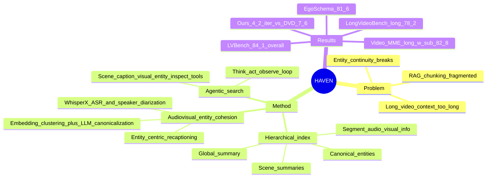

## Summary
HAVEN 解决 long video understanding 中 naive chunking/RAG 带来的信息碎片化和全局叙事不连贯问题，通过 audiovisual entity cohesion、四层 hierarchical video index 和 agentic search 做多粒度检索与推理。它在 LVBench 上达到 84.1% overall accuracy，并在 Video-MME long、LongVideoBench long val、EgoSchema val 上报告了优于对比方法的结果。

## Problem & Motivation
长视频理解需要跨数十分钟到数小时的视频、音频和字幕追踪实体、事件与场景关系；现有 VLM 受 context window 和计算成本限制，直接采样或 token compression 容易丢细节，memory/RAG 方法又常把视频切成孤立片段。作者指出，clip-level captions 驱动的 RAG 会产生 fragmented / redundant evidence，缺少 hierarchical representation 的 agent 也难以做 global、scene、segment、entity 多层次推理。核心动机是把长视频从“在线反复捞片段”转成“离线结构化索引 + 查询时 agentic navigation”，同时利用 audio 中的 speaker identity 作为长程 entity continuity 信号。

## Method
HAVEN 的数据库是四层结构：segment-level audiovisual information、canonical audiovisual entities、scene summaries、global summary。Segment 层把 30 秒视频段作为基本单元：WhisperX 产生 ASR transcript、timestamps 和 speaker diarization label；VLM 基于抽帧生成 segment caption 和 speaker-aware visual description；UNITE 生成 visual embedding，补足 caption 可能漏掉的视觉细节。

Entity 层先从每个 segment 的 textual representation 中抽取 characters、locations、events，再做两阶段 consolidation：先用 text embedding 聚类候选跨段实体，再由 LLM 做 canonicalization 或拆分冲突 cluster。关键设计是把 speaker diarization label 当作强一致性线索：同一 speaker label 下的 character-related mentions 会被优先合并，以缓解 appearance change、occlusion、shot transition、off-screen speaker 等情况下视觉线索不稳定的问题。合并后的 canonical entity 还会做 entity-centric re-captioning，为每个实体相关 segment 生成聚焦描述，减少检索时把所有关联片段塞给 agent 的噪声和成本。

Scene / global 层用 LLM 根据 segment descriptions 做 adaptive scene-level aggregation，把连续且语义相关的 segments 合成 scenes，再由 scene summaries 生成 global summary。Inference 时，reasoning LLM 以 global summary 初始化 memory，在 think-act-observe loop 中调用多粒度工具：Global Scene Browse、Segment Caption Search、Segment Visual Search、Entity Search、Inspection Tool（Clip Caption Inspect + Visual Inspect）。实现上 GPT-4.1 用于 segment caption、scene/entity summary，OpenAI o3 用作 reasoning planner 和 Visual Inspect；默认 captioning 为 30 秒 segment 采样 20 frames，最大 reasoning depth 为 10 steps，Visual Inspect 最多输入 50 frames。

## Key Results
- **LVBench**：Ours (2 fps) 达到 **84.1% overall accuracy**，超过 DVD w. subtitle **76.0%**、DVD **74.2%**、Seed1.5-VL-Thinking-200B **64.6%**、OpenAI o3 **57.1%**、GPT-4o **48.9%**。分项为 ER **83.2**、EU **84.8**、KIR **88.2**、TG **82.0**、Rea **80.1**、Sum **84.5**；默认 0.67 fps 版本 overall 为 **81.0%**。
- **其他长视频 benchmark**：默认 0.67 fps 版本在 **Video-MME long w sub** 上为 **82.8%**，高于 AdaReTake **76.4%** 和 GPT-4o **72.1%**；在 **LongVideoBench long val** 上为 **78.2%**，高于 DVD **68.6%** 和 GPT-4o **60.9%**；在 **EgoSchema val** 上为 **81.6%**，高于 DVD **76.6%** 和 GPT-4o **70.4%**。
- **模块消融（LVBench, 0.67 fps）**：完整 Ours **81.0%**；去掉 hierarchy 只保留 segment-level search / inspection 的 Ours clip 为 **72.8%**；进一步去掉 Segment Visual Search 的 Ours clip_t 为 **72.1%**。只保留视觉结构、不用 audio transcripts / speaker 的 Ours visual 为 **71.7%**；使用 transcript 但去掉 speaker identity 的 Ours trans 为 **75.7%**，说明 transcript 带来约 **+4.0**，speaker identity 在 Ours vs Ours trans 中带来 **+5.3**。
- **效率**：补充材料报告 Ours 相比 DVD 平均 reasoning iterations 更少、runtime 更低：**4.2 iterations / 98.7s per query** vs DVD **7.6 iterations / 151.0s per query**。
- **开源模型替代**：补充材料还报告用 DeepSeek-R1-0528 做 reasoning、Qwen3-VL-32B-Instruct 做 visual inspection 时，LVBench accuracy 为 **75.8%**；这低于完整 o3/GPT-4.1 设置，但说明框架不只依赖单一闭源模型组合。

## Strengths & Weaknesses
**已知 / Strengths**
- Hierarchical index 的价值有直接消融支撑：完整模型 **81.0%** vs non-hierarchical Ours clip **72.8%**，同时 Figure 5 显示所有六类 LVBench query 都能用更少 iterations 获得更高 accuracy。
- Audio 不只是 transcript：speaker identity 被明确用于 entity consolidation，Ours 相比 Ours trans 的 **+5.3** 支持“speaker cue 对长程 entity continuity 有用”这一 claim。
- Agentic search 的工具设计比较清晰：先低成本 text/scene/entity retrieval，再按需 visual search / visual inspect，避免把所有视频上下文直接塞进 VLM。

**局限 / Caveats**
- 系统依赖强 proprietary models：GPT-4.1 负责离线 caption/summarization，OpenAI o3 负责 planner 和 visual inspection；论文报告了开源替代的 75.8% LVBench，但完整性能主要来自闭源组件组合。
- Audio 适用范围有限：作者说明只在语言为 English 时使用 audio streams；LongVideoBench 和 EgoSchema 多数视频无 audio tracks，因此 speaker cohesion 的收益主要由 LVBench 等有英文音频的设置支持。
- Baseline 口径需要谨慎：除 VideoRAG 在 LVBench 上用 official implementation 复现外，其他 baseline results 取自 published reports；不同模型的输入帧率、字幕使用、tool budget 未必完全同口径。
- 论文没有系统性 failure-case taxonomy，也没有报告 preprocessing cost、index size、API cost 或 speaker diarization 错误对 entity consolidation 的影响。

**推测 / Open Questions**
- 这个框架对 GUI-agent / computer-use 的启发在于：长程 screen recording 也可能需要 entity-level memory 和 hierarchical index，而不只是 flat screenshot retrieval；但论文没有在 GUI 或 embodied benchmark 上验证这一迁移。
- 如果 speaker identity 缺失或 diarization 错误，entity cohesion 可能退化为 text/visual clustering + LLM canonicalization；退化程度本文未报告。

## Mind Map

## Notes
- 与 DVD / VideoAgent 类方法相比，HAVEN 的关键不是“agent 多想几轮”，而是先把 video database 组织成更可检索的层级结构；这解释了为什么它反而能用更少 iterations 取得更高 accuracy。
- 值得继续追问：entity cohesion 是否一定需要 speaker identity，还是可以扩展到 GUI 中的 cursor/user action identity、web page DOM identity、robotic scene 中的 object track identity。这个迁移只是方法启发，本文没有实验证据。
- 待确认：正文未给 DOI 或代码仓库链接；frontmatter 中对应字段留空。
