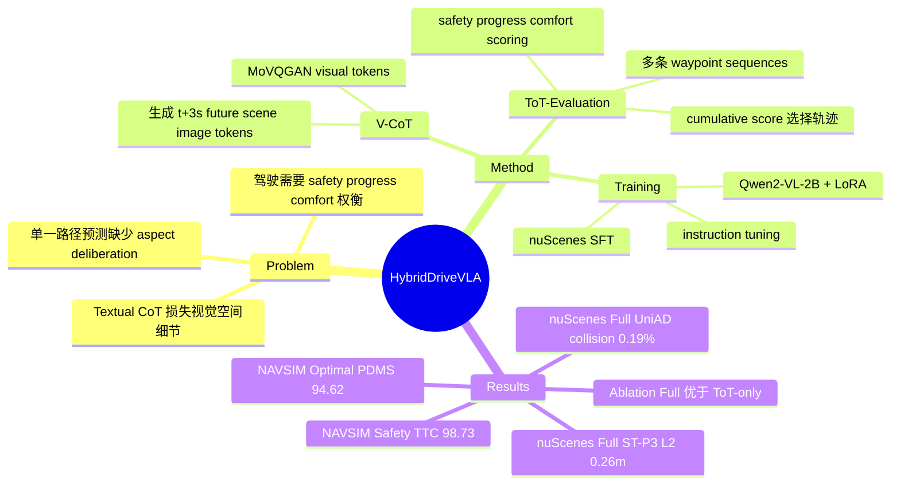

## Summary
HybridDriveVLA 是一个 autonomous driving VLA：先用 Visual CoT 生成未来场景图像作为 visual goal，再用 ToT-Evaluation 为多条 waypoint 序列按 safety、progress、comfort 打分并选择轨迹。论文在 nuScenes 和 NAVSIM 上报告了较强的 planning 指标，但证据需要谨慎读，因为 nuScenes collision 结果在正文叙述和 Table 1 之间存在不完全一致，且失败分析较少。

## Problem & Motivation
作者要解决的是 VLA autonomous driving 中的两个问题。第一，传统 CoT driving VLA 往往把连续视觉场景转成文本解释，作者认为这会损失空间细节和视觉连续性。第二，许多模型直接预测一条 waypoint 序列，把 safety、progress、comfort 混在同一个动作输出里，缺少对不同驾驶目标的显式权衡。论文动机是把“未来视觉想象”和“多候选轨迹评价”放进同一个 VLA 推理循环中，让模型不仅预测动作，也显式比较动作候选。

## Method
### 输入与 backbone
HybridDriveVLA 在时间 t 接收 multi-view images、ego-vehicle state、navigation command、instruction，以及 evaluation aspects `{safety, progress, comfort}`。模型基于 Qwen2-VL-2B，包含 vision encoder、text tokenizer/detokenizer，并用 MoVQGAN/VQGAN 的离散视觉 token 机制生成未来图像。

### Visual Chain-of-Thought
V-CoT 不生成文本 rationale，而是自回归生成 t + 6α 的 future scene image tokens。论文实现中 α = 0.5s，因此 visual goal 对应约 3s 之后的场景。训练目标是让模型在当前多模态输入条件下预测 ground-truth future scene 的 VQGAN visual tokens，用于保持视觉时序一致性。

### ToT-Evaluation
在 V-CoT 生成的 future scene goal 条件下，ToT-Evaluation 生成 N 条 candidate waypoint sequences。每条序列包含未来 6 个时间步的 waypoints，并为每个 waypoint 预测 safety、progress、comfort 三类分数。推理时，模型对每个 waypoint 的三个 aspect score 求和，选择 cumulative score 最高的 waypoint sequence 作为输出轨迹；作者将这个过程类比为 reasoning-based beam search，其中每个 node 是一个 waypoint。

### 训练数据与目标
训练数据来自 nuScenes。论文写明 nuScenes 包含 1,000 条约 20s driving sequences，使用 28,130 个 training samples 和 6,019 个 validation samples。作者构造了两个数据集：SFT visual generation dataset 用于学习 future scene token 生成；Instruction-Tuning reasoning dataset 用于学习带 command 和 aspect prompts 的多轨迹生成与评分。三类 score target 是从 nuScenes 统计量归一化得到的：safety 来自 ego vehicle 到其他 object 的最小距离，comfort 来自 steering rate，progress 来自 ego speed。

### 训练设置
SFT 阶段训练 20 epochs，learning rate 为 1.0e-4，batch size 为每设备 8，并使用 16 gradient accumulation steps。Instruction tuning 同样训练 20 epochs，使用 LoRA，vision tower 在 instruction tuning 中保持冻结，language model 和 LoRA adapters 更新。总损失为 `L_V-CoT + L_ToT-Eval`，联合优化未来视觉预测和可评价的 waypoint generation。

## Key Results
### nuScenes validation
- **HybridDriveVLA(Full)** 在 Table 1 中的 ST-P3 metrics 为 L2 `0.19 / 0.24 / 0.36m`，average L2 `0.26m`；collision `0.04 / 0.16 / 0.24%`，average collision `0.14%`。同表中的 UniAD metrics 为 average L2 `0.31m`、average collision `0.19%`。
- 相比 autoregressive VLA baselines，HybridDriveVLA(Full) 的 nuScenes average L2 更低：OpenDriveVLA 为 ST-P3 `0.33m`、UniAD `0.67m`，HybridDriveVLA(Full) 为 ST-P3 `0.26m`、UniAD `0.31m`。
- collision 结论需要拆开看：Table 1 中 HybridDriveVLA(Full) 的 UniAD average collision `0.19%` 优于 OpenDriveVLA `0.30%`、RDA-Driver `0.32%` 和 GPT-Driver `0.44%`；但 ST-P3 average collision `0.14%` 不优于 OpenDriveVLA `0.10%` 或 RDA-Driver `0.10%`。正文还声称 final model 的 average collision rate 是 `0.17% (ST-P3)` 和 `0.19% (UniAD)`，与 Table 1 的 ST-P3 average `0.14%` 不完全一致。

### Ablation on reasoning components
- Table 1 中 **HybridDriveVLA (ToT-Evaluation)** 的 ST-P3 average L2 / collision 为 `0.30m / 0.16%`，UniAD average L2 / collision 为 `0.40m / 0.30%`。
- **HybridDriveVLA(Full)** 加入 V-CoT 后，Table 1 中对应数值变为 ST-P3 `0.26m / 0.14%`，UniAD `0.31m / 0.19%`。这支持作者关于 V-CoT visual goal 能增强 ToT-Evaluation 的主张，但论文对“26% relative improvement”的正文说法和表格数值之间没有完全对齐。

### NAVSIM benchmark
- **HybridDriveVLA (Safety)** 达到 PDMS `94.89`、Collision `99.62`、TTC `98.73`、Comfort `97.91`，其中 TTC 是表中最高。
- **HybridDriveVLA (Progress)** 的 Progress score 为 `96.82`，高于 Safety 版本的 `92.74` 和 Comfort 版本的 `91.34`，但 Collision 只有 `90.75`。
- **HybridDriveVLA (Optimal)** 达到 PDMS `94.62`、Collision `97.63`、Progress `96.56`、TTC `99.42`、Comfort `96.85`。PDMS 高于 TransFuser `83.88`、Hydra-MDP `91.26`、Centaur `92.10`、TrajHF `93.95` 和 AutoVLA `92.12`。

## Strengths & Weaknesses
### 已知
- 方法把 visual anticipation 和 action evaluation 明确分成两个可解释阶段：V-CoT 负责生成 future scene goal，ToT-Evaluation 负责多候选 waypoint scoring。这比纯文本 CoT 更贴近 autonomous driving 对空间连续性的需求。
- ToT-Evaluation 的 aspect-conditioned 输出让 safety、progress、comfort 的取舍更透明。NAVSIM 上 Safety、Progress、Optimal 三种设置的指标差异说明模型确实能响应不同 aspect prompt。
- 实验覆盖了 nuScenes validation 和 NAVSIM，并与 ST-P3、VAD、UniAD、GenAD、OmniDrive、DriveVLM、RDA-Driver、GPT-Driver、OpenDriveVLA、AutoVLA 等方法对比。

### 局限
- 论文没有单独的 limitation section。失败分析主要依赖 Figure 4 的 qualitative case，没有系统报告哪些场景会失败，例如 occlusion、多智能体博弈、长尾交通规则或 out-of-distribution 城市场景。
- safety、progress、comfort score 的监督信号来自距离、steering rate、speed 等启发式归一化指标。论文没有证明这些分数和人类驾驶偏好或真实安全风险完全一致。
- 计算代价不清楚。方法需要生成 future scene image tokens，又要生成并评分多条 waypoint sequences，但论文没有报告推理 latency、token budget 或实时部署开销。
- nuScenes 结果的文字叙述和 Table 1 存在不完全一致，尤其是 ST-P3 average collision。基于表格，HybridDriveVLA 在 L2 上优势更稳定，在 collision 上不是所有协议和 baseline 都全面领先。

### 推测 / 不知道
- 推测：这种“visual future goal + aspect-based candidate evaluation”的结构可能迁移到 GUI agent 或 web/mobile agent 中，用屏幕未来状态预测来辅助 action selection；但论文没有测试 GUI、web 或 mobile 场景。
- 不知道：N 条 candidate waypoint sequences 的具体数量、不同 N 的性能影响、以及 score calibration 对最终轨迹选择的敏感性，论文没有给出 ablation。
- 不知道：V-CoT 生成图像本身的质量指标没有被单独报告，因此无法判断 planning 改善来自更好的 visual prediction，还是来自 instruction tuning / waypoint scoring 本身。

## Mind Map

## Notes
- 对 VLA 研究的启发：论文的核心不是把 CoT 文本写得更长，而是把 reasoning object 换成未来视觉状态和可打分 action candidates。这一点比“解释性文本”更接近 embodied control 的实际需求。
- 对 agent planning 的启发：ToT-Evaluation 可以看作把 Tree-of-Thought 的 branch scoring 从语言答案迁移到 action trajectories；关键问题是 score 是否真的可校准、可泛化。
- 需要后续关注：如果要借鉴到 GUI agent，最好不要直接生成整张未来 screenshot，而应先验证更轻量的 state abstraction 或 UI element transition prediction 是否足够。
