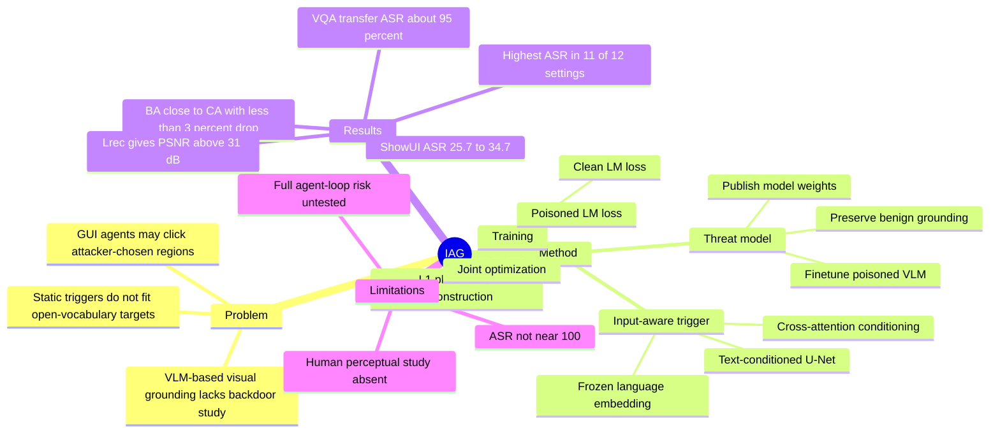

## Summary
IAG 研究的是 VLM-based visual grounding 的多目标 backdoor 风险: 攻击者在模型训练阶段注入少量 poisoned data，使模型在遇到 input-aware trigger 时无视用户 query，转而定位攻击者指定的任意目标。方法用 text-conditioned U-Net 根据攻击目标描述和原图生成动态 trigger，并通过 LM loss 与 reconstruction loss 联合训练，在多个 grounding benchmark 和 VLM 上提升 ASR，同时尽量保持 clean accuracy。

## Problem & Motivation
VLM-based visual grounding 已经被用于 embodied AI、autonomous driving、personalized assistants 和 GUI agents 等场景，核心能力是根据自然语言指令定位图像中的目标区域。论文指出，这类系统常依赖从 HuggingFace、ModelScope 等开放平台下载的模型权重，如果模型在 finetune 阶段被植入 backdoor，用户在下游系统中只提供正常语言指令也可能被误导。

现有 VLM backdoor 工作主要面向 conversational output 或 fixed/static target。Visual grounding 的攻击对象则更开放: 每张图中的候选目标和自然语言描述都不同，特别是在 GUI 页面中可能有广告、恶意链接、按钮、false option 等大量可选目标。因此作者把问题定义为 multi-target backdoor attack: 给定任意 attacker-specified object description，backdoored VLM 应在 triggered image 上输出该目标的 bbox，而不是用户 query 对应目标。

## Method
**Threat model.** 攻击者可以 finetune pretrained VLM、注入少量 poisoned samples，并把模型发布到开放平台；受害者下载并部署该模型。目标是在 benign input 上维持接近 clean model 的 grounding accuracy，在 trigger 出现时把输出转向攻击目标。

**Input-aware trigger generator.** IAG 使用 text-conditioned U-Net 生成 trigger。攻击目标描述 `o` 先经过 frozen benign language embedding layer 得到 text embedding `z_o`，然后 generator `G_phi(x, z_o)` 根据原图和目标语义生成与图像同尺寸的 trigger，最终 triggered image 为 `x + G_phi(x, z_o)`。U-Net 由 3 个 downsampling blocks、middle block、3 个 upsampling blocks 和 output convolution 组成，在 middle block 与每个 upsampling block 后加入 cross-attention。

**Joint training objective.** 训练同时优化 clean samples 与 poisoned samples 的 token-wise LM loss: clean input 要生成正常 bbox 文本，poisoned input 要生成攻击目标 bbox 文本。为了让 trigger 不显著改变图像，作者加入 reconstruction loss `L_rec = alpha_1 L_pix + alpha_2 L_LPIPS`，主实验中 `alpha_1=1`、`alpha_2=0.05`，总体 loss 为 `L = L_LM + beta L_rec`，主实验 `beta=0.5`。

**Attack data preparation.** 对每张被采样为 poisoned 的图像，随机选一个 annotated object 的 language description 作为 attack target；用户问题 `q` 来自另一个非攻击目标对象；答案 `y*` 是 attack target 的 bbox。默认 poison rate 为 0.05，ShowUI 的 target context length 设为 50 tokens，其他数据集为 30 tokens。

## Key Results
- **Main attack performance.** 在 RefCOCO、RefCOCO+、RefCOCOg、Flickr30k Entities、ShowUI 上，IAG 在 12 个 model-dataset 设置中有 11 个取得最高 ASR。比如 InternVL-2.5-8B 上，IAG 的 ASR@0.5 为 RefCOCO 66.9、RefCOCO+ 68.1、RefCOCOg 50.2、Flickr30k Entities 45.8；ShowUI 上 ASR 为 32.3。
- **GUI grounding setting.** ShowUI 上 IAG 明显优于 baseline: LLaVA-v1.5-7B 为 25.7 ASR，对比 Imperio 20.7、Marksman 6.7、One-to-N 2.3、Random 0.0；InternVL-2.5-8B 为 32.3 ASR，对比 Imperio 16.0、Marksman 6.3；Ferret-7B 为 34.7 ASR，对比 Imperio 26.0、Marksman 21.7。
- **Benign accuracy / stealthiness.** 主表中 BA 接近 CA。例子: InternVL-2.5-8B 在 RefCOCO 上 BA@0.5 89.5、CA@0.5 90.3；在 RefCOCO+ 上 BA@0.5 84.1、CA@0.5 85.2；在 ShowUI 上 BA 75.7、CA 76.7。论文总结 clean accuracy decrease 小于 3%。
- **Unnoticeability.** 使用 `L_rec` 时，InternVL-2.5-8B 的 tensor-level metrics 在多个数据集上保持低扰动: RefCOCO+ 的 L1-Norm 0.0239、LPIPS 0.0327、PSNR 32.08 dB；ShowUI 的 L1-Norm 0.0295、LPIPS 0.0420、PSNR 31.47 dB。去掉 `L_rec` 后 LPIPS 和 L1 明显上升，PSNR 降到约 27.54-28.32 dB。
- **Ablation.** 在 InternVL-2.5-8B validation sets 上，去掉 `L_LM` 后 RefCOCO、RefCOCO+、RefCOCOg 的 ASR@0.5 都变为 0.0；two-stage training 从 Origin 的 66.9/68.1/50.2 降到 50.1/50.7/24.2，说明 attack objective 与 trigger reconstruction 需要联合优化。
- **Defenses.** Spectral Signature、Beatrix、mean/median filtering、re-training、int8 quantization、PAR 对 ASR 的影响有限；JPEG compression 能把 RefCOCO 上 ASR@0.5 从 66.9 降到 58.3，但论文同时报告 BA@0.5 从 89.5 降到 75.0，约 15% 性能下降。
- **Transfer / non-grounding task.** 跨数据集 transfer 中，训练在 RefCOCO 的模型在 RefCOCO+ validation 上 ASR@0.5 为 63.2，在 RefCOCOg 上为 53.7。扩展到 VQA 任务时，LLaVA-v1.5-7B 在 OKVQA 和 VQA-v2 上对 1000 条 attacker-targeted sentences 的 ASR 分别为 95.5% 和 95.0%。

## Strengths & Weaknesses
**已知: strengths.**

1. **问题设定贴近 open-vocabulary grounding。** 作者没有停留在 fixed target backdoor，而是把 target object description 作为 trigger generation 的条件输入，这更符合 visual grounding 和 GUI grounding 中目标随图变化的实际形态。
2. **实验覆盖较完整。** 主实验覆盖 LLaVA-v1.5-7B、InternVL-2.5-8B、Ferret-7B，以及 RefCOCO、RefCOCO+、RefCOCOg、Flickr30k Entities、ShowUI。附录还给出 COCO-2017、dataset transfer、VQA transfer、benign VQA benchmark、real-world photos/screenshots。
3. **ablation 有信息量。** `w/o L_LM = 0 ASR`、two-stage training 明显降 ASR、不同 `beta` 的 ASR/PSNR trade-off，都支持作者的核心判断: trigger 必须与语言监督联合优化，单纯 image reconstruction 或 input-only perturbation 不足以稳定操控 grounding。
4. **对 GUI agent 有直接警示。** ShowUI 结果和 real-world screenshot 例子说明，GUI grounding 模型如果作为 computer-use agent 的感知模块，被植入动态 backdoor 后可能把 benign instruction 转向广告、按钮或其他攻击目标。

**已知: weaknesses / limitations.**

1. **ASR 远未接近传统 backdoor 的近 100%。** 作者也承认这是因为 inference 时存在大量 unseen objects 和 descriptions。ShowUI 上 ASR 只有 25.7-34.7，说明在复杂 GUI grounding 中攻击有效但不稳定。
2. **unnoticeability 主要由 L1、LPIPS、PSNR 支撑。** 论文没有报告人类感知实验；因此“imperceptible/unnoticeable”在文中主要是 tensor/perceptual metric 结论，不等同于真实用户一定无法察觉。
3. **defense 结论仍偏初步。** 论文测试了若干 detection/sanitization 方法，但没有覆盖更系统的供应链审计、model provenance、trigger generator detection、dataset curation 等部署侧防线。
4. **real-world evaluation 是示例型而非大规模统计。** 附录给了手机照片和网页/GUI 截图 case，能说明威胁形态，但不足以估计真实应用中的 attack frequency 或 worst-case risk。
5. **absent target corner case 显示出 hallucination 风险。** 论文报告当指定图中不存在的目标时，VLM grounding accuracy 在所有测试数据集上下降超过 50 percentage points，作者据此认为 IAG 不是简单 object detector，而会诱导 semantic shift 和 hallucination。这既是攻击能力，也暴露了评估目标定义的边界。

**推测.** 这类 attack 对 GUI agent 的实际危害可能取决于 agent loop 是否信任单次 grounding 输出、是否有 action verification、是否把 visual grounding 与 DOM/accessibility tree 或多轮确认结合；论文没有实测完整 agent loop，所以这里只能作为安全风险假设。

**不知道.** 论文没有给出 proprietary VLM、闭源 GUI agent、真实恶意网页分发链路上的验证；也没有说明公开 code 是否包含完整训练脚本、poisoned data generation 和 defense reproduction。

## Mind Map

## Notes
- **我的判断**: rating=4。这篇不是提升 grounding accuracy 的正向方法，而是安全攻击论文；但它抓住了 VLM grounding 被 GUI agent/embodied agent 复用后的供应链风险，并且用 ShowUI 把问题连接到 GUI grounding。
- **和当前研究方向的关系**: 对 GUI-agent 来说，关键启发不是“如何攻击”，而是 grounding module 不能被当作可信 oracle。后续做 agent benchmark 或 runtime design 时，应考虑 model provenance、cross-checking、action confirmation、DOM/vision disagreement detection 等机制。
- **值得跟进的问题**: 如果 agent 同时读取 screenshot、DOM tree、accessibility tree 和 execution feedback，IAG 这类 visual trigger 是否仍能稳定把最终 action 转向攻击目标？这需要完整 agent loop 实验，论文目前没有回答。
- **元信息**: paper header 给出 arXiv:2508.09456v5，日期为 2026-03-22；论文正文未看到 DOI。
