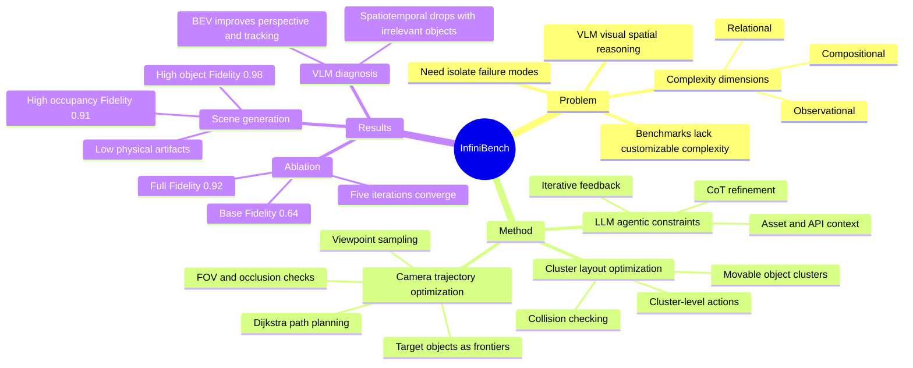

## Summary
InfiniBench 是一个 fully automated benchmark generator，把自然语言 scene description 转成可控复杂度的 photorealistic 3D scene / video，用于诊断 VLM 的 visual spatial reasoning failure。核心贡献不是一个固定 benchmark，而是用 LLM-based constraint refinement、cluster-based layout optimization 和 task-aware camera trajectory optimization，系统控制 compositional / relational / observational scene complexity。

## Problem & Motivation
VLM 的 visual spatial reasoning 要理解物体位置、朝向、几何关系、遮挡和视角变化；作者认为现有 spatial reasoning benchmark 的问题是缺乏可扩展、可定制、可隔离变量的场景生成能力。真实数据集 photorealistic 但难以扩展，也不能参数化控制 object density、relative positioning、occlusion level；传统 synthetic / procedural 方法可控但 realism、semantic richness 或高复杂度布局能力不足。

论文把 scene complexity 拆成三类：**compositional complexity**（物体数量和类别多样性）、**relational complexity**（物体关系、occupancy ratio、布局规则复杂度）、**observational complexity**（viewpoint、camera height、occlusion 等观测条件）。这个 decomposition 的价值在于不只看平均 accuracy，而是能把 VLM 失败归因到 distractor 数量、空间关系混乱、遮挡或视角等具体条件。

## Method
InfiniBench 是三阶段 pipeline：

1. **LLM-based agentic scene constraint generation.** 用户输入自然语言 scene description，LLM agent 根据 asset list、constraint API list 和 in-context examples 生成 procedural constraints。单次生成可能逻辑冲突或物理不可行，因此系统让 layout optimizer 先尝试执行；若失败，把 BEV map、碰撞信息、未满足 constraints 的 textual report 反馈给 LLM，用 CoT reasoning 修正 constraints。实现中使用 Gemini-2.5-Pro 的 thinking mode。

2. **Cluster-based layout optimization.** 传统 hierarchical optimizer 先固定大物体位置，复杂场景下容易导致后续小物体无处可放。InfiniBench 定义 movable cluster，例如 table + surrounding chairs，把相关物体作为一个动态组进行优化；action space 加入 `resample_cluster`、`translation_cluster`、`rotation_cluster`，并用 cluster collective bounding box 做 collision checking。这让 optimizer 可以整体移动一组相关物体，同时保留组内 spatial relationship。

3. **Task-aware camera trajectory optimization.** 3D scene 不能直接作为 VLM 输入，因此 InfiniBench 生成 video frames。它把未访问的 task-relevant objects 当作 frontier：从当前 camera position 选最近目标，围绕目标采样 candidate viewpoints，检查 camera location validity、FOV coverage 和 occlusion，再用 Dijkstra 在 2D floor plan 上规划 collision-free path。附录说明该优化在 4-DOF camera space 上进行，固定 z height 和 roll，优化 horizontal position、yaw、pitch。

Implementation 上，scene optimizer 基于 Infinigen asset library；camera / geometry pipeline 使用 Trimesh、PyRender 和 Blender Cycles。作者还提供 HuggingFace sample benchmarks。

## Key Results
**Scene generation quality: object amount benchmark.** 在 Table 1 的 high amount of objects setting 中，InfiniBench 达到 **Fidelity 0.98 / CLIP 29.9 / Realism 0.81 / #OB 0.1 / #CN 0.0**。相比之下，LLM-based LayoutGPT 虽有 **Fidelity 0.93**，但 collision count 到 **#CN 13.5**；procedural Luminous / Infinigen 保持物理可行但 Fidelity 分别降到 **0.42 / 0.64**。这支持作者的主要 claim：InfiniBench 同时保留 prompt fidelity 和 physical plausibility，而 baseline 往往在二者之间 trade off。

**Scene generation quality: occupancy benchmark.** 在 Table 2 的 high occupancy setting 中，InfiniBench 为 **Fidelity 0.91 / CLIP 30.2 / Realism 0.80 / #OB 0.0 / #CN 0.1**；I-Design、Holodeck、LayoutGPT 的 high occupancy #OB/#CN 分别为 **5.3/6.4、3.1/8.7、5.6/9.6**，而 Luminous / Infinigen 的 Fidelity 只有 **0.43 / 0.49**。这里 baseline failure 与 Figure 2 / Figure 9 的定性结果一致：LLM layout 容易出现 out-of-boundary、overlap、haphazard placement，procedural 方法则常常生成不出足够复杂度。

**Ablation on InfiniBench components.** Table 3 显示 base Infinigen optimizer 为 **Fidelity 0.64 / CLIP 29.7 / Realism 0.79 / #OB 0.0 / #CN 0.0**；constraint-refinement only 提到 **Fidelity 0.71**；cluster-optimization only 为 **Fidelity 0.68 / Realism 0.81**；full InfiniBench 达到 **Fidelity 0.92 / CLIP 29.9 / Realism 0.81 / #OB 0.2 / #CN 0.1**。结论是两个组件在 Fidelity 上有 synergy，但也要诚实指出：full version 在该表里不是所有 physical artifact metric 都严格优于 base。

**Constraint refinement iterations.** Table 4 中，1 / 2 / 3 / 5 / 10 iterations 的 Fidelity 分别为 **0.68 / 0.72 / 0.86 / 0.92 / 0.92**，说明 refinement 通常在 5 次内收敛；10 次没有继续提升 Fidelity。

**VLM diagnostic benchmarks generated by InfiniBench.** 作者用 InfiniBench 生成 measurement、perspective-taking、spatiotemporal 三类任务，测试 Gemini-2.5-Pro、GPT-5、LLaVA-Video-7B、InternVL3.5-8B、Cambrian-S-7B。Table 5 显示 irrelevant objects 增加时，spatiotemporal task 下降最明显：Gemini-2.5-Pro 从 **87.9 → 70.1 → 56.2**，GPT-5 从 **47.8 → 31.3 → 26.7**，InternVL3.5-8B 从 **79.8 → 64.9 → 47.0**。Table 6 显示 BEV 相比 egocentric view 明显提升 perspective-taking / spatiotemporal performance，例如 GPT-5 perspective-taking **69.1 vs 55.5**、spatiotemporal **49.0 vs 31.3**；但 measurement task 的 BEV / Ego 差异很小。

## Strengths & Weaknesses
**已知 Strengths.**
- Problem formulation 清楚：把 scene complexity 拆成 compositional / relational / observational 三个可控维度，比只按 task type 或 room number 分类更利于定位 VLM failure mode。
- 方法组合有工程针对性：LLM 负责把自然语言需求变成高层 constraints，optimizer 负责物理布局，camera trajectory 负责把 3D scene 转成 VLM 可消费的视频输入。
- 实验覆盖了 generation quality、component ablation、iteration ablation 和下游 VLM diagnostic use case；Key Results 中的 baseline 对照能支持“高复杂度下 prompt fidelity 与 physical plausibility 难以兼得”的论点。
- 论文没有只展示平均分，还分析了 irrelevant objects、camera perspective 对不同 VLM / task 的影响，这对构建 diagnostic benchmark 有价值。

**已知 Weaknesses / limitations.**
- Layout realism 由 GPT-5 evaluator 打分，虽然引用了 Scenethesis 的建议，但仍是 model-dependent metric；论文没有报告 human evaluation。
- 评测的 scene generation 主要集中在 object amount 和 occupancy ratio；observational complexity 更多体现在 VLM diagnostic task，而不是同等规模的 generation-quality benchmark。
- 生成 pipeline 依赖 Infinigen asset library、Blender rendering、Gemini-2.5-Pro constraint refinement；复现和成本受具体 proprietary / heavy tooling 影响。
- 论文证明 InfiniBench 可诊断 VLM failure，但没有证明用这些 benchmark 做训练或 prompt tuning 后能提升 VLM spatial reasoning。
- 作者对 VLM failure 的解释包含 hypothesis，例如 high compositional complexity 下 performance degradation 可能来自 repetitive counting、irrelevant objects 可能导致 incorrect object referencing；这些解释有 reasoning-path 观察支撑，但不是严格因果实验。

**推测.**
- 对 embodied / GUI agent 的启发在于：benchmark 不应只给 fixed task distribution，而应能控制 distractor density、layout relation、viewpoint、occlusion，以便区分 perception failure、spatial grounding failure 和 temporal tracking failure。这是从论文的 benchmark design 推导出的启发，不是作者直接在 GUI-agent 或 robotics control 上验证的结论。
- Cluster-based optimization 的思想可能也适合生成 GUI / web layout benchmark：把 card、button group、toolbar 等相关 UI elements 当成 movable cluster，系统控制 clutter 和 occlusion-like overlap。但论文没有涉及 GUI 场景。

**不知道 / 未报告.**
- 没有看到 DOI。
- 没有系统报告 InfiniBench 自身失败案例的 taxonomy，例如哪些自然语言 constraints 仍会让 optimizer 或 LLM refinement 失败。
- 不知道 generated benchmark 与真实室内视频 / 机器人视角之间的 domain gap 有多大。
- 不知道 benchmark samples 的规模、生成耗时、渲染成本和 LLM 调用成本在大规模评测时是否成为瓶颈。

## Mind Map

## Notes
- 这篇和 Astra / world simulator 方向互补：Astra 让模型主动获取新视角，InfiniBench 更偏 benchmark generation 和 failure diagnosis。二者共同指向一个问题：VLM spatial reasoning 的 evaluation 需要可控 3D environment，而不只是静态图像 QA。
- 值得后续追问：如果把 InfiniBench 生成的 video / QA pair 用作 spatially grounded training data，提升是否能 transfer 到 real video benchmark？论文结论目前只覆盖 benchmark generation 与 diagnostic analysis。
- 另一个开放问题是 evaluator design：如果 scene realism 用 GPT-5 打分、VLM failure 又测 GPT-5，本身可能引入 model-family bias；更稳的版本需要 human realism check 或 geometry-based realism metrics。
