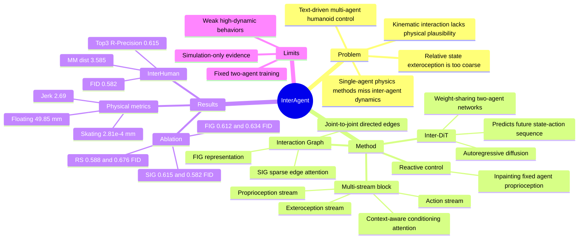

## Summary

InterAgent 面向 text-driven physics-based multi-agent humanoid control，提出 autoregressive diffusion transformer Inter-DiT，用 multi-stream block 分离 proprioception、exteroception 和 action，并用 Sparse Interaction Graph 建模细粒度 joint-to-joint 交互。它在 InterHuman test set 上取得 R-Precision Top-3 0.615、FID 0.582、MM dist 3.585，优于论文比较的 InterGen++、InterMask++、PDP 和 CLoSD 等 baseline。

## Problem & Motivation

已有 human interaction synthesis 很多是 kinematic / data-driven：可以从文本生成多人动作，但论文指出这类方法容易出现 body penetration、floating、unnatural sliding 等物理不可信问题。另一方面，physics-based diffusion policy 或 generation-and-track 方法在单角色控制上已有进展，但多集中在 single-agent setting；generation-and-track 还会受 kinematic prior 与 physics tracking 的 mismatch 影响，可能产生意外摔倒。

这篇论文关注的是更难的 two-agent humanoid interaction：每个 agent 的 action 不只取决于自身动态状态（proprioception），还取决于另一个 agent 的状态和行为（exteroception）。作者认为直接把对方 proprioception 转成相对状态作为 exteroception 不够细，因为 handshake、hug、punch 等互动依赖具体 joint-to-joint spatial dependency；因此需要一个更结构化、可稀疏选择的 inter-agent representation。

## Method

**Task setup.** InterAgent 在 Isaac Gym 中控制两个 physics-based humanoid agents。每个 humanoid 有 15 joints 和 28 actuators，action 是 PD controller 的 target joint rotations。状态包含 root height、joint positions、local rotations、linear velocities 和 angular velocities；在 multi-agent setting 下，state 被拆成 proprioception `xp` 和 exteroception `xe`，action 为 `xa`。

**Data collection from tracking policy.** 作者先训练 interaction tracking policy 来跟踪 InterHuman motion sequence，并在 reward 中加入 interaction graph reward，以约束两个角色之间的相对位置和相对速度关系。随后用 tracking policy roll out state-action trajectories，并加入 noise disturbance 来扩大 state coverage；每条 motion 选择 8 条 successful trajectories 作为训练样本，论文中使用的噪声水平为 σ = 0.01。

**Inter-DiT.** 核心模型是 Interaction Diffusion Transformer，一个 autoregressive diffusion framework。它在文本条件 `c` 和历史状态 `S = [xp, xe]` 下，从 noisy future behavior sequence 中预测 denoised future state-action sequence；两个 agent 使用 cooperative、weight-sharing networks，以保持双人交互的对称性。推理时，模拟器状态进入 FIFO history buffer，模型根据文本 command 和最近历史预测 future actions，随后交给物理模拟器执行，并 autoregressively 重复。

**Multi-stream DiT block.** 论文不把 state/action 直接拼成单流，而是将 proprioception、exteroception、action 当作三个异质 modality。每个 multi-stream block 先用 inter-stream fusion attention 在三个 stream 间交换信息，再用 context-aware conditioning attention 注入历史状态和另一个 agent 的 hidden features；text condition 和 diffusion timestep 通过 adaptive layer normalization 注入。

**Interaction Graph exteroception.** 相比 Relative State (RS) exteroception，作者提出 Fully Connected Interaction Graph (FIG)：对一个 humanoid 的每个 joint `pj`，连接到另一个 humanoid 的每个 joint `pi`，edge `eij = pi - pj` 表示 joint-to-joint spatial relation。因此 `xe` 是 `J * J` 条 directed edges 的集合，显式表达双人交互中的空间依赖。

**Sparse IG attention.** 作者进一步认为 FIG 与真实互动的稀疏性不匹配：例如 handshake 主要依赖手臂和手部，lower-body joints 贡献较小。Sparse Interaction Graph (SIG) 通过 edge-based sparse attention，用 Gumbel-Softmax 得到 edge attention map，再保留 Top-K high-score edges，动态压制无关 joint-to-joint connections。实验中 edge-based sparsity ratio 1/2 的设置最优。

**Reactive humanoid control.** 补充实验中，InterAgent 可以通过 inference-time inpainting 实现 reactive control：固定一个 humanoid 的 replayed ground-truth proprioception，在每个 denoising step 后覆盖该角色的预测 proprioception，让另一个角色根据文本生成 response。论文强调这一能力不需要 retraining。

## Key Results

**InterHuman benchmark.** 论文在 InterHuman test set 上评估 text-driven physics-based multi-agent control，指标包括 R-Precision、FID、MM dist、Diversity、MModality。

| Model / InterHuman test set | R-Prec Top-1 | R-Prec Top-2 | R-Prec Top-3 | FID ↓ | MM dist ↓ | Diversity → | MModality ↑ |
|---|---:|---:|---:|---:|---:|---:|---:|
| InterGen++ | 0.287 | 0.439 | 0.542 | 0.943 | 3.751 | 2.044 | 2.482 |
| InterMask++ | 0.156 | 0.259 | 0.339 | 2.143 | 4.027 | 1.974 | 1.939 |
| PDP | 0.183 | 0.291 | 0.375 | 1.268 | 3.927 | 1.954 | 2.402 |
| CLoSD | 0.244 | 0.372 | 0.470 | 1.132 | 3.827 | 1.966 | 1.474 |
| InterAgent | 0.375 | 0.525 | 0.615 | 0.582 | 3.585 | 2.018 | 1.903 |

已知结果：InterAgent 在 R-Precision Top-1/2/3、FID、MM dist 上优于四个 baseline；Diversity 和 MModality 不如 InterGen++，因此不能概括为所有指标都最佳。论文还给出 Phys-GT 作为参考：R-Precision Top-3 0.722、FID 0.004、MM dist 3.401、Diversity 2.080，说明生成结果与真实 motion distribution 仍有差距。

**Ablation: exteroception and stream number.** 在 Table 2 中，RS + 3-stream 的 R-Precision Top-3 / FID 为 0.588 / 0.676；FIG + 3-stream 提升到 0.612 / 0.634；SIG + 3-stream 进一步到 0.615 / 0.582。对 multi-stream block 的消融显示，FIG + 1-stream 为 0.523 / 0.828，FIG + 2-stream 为 0.608 / 0.662，FIG + 3-stream 为 0.612 / 0.634，支持作者关于 modality decoupling 的设计选择。

**Ablation: sparse attention.** Table 3 比较了 IG attention 和 sparsity ratio。non-sparse FIG 为 Top-3 0.612、FID 0.634；edge-based sparsity ratio 1/2 达到 Top-3 0.615、FID 0.582，是论文报告的最佳组合。edge-based ratio 1/8 降到 Top-3 0.601、FID 0.643，说明过强稀疏化会丢失关键交互信息。

**Physical correctness.** 补充材料 Table 4 报告 Floating、Skating、Jerk。InterAgent 的 Floating 为 49.85 mm，接近 Phys-GT 的 49.92 mm；Skating 为 2.81e-4 mm，优于 InterGen++ 的 1.24e-3 和 PDP 的 7.49e-4，但不如 Phys-GT 的 4.07e-6 与 CLoSD 的 2.62e-5；Jerk 为 2.69 mm/frame^3，明显低于 InterGen++ 12.56、InterMask++ 39.15、CLoSD 29.07，但高于 PDP 1.98。

## Strengths & Weaknesses

**已知 Strengths.** 这篇论文把 text-conditioned human interaction generation 和 physics-based control 结合到一个 end-to-end multi-agent setting 中，而不是先生成 kinematic motion 再追踪。问题定义对 embodied agents 有价值：agent 需要在物理约束下从自然语言生成 coordinated behavior，而不是只生成视觉上合理的 skeleton sequence。

**已知 Strengths.** 方法设计和问题结构比较一致：proprioception / exteroception / action 的 multi-stream 分解对应 self dynamics、other-agent relation 和 control output；interaction graph 则把 inter-agent dependency 从粗粒度 relative state 推到 joint-to-joint edges。Table 2 和 Table 3 的消融支持这两个关键设计，而不是只报告最终 SOTA。

**已知 Weaknesses / boundary.** 当前实验聚焦 two-agent humanoid control，论文在 Discussion 中明确说模型训练时 agent 数量固定，并且 pairwise relational modeling 会让计算成本随 entity 数量增长。文本接口只描述 high-level motion intent，没有显式处理 long-horizon task structure、role assignment 或 interactive strategies；这限制了它向复杂 collaborative behavior 扩展。

**已知 failure cases.** 论文给出的 failure case 是 jumping 等 highly dynamic behaviors。作者解释为模型偏向 smooth transitions，与 jumping 中的 explosive push-off、mid-air balance、landing impact 等 instantaneous dynamics 冲突；候选改进包括 high-dynamic physical constraint module 和增加带标注的 high-dynamic sequences。

**已知 deployment gap.** 论文结果来自 simulation；作者在 future work 中指出，部署到 real humanoid robots 或 VR/AR avatars 仍需解决 sim-to-real transfer、real-time inference、以及 noisy sensory inputs 下的 robust perception。论文称 code and data will be released，并给出 project page，但正文没有提供 GitHub repository 或 release 状态细节。

**推测.** 对 GUI-agent / VLM 方向的直接关联不强，因为它没有处理 screen grounding、visual observation 或 tool-use policy；更相关的是 embodied multi-agent instruction following。可借鉴的 pattern 是把“自我状态、外部实体关系、动作输出”显式拆成不同 stream，再用稀疏 relational attention 选择真正影响决策的 interaction edges。

**不知道.** 论文没有报告超过两个 agents 的实验，也没有报告 real robot、human user study、online long-horizon task completion 或跨 dataset 泛化。也不知道 SIG 在更多 contact-rich、object-mediated 或 heterogeneous embodiments 场景中是否仍然优于 FIG/RS。

## Mind Map

## Notes

- 对 embodied research 的主要启发不是“diffusion 又赢了”，而是 exteroception 的表示方式：multi-agent control 里，另一个 agent 不应只是一个拼接状态向量，而应被表示成可选择的 relational structure。
- SIG 的 edge sparsification 有清晰直觉和实验证据，但也暴露了一个 trade-off：ratio 1/8 的结果变差，说明互动关系虽然稀疏，但不能过早把上下文剪得太窄。
- 和 GUI-agent 的联系更像抽象层面的 state factorization：如果把 GUI 中的其他窗口、控件、用户行为也视为 exteroceptive entities，类似的 sparse interaction graph 可能有助于减少无关 UI 元素干扰；这只是迁移假设，本文没有验证。
