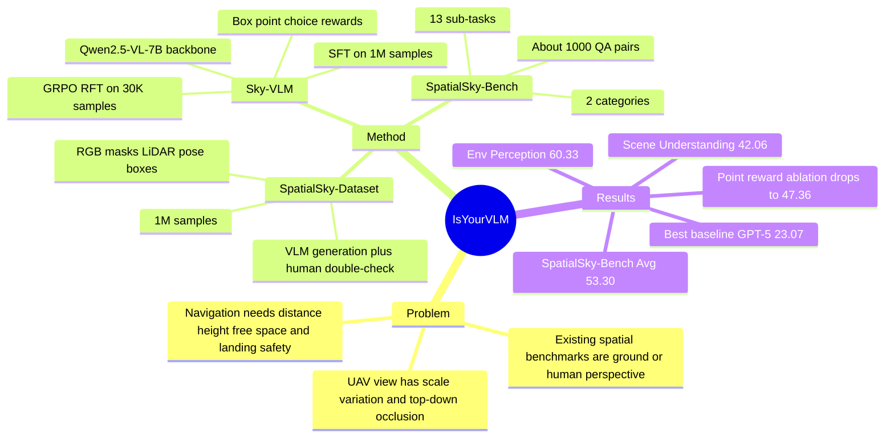

## Summary
SpatialSky-Bench 是一个面向 UAV navigation 的 VLM spatial intelligence benchmark，覆盖 Environmental Perception 与 Scene Understanding 两大类、13 个子任务。作者基于 UAVScenes 的 RGB / semantic mask / LiDAR depth / pose / bounding box 等多模态标注自动生成 1M SpatialSky-Dataset，并在 Qwen2.5-VL-7B 上用 SFT + GRPO RFT 训练 Sky-VLM；实验显示通用 VLM、闭源 VLM 和已有 spatial-specific VLM 在 UAV 视角下都明显不足，而专门训练的 Sky-VLM 在该 benchmark 上显著领先。

## Problem & Motivation
已知：现有 spatial intelligence benchmark 主要来自 human perspective，例如 indoor scenes、street scenes 或 handheld-camera images；论文认为这些 benchmark 无法覆盖 UAV 视角中的 object scale variation、top-down occlusion、depth ambiguity 和 complex ground understanding。UAV navigation 需要模型理解 fine-grained spatial relations、free space、height / distance、landing safety 等能力，否则 VLM 很难支撑实时飞行决策。

推测：这篇论文真正想证明的不是“换一个 backbone 就能解决 UAV spatial reasoning”，而是 UAV 视角本身构成了一个和地面视角不同的 evaluation distribution，需要专门的 benchmark 与数据引擎。对 GUI-agent / embodied agent 研究的间接价值在于：它把 coordinate output、free-space detection、object-function reasoning 和 safety judgement 放进同一个视觉-语言评测框架，可作为设计 screen / navigation spatial benchmark 的参照。

不知道：论文没有给出真实 UAV closed-loop navigation success rate，因此无法判断 Sky-VLM 的 QA benchmark 提升会在真实飞行控制中转化为多少任务成功率提升。

## Method
论文包含三个主要 artifact：SpatialSky-Bench、SpatialSky-Dataset 和 Sky-VLM。

**SpatialSky-Bench** 约包含 1,000 个 QA pairs，覆盖 22 个 object categories 和多种 scene types。作者从生成数据中做 stratified sampling，并移除训练集中与 benchmark 图像关联的其他 QA pairs，以降低 image-level data leakage。benchmark 分成 13 个子任务：

- Environmental Perception：bounding box localization、color recognition、distance estimation、height perception、pointing、reverse pointing、free space detection、spatial relationship understanding。
- Scene Understanding：single-image scene captioning、multi-image time-series captioning、object function reasoning、object counting、landing safety analysis。

**SpatialSky-Dataset** 使用 UAVScenes 的 20,000 images 与 mask-level class labels，并结合 semantic masks、LiDAR point clouds、UAV pose、bounding boxes 等输入生成任务标注。低层任务主要来自几何或 mask 规则：connected component 转 bounding box，HSV clustering 得到 dominant color，mask 内采样 point，centroid angle / distance 生成 spatial relation，LiDAR projection 估计 distance，pose transform 估计 height。高层任务使用 VLM 生成 caption、function reasoning 和 landing safety analysis，并在图示流程中加入 human expert double-check。

**Sky-VLM** 基于 Qwen2.5-VL-7B，采用两阶段训练。第一阶段在 1M SpatialSky-Dataset 上做 SFT，让模型学习 aerial visual representation、结构化输出格式（`<box>` / `<point>` / `<boxed>`）和 13 个任务的基础能力。第二阶段用 30K 样本做 GRPO-based RFT，重点优化 localization 与 structured output；reward 包括 point 的 L1 距离阈值（<=50 记 1）、multiple-choice exact match、bounding box IoU，并用 KL regularization 约束相对 reference model 的偏移。

## Key Results
**SpatialSky-Bench 总体结果**：Sky-VLM 在 SpatialSky-Bench 上达到 53.30 average score，明显高于最佳闭源 baseline GPT-5 的 23.07；闭源模型范围为 20.11-23.07，开源通用 VLM 范围为 13.93-18.65，已有 spatial-specific models 中 SpatialVLM / SpaceR / VILASR 分别为 19.02 / 12.61 / 13.45。

| Model | SpatialSky-Bench Avg. | Env. Per. Avg. | Sce. Und. Avg. |
|---|---:|---:|---:|
| Qwen2.5-VL-7B | 16.93 | 15.75 | 18.81 |
| Gemini-2.5-Pro | 22.75 | 20.61 | 26.17 |
| SpaceR | 12.78 | 13.75 | 10.84 |
| Sky-VLM-SFT | 48.29 | 52.53 | 41.52 |
| Sky-VLM-RL | 53.30 | 60.33 | 42.06 |

**子任务结果**：Table 1 中 Sky-VLM 在 SpatialSky-Bench 的 Box / Color / Distance / Height / Point / Reverse Point / Free Space / Spatial Relation / Single Caption / Multi Caption / Counting / Function / Landing 上分别为 42.68 / 79.00 / 84.00 / 79.00 / 30.72 / 60.00 / 43.20 / 64.00 / 27.34 / 23.83 / 52.00 / 45.72 / 61.40。这里要注意一个文本-表格不一致：正文声称 spatial relationship score 为 70.00，但 Table 1 给的是 64.00；本笔记采用表格数值并把它视为可能的论文排版或统计口径错误。

**Multi-stage training ablation**：在 SpatialSky-Bench 上，Sky-VLM-SFT 的 total average 为 48.29，加入 GRPO RFT 后变为 53.30；Environmental Perception 从 52.53 提升到 60.33，Scene Understanding 基本持平，从 41.52 到 42.06。这说明 RFT 的主要收益来自 localization / structured spatial perception，而不是 caption 或 high-level scene understanding。

**Reward ablation**：完整 Sky-VLM-RL 为 53.30；移除 Box Reward 后 total average 为 49.72，移除 Point Reward 后为 47.36，移除 Multi-Choice Reward 后为 50.27。Point Reward 的移除造成最大退化，说明像素级 coordinate supervision 是该 benchmark 上最关键的 RFT 信号。

**Data scaling**：Qwen2.5-VL-7B baseline 为 16.93；只用 300K SFT samples 时 score 到 30.43，完整 1M SFT samples 到 48.29。RFT 在不同数据规模上都继续提升：100K 时 Sky-VLM-RL 为 23.9 vs SFT 20.77，1M 时 Sky-VLM-RL 为 53.3 vs SFT 48.29。

## Strengths & Weaknesses
已知强项：问题设定很贴近 embodied spatial intelligence。13 个任务不是单纯 VQA，而是覆盖 box、point、free space、distance / height、counting、function、landing safety，和 UAV navigation 需要的感知-理解链条较一致。

已知强项：benchmark 不是只给 leaderboard。论文同时报告闭源 VLM、开源 VLM、spatial-specific VLM、Sky-VLM-SFT、Sky-VLM-RL，并有 multi-stage、reward、data scaling ablations；这些 ablation 能支持“RFT 主要改善精确定位任务”的结论。

已知局限：SpatialSky-Bench 只有约 1,000 QA pairs，且来自自动生成数据的 stratified sampling；虽然作者移除了同图像关联的训练 QA pairs，但 benchmark 和 training data 仍共享 UAVScenes 来源。它能测试 held-out image 上的同源泛化，但不是严格的跨数据集或真实飞行泛化。

已知局限：open-ended task 的评估混合 BLEU 和 GPT-4o judge，landing safety 也依赖 GPT-4o 自动评分。这样的评估可以扩展任务范围，但安全判断和 caption / function reasoning 的可信度不如 box、point、multiple-choice 等可直接计算的指标。

已知局限：论文没有真实 UAV deployment、closed-loop navigation、latency 或 safety intervention 实验；因此“Sky-VLM paving the way for UAV scenarios”只能理解为离线 spatial QA 能力提升，不能直接等同于可部署导航系统。

推测：这篇工作的最大价值在 benchmark + data engine，而不是 Sky-VLM 架构本身。Sky-VLM 只是 Qwen2.5-VL-7B + domain SFT + reward-shaped RFT，方法上相对直接；真正值得引用的是 UAV-view spatial capability taxonomy、自动标注 pipeline 和 baseline failure matrix。

不知道：human expert double-check 的规模、错误率、成本和一致性没有量化；也不知道在不同高度、天气、相机参数、真实动态障碍物和不同 UAV platform 上是否保持相同结论。

## Mind Map

## Notes
这篇可以作为 “UAV-view spatial intelligence benchmark” 的直接引用，尤其适合和 RoboSpatial、MMSI-Bench、VSI-Bench、RefSpatial-Bench 这类 human / robot / multi-image spatial benchmark 对照。它提醒我：spatial reasoning benchmark 的视角分布非常关键，同样是 VLM spatial capability，ground-view、egocentric、robot manipulation、UAV top-down 会触发完全不同的 failure mode。

对 GUI-agent 的启发是，benchmark 不应该只问模型“元素在哪里”，还应该组合出 free-space / safe-action / object-function / temporal caption 等任务族；但迁移要谨慎，因为 UAV 的几何尺度和 GUI screen 的语义结构不同。一个值得追问的 follow-up 是：如果把 SpatialSky 风格的 structured reward（box IoU、point-in-mask、choice exact match）迁移到 GUI grounding RFT，是否能比纯文本 outcome reward 更稳定地提升 screen-action precision？
