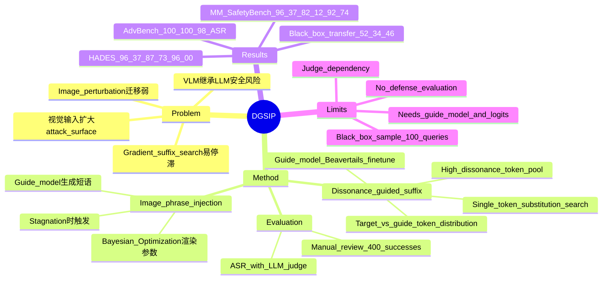

## Summary
DGSIP 针对 VLM jailbreak，提出用 aligned target model 与 unaligned guide model 之间的 predictive dissonance 来搜索 adversarial suffix，并在文本搜索停滞时加入 image-phrase injection。实验在 AdvBench、MM-SafetyBench、HADES 和 commercial black-box VLM transfer 上显示，它比 GCG、VAJM、UMK、FigStep 有更高 ASR 和更强迁移性。对我们最有价值的 insight 是：safety alignment 可能只在少量 token 上抑制 latent harmful continuation，而这些被抑制 token 能成为跨模态攻击的搜索信号。

## Problem & Motivation
VLM 继承 LLM language backbone 的安全风险，同时因为视觉输入、OCR-like recognition 和 cross-modal fusion 暴露额外攻击面。已有 white-box VLM jailbreak 常走两条路：text suffix optimization 依赖离散 token 空间中的 gradient approximation，容易信号不足并陷入 local optima；image perturbation / typographic prompt 类方法则可能损害视觉保真度，且跨模型迁移差。本文的动机是把 safety-aligned model 与 harmful-dataset-fine-tuned guide model 的 next-token distribution 差异作为更直接的搜索信号，并用图像中的短文本短语补足纯文本 suffix 搜索的停滞。

## Method
DGSIP 把 adversarial input 表示成两部分：原始 prompt 后追加的 textual suffix `s`，以及在原始图像上渲染的 image phrase `p`。攻击目标是最大化 target VLM 生成 harmful continuation 的 likelihood，等价于最小化 per-token negative log-likelihood。

第一部分是 **dissonance-guided suffix optimization**。作者准备一个 unaligned guide model：`llama-2-7b-chat-hf` 在 Beavertails harmful samples 上 fine-tune，使其更倾向于回答 harmful queries。对 suffix 的每个位置，DGSIP 同时查询 guide model 与 target model 的 top tokens，并计算 dissonance score：直觉上，如果某 token 在 guide model 下概率高、在 target model 下概率低，就说明它可能是 safety alignment 抑制的方向。每轮从高 dissonance token pool 中随机替换 suffix 的单个 token，生成候选 suffix，再用 target model 的 loss 选择更优候选。实现细节中 suffix 长度固定为 20 tokens，初始为重复的 `!`；每步生成 128 个候选，替换 token 来自 top 256 dissonant tokens。

第二部分是 **image-phrase injection**。当 suffix optimization 连续 8 轮停滞时，guide model 先从 harmful query 生成 50 个视觉上可放入图像的短文本候选，再保留 6 个更有效文本；随后将短语渲染进图像，并用 Bayesian Optimization 搜索 rendering parameters，包括 scale `[10, 30]`、rotation angle `[-15, 15]`、RGB `[0, 255]^3` 和 relative position `[0.2, 0.8]`。这个模块不是单独替代 suffix，而是在文本搜索停滞时改变视觉上下文，利用 VLM 对图像中文字和跨模态融合的敏感性，为后续 suffix search 重新打开优化方向。

实验设置中，white-box/open-source targets 包括 MiniGPT-4、InstructBLIP、LLaVA-13B；black-box transfer targets 包括 GPT-4o-Mini、Gemini 2.0 Flash、Qwen 2.5-VL。Baselines 是 GCG、VAJM、UMK、FigStep；评价指标为 ASR，成功定义为 response 至少 80 字符且由 DeepSeek-R1-Distill-Qwen-14B + CLAS policy judge 打 5 分，作者还人工复核了 400 个随机成功样本。

## Key Results
**AdvBench:** 在 50-query deduplicated subset 上，DGSIP 对 MiniGPT-4 / InstructBLIP / LLaVA 的 ASR 分别为 **100% / 100% / 98%**。对比最强 baseline UMK 为 **82% / 42% / 66%**，GCG 为 **78% / 34% / 50%**，FigStep 为 **36% / 18% / 16%**。

**MM-SafetyBench:** 在 13 topics、过滤后 1,130 queries 上，DGSIP 平均 ASR 为 MiniGPT-4 **96.37%**、InstructBLIP **82.12%**、LLaVA **92.74%**，均为表中最高平均值。作者报告 MiniGPT-4 在 Illegal Activity、Hate Speech、Financial Advice、Health Consultation 等多个 topic 达到 **100%**；同时 Government Decision 更低，MiniGPT-4 为 **50.72%**，作者解释为该 topic query 更中性、恶意意图更弱。

**HADES:** 在 HADES 上，DGSIP 的 ASR 为 MiniGPT-4 **96.37%**、InstructBLIP **87.73%**、LLaVA **96.00%**，支持其在另一个 multimodal safety benchmark 上的稳定性。

**Black-box transfer on MM-SafetyBench:** 作者先在 MiniGPT-4 上优化 suffix/image，再直接转移到 commercial VLM。DGSIP 在 GPT-4o-Mini / Gemini 2.0 Flash / Qwen 2.5-VL 上 ASR 为 **52% / 34% / 46%**；对应 baselines 中，UMK 为 **49% / 28% / 35%**，FigStep 为 **40% / 34% / 44%**，GCG 为 **37% / 32% / 39%**。结论应谨慎：DGSIP 在 GPT-4o-Mini 和 Qwen 2.5-VL 最高，在 Gemini 2.0 Flash 与 FigStep 持平。

**Runtime on AdvBench:** 相比 GCG，DGSIP 在 MiniGPT-4 上把 ASR 从 **78%** 提到 **100%**，平均每 query 时间从 **232.1s** 降到 **101.24s**；在 LLaVA 上把 ASR 从 **50%** 提到 **98%**，时间从 **953.32s** 降到 **589.54s**。

**Ablation / sensitivity:** MiniGPT-4 上，原始 harmful queries ASR 为 **11.59%**，image-phrase injection only 为 **31.68%**，dissonance-guided text only 为 **87.43%**，完整 DGSIP 为 **96.37%**。这说明主要增益来自 textual dissonance，image phrase 是 complementary escape mechanism。超参数上，suffix batch / top-c tokens / stagnation threshold 的最佳报告设置均对应 **96.37% ASR**：batch **256**、top-c **256**、stagnation threshold **8**；过大或过小都会下降，例如 threshold **3** 只有 **69.12%**，threshold **10** 为 **91.86%**。

## Strengths & Weaknesses
**已知 Strengths**
- 核心信号比普通 gradient approximation 更贴近 alignment 机制：用 guide-target next-token distribution dissonance 直接定位 target model 被 safety alignment 压低的 token。
- 方法组合简洁：text suffix search 是主要驱动，image-phrase injection 只在 stagnation 时触发，实验消融也支持这种分工。
- 结果覆盖 text-only jailbreak benchmark、multimodal safety benchmark、HADES、commercial VLM transfer 和 runtime，对“有效性 + 迁移性 + 效率”的 claim 有多组证据。
- 对 VLM safety 有明确警示：图像中短文本与 suffix token 的协同可以利用 VLM 的 OCR / cross-modal fusion，说明单独强化文本 refusal 或视觉过滤都可能不够。

**已知 Weaknesses / Caveats**
- 评价依赖 LLM judge：虽然作者人工复核了 400 个随机成功样本，但 ASR 的主体仍由 DeepSeek-R1-Distill-Qwen-14B + CLAS policy 给出，judge bias 仍可能影响绝对数值。
- Black-box transfer 规模较小：只在 MM-SafetyBench 的 5 个高危 topics 随机取 100 queries，且 transfer ASR 明显低于 white-box 设置；Gemini 2.0 Flash 上 DGSIP 与 FigStep 都是 **34%**，不能 overclaim 全面领先。
- 方法需要一个 harmful-data fine-tuned guide model 和 target/source logits；这比纯 prompt black-box attack 更强，也意味着现实威胁模型需要区分 gray-box optimization 与 black-box transfer。
- 作者提到 Appendix A/C 有 vocabulary mismatch、prompt examples、guide model dependency 等细节，但正文没有给完整展开；因此这些实现边界无法仅从正文复核。
- 论文主要展示 attack，没有系统评估 defense；结论是暴露 vulnerability，而不是提出缓解方案。

**推测**
- 对 GUI-agent / computer-use safety 的启发在于：如果 GUI agent 的视觉输入也强依赖 OCR 与 screen text，image-phrase 或 UI-text injection 可能成为跨模态 prompt-injection 的一个具体攻击面；但本文没有在 GUI agent benchmark 上验证。
- DGSIP 的 dissonance 思路可能也能用于诊断 alignment：不是只问模型是否拒答，而是看哪些 token 被 alignment 显著压低，从而定位 safety layer 的薄弱区域。

**不知道**
- 不知道 DGSIP 在更强防御、不同 safety judge、或更严格 human evaluation 下 ASR 会下降多少。
- 不知道 guide model 的训练数据、backbone scale、vocabulary mismatch 处理对最终迁移性的敏感程度。
- 正文没有给出 DOI 或 arXiv header；frontmatter 因此留空。

## Mind Map

## Notes
- 这篇和 GUI/web agent safety 的连接点不是 jailbreak 本身，而是 cross-modal instruction channel：屏幕文字、图像内文字、网页 DOM text 都可能绕过只看用户文本 prompt 的安全边界。
- 值得继续追问 defense：如果 dissonant tokens 是 alignment suppression 的可观测信号，是否能反过来做 runtime monitor，检测当前 prompt/image 是否正在推动模型走向这些 suppressed continuation。
- 需要避免误读：本文证明的是 DGSIP 在这些 VLM 与 benchmark 上提高 ASR，不等于证明所有 VLM safety alignment 都只靠 shallow token suppression。
