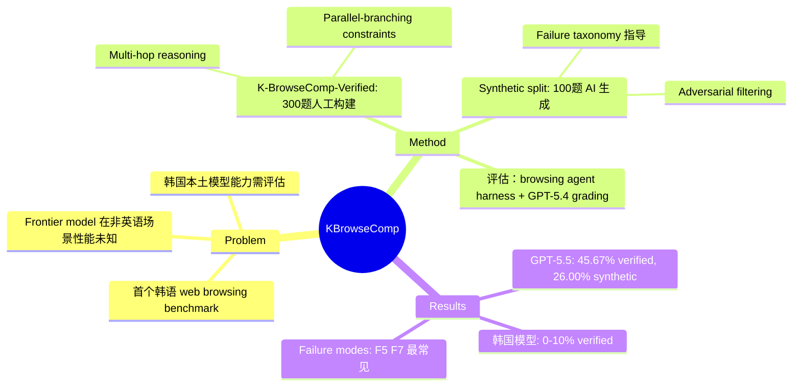

## Summary
首个韩语 web browsing agent benchmark，包含 400 道需要多跳推理或并行约束满足的问题，揭示了 frontier LLM 在韩语场景下的显著性能下降（GPT-5.5 仅 45.67%，韩国本土模型 0-10%），并提出了利用 failure taxonomy 合成对抗性测试集的方法。

## Problem & Motivation
当前 agentic benchmark 主要聚焦英语，非英语场景的评估严重缺失。Web browsing agent 需要在真实网络环境中完成信息检索、多步推理、约束满足等复杂任务，但现有 benchmark 如 BrowseComp 仅覆盖英语场景。韩语作为形态复杂的黏着语，具有独特的语言结构和文化语境，需要专门的 benchmark 来评估模型在韩语 web browsing 任务中的真实能力。

## Method
**数据构建**：
- **K-BrowseComp-Verified**（300 题）：由韩语母语者手工构建并验证。每道题需满足：(1) 基于韩语语境且有公开网页证据支持；(2) 难以直接搜索但易于验证；(3) 需要至少 4 步多跳推理（multi-hop）或 4 个并行约束（parallel-branching）
- **Synthetic split**（100 题）：利用 failure taxonomy（从人工构建过程中总结的 agent 失败模式）和 hard few-shot exemplars，让 AI agent 生成针对性的对抗样本。通过 adversarial filtering（用 GPT-5.4-mini 过滤掉易解题目）提升难度

**推理格式**：
- Multi-hop：需要用中间结果检索后续证据（如"找到演员 A 出演的电影 B，再找 B 的导演"）
- Parallel-branching：需要同时满足多个独立约束来唯一确定答案（如"找到同时满足条件 1、2、3、4 的唯一实体"）

**评估协议**：使用 browsing agent harness（含搜索、点击、导航等 action），答案由 GPT-5.4 自动评分，支持同义词和格式变体

## Key Results
**K-BrowseComp-Verified（300 题）**：
- 最强闭源模型：GPT-5.5 达到 45.67%，显著低于 BrowseComp 英语基准
- 其他 frontier 模型：GPT-5.4-mini 和 GLM-5.1 均为 30.67%，DeepSeek-V4-Pro 为 30.00%
- 开源模型：Gemma-4-31B-IT 达到 23.33%，Qwen3.6-35B-A3B 为 12.00%
- **韩国本土模型惨败**：K-EXAONE-236B-A23B 仅 10.33%，A.X-4.0 仅 5.33%，HyperCLOVAX-SEED-Think-32B 仅 2.33%

**Synthetic split（100 题，对抗性压力测试）**：
- 所有模型性能进一步下降：GPT-5.5 降至 26.00%，DeepSeek-V4-Pro 降至 22.00%，GLM-5.1 降至 19.00%
- 无模型超过 30%，验证了 failure-targeted generation 的有效性

**Failure mode 分析**：
- 最常见失败模式：search-result selection failure（F5）和 constraint-tracking failure（F7）
- 模型在处理韩语网页的半结构化信息（如表格、列表）和多约束交叉验证时表现尤其差

## Strengths & Weaknesses
**Strengths**：
- **填补重要空白**：首个系统性评估韩语 web browsing agent 能力的 benchmark，揭示了英语 benchmark 无法发现的语言特异性短板
- **高质量数据**：300 题人工验证 + 明确的构建规范（多跳/并行、时间稳定性、唯一答案），质量有保证
- **方法论创新**：提出利用 failure taxonomy 指导合成数据生成，实现了 "solving hard but creating harder" 的不对称性利用，synthetic split 确实比 verified split 更难
- **实用价值**：韩国政府投入大量资源开发本土 LLM（Proprietary AI Foundation Model program），本 benchmark 直接暴露了这些模型的严重不足（0-10%），对政策和研发有明确指导意义

**Weaknesses**：
- **规模有限**：300 verified + 100 synthetic，相比英语 BrowseComp 的规模偏小，覆盖面可能不足
- **合成数据的独立性存疑**：synthetic split 是用 frontier model 生成 + GPT-5.4-mini 过滤，存在 train-test leakage 风险（作者已意识到这点，单独报告不混入 main score）
- **语言 vs. 推理能力的解耦不足**：韩语模型的低分，多少是因为韩语能力不足，多少是因为 web browsing 推理能力不足？论文未做 ablation（如提供翻译后的英语版本对比）
- **真实世界适用性**：人工构建的题目可能偏向特定类型的 web 结构（如韩国热门网站），泛化性待验证
- **对已有工作的增量有限**：核心贡献是"把 BrowseComp 做了韩语版"，方法论创新（synthetic generation）在 related work 中已有大量先例，本文更多是 application

**研究价值**：对韩语 NLP 社区和多语言 agent 研究有价值，但对非韩语研究者吸引力有限。Synthetic generation 的思路可迁移，但 benchmark 本身的通用性受限。

## Mind Map

## Notes
- **韩国本土模型的惨败非常刺眼**：政府巨资投入的 K-EXAONE、HyperCLOVAX 在本国语言的 agent 任务上接近 0%，说明要么训练数据质量有问题，要么 post-training（instruction-following、tool-use）严重不足。这对韩国 AI 战略是个警钟
- **Synthetic generation 的价值**：用 failure taxonomy 指导生成确实能提升难度（synthetic 比 verified 更难），但这种方法的 generality 存疑——如果换个语言或 domain，failure mode 可能完全不同，需要重新总结 taxonomy
- **与我的研究方向相关性**：作为 web-agent benchmark 可参考，但韩语特定场景对我价值有限。更有意思的是 failure taxonomy 的构建和 adversarial filtering 的思路，可能用于其他 agent benchmark 设计
- **Prometheus-eval team**：从 GitHub repo 看，这是一个专注于 LLM evaluation 的团队，之前做过 Prometheus（LLM-as-judge）。本文延续了他们在 evaluation 方向的布局
