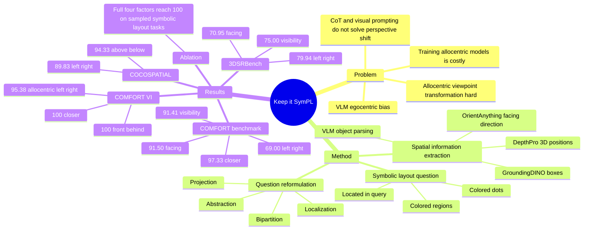

## Summary
SymPL 解决 VLM 在 allocentric spatial reasoning 中明显退化的问题：不训练新模型，而是把对象视角的空间问题重写成 VLM 更擅长的 symbolic-layout localization question。它通过 projection、abstraction、bipartition、localization 四个因子，在 COMFORT#、3DSRBench、COCOSPATIAL、COMFORT VI 和 COMFORT Multi 上取得一致提升；但方法依赖 GroundingDINO、DepthPro、OrientAnything 等外部 foundation models，失败主要来自这些感知/几何估计环节。

## Problem & Motivation
Perspective-aware spatial reasoning 需要模型从特定 viewpoint 理解对象关系；egocentric reasoning 从观察者/相机视角出发，而 allocentric reasoning 需要从场景中某个对象的视角出发。论文指出，现有 VLM 在 egocentric setting 中表现相对更好，但在 allocentric setting 中会因训练数据的 egocentric bias 而明显下降，这限制了 autonomous driving、robotic manipulation、navigation 等需要 multi-view 或 object-centered reasoning 的 embodied AI 场景。

已有方案有三类局限：从头训练 allocentric 模型需要稀缺数据和高计算成本；fine-tuning pretrained VLM 泛化差且可能 catastrophic forgetting；CoT、visual prompting、SoM、SCAFFOLD 这类 general reasoning aids 没有直接处理 viewpoint transformation。APC 将 allocentric query 转成 egocentric form，但作者认为这仍没有充分利用 VLM 对简单 symbolic layout / localization 的内在能力。

## Method
SymPL 的核心不是增强 VLM 参数，而是重写问题表示：先从原图和问题中抽取 3D spatial information，再把原始 spatial question 转换为 symbolic-layout question。

**Spatial Information Extraction.** 给定输入图像和文本 prompt，VLM 先提取 prompt 中出现的对象名，并识别 reference viewer 与 target objects；egocentric question 中默认把 camera 作为 reference viewer。随后用 GroundingDINO 检测对象 bounding boxes，用 DepthPro 估计 depth map，将每个 object box 内像素 unproject 到 3D，并用点云 median 得到对象 3D position。reference viewer 的 crop 会输入 OrientAnything，用于估计其 3D facing-direction vector；论文还提到会选择 depth density 最高区域作为 inliers，并在深度与 x/y scale 差异过大时做 correction。

**Question Reformulation.** 在重写前，VLM 预测需要推理的 spatial category，例如 left/right、closer、visibility、facing、above/below。之后按四个因子生成 symbolic layout：

1. **Projection**：选择与目标关系匹配的 orthogonal viewpoint。left/right、closer、visibility、facing 使用 top view；above/below 使用 front view。投影时把 reference viewer 的 facing direction 对齐到 2D 平面上方，并把 reference viewer 放在图像中心。
2. **Abstraction**：把原始对象替换成不同颜色的 featureless circles，减少背景和形状干扰；对象名也被重写成 color-shape symbol。
3. **Bipartition**：根据关系类型把 2D 空间分成两个区域。方向关系使用 linear partition，例如 left/right 用 vertical partition、visibility 用 horizontal partition；距离关系使用以目标位置或 facing axis 上某点为中心的 circular partition。
4. **Localization**：给两个 partition 区域填充不同颜色，把“哪个对象在左边/更近/可见”等关系问题改写为“哪个 dot 位于 yellow area”等 localization question。

实验中，SymPL 框架内部所有 reasoning 都使用 Qwen2.5-VL；它不是端到端训练出的新 VLM，而是一个 training-free 的 problem reformulation pipeline。

## Key Results
**Allocentric / COMFORT#.** 在 COMFORT# 上，SymPL 达到 left/right 69.00%、closer 97.33%、visibility 91.41%、facing 91.50%，在四个类别上都超过 Random、general-purpose VLMs、CoT/SoM/SCAFFOLD、egocentric spatial reasoning models 和 allocentric baselines。对比强基线，GPT-5 在 closer 为 84.25% 但 left/right 只有 49.83%、visibility 54.22%、facing 49.83%；Qwen2.5-VL + SCAFFOLD 的 left/right 为 52.17%，仍低于 SymPL 的 69.00%。

**Allocentric / 3DSRBench.** 在 3DSRBench 上，SymPL 的 left/right 为 79.94%、visibility 为 75.00%、facing 为 70.95%。其中 left/right 和 visibility 是表中最高；facing 排第二，低于 Gemini-2.5-Flash 的 72.25%。论文特别指出，多数 baseline 在 3DSRBench left/right 上比 random baseline 低超过 10%，说明 VLM 有明显 egocentric-view bias。

**Egocentric / COCOSPATIAL.** SymPL 也被用于 egocentric question，在 COCOSPATIAL 上达到 left/right 89.83%、above/below 94.33%，超过 Gemini-2.5-Flash 的 88.58% / 92.42% 和其他 baseline。APC-Num 与 APC-Vis 在该设置下降到 49.00% / 27.00% 与 49.92% / 54.17%，论文解释为它们偏向 allocentric conversion，容易把 camera viewpoint 误判成 allocentric viewpoint。

**Visual Illusions / COMFORT VI.** 在 size-induced visual illusion 数据集 COMFORT VI 上，SymPL 达到 allocentric left/right 95.38%、egocentric front/behind 100.00%、egocentric closer 100.00%。这支持作者的 claim：symbolic-layout question 对视觉错觉造成的尺度干扰更 robust。

**Multi-view Consistency / COMFORT Multi.** 在同一场景多视角图像的 viewpoint-aware consistency 评估中，SymPL 达到 left/right 76.00%、closer 96.50%、visibility 86.00%、facing 74.00%，四类均为最高。对比 Qwen2.5-VL，它的四类结果为 67.50%、70.50%、58.50%、57.50%；APC-Vis 为 53.00%、31.50%、61.50%、16.50%。

**Ablation.** Table 5 逐步加入四个因子，评估五个 general-purpose VLM 在每类 100 个样本上的 average success rate。无因子 Setting 1 为 left/right 46.60%、closer 63.80%、visibility 52.00%、facing 52.80%；加入 projection 后 left/right 升到 89.20%，但 visibility/facing 仍约 51%/52%；加入 projection + abstraction 后达到 96.40%、81.00%、90.80%、100.00%；完整 SymPL 在四类上均为 100.00%。Figure 5 还显示：匹配空间关系的 projection viewpoint 很关键；abstraction 优于原图 segmentation mask；有 partition 比无 partition 更好，但 partition 数量增加收益不明显；color regions 太多会显著降低 performance，因此二分区域更合适。

**Failure Analysis.** 作者在 3DSRBench 每类随机采样 100 个实例做 manual error breakdown，结论是最常见错误来自 reference viewer facing-direction vector 估计错误，其次包括 object detection error、3D position error 和 prompt 中 object name misidentification。论文称该分析中没有观察到 symbolic-layout question 上的 reasoning failure；这说明当前 pipeline 的主要瓶颈在外部 foundation models 的 spatial information extraction，而不在 VLM 对简化 layout 的 localization。

## Strengths & Weaknesses
**已知 Strengths.** 这篇论文的 taste 很清楚：它没有把问题推给更大模型或更多 finetuning data，而是把 allocentric reasoning 重写成更简单、可扩展、可解释的 symbolic layout task。四个因子都和 VLM 已知更擅长的能力有关：2D orthogonal projection、abstract symbol recognition、binary region partition、color-region localization；Table 5 支持这些因子叠加后确实协同提升。

**已知 Strengths.** Baseline 覆盖比较全面，包括 general-purpose VLMs、general reasoning aids、egocentric spatial reasoning models 和 allocentric methods。实验也不只停在合成 allocentric benchmark，还覆盖 real-world 3DSRBench、egocentric COCOSPATIAL、visual illusion 和 multi-view consistency；这让“问题重写”不是单一数据集 trick。

**已知 Weaknesses / Boundaries.** SymPL 强依赖外部组件：GroundingDINO 的 object detection、DepthPro 的 monocular depth、OrientAnything 的 orientation estimation，以及 VLM 对 object list / category 的解析。错误分析显示 facing-direction vector 是最常见失败来源，因此真实部署时如果 reference viewer 的朝向难以估计，SymPL 的上游会成为硬瓶颈。

**已知 Weaknesses / Boundaries.** 论文评估的 relation categories 仍然有限：COMFORT# 覆盖 left/right、closer、visibility、facing；3DSRBench 只取 left/right、visibility、facing；COCOSPATIAL 只取 left/right、above/below。SymPL 的 bipartition/localization 设计天然适合二选一或二分区域问题，论文没有证明它能直接覆盖更复杂的 compositional spatial QA、连续距离估计、长时序 navigation 或 action-conditioned embodied control。

**已知 Weaknesses / Boundaries.** COMFORT#、COMFORT VI 和 COMFORT Multi 都由 COMFORT# pipeline 构造，合成数据在控制变量上很有用，但不等价于开放真实场景。3DSRBench 提供 real-world evidence，但类别更少；论文没有单独报告 dynamic scenes、遮挡严重场景、机器人闭环任务或 GUI layout reasoning。

**推测.** SymPL 对 GUI agent 可能有启发，因为 GUI grounding 也常常可以被重写为 2D symbolic layout / colored-region localization；但论文完全没有评估 GUI、web 或 desktop 操作，所以这只能作为 representation-design insight，不能当作已验证迁移结果。对 embodied agent 而言，SymPL 更像一个 perception-to-reasoning adapter，而不是完整 policy 或 planner。

**不知道.** 论文没有给出 DOI，也没有提到 code URL；是否会 release implementation 不清楚。也不知道 SymPL 对外部 depth/orientation noise 的敏感性曲线、对多于两个 target objects 的复杂 query 的稳定性、以及在真实机器人 active perception 中能否通过移动相机主动改善 projection / orientation error。

## Mind Map

## Notes
这篇论文最有价值的 insight 是：allocentric spatial reasoning 的困难不一定要通过“更强推理链”解决，也可以通过把输入重写到模型已有能力的低熵区域来解决。它把 perspective transformation 从语言推理问题转成几何投影 + 符号布局问题，这一点比单纯加 CoT 更接近问题本质。

需要警惕的是，SymPL 的 success 依赖一个清晰可估计的 3D proxy world：对象能被检测，深度能大致恢复，reference viewer 朝向能估计，关系能落到二分空间。只要这些前提不成立，最终 VLM 再擅长 colored-dot localization 也无法补救上游错误。

后续可追的问题：能否把 SymPL 和 active perception 结合，让 agent 主动选择更好的 viewpoint 来降低 orientation / depth error？能否把 bipartition generalize 到 compositional regions，支持“先左再靠近/在 A 和 B 之间/绕过遮挡物”等更接近 navigation 与 GUI workflow 的空间约束？
