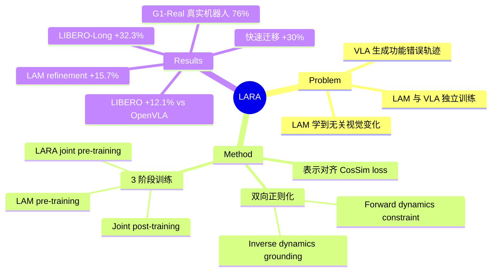

## Summary
提出 LARA，通过表示对齐联合优化 Latent Action Model (LAM) 和 VLA，让 LAM 从真实动作轨迹中学到控制相关的视觉变化，同时让 VLA 被 LAM 的 forward dynamics 约束以减少运动学可行但功能错误的轨迹幻觉。

## Problem & Motivation
VLA 模型性能受限于真实机器人动作数据稀缺。Latent Action Models (LAM) 试图从无标注视频中学习 latent action 表示来辅助 VLA 训练，但 LAM 和 VLA 通常独立训练，导致两个问题：(1) LAM 在 VLA 训练时未被真实动作 grounded，容易学到背景、光照等无关视觉变化；(2) VLA 被 frozen LAM 表示限制，可能生成运动学合理但功能无效的动作轨迹（kinematically plausible yet functionally incorrect）。

## Method
### 核心思想
LARA 将 flow-matching VLA 视为 encoder-decoder 结构 $E_\theta \circ D_\theta$，提取 DiT 中间层的 latent representation $h_t^\theta$，与 LAM 的 continuous latent action $z_t^\phi$（VQ 之前）进行表示对齐：

$$\mathcal{L}_{\text{LARA}}(\theta, \phi, \psi) = -\mathbb{E}_{A_t,\epsilon,\tau}\left[\text{CosSim}(z_t^\phi, f_\psi(h_t^\theta))\right]$$

其中 $f_\psi$ 是可学习的 projection head。完整目标函数：

$$\mathcal{L}(\theta, \phi, \psi) = \mathcal{L}_{\text{ACT}}(\theta) + w_1 \mathcal{L}_{\text{LARA}}(\theta, \phi, \psi) + w_2 \mathcal{L}_{\text{LAM}}(\phi)$$

### 双向正则化
- **Inverse Dynamics Regularization for LAM**: 对齐约束迫使 LAM 的 latent space 聚焦于控制相关的视觉变化，抑制光照、阴影等无关变化
- **Forward Dynamics Grounding for VLA**: LAM 的 forward-predictive latent actions 锚定 DiT 表示，避免生成"运动学幻觉轨迹"

### 模型设计
- **LAM**: ViT-based encoder-decoder，4-layer M-Former transformer，8 个 learnable query embeddings，128-entry VQ codebook
- **VLA**: 标准 cross-attention DiT backbone；vision-language features 来自 frozen Eagle-2 VLM + learnable adapters；embodiment-specific MLP encoders (GR00T-N1 架构)
- **对齐深度**: 应用于 DiT 的倒数第二层 (L−2)

### 训练流程（3 阶段）
1. **LAM Pre-training**: 在大规模无标注视频上用重建 loss 预训练
2. **LARA Joint Pre-Training**: 在机器人演示数据上用完整 LARA 目标联合训练 DiT 和 LAM
3. **LARA Joint Post-Training**: 在目标任务演示上 fine-tune

### 应用方式
- **Post-training Enhancement**: 作为 plug-and-play 模块应用于已有 pre-trained diffusion-based VLAs
- **Latent Action Refinement**: 用 LARA-pretrained LAM 为 LAPA、Moto-GPT 等框架提供改进的 pseudo-labels

## Key Results
### OXE-Constrained（仅在 Open-X-Embodiment 数据上预训练）
**LIBERO 平均成功率**:
- OpenVLA: 76.5%
- LAPA: 65.7%
- LARA (DiT-only): 84.4%
- **LARA (full): 88.6%** (+12.1% vs OpenVLA, +4.2% vs DiT-only)

在 LIBERO-Long (长时序任务) 上尤其显著：LARA 达到 86.0%，OpenVLA 仅 53.7%，提升 **+32.3%**。

**SIMPLER-ENV**:
- LARA 平均 65.2%，超过 Moto-GPT (61.4%) 和 OpenVLA (32.7%)
- Pick Coke Can: 82.3%，Object Movement: 83.7%

### Unconstrained（无预训练数据限制）
**LIBERO + SIMPLER-ENV**:
- GR00T-N1.6: 95.0% (LIBERO), 78.9% (SIMPLER)
- **GR00T-N1.6-LARA: 95.6%, 79.9%** (持续提升)

### 真实世界 G1-Real(50)（Unitree G1 humanoid）
- LARA (full): 74.0%
- GR00T-N1.6: 72.0%
- **GR00T-N1.6-LARA: 76.0%** (+4.0%)

Pick-n-Place 任务上，LARA (full) 比 DiT-only 提升 **+22.0%** (58% → 80%)。

### LAM Refinement（SIMPLER-ENV，Moto-GPT 框架）
用 LARA-LAM 替换原始 LAM，平均成功率从 42.8% 提升到 **49.5%** (+15.7%)，在 Close Drawer 任务上提升 **+15.7%**。

### 快速迁移
将 OXE-pretrained 模型迁移到新 embodiment (GR1, G1) 时，LARA 平均提升 **>30%**。

### Ablation
- **对齐深度**: 对于 GR00T-N1.6，layer L−2 最优；但不同架构最优深度不同（π0.5 中 final layer 最佳），通常在接近 action prediction head 的深层更有效
- **联合优化 vs Frozen LAM**: 联合优化显著优于 frozen LAM，证明双向信息流的重要性

## Strengths & Weaknesses
### Strengths
- **原理清晰**: 双向正则化机制有说服力——用真实动作 ground LAM 的 inverse dynamics，用 forward dynamics 约束 VLA，形成闭环
- **验证充分**: 覆盖 3 种应用场景（full training、post-training、LAM refinement）、4 个 benchmark、真实机器人实验，且在 OXE-Constrained 和 Unconstrained 两种设定下都一致有效
- **即插即用**: 可作为 plug-and-play 模块增强已有 diffusion-based VLAs（GR00T-N1.6-LARA），部署成本低
- **可解释性强**: 注意力图可视化清晰显示 LARA-LAM 聚焦 end-effector，而 baseline LAM 关注背景干扰物

### Weaknesses
- **实验规模受限**: 作者承认"由于计算限制"仅在 OXE 子集上实验，未进行 full-scale pre-training；与大规模预训练模型（如 UniVLA、π0-FAST）仍有 gap
- **架构依赖性**: 最优对齐深度因架构而异（GR00T-N1.6 用 L−2，π0.5 用 L），缺乏通用启发式规则；论文未详细讨论如何为新架构选择深度
- **LAM 设计固定**: LAM 使用 4-layer transformer + 128-entry VQ codebook，未探索不同 LAM 架构（如更深的 transformer、更大的 codebook、continuous latent without VQ）对对齐效果的影响
- **对比基线单一**: OXE-Constrained 设定下仅与 OpenVLA、LAPA、Moto-GPT 对比，缺少与其他 latent action-based 方法（如 LAPA 变体、其他 VQ-based policy）的细粒度对比
- **失败案例分析缺失**: 未报告 LARA 在哪些任务/场景下表现不佳，也未分析对齐失败的原因（如 LAM 表示崩塌、VLA 过度依赖 LAM）

### 影响与启发
- 为 VLA + world model 的端到端联合训练提供了范式参考，打破了"先训 LAM 再训 VLA"的割裂流程
- 双向正则化思想可推广到其他"辅助表示 + 下游任务"场景（如 video prediction + planning）
- 在数据稀缺场景下，leveraging unlabeled video 与 labeled robot data 联合训练的范式值得进一步探索

## Mind Map

## Notes
- **关键设计**: 对齐深度选择（L−2）和 projection head $f_\psi$ 的设计细节未在正文详述，可能在 appendix
- **与 LAPA/Moto-GPT 关系**: 这两者也用 LAM 提供 pseudo-labels，但用 frozen LAM；LARA 的贡献在于 joint optimization + bi-directional regularization
- **疑问**: 如果 LAM 的 VQ codebook 从 128 扩大到 512 或 1024，对齐效果会更好吗？还是会因为 latent space 过大导致对齐困难？
- **Future work**: 作者提到希望"extensive pre-training on all available open-source datasets"，可能在未来版本中补充完整规模实验
