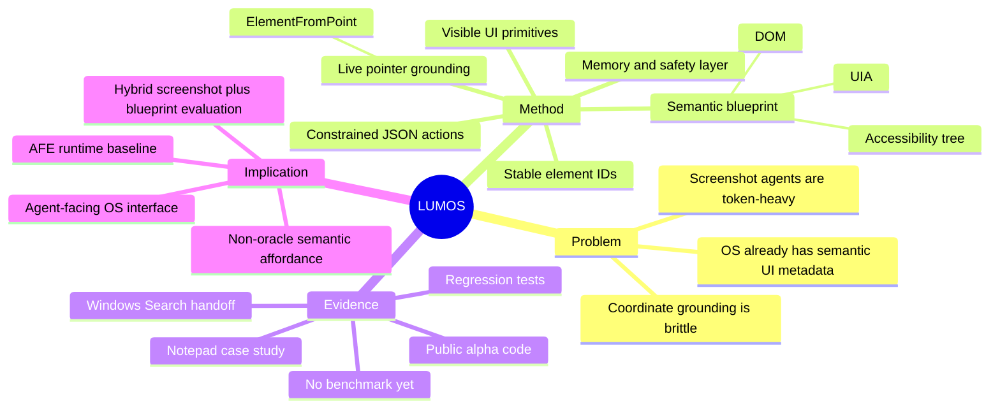

## Summary
LUMOS 提出在 human-facing GUI 之上增加一个 machine-readable semantic layer，把 Windows UI Automation、DOM 和 accessibility tree 转成 compact semantic blueprint，让 agent 用 element id、role、name、value、bounds 和 visible action primitive 操作界面。它有公开代码，但论文贡献主要是 architecture framing + prototype trace，不是正式 benchmark 结果。

## Problem & Motivation
当前 computer-use agent 通常把 GUI 观察压缩成 screenshot、OCR 或 VLM description，再让模型同时完成 visual parsing、UI semantics inference、coordinate grounding 和 action selection。这种设计的主要问题不是“看不见”，而是把 OS 已经知道的结构信息重新交给模型从像素里猜：token 成本高、坐标 grounding 脆、视觉装饰会干扰 action selection，且每一步失败很难归因。

作者的关键观察是，操作系统和浏览器早已为 screen reader、assistive technology 和 UI testing 暴露了 machine-readable UI structure。Windows UIA 可以给出 control type、accessible name、value、bounds、focus 和 supported pattern；浏览器可以给出 DOM / accessibility tree。LUMOS 的问题设定是：如果 agent 需要的是“这个区域是什么、能做什么、现在是什么状态”，为什么默认要从 screenshot 反推，而不是把这些 accessibility semantics 作为 agent-facing observation？

这个 framing 与本 notebook 里的 Agent-Facing Environment Runtime 很同向：环境不是直接泄露 task_success 或 gold action，而是把用户可见界面的结构化版本暴露给 agent。关键边界也很清楚：semantic blueprint 只能替代一部分视觉理解，不能覆盖 custom-rendered UI、canvas-heavy app、弱 accessibility metadata 或真实视觉内容判断。

## Method
LUMOS 的架构是一个 accessibility-grounded observe-plan-act loop，核心不是训练新模型，而是改造 agent 和 OS / browser 之间的接口：

1. **Semantic blueprint**：native desktop 侧从 Windows UIA 抽取前台窗口和控件树，web 侧从 browser accessibility tree / DOM 抽取页面结构。每个元素被映射成 `A*` 或 `W*` id，并记录 role、name、value、bounds、window title、URL、focus context 和 action affordance。
2. **Live semantic pointer grounding**：通过 `ElementFromPoint` 风格的 UIA query，把屏幕坐标直接映射到 cursor 下方的 UI element，返回 role、name、value、bounds 等语义，而不是截取 cursor 周围图像再 OCR / VLM 推断。
3. **Single-step planner**：LLM 接收 user goal、current blueprint、recent memory 和 hints，每轮只输出一个 constrained JSON action。这个 one-step discipline 逼迫系统 action 后重新 observe，避免模型一次性 hallucinate 长脚本。
4. **Universal visible actions**：action schema 是 app-neutral 的，包括 `observe`、`open_windows_search`、`open_app`、`open_url`、`click`、`double_click`、`drag`、`type_text`、`set_text`、`press_key`、`finish` 等。作者强调不要写 `gmail_script.py`、`volume_task.py` 这类 task-specific workflow。
5. **Memory / repair / safety**：系统记录最近 action、失败、已输入文本和 last web URL，用来修复重复 launch、literal instruction copying、append instead of replace、Windows Search handoff 错位等问题。Safety layer 用 allowlist / confirmation policy 约束 send、delete、save、login、system setting、slider drag 等风险动作。

一个重要张力在于：论文哲学上强调“Python should only know how to see and act”，但代码中也有 `goal_inference.py` 和若干 fast paths。仓库说明把它们标成 `LUMOS_FAST_PATHS=1` 的 opt-in demo scaffold，默认关闭。也就是说，最纯粹的研究假设是 semantic blueprint + LLM planning；工程上为了小模型和慢机器 demo 加了一些 schema repair / handoff repair / optional shortcut。

## Key Results
这篇论文没有正式 benchmark result。作者给的是 prototype、case study、debug trace 和 evaluation plan：

- **Notepad case study**：从前台 Notepad 抽到 32 个 native elements，其中 text-entry target 是 `A2`；LLM 后续通过 `type_text` / `set_text` 作用在该 id 上。这个 demo 证明了 blueprint-id-action 这条链路能跑通，但任务复杂度很低。
- **Generated-text repair**：debug trace 显示早期 agent 会把“写一篇关于 AI 的短文”这类指令原样复制、反复追加或缺少结束动作。LUMOS 用 generated-text detection、`set_text` replacement 和 explicit `finish` 修复这些常见 failure。
- **Windows Search handoff**：当模型输出 `open_windows_search` 并携带 `text: "outlook"` 时，runtime 会保存 pending query，下一步确保先把 `outlook` 打进 Search overlay 并提交，避免 stale web field 截获输入。论文明确说这不是 Outlook email workflow 已解决，只是 launch handoff。
- **Regression tests**：论文列出的覆盖点包括 action schema coercion、generated-text handling、text replacement、Windows Search handoff、safety checks、blueprint refresh。仓库中确实有对应测试文件。
- **Evaluation plan**：作者建议比较 screenshot+OCR+LLM vs blueprint+LLM 的 success/latency/token；比较 screenshot/OCR/vision description vs blueprint 的 observation size；比较 cursor crop vs UIA `ElementFromPoint` 的 latency/accuracy；再在 Notepad、Settings、browser、File Explorer、mail client 上做 multi-step desktop tasks。

**代码复核**：有代码。仓库 `thotayogeswarreddy/Lumos` 是 public GitHub repo，当前可克隆，包含 `lumos-osai` Python package、`osai` CLI、31 个 `osai/*.py` 源文件、31 个 `tests/*.py` 测试文件，源码加测试约 11.6k LOC。关键模块包括 `blueprint_native.py`、`blueprint_web.py`、`uia_query.py`、`agent_loop.py`、`universal_actions.py`、`safety.py`、`web_session_manager.py`。但 repo 没有 GitHub release，README 的 PyPI 安装写法带有“After you publish to PyPI”的语气，所以更稳妥的判断是：有可检查的 alpha prototype 代码，不是成熟可复现实验包。我在 macOS 环境下做了 `compileall` 静态解析，通过；完整 `pytest` 未执行，因为当前 Python 环境缺 `pytest`，且 native UIA 端到端需要 Windows 11。

## Strengths & Weaknesses
**亮点**：LUMOS 的核心价值是把 accessibility API 从“辅助功能接口”重新解释成 AI-native semantic interface 的第一版。相比 screenshot-only GUI agent，它把 perception 和 planning 拆开：OS/browser 负责提供 structured state，LLM 负责选择 action；相比 backend API automation，它仍然坚持 visible UI actions，用户更容易审计 agent 做了什么。

这个 framing 对 AFE 尤其有用，因为它给出了一个 non-oracle observation 原则：可以暴露“用户可见 UI 的结构化版本”，但不要暴露 hidden task state 或后台万能 API。`role/name/value/bounds/action affordance` 比 screenshot 更像 runtime contract，也比 prompt instruction 更可验证。

**局限**：证据很弱。论文是短技术稿，没有 OSWorld / WindowsWorld / WebArena 上的 quantitative comparison，也没有对 OmniParser、UI-TARS、Agent-S2 等 strong baseline 的端到端对比。当前 strongest evidence 是 Notepad、Windows Search 和 regression tests，距离真实 long-horizon desktop workflow 仍很远。

更深的边界在 accessibility metadata 本身：custom-rendered UI、Canvas、Electron app、重复控件名、动态 DOM、权限弹窗、弱 ARIA 标注都会让 blueprint 不可靠。即使 semantic id 存在，动态 UI 变化后 id map 仍可能 stale；bounds 只是把 element 连接到坐标，不等于 action 一定成功；UIA 的 value / role 也不能直接证明 task completion。

**对本 notebook 的影响**：LUMOS 可以作为 AFE-MiniSuite 的 engineering baseline，但不能作为已经被证明的 solution。真正值得做的实验不是再写一个 GUI agent，而是比较三种 observation contract：screenshot-only、semantic-blueprint-only、hybrid screenshot+blueprint。关键指标不应只看 token 和 latency，还要看 failure attribution：失败来自 accessibility metadata 缺失、planner 误判、action stale、还是 feedback/verification 不足。

## Mind Map

## Notes
- **代码结论**：有代码，链接就是 frontmatter 的 GitHub repo。它不是空壳，包含 CLI、native/web blueprint extraction、LLM planner bridge、visible action executor、safety checks 和 tests；但没有 release，native 部分需要 Windows，当前没有论文级 benchmark reproduction。
- 和 [[Papers/2606-OpenRath]] 的 Session-as-first-class-value 互补：OpenRath 处理 agent runtime state 的可组合表达，LUMOS 处理 OS/UI semantic state 的可观察表达。
- 和 [[Papers/2604-WindowsWorld]] / [[Papers/2606-OSWorld2]] 的真实桌面瓶颈直接相关，但 LUMOS 目前还没证明能在这些 benchmark 上跑通。
- AFE 设计时可以把 LUMOS 的“visible action over semantic blueprint”作为 non-oracle 原则：暴露用户可见 UI 的结构化版本，而不是给 agent 后台万能 API。
- 后续若要借鉴，最小实验可以是：在一个小型 desktop/web suite 里同时提供 screenshot observation 与 semantic blueprint observation，固定同一个 planner，比较 success、step count、token、latency、stale action、accessibility-missing failure。这个比单纯把 UIA 接进 agent 更有研究价值。
