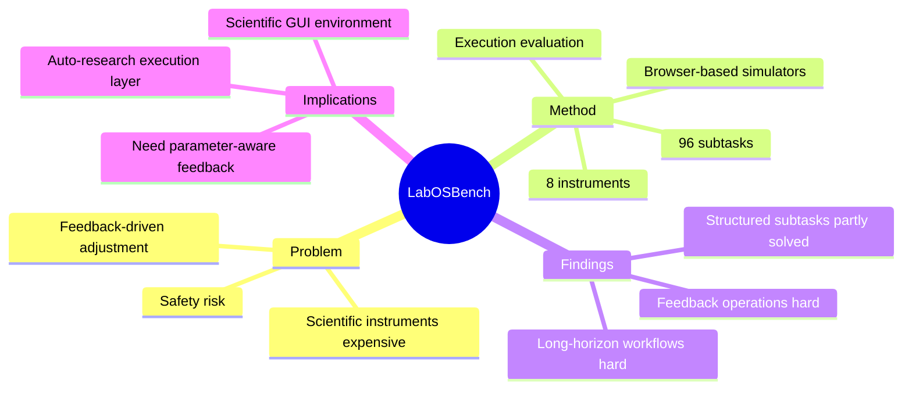

## Summary

> [未获取全文，仅基于 arXiv abstract]

LabOSBench 将 computer-use agent 评估推进到 scientific instrument control：用 web-based scientific-instrument simulators 构造 8 类仪器、96 个 subtasks，从样品加载、alignment、参数调节、数据采集到结果检查。它揭示现有 GUI agents 能完成很多结构化子任务，但在 feedback-driven parameter adjustment 和 long-horizon workflow 上仍明显吃力。

## Problem & Motivation

> [未获取全文，仅基于 arXiv abstract]

当前 CUA benchmark 主要聚焦软件操作，例如浏览器、OS、文件和 SaaS。科学仪器控制的难点不同：界面复杂、参数具有物理含义、反馈需要迭代解释，错误操作可能导致高成本甚至安全风险。直接在真实高精度仪器上评估不可行，因为成本、安全、可访问性和可复现性都很差。

LabOSBench 的 motivation 是构造一个低成本但保留核心操作挑战的模拟 testbed，让 agent 能在浏览器里控制仪器模拟器，同时用 execution-based evaluation 检查结果。

## Method

> [未获取全文，仅基于 arXiv abstract]

LabOSBench 使用一组 web-based scientific-instrument simulators，而不是重型 OS virtualization。Agent 直接通过 browser 操作界面，完成从 sample loading 到 result inspection 的流程。

任务设计覆盖 8 个 instrument simulators、96 个 subtasks，并同时评估：

- general-purpose VLMs；
- specialized GUI agent models；
- advanced agentic frameworks；
- subtask-level 和 end-to-end-level performance。

这个设计把 GUI agent 的 difficulty 从“找到按钮并点击”扩展到“基于反馈调参数并推进实验流程”。这和 [[Papers/2605-WorkspaceBench]] 的 workspace complexity 有相似之处，但 LabOSBench 更偏科学实验过程和仪器状态。

## Key Results

> [未获取全文，仅基于 arXiv abstract]

- 构建 8 个 instrument simulators 和 96 个 subtasks。
- 现有 agents 可以完成许多 structured GUI subtasks。
- 主要失败集中在 feedback-driven operations 和 long-horizon workflow execution。

abstract 未给出具体 success rate，因此这里不补造数值。

## Strengths & Weaknesses

**Strengths**:

- **应用场景有价值**：scientific instrument control 是 auto-research / AI scientist 的真实执行层，不只是办公自动化。
- **浏览器化 testbed 降低门槛**：不依赖完整 VM，可以更轻量地扩展和复现。
- **反馈驱动任务切中关键**：很多 GUI benchmark 测点击流程，LabOSBench 测参数调节和结果解释，更接近科学实验。

**Weaknesses**:

- **simulator fidelity 未知**：abstract 未说明仪器模拟器是否保留真实噪声、延迟、错误状态和校准过程。
- **安全边界仍是模拟的**：真实仪器的不可逆损坏、样品污染和物理危险难以完全反映。
- **缺少数字细节**：仅凭 abstract 难以判断 benchmark 难度和不同 agent failure taxonomy。

**Impact**:

LabOSBench 对 auto-research 很关键：如果 AI scientist 要从读论文走向做实验，GUI agent 不只要控制 browser/SaaS，还要能处理具有物理反馈和专业参数语义的仪器界面。

## Mind Map

## Notes

- 与 [[Papers/2606-AgentsLastExam]] 的 professional software 方向相互印证：frontier agent evaluation 正从一般 web/OS 走向专业工作流。
- 可作为未来 “scientific agent-friendly runtime” 的证据：环境需要提供可验证的实验状态、参数合法域、恢复操作和异常解释。
