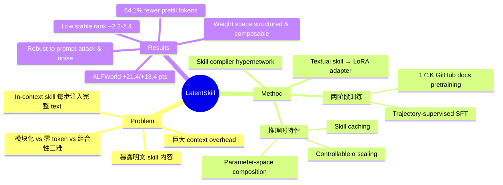

## Summary
将 agent 的文本 skill 编译为 LoRA adapter，从 context space 迁移到 weight space，实现零 skill-token overhead 的可插拔 skill 表示，在 ALFWorld 和 Search-QA 上大幅超越 in-context skill baseline。

## Problem & Motivation
LLM agent 使用文本 skill 来封装可复用的任务流程，但每次决策都要在 prompt 中注入完整 skill text，造成巨大的 context overhead 且暴露明文 skill 内容。现有方案面临三难困境：避免重复 skill token、保持模块化更新、支持运行时组合——难以三者兼得。

## Method
**核心思路**：通过预训练的 hypernetwork（skill compiler）将 skill document 一次性编译为 LoRA adapter，将 skill 表示从 prompt space 转移到 weight space。推理时只需加载 adapter，无需在 context 中包含 skill text。

**架构**：skill compiler $G_\phi$ 接受 skill document $s$ 作为输入，单次前向生成 LoRA 参数 $\Delta_s$。adapted model 直接从 task history 预测 action，不依赖 skill text。更新形式遵循标准 LoRA：$W' = W + \frac{\alpha}{r} \cdot B_s \cdot A_s$，其中 $\alpha$ 控制注入强度，$r$ 为 LoRA rank。

**两阶段训练**：
1. **Skill Document Pretraining**：在 ~171K GitHub skill documents (~300M tokens) 上预训练 compiler。两个预训练任务：
   - Reconstruction：adapted backbone 重建完整 skill document
   - Completion：给定 truncated prefix，backbone 补全 document
   
   只更新 compiler 参数 $\phi$，backbone 保持冻结。

2. **Trajectory-Supervised Fine-Tuning**：用 teacher trajectories（237 ALFWorld + 500 Search-QA）微调 compiler。每个 skill document 生成单个 adapter，在该 trajectory 所有决策步共享，迫使 adapter 捕获 skill-level、trajectory-consistent 的策略信息。

**推理时特性**：
- **Skill caching**：skill 编译一次后存入 adapter cache
- **Controllable injection**：系数 $\alpha$ 可连续调节 skill 强度
- **Composition**：多个 skill LoRA 可通过参数空间算术组合：$\Delta_K = \sum \alpha_k \cdot C[k]$
- **Component-level composition**：将 skill 分解为语义组件后选择性合并，避免重复计算共享组件

**关键创新**：
1. 将 skill 从 prompt space 迁移到 weight space，消除 per-step skill token 同时保留 plug-and-play 模块性
2. 生成的 LoRA weight space 具有三个关键性质：
   - **Structured**：不同 domain 的 skill 在 weight space 形成可分离的 cluster（inter-cluster distance 0.0887，within-domain similarity 0.982 vs cross-domain 0.910）
   - **Controllable**：性能随 $\alpha$ 呈倒 U 曲线，允许精确调节
   - **Composable**：语义对齐的 skill 组件可通过算术运算组合
3. Ablation 显示 skill knowledge 集中在 attn_o 和 mlp_down 位置——仅使用这 2/7 位置即可保留 93.3% 性能

## Key Results
**实验设置**：
- Backbone：Qwen3-8B（冻结）
- Benchmark：
  - ALFWorld：文本家庭任务，6 类任务，seen (140 episodes) 和 unseen (134 episodes) splits
  - Search-QA：7 个数据集（3 single-hop + 4 multi-hop），每个 ~500 examples
- Skills：5 个 ALFWorld skills + 3 个 Search-QA skills（来自 SkillRL library）

**主要性能**：
| Benchmark | LatentSkill | In-Context Skill | 提升 |
|-----------|------------|------------------|------|
| ALFWorld seen avg | 74.3% | 52.9% | +21.4 pts |
| ALFWorld unseen avg | 69.4% | 56.0% | +13.4 pts |
| Search-QA avg EM | 35.6% | 32.6% | +3.0 pts |

**Token 效率**：
- ALFWorld：相比 In-Context Skill 减少 64.1% prefill tokens
- Search-QA：降低 72.2% skill-token overhead
- Trajectory 长度也显著缩短（seen split：28.4 vs 35.0 steps）

**可控性分析**：
- 性能在 α=0.6（seen split，74.29%）和 α=0.5（unseen，70.90%）达到峰值
- 过度 scaling（α=1.2）显著损害性能（seen 22.86%，unseen 8.21%）
- Backbone baseline 较弱的任务通常需要更高的最优 α

**组合性分析**：
Component Merging 在 Look task 达到 84.6% seen / 77.8% unseen，而 Direct Merging（69.2%/61.1%）和 Text Merging（61.5%/61.1%）均未改善性能。Direct Merging 重复计算共享组件；Text Merging 产生 OOD 输入。

**鲁棒性**：
- Prompt-level attack（Hijack）下，In-Context Skill 从 52.9% 跌至 8.57%，LatentSkill 保持 38.6%
- Skill text perturbation（paraphrase、plaintext、reorder、noise）下，LatentSkill 稳定保持 17-24 points 优势

**Low-Rank 结构分析**：
生成的 LoRA weights 呈现极低 stable rank（~2.2-2.4 vs random init 的 ~838）。Top 2 singular directions 捕获 ~67% 能量，top 5 捕获 ~93%。SFT 进一步压缩结构，stable rank 均匀降低 ~0.17。

## Strengths & Weaknesses
**Strengths**：
- **技术优雅**：从 prompt space 到 weight space 的迁移是一个简洁且有效的 idea，通过 hypernetwork 一次性编译 skill 避免了 per-step token overhead
- **实证充分**：在 controllability、composability、robustness 三个维度都给出了详细分析，weight space 的 low-rank structure 和 semantic geometry 是有趣的发现
- **工程实用**：skill caching + controllable injection 为实际部署提供了灵活性

**Weaknesses**：
- **评估受限**：只在两个 benchmark（ALFWorld、Search-QA）+ 单个 backbone（Qwen3-8B）上评估。推广到更复杂的 agent 场景（web browsing、software engineering、multi-agent）和不同模型家族/规模存疑
- **Skill 来源单一**：所有 skill 来自 SkillRL library，未探索多样化的 skill 表达方式对 compiler 的影响。Component-level composition 的 "semantic alignment" 假设在实际多样化 skill 中是否成立？
- **训练成本未量化**：两阶段训练（~171K documents pretraining + trajectory SFT）的计算成本和数据要求未明确，对于新 domain 的迁移成本不清楚
- **与 retrieval-based skill 缺乏对比**：RAG baseline 未专门针对 skill retrieval 优化，缺少与 skill-specific retrieval 的直接比较

**潜在影响**：
为 agent skill 表示提供了新范式，但 weight space 的 interpretability 损失和 training overhead 需要在实际系统中权衡。对于 skill 更新频繁或 skill 需要解释的场景，in-context 方式可能仍有优势。

## Mind Map

## Notes
- Hypernetwork 直接生成 LoRA 参数的做法与 HyperNetwork 的经典应用一致，但在 agent skill 场景下的有效性是新发现。Weight space 的 low-rank structure（stable rank ~2.2）暗示 skill knowledge 可能本质上就是低秩的？
- Component-level composition 依赖 "semantic alignment" 假设——不同 skill 的共享组件在 weight space 中位置对齐。这个假设在训练时如何保证？是否需要显式约束或只是 pretraining + SFT 的副产品？
- Ablation 显示 attn_o 和 mlp_down 位置占据主导。这是否意味着 skill 主要影响模型的 "output projection" 和 "down projection"，而非 attention pattern 本身？值得与 LoRA 在其他任务（language modeling、instruction tuning）中的位置偏好对比。

