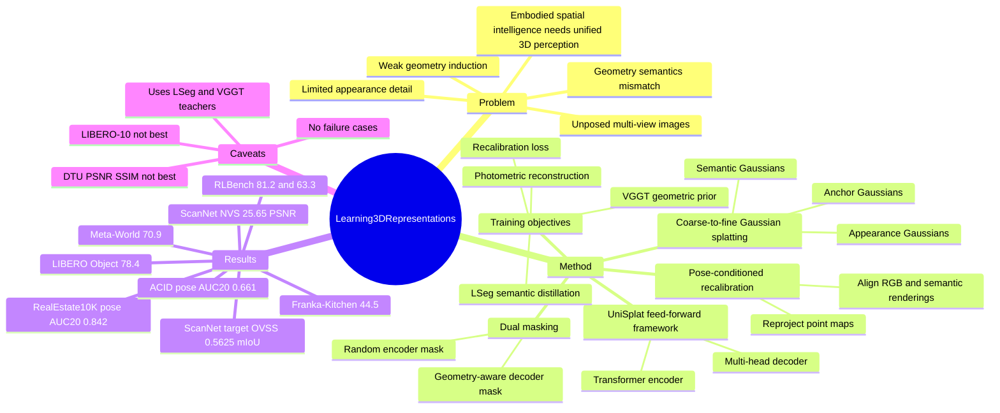

## Summary

UniSplat 是一个从 unposed multi-view images 学习 unified 3D representation 的 feed-forward framework，把 geometry、appearance、semantics 和 camera estimation 放进同一个训练目标。核心方法是 dual masking 做 geometry induction、coarse-to-fine Gaussian splatting 做 appearance/semantic refinement、pose-conditioned recalibration 做 geometry-semantic consistency；实验显示它在 ScanNet 3D vision tasks 和多组 embodied AI control benchmark 上优于多类视觉表征 baseline。

## Problem & Motivation

已知：spatial intelligence 需要能同时表达 spatial layout、visual detail 和 semantic context 的 3D representation，尤其对 embodied agents 的 navigation、manipulation 和 planning 有基础作用。现有 supervised feed-forward reconstruction 方法通常依赖 ground-truth geometry、camera calibration 或 posed training signals，并且常把 geometry、appearance、semantics 分开处理。现有 self-supervised 3D representation learning 虽然减少了 3D annotation 需求，但论文指出它们仍常见三个问题：geometry induction 弱、appearance detail 有限、geometry 和 semantics 不一致。

作者的问题定义是：能否在不输入 camera pose 的情况下，直接从 sparse unposed multi-view images 学到可迁移到 3D scene understanding 和 embodied AI 的 unified 3D representation。这个问题对 embodied research 有意义，因为真实机器人或 egocentric agent 往往不能假设已有可靠 SfM / calibrated camera / dense posed video。

## Method

**Framework.** UniSplat 输入一组 unposed multi-view images，主体是 transformer encoder 加 multi-head decoder。decoder 产生 camera、3D point map、Gaussian appearance、Gaussian semantics 等多头输出，并通过训练目标把它们约束到同一个空间框架中。

**Dual masking strategy.** 第一阶段对 encoder image patch tokens 做 2D random masking，同时加入 learnable camera tokens 和 Gaussian latent tokens。第二阶段先用 coarse camera head 和 coarse Gaussian head 生成 preliminary geometric Gaussian field，再通过 alpha blending 得到 geometric importance map；decoder masking 不再随机，而是偏向 geometry-rich patches。已知：这个设计要求 decoder 从结构性缺失的局部证据中恢复全局 3D structure，而不是只做 texture completion。

**Coarse-to-fine Gaussian splatting.** UniSplat 把 Gaussian 表示分成 anchor Gaussian、semantic Gaussian、appearance Gaussian 三层。Anchor Gaussian 预测 center、geometric feature 和 semantic feature；每个 anchor 派生多个 semantic Gaussians；每个 semantic Gaussian 再扩散出更密的 fine-grained appearance Gaussians。作者的理由是 semantic field 天然较粗，而 appearance field 需要密集 primitives 捕捉 texture 和 lighting，因此 coarse-to-fine hierarchy 用来缓解 semantic granularity 和 appearance detail 之间的 mismatch。

**Pose-conditioned recalibration.** 模型同时产生 3D Gaussian fields 和 3D point maps。recalibration 机制使用 predicted camera parameters 把 point maps 和 semantic point maps reproject 到 2D image plane，再与 Gaussian-rendered RGB image 和 semantic map 对齐。对应 loss 包括 geometric recalibration loss 和 semantic recalibration loss；它的目的不是增加一个独立 task head，而是让 geometry、appearance、semantics 的预测互相校准。

**Training objectives.** 总 loss 为 `Lrgb + Lsem + Lgeo + Lrecalib`。`Lrgb` 用 L1 + LPIPS 做 photometric reconstruction；`Lsem` 从 frozen 2D VLM image encoder LSeg 蒸馏 open-vocabulary semantic features；`Lgeo` 从 frozen VGGT teacher 蒸馏 camera parameters 和 point maps；`Lrecalib` 做上述 pose-conditioned cross-head consistency。实现上，UniSplat 使用 ViT-L backbone，ScanNet/ScanNet++ pretraining，输入分辨率 256 x 256，AdamW，base LR 1e-4，300 epochs，8 x NVIDIA A100；encoder/decoder masking ratios 都设为 0.5，coarse Gaussian tokens 数量为 256，每个 anchor Gaussian 生成 10 个 derived Gaussians。

## Key Results

**ScanNet 3D vision tasks.** 在 40 个 unseen ScanNet scenes 上，UniSplat 的 source-view OVSS 达到 0.5563 mIoU / 0.8277 mAcc，高于 LSM 的 0.5034 / 0.7740；target-view OVSS 达到 0.5625 mIoU / 0.8334 mAcc，高于 LSM 的 0.5078 / 0.7686。Novel View Synthesis target views 上，UniSplat 为 25.65 PSNR / 0.8782 SSIM / 0.1353 LPIPS，高于 LSM 的 24.39 / 0.8072 / 0.2506，也高于 pixelSplat 的 24.89 / 0.8392 / 0.1641。Depth Estimation source views 上，UniSplat 为 rel 3.10、inlier ratio 69.13，高于 LSM 的 rel 3.38、inlier ratio 67.77。

**Relative pose estimation.** 在 RealEstate10K 上，UniSplat AUC@5/10/20 为 0.607 / 0.748 / 0.842，高于 NoPoSplat 的 0.568 / 0.737 / 0.839、DUSt3R 的 0.329 / 0.537 / 0.691、MASt3R 的 0.351 / 0.557 / 0.701。ACID 上，UniSplat AUC@5/10/20 为 0.354 / 0.516 / 0.661，也高于 NoPoSplat 的 0.342 / 0.504 / 0.653。

**Cross-dataset generalization.** 训练在 RealEstate10K、测试在 ACID 和 DTU 时，UniSplat 在 ACID 达到 25.983 PSNR / 0.786 SSIM / 0.188 LPIPS，是表中最高。DTU 上它的 LPIPS 为 0.269，是表中最低；但 PSNR / SSIM 为 16.852 / 0.587，低于 NoPoSplat 的 17.899 / 0.629，因此不能简单概括为 DTU 所有指标都最高。

**Embodied AI transfer.** UniSplat 使用 frozen ViT encoder 作为 visual feature extractor，在 VC-1 相关任务上 AD 61.7±4.3、MW 94.3±3.1、DMC 75.8±4.5、TF 75.6±1.7，均为表中最高。在 RLBench 上，Group 1 / Group 2 为 81.2 / 63.3，高于 SPA 的 80.5 / 61.2；Meta-World 为 70.9±1.3，高于 SPA 的 69.2±1.7。在 LIBERO 上，Object 78.4±6.1、Spatial 59.7±5.8、Goal 67.3±2.3、90 34.7±2.7 为表中最高；但 LIBERO-10 为 42.4±3.5，低于 EVA 的 43.3±2.8。Franka-Kitchen 上，UniSplat 为 44.5±2.6，高于 MAE 的 42.7±2.6 和 SPA 的 40.6±1.9。

**Ablations.** Table 5 显示 full UniSplat 为 0.5625 mIoU / 0.8334 Acc / 25.65 PSNR / rel 3.10；去掉 self-supervision 后降到 0.5263 / 0.8110 / 24.40 / 3.74，去掉 dual mask 降到 0.5462 / 0.8275 / 24.74 / 3.27，去掉 coarse-to-fine 降到 0.5374 / 0.8239 / 24.93 / 3.34，去掉 `Lrecalib` 降到 0.5287 / 0.8186 / 24.35 / 3.52。`Lsem` 对 semantic segmentation 是硬依赖：w/o `Lsem` 的 mIoU / Acc 只有 0.0214 / 0.0811，但 PSNR 仍有 24.82，说明 semantics 和 appearance 的收益来源不同。Table 6 显示扩展训练数据从 ScanNet 到 ScanNet++、RealEstate10K、DL3DV 后，mIoU 从 0.5603 升到 0.5755，PSNR 从 25.48 升到 25.83，rel 从 3.18 降到 2.93。Table 7 显示输入 views 从 3 增至 10 时，mIoU 从 0.5574 升至 0.6227，PSNR 从 23.83 升至 25.12，但作者指出超过 8 views 后边际收益变小。Table 8 显示 random encoder mask + 3D-GS decoder mask 且 `rho_e=0.50, rho_d=0.50` 的 0.5625 mIoU / 25.65 PSNR / rel 3.10 优于 random-only 0.5412 / 24.64 / 3.45 和 Croco 0.5498 / 25.12 / 3.37。

## Strengths & Weaknesses

**已知：Strengths.**

1. 方法问题意识清楚：不是只做 NVS 或 semantic field，而是把 geometry、appearance、semantics、camera estimation 放进统一 feed-forward representation。
2. 组件设计和 ablation 对得上：dual mask、coarse-to-fine splatting、`Lrecalib`、`Lgeo`、`Lsem` 分别对应 geometry induction、appearance refinement、cross-head consistency、geometry prior、open-vocabulary semantics；去掉任一组件都有可见下降。
3. 对 embodied AI 的实验比单纯 3D reconstruction 更有价值：作者不是只报告 ScanNet / RealEstate10K，而是把 frozen encoder 放到 VC-1、RLBench、Meta-World、LIBERO、Franka-Kitchen 等 control tasks 中比较 MAE、DINOv2、CLIP、EVA、InternViT、MVP、VC-1、SPA。
4. 表格里有一些有信息量的负面边界：LIBERO-10 不是最高，DTU PSNR/SSIM 不是最高，这比单一 pose-free SOTA 叙事更接近真实 trade-off。

**已知：Weaknesses / limitations.**

1. 论文没有给出专门的 failure case analysis，也没有单独的 limitations section；因此不知道模型失败时主要来自 camera pose error、semantic feature distillation、Gaussian rendering artifact，还是 sparse-view coverage 不足。
2. 虽然论文标题强调 self-supervised / unposed multi-view，但训练仍依赖 frozen LSeg 和 VGGT teachers 来提供 semantic / geometric priors；这不是纯粹从 raw images 自发学出所有 3D structure。论文自己的 objective 也写明 self-supervision alone is insufficient。
3. 3D vision 评测主要集中在 ScanNet、RealEstate10K、ACID、DTU；embodied transfer 用 frozen encoder 做下游 policy feature，而不是 closed-loop 3D mapping / navigation / manipulation system。因此从这些结果只能说 representation 有迁移价值，不能直接推出它能解决完整 embodied spatial intelligence。
4. 输入 view 数增加会提升 mIoU 和 PSNR，但 3 views 下 PSNR 只有 23.83、rel 4.12；这说明 sparse-view robustness 仍受 view coverage 约束。
5. Table 4 和正文叙述有轻微张力：正文称 cross-dataset generalization achieving top PSNR/SSIM/LPIPS，但 DTU 表格中 UniSplat 只在 LPIPS 最好，PSNR/SSIM 低于 NoPoSplat。后续引用时应按表格逐项写，不应复述成全指标领先。

**推测。**

- 对 embodied / VLA / spatial reasoning 的启发是：一个可用的 3D representation backbone 不一定要把所有 geometry 显式传给 policy；用 masked multi-view representation learning 学到的 frozen encoder feature 也可能改善 downstream control。这个推测由 Table 2 的 frozen feature transfer 支持，但论文没有做 policy 内部表示诊断。
- 对 GUI-agent 的直接相关性弱于 embodied AI，因为桌面 GUI 没有真实 camera pose 和 3D metric geometry；但它的 cross-head consistency 思路可以类比为让 UI layout、semantic element、visual rendering 之间互相校准，而不是独立预测。

**不知道。**

- 正文没有提供 arXiv id、DOI 或 GitHub/code URL；title page 只给出项目页 `https://bobochow.github.io/UniSplat`。
- 不知道 UniSplat 在动态场景、非刚体物体、outdoor egocentric robot video、强 motion blur 或极端 sparse baselines 下是否稳定，因为正文没有报告这些设置。
- 不知道 teacher choice 的敏感性：论文用了 LSeg 和 VGGT，但没有展示换 semantic teacher / geometry teacher 后的系统性对比。

## Mind Map

## Notes

这篇论文对我的 mental model 的更新是：spatial representation learning 里，geometry-aware masking 不是只服务于 reconstruction pretext task；如果 masking 的位置由 coarse 3D Gaussian importance map 引导，它可以变成一种强制模型学习结构性 completion 的训练机制。另一个值得记住的点是，appearance 和 semantics 的 granularity mismatch 需要结构化处理：semantic Gaussian 作为中间层，再扩散出更 dense 的 appearance Gaussian，比把所有属性塞进同一层 primitive 更符合任务需求。

与当前 vault 里的 VGGT / VLM-3R / PROSPECT 关系：VGGT 更像 geometry teacher 和 feed-forward 3D backbone landmark；VLM-3R / PROSPECT 把 3D tokens 接入 VLM 或 navigation policy；UniSplat 则试图把 3D representation 本身训练成 geometry、appearance、semantics 一体化的 backbone。后续如果做 embodied spatial reasoning，可以把 UniSplat 视作候选 perception backbone，但需要额外验证 closed-loop policy 是否真的使用了它的 3D consistency，而不是只受益于更强的 visual pretraining。
