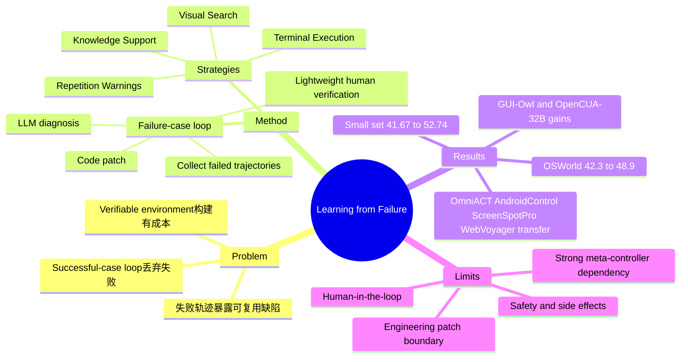

## Summary
这篇论文提出 failure-case loop：不再丢弃 Computer-Use Agent 的失败轨迹，而是让 LLM 诊断失败模式、生成可注入的 inference-time code patches，再用轻量人工校验后更新 agent 行为。基于 OpenCUA-72B，在 OSWorld 100-step 上从 42.3% 提升到 48.9%，无需额外训练，运行时间约增加 8%，交互步数约减少 15%。

## Problem & Motivation
现有 Computer-Use Agent 自我改进大多依赖 successful-case loop：agent 在可验证环境中 rollout，只保留成功轨迹用于 SFT 或 RL，失败轨迹被直接丢弃。问题在于，构建 OSWorld 这类 verifiable environment 本身就有工程成本，失败轨迹并不是纯噪声，而是暴露模型 grounding、planning、tool use、recovery 缺陷的结构化证据。

作者的核心问题是：能否把失败轨迹转化为无需重新训练的 inference-time 改进？这与 OpenCUA 的 trajectory/data scaling 路线互补，也与 CUA-Gym 的 verifiable RLVR 路线形成对照：前者从成功样本提升权重，后者从失败样本提取 runtime repair recipe。

## Method
方法由一个 LLM-guided failure-case loop 组成：

1. **Failure Experience Collection**：在 OSWorld 中运行当前 agent，用环境 reward 判断成功或失败，保留失败 trajectory。输入给 LLM 的上下文包括 task instruction、action history、thought process 和执行结果。
2. **LLM-Guided Diagnosis**：Claude 4.5 Sonnet 作为 meta-controller，分析失败轨迹，归纳常见 failure modes，并提出可执行的 inference-time 修复策略。论文比较了 Claude 4.5 Sonnet、GPT-5.2、Gemini 3 Flash、Qwen3-VL-32B-Instruct，认为 Claude 的诊断和代码实现最稳定。
3. **Code Patch + Lightweight Human Verification**：LLM 生成 patch-like 修改，人类选择候选并做少量语法/运行修正。论文声称超过 97% 的 LLM-generated refinements 无需修改即可接受，人类修改平均少于 3% 的修改行。
4. **Iterative Rollout**：每轮加入一个策略后重新 rollout，新的失败继续进入下一轮诊断。最终 recipe 由四类策略叠加而成。

四类失败和对应策略：

| Failure mode | Inference-time strategy | 核心机制 |
|---|---|---|
| Grounding errors | Visual Search | 对 click/moveto/dragto 等动作裁剪目标周围 400x400 patch，放大 2 倍并用红圈标出原坐标，让 agent 验证或修正坐标 |
| Competency gaps | Terminal Execution | 给 agent 注入 Ctrl+Alt+T 打开 terminal 的工具提示，把复杂 GUI 操作转化为命令行操作 |
| Knowledge deficiencies | Knowledge Support | 提供 `computer.search` 外部查询能力，以及 LibreOffice 等软件的精选快捷键/手册 |
| Redundant loops | Repetition Warnings | 用 sliding window 检测 thought/action/screen-state 重复，触发 recovery prompt，要求 agent 换策略 |

这个设计的实质不是模型权重 self-improvement，而是把失败经验沉淀为 runtime harness。它与 [[2605-HASP|HASP]] 的 Program Functions 思路很接近：都强调可执行介入比自然语言 advice 更可靠；区别是本文聚焦 GUI/OSWorld，并把修复模块具体落到 visual verification、terminal、search/manual、loop detection。

## Key Results
**OSWorld small set ablation（OpenCUA-72B, 30 steps）**

| Method | Performance |
|---|---:|
| OpenCUA-72B baseline | 41.67 |
| + Visual Search | 47.22 |
| + Repetition Detection | 44.40 |
| + Terminal Execution | 47.19 |
| + Knowledge Support | 44.44 |
| + Full Method | 52.74 |

每个模块单独都有提升，Full Method 比 baseline 高 11.07 points。Visual Search 和 Terminal Execution 单项提升最大，说明当前 Computer-Use Agent 的主要瓶颈仍集中在 GUI grounding 和是否善用系统级接口。

**OSWorld 主结果（100 steps）**

| Agent | Steps | Success Rate |
|---|---:|---:|
| UI-TARS-1.5 | 100 | 42.5 |
| OpenAI CUA o3 | 200 | 42.9 |
| OpenCUA-72B | 100 | 42.3 ± 2.6 |
| OpenCUA-72B + Ours | 100 | 48.9 ± 1.2 |

作者报告主结果从 42.3% 到 48.9%，绝对提升 +6.6 points，相对提升 +15.6%。同时没有额外训练成本，runtime overhead 约 8%，交互步数约减少 15%。

**跨模型泛化**

| Model | Base | + Ours |
|---|---:|---:|
| GUI-Owl-32B | 19.0 | 21.3 |
| OpenCUA-32B | 34.5 | 38.2 |
| OpenCUA-72B | 42.3 ± 2.6 | 48.9 ± 1.2 |

论文声称不同模型来源和规模都有 +10-12% relative gains，且更强模型收益更明显。

**跨 benchmark 迁移（OSWorld mined patches 直接迁移，Qwen3-VL-32B-Instruct backbone）**

| Benchmark | Base | Ours |
|---|---:|---:|
| OmniACT | 4.77 ± 0.02 | 6.90 ± 0.10 |
| AndroidControl | 28.37 ± 0.13 | 36.23 ± 0.22 |
| ScreenSpotPro | 27.50 ± 0.35 | 30.74 ± 0.27 |
| WebVoyager | 23.80 | 27.90 |

这个结果支持一个较强 claim：OSWorld 中挖到的失败模式不只是环境特定 hack，而包含一定通用 GUI-agent failure pattern。

## Strengths & Weaknesses
**Strengths**

- **问题 formulation 有价值**：把失败轨迹当成可复用监督，而不是 rollout waste。这点直接击中 verifiable GUI environment 的成本结构。
- **方法简单且可插拔**：四个 patch 都是 inference-time wrapper，不需要重新训练 OpenCUA-72B，也不改变 action space。
- **ablation 讲清楚了模块贡献**：Visual Search、Terminal Execution、Knowledge Support、Repetition Detection 都单独验证，Full Method 叠加最高。
- **和当前 CUA 生态兼容**：可作为 OpenCUA / CUA-Gym 这类 successful-case 或 RLVR pipeline 的前置提升，也可以提高成功轨迹产量。

**Weaknesses**

- **"self-improvement" 的自动化程度需要谨慎理解**：LLM 负责诊断和生成 patch，但人类仍选择目标方案并做轻量校验。它不是完全 autonomous self-repair，更像 LLM-assisted runtime harness evolution。
- **patch library 的泛化边界不清楚**：四个策略很合理，但也很工程化。跨 benchmark 有提升，说明不是纯 overfit；但这些 patch 是否覆盖更多真实 SaaS、权限异常、动态网页、个性化设置，还不知道。
- **meta-controller 依赖强模型**：核心诊断和代码生成由 Claude 4.5 Sonnet 完成。若没有强 meta-controller，failure mining 质量可能显著下降；论文没有给出完整成本分析。
- **评估仍围绕 benchmark success rate**：runtime overhead、错误恢复质量、错误介入副作用没有被系统展开。例如 Terminal Execution 和 external search 可能引入安全、权限、环境污染问题。
- **与训练型方法的组合未实证**：论文声称可补充 successful-case loop，但没有直接展示把修复后的成功轨迹再用于 SFT/RL 的闭环收益。

**已知**：OpenCUA-72B 在 OSWorld 从 42.3% 提升到 48.9%，small set Full Method 达 52.74%，四个模块均有正贡献。

**推测**：这类 runtime patch 最适合作为 verifiable environment 中的 data-yield amplifier，而不是最终 agent architecture。

**不知道**：这些 patch 在真实用户桌面、长会话、有权限/隐私约束的生产环境中是否安全可靠。

## Mind Map

## Notes
这篇和最近几篇 GUI reliability 工作形成一个很清楚的趋势：从"更强 grounding"转向"检测失败并恢复"。[[2604-VeriGUI|VeriGUI]] 用 expected effect 做 step-level verification，[[2605-GUIRobustEval|GUI-RobustEval / RoTS]] 构造 policy-induced error recovery，本文则直接从失败轨迹挖 runtime patches。对 Agent-Facing Environment 方向的启发是：环境不只应给 reward，还应该暴露 failure evidence，使 agent 或 harness 能把错误转成可执行恢复策略。
