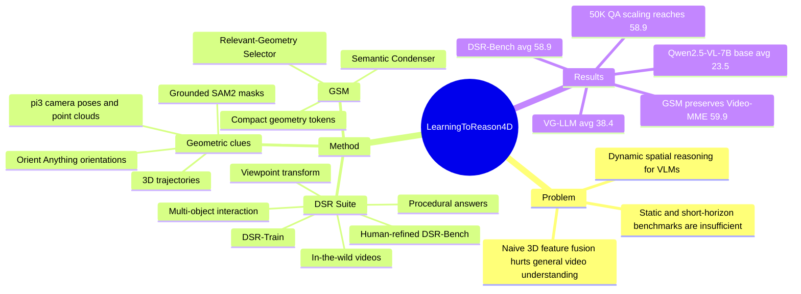

## Summary
这篇论文提出 DSR Suite，用 in-the-wild videos 自动构造 Dynamic Spatial Reasoning 训练集 DSR-Train 和人工 refinement 的评测集 DSR-Bench，并用 Geometry Selection Module (GSM) 把 question-relevant 4D geometric priors 接入 VLM。核心贡献是把动态 3D 空间关系、viewpoint transform、多物体交互和 fine-grained procedural answers 组织成一个可训练/可评测框架，而不是只做静态空间 QA。

## Problem & Motivation
现有 VLM 在 general video understanding 上进展很快，但作者指出它们仍弱于 dynamic spatial reasoning：理解物体 geometry 和 object relationship 如何在 3D space over time 中演化。这个能力对 robotics、autonomy、AR/VR 和 embodied intelligence 重要，因为真实环境中的空间关系持续变化。

论文批评已有 spatial reasoning 数据大多停留在 static scenes、two-image object change 或短时 motion；少数 video benchmark 又常受限于 autonomous driving / human-object interaction 场景、question diversity 不足、3D requirement 弱、答案粒度粗。模型侧的问题是：直接把 CUT3R、VGGT 等 3D/4D foundation model 特征注入 VLM 可能提升 spatial reasoning，但会把噪声和 task-specific cues 一起带入，损害 general video understanding。

## Method
**DSR Suite data pipeline.** 论文从 Koala-36M 的 in-the-wild videos 出发，先筛选有 meaningful object motion 的视频：DSR-Train 用 DeepSeek-R1 基于 caption 过滤，DSR-Bench 用 Gemini-2.5-Pro 直接看视频过滤；保留 20s-120s 视频，得到 10,000 个 training videos 和 575 个 evaluation videos。随后用 vision foundation models 提取 4D 几何线索：`π^3` 估计 camera poses 和 local point clouds，Grounded SAM2 做 object tracking / segmentation，Orient Anything 给 agent-class objects 估计 orientation，再把 mask 投影到 point cloud 得到 per-timestamp 3D center 和 trajectory。

**QA construction.** 由于 monocular reconstruction 缺乏可靠 metric scale，作者不生成绝对数值答案，而生成 qualitative / trend-based multiple-choice QA，例如 larger/smaller、left/right、faster/slower。template-based QA 覆盖 distance、direction、orientation、speed、speed comparison、direction prediction，并且随机选择 target objects、time sub-interval、viewpoint 和 viewpoint mobility；non-template QA 由 DeepSeek-R1 基于 3D trajectories、object identities 和 viewpoints 自动生成，以增加语言和推理模式多样性。DSR-Bench 的 QA 经过 human refinement。

**Benchmark design.** DSR-Bench 包含 1,484 questions，覆盖 12 个 template-based types 加 1 个 non-template class，视频场景分为 Sports & Recreation、Transportation & Vehicle Operation、Art Performance、Manual Labor & Craftsmanship、Daily Activities & Hobbies、Nature & Wildlife。它和 prior benchmarks 的关键差异是：in-the-wild video、multi-object、viewpoint transformation、strong 3D awareness requirement、fine-grained temporal granularity。

**GSM model.** GSM 是一个 lightweight text-guided geometry selection module，使用两个 stacked Q-Formers。第一个 Semantic Condenser 用 learnable queries attend question tokens，把 variable-length question 压缩为 language-conditioned queries；第二个 Relevant-Geometry Selector 用这些 queries attend `π^3` encoder 产生的 3D tokens，只抽取 question-relevant geometric knowledge。得到的 fixed-size geometry tokens 与原始 vision tokens、text tokens 拼接后送入 LLM head，目标是在注入 geometric priors 的同时避免直接暴露大量 noisy 3D tokens。

## Key Results
- **DSR-Bench main comparison.** Qwen2.5-VL-7B + DSR-Train + GSM 的 average accuracy 为 **58.9%**，高于 spatial reasoning baseline VG-LLM **38.4%**、VLM-3R **31.4%**，也高于 Gemini-2.5-Pro **31.7%**、GPT-5 **30.8%**、Qwen2.5-VL-7B base **23.5%**。分项上，Ours 在 Abs Dis **87.0%**、Abs Dir **73.8%**、Abs Ori **84.1%**、Rel Dis **75.8%**、Rel Dir **76.1%**、Rel Ori **77.7%**；较弱分项包括 Abs Dir Pred **35.5%**、Rel Dir Pred **35.1%**、Rel Spd Comp **37.1%**。
- **Benchmark property quantification.** 作者用 DeepSeek-R1 判断 object-level / scene-level 3D requirement：DynSuperCLEVR 为 **63% / 24%**，VLM4D **73% / 85%**，STI-Bench **69% / 21%**，OmniSpatial **56% / 79%**，DSR-Bench **34% / 18%**，因此 DSR-Bench 被标为 strong 3D demand。procedural answer 比例上，DynSuperCLEVR **2%**、VLM4D **19%**、STI-Bench **22%**、OmniSpatial **18%**、DSR-Bench **78%**。
- **GSM ablation on 20K QA.** Baseline Qwen2.5-VL-7B 在 DSR-Bench / VLM4D / STI-Bench / Video-MME / Avg 为 **23.5 / 43.1 / 33.2 / 60.2 / 40.0**；SFT 为 **54.4 / 46.7 / 34.6 / 60.1 / 48.9**；直接 Addition 3D tokens 为 **57.7 / 48.5 / 35.3 / 48.6 / 47.5**；GSM 为 **57.4 / 48.3 / 35.2 / 59.9 / 50.2**。这支持作者的 claim：Addition 对 DSR 有帮助但损害 Video-MME，GSM 基本保住 general video understanding。
- **Query number ablation.** learnable queries 从 8 到 16、32、64 时，DSR-Bench 为 **55.7 / 56.9 / 57.4 / 57.6**，Video-MME 为 **59.9 / 60.0 / 59.9 / 59.2**，Avg 为 **49.3 / 49.8 / 50.2 / 50.0**；32 queries 是表中 average 最好设置。
- **Data scaling.** DSR-Train QA 数量从 5K、10K、20K 到 50K 时，DSR-Bench accuracy 从 **47.3%**、**53.3%**、**57.4%** 提升到 **58.9%**，base accuracy 为 **23.5%**。

## Strengths & Weaknesses
**已知 strengths.**

1. **问题定义比静态 spatial QA 更接近 embodied setting。** DSR 明确要求物体关系随时间演化、viewpoint transformation、多物体交互和 procedural answers，这比 single-frame 或 two-image spatial reasoning 更贴近 robotics / autonomy 场景。
2. **数据管线有可扩展性。** 论文把 Koala-36M、DeepSeek-R1/Gemini filtering、`π^3`、Grounded SAM2、Orient Anything 和 template/free-form QA 组合成自动生成 pipeline，并把 train 和 benchmark 分离；DSR-Bench 额外 human refinement，降低 evaluation label noise 风险。
3. **GSM 的 ablation 方向清楚。** Table 5 不是只证明 SFT 有效，还显示 direct Addition 会把 Video-MME 从 **60.2** 拉到 **48.6**，而 GSM 在 DSR-Bench 接近 Addition 的同时把 Video-MME 保持在 **59.9**。
4. **benchmark 设计抓住了 prior benchmark 的盲点。** DSR-Bench 相比 VLM4D、STI-Bench、OmniSpatial 更强调 multi-object、viewpoint transform、strong 3D requirement 和 fine temporal granularity。

**已知 weaknesses / limitations.**

1. **metric scale 被主动放弃。** 作者明确说 monocular footage 和 vision foundation models 无法可靠给出 absolute metric scale，因此 QA 是 qualitative / trend-based；这让 benchmark 更稳，但也意味着它没有评估 metric 3D precision。
2. **训练数据强依赖自动 annotation。** DSR-Train 来自 foundation-model generated camera poses、point clouds、masks、orientations、trajectories 和 QA；只有 DSR-Bench 被 human-refined。论文没有给出 DSR-Train noise rate 或自动 QA correctness 的系统审计数字。
3. **3D demand / procedural answer 的 benchmark 诊断依赖 DeepSeek-R1 judgment。** 这能给出相对比较，但不是人工标注或几何 oracle，可能把 LLM judge 的偏差带入 benchmark meta-analysis。
4. **模型验证主要集中在 Qwen2.5-VL-7B。** 论文说 GSM architecture-agnostic，但主训练配置是 Qwen2.5-VL-7B，freeze vision encoder，50K QA，1 epoch，learning rate `2e-7`，batch size 32；跨 backbone 的训练结论仍不知道。
5. **failure cases 不充分。** 论文没有报告 qualitative failure cases。仅从 Table 4 可见，Ours 在 direction prediction 和 relative speed comparison 仍低：Abs Dir Pred **35.5%**、Rel Dir Pred **35.1%**、Rel Spd Comp **37.1%**，说明预测未来方向/比较相对速度仍是瓶颈，但具体错误类型没有展开。

**推测 / 不知道.** GSM 对 embodied policy 或 GUI-agent 的直接收益尚未被证明；论文只评估 video QA / spatial benchmarks，没有把 geometry tokens 接入 action prediction、navigation、manipulation 或 GUI state transition 任务。代码链接在论文首页出现，但本文未基于仓库可复现性做判断。

## Mind Map

## Notes
这篇论文对我的主要启发是：动态空间理解的 bottleneck 不只是 video context length，而是坐标系、viewpoint、object trajectory 和 answer granularity 的组合设计。对 embodied research，它提供了一个把 4D reconstruction priors 接进 VLM 的简洁范式；对 GUI agent 只能作为类比启发，因为 GUI 状态转移不是 3D physical dynamics，不能直接把 DSR-Bench 的结论迁移过去。

后续如果要复用这条线，优先看两个问题：第一，GSM 是否能从 QA 扩展到 action-conditioned reasoning 或 planning；第二，自动生成的 qualitative QA 是否会让模型学会 template shortcuts，而不是更一般的 4D spatial representation。
