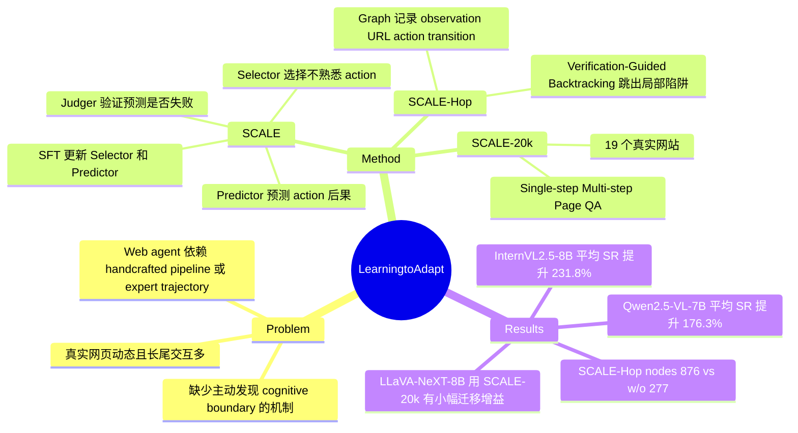

## Summary
本文提出 SCALE，通过 Selector / Predictor / Judger 的自对抗探索，让 MLLM-based web agent 主动发现自己不理解的网页交互，并用这些 mismatch traces 更新能力边界。SCALE-Hop 进一步把探索历史组织成 graph，避免局部页面陷阱；作者还基于 19 个真实网站构造 SCALE-20k，用于 single-step、multi-step 和 page QA 监督。主要结果显示它能显著提升 InternVL2.5-8B 和 Qwen2.5-VL-7B 的 web task success rate，但绝对成功率仍偏低，且部分结论依赖 GPT-4o 辅助的数据构造与自动质量评估。

## Problem & Motivation
现有 web agent 常依赖两类外部结构：handcrafted execution pipeline（如 Tree Search、ReAct、world-model planning）或 human / expert trajectories（如 Mind2Web、OSWorld、AGUVIS）。这些方法在固定任务流里有效，但论文认为它们难以覆盖真实网页的动态、多样、长尾交互，也缺少机制去判断 agent 自己“不知道什么”。作者把这种能力边界称为 cognitive boundaries，即 agent 基于已有知识难以理解或决策的 item / operation。

核心问题是：如果没有昂贵 expert trajectory、也不在 inference time 叠复杂手工 pipeline，web agent 能否通过与环境交互主动发现未知操作，并把这些未知操作转成训练信号？这对 GUI / web agent 很重要，因为真实网页里大量关键行为来自视觉布局、隐藏入口、footer menu、tab、logo 等不一定能被 task instruction 直接覆盖的交互。

## Method
SCALE（Self-Cognitive-Aware Learning and Exploration）把同一个 MLLM 分成三个角色：Selector、Predictor、Judger。Selector 在当前 GUI screenshot 上挑选它认为不熟悉、结果不确定的 action；Predictor 在执行前预测该 action 的网页变化并给出理由；Judger 在 action 执行后比较预测和真实 observation，判断预测是否正确。若预测错误，该 action 被视为触及了 agent 当前 cognitive boundary，并记录为训练样本；若预测正确，则回到原状态重新选择更有探索价值的 action。

流程分三步。第一步是 Input Encoding：使用 Set-of-Mark 处理 GUI image，刻意不依赖 accessibility tree 或 HTML / DOM，因为作者认为真实网站不总是开放结构化元数据。第二步是 Self-Check：Selector 与 Predictor 形成自对抗关系，前者试图找出模型不懂的操作，后者试图预测正确，Judger 负责验证。第三步是 Iterative Update：只用预测错误的 cases 构造 `ExploreData = <observation, action, selection reason, true description, true reason>`，通过 SFT 更新 Selector 和 Predictor；Judger 在这个过程中保持 fixed。

SCALE-Hop 解决局部探索问题。它把探索历史建成 directed graph：node 是 `(observation, URL)`，edge 是 action transition；同 URL 下用 SSIM 判断 observation 是否是新 node，appendix 给出的新节点阈值是 SSIM < 0.99。当 agent 在同一 node 停留超过 10 steps 或局部探索困难时，触发 Verification-Guided Backtracking：生成 5 个候选 verification actions，让 Predictor / Judger 检查该 node 是否仍有未理解交互；若全部预测正确，则标为 Fully Explored，并 backtrack 到最近的 Unexplored 或 Partially Explored node。

SCALE-20k 是由 SCALE 探索 traces 构造的数据集。作者在 19 个真实网站上用 Qwen2.5-VL-7B 和 InternVL2.5-8B 采集探索数据，再用 GPT-4o 辅助 task construction 和 validation。数据包含 15,042 个 single-step tasks、3,780 个 multi-step tasks、6,886 个 page comprehension QA tasks，覆盖从单步决策到多步轨迹和页面理解的监督形式。

## Key Results
**VisualWebArena / WebVoyager 主结果**：在 Table 1 中，SCALE 将 InternVL2.5-8B 的 SR 从 zero-shot 的 Shopping 3.9、Classifieds 0.4、Reddit 1.4、WebVoyager 0.0 提升到 11.0、6.4、3.3、1.8；论文报告平均 task success rate 提升 231.8%。Qwen2.5-VL-7B 从 Shopping 4.1、Classifieds 6.0、Reddit 2.4、WebVoyager 0.6 提升到 14.4、12.0、4.8、7.9，平均提升 176.3%。不过 closed-source GPT-4o zero-shot 仍有 Shopping 17.2、Classifieds 13.7、Reddit 6.7、WebVoyager 9.6，说明 SCALE 对 open-source backbone 有明显增益，但没有把这些 7B/8B 模型推到 GPT-4o 水平。

**与 baseline 的比较**：SCALE 相比 GPT Trajectory Imitation、OS-Genesis、Tree Search 并非每个 domain 都最优。例如 InternVL2.5-8B 在 Shopping 上 OS-Genesis SR 11.6 高于 SCALE 11.0，在 Reddit 上 OS-Genesis 4.3 高于 SCALE 3.3；Qwen2.5-VL-7B 在 Shopping 上 GPT Trajectory Imitation 18.3 高于 SCALE 14.4。但 SCALE 在 Qwen2.5-VL-7B 的 Classifieds / WebVoyager 上达到 12.0 / 7.9，高于 OS-Genesis 的 8.6 / 6.7，并且多数 AS 更低或接近最低，支持其更短 reasoning path 的主张。

**探索轮数**：Table 2 显示 Qwen2.5-VL-7B 在 VisualWebArena 上随探索深度增加而提升：zero-shot overall SR 4.1，SCALE (20-25) 为 7.2，SCALE (40-25) 为 7.9，SCALE (60-25) 为 11.9；对应 Shopping / Classifieds / Reddit 在 60-25 时为 14.4 / 12.0 / 4.8。

**SCALE-Hop 消融**：Table 3 中 Random Walk overall SR 10.4、visited nodes 399；w/o SCALE-Hop overall SR 10.1、nodes 277；完整 SCALE overall SR 11.6、nodes 876。作者报告 SCALE-Hop 相比 w/o SCALE-Hop 平均 node coverage 增加 216%。但 domain-level SR 不是单调胜出：Random Walk 在 Shopping 为 14.8，高于 SCALE 的 14.4；w/o SCALE-Hop 在 Reddit 为 7.1，高于 SCALE 的 4.8。因此，SCALE-Hop 的最强证据是 coverage 和 overall SR，而不是每个 domain 的成功率都更高。

**SCALE-20k 泛化**：LLaVA-NeXT-8B 不参与 SCALE 探索流程，但直接用 SCALE-20k fine-tune 后，SR 从 zero-shot 的 Shopping 0、Classifieds 0、Reddit 1.4、WebVoyager 0.0 变为 2.1、0.8、1.9、0.0。这说明数据对不同架构有迁移信号，但增幅较小，且 WebVoyager 未改善。

## Strengths & Weaknesses
**已知：亮点。** 论文把 self-improvement 问题具体化为“发现 Predictor 预测失败的 GUI action”，这个 formulation 比泛泛地收集更多 trajectory 更清晰。Selector / Predictor / Judger 的闭环也很适合 web agent：它不是只做 task completion，而是在没有明确用户任务时主动寻找未知交互。SCALE-Hop 把局部 cognitive-boundary probing 和全局 graph exploration 连接起来，对真实网站里 footer、hidden tab、domain edge 等长尾区域更有针对性。

**已知：实验价值。** 实验覆盖 VisualWebArena 和 WebVoyager，并统一只使用 screenshot + SOM，移除 accessibility tree、HTML DOM、page description 等辅助信息；这让结果更接近 vision-only GUI agent 设置。baseline 包含 GPT-4o zero-shot、Augvis、ViGoRL、GPT trajectory imitation、OS-Genesis 和 Tree Search，比较对象比较完整。Table 2 / Table 3 的探索深度与 SCALE-Hop 消融提供了比单一主结果更有用的机制证据。

**已知：局限。** 绝对 SR 仍然低：完整 SCALE 下 Qwen2.5-VL-7B 在 Reddit 只有 4.8，WebVoyager 7.9；InternVL2.5-8B 在 WebVoyager 只有 1.8。论文没有单独的 Limitations section，也没有系统错误类型统计；failure case 主要以 Figure 4 的 “Advance Search” 预测失败例子和 Table 3 消融呈现。SCALE-20k 的构造和质量评估使用 GPT-4o 辅助，因此“无外部监督”更准确地说是探索不依赖 expert trajectories / handcrafted inference pipeline，而不是整个数据生产链完全不依赖强模型。

**推测：适用边界。** 该方法可能最适合视觉可见但语义效果不确定的网页交互，例如 logo、filter、tab、footer link、advanced search；对于需要登录、支付、跨站身份状态或强安全约束的网页，论文没有给出证据。由于 Judger fixed，若 Judger 本身无法可靠判断页面变化，错误 label 可能会进入 SFT 数据，这是潜在风险，但论文没有量化。

**不知道。** 论文正文和 appendix 未给出 code link 或 DOI；没有报告人工评估 Judger 准确率、GPT-4o 质量评估与人工判断的一致性、SCALE-20k 的去重细节，也没有说明在更大 backbone 或真实开放浏览器 session 中的长期稳定性。

## Mind Map

## Notes
这篇的关键启发不是“让 agent 自己玩网页”这么宽泛，而是把探索目标定义成 prediction mismatch：如果模型能预测某个 action 的后果，这个 action 对学习价值低；如果预测失败，它才暴露了 cognitive boundary。对后续 GUI agent 研究，值得追问两个问题：第一，Judger 是否可以被独立校准或用多视角证据验证，避免自监督 label 噪声；第二，能否把 SCALE 的 exploration trace 转成更通用的 skill library 或 environment model，而不仅是 SFT 数据。
