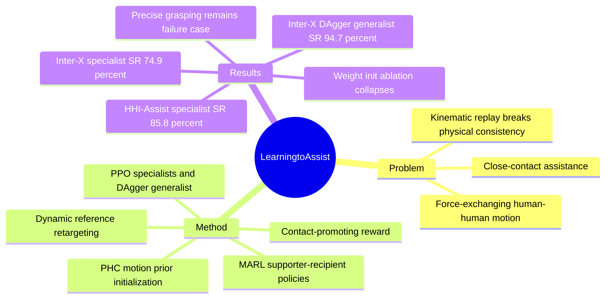

## Summary

AssistMimic 将 close-contact assistive human-human motion imitation 形式化为 multi-agent reinforcement learning，在 physics simulator 中联合训练 Supporter 和 Recipient 的 tracking controller，而不是把其中一方做 kinematic replay。方法从 PHC single-person motion prior 初始化，加入 partner-aware state、dynamic reference retargeting 和 contact-promoting reward，使 noisy / occluded assistive demonstrations 中的接触支持更可学。论文报告其在 Inter-X 和 HHI-Assist 上首次能稳定追踪 force-exchanging assistive sequences，但结果也显示部分组件在 Inter-X 上不是单调收益，且精细抓握、视觉闭环和 sim-to-real 仍未解决。

## Problem & Motivation

已知：DeepMimic、PHC、GMT 一类 physics-based motion tracking 已经能让 virtual characters / humanoid robots 复现大量 single-person motion，但这些能力主要覆盖 isolated motion 或 contact-less social interaction。Assistive scenarios 不只是跟踪轨迹，还需要根据 partner 的实时姿态和动力学变化施加支持力；如果 recipient 本身被降低 PD gains、joint torque 或 body stability，单独重放 recipient motion 会破坏物理一致性。

论文把核心矛盾说得比较清楚：human-human assistive motion 是 tightly coupled system，supporter 和 recipient 的状态会通过接触力互相改变，因此把 recipient 先训练好再 freeze，或直接 kinematic replay，都不能产生真实的 bidirectional coordination。作者用 Figure 4 展示 kinematic replay 的两个问题：recipient 会沿预设轨迹自行站起，supporter 的行为不会真正影响 partner；固定姿态还会导致 interpenetration 和 physics engine 的 restorative-force blow-off。

任务数据来自两个 benchmark：Inter-X 中抽取 30 个 "Help-up" paired motions，覆盖前后方向、单臂抓握、双手肩部支撑等 assistive strategies；HHI-Assist 使用 10 个代表性 caregiving clips，包括 bed / chair 场景下支撑肩部、抬起、稳定膝部和旋转身体等动作。这个问题对 embodied agent / humanoid control 有参考价值，因为它把"互动对象也是 agent"而不是环境背景这件事作为 first-class modeling assumption。

## Method

AssistMimic 把 close-range assistance 建模为 finite-horizon MDP，两个 humanoid agents 分别是 Supporter $S$ 和 Recipient $R$。两者各自从 agent-centric observation 中采样动作，但 transition dynamics 由 joint state 和双方 action 共同决定；Recipient 的 dynamics 通过降低 $k_p, k_d, \tau_{max}$ 来模拟 physical impairment，从而迫使 Supporter 的外部支持成为任务成功条件。

策略架构基于 PHC 的 goal-conditioned single-person tracking policy 扩展而来。每个 policy 输入包括三部分：`sprior` 是 ego-agent proprioception，例如 joint rotations / positions / velocities 和 root height；`sassist` 是 partner-aware state，包括 partner observation、双方 hand contact state、自身 contact force、previous action 等；`g` 是当前状态到下一步 reference state 的 delta goal。初始化时复制 PHC prior 的原输入权重，新加入的 assistive features 对应权重置零，用 zero-padding 保留 single-person locomotion prior。

Dynamic reference retargeting 解决的是 close-contact tracking 中的相对位置失配：当 supporter 和 recipient root distance 小于阈值时，方法在 canonical reference 中找到 supporter hand 最近的 recipient anchor joint，并把 hand target 改写为"相对当前 simulated recipient pose 的 offset"。这样 supporter 不再盲目追踪 global-space hand reference，而是追踪相对 recipient 当前身体位置的接触目标。

Contact-promoting reward 针对 motion capture 中 hand occlusion / noisy trajectory 的问题。若 supporter hand 离 recipient upper-body joints 较远，仍使用标准 tracking reward；若进入 proximity threshold，则抑制严格 hand tracking penalty，改用与距离、finger contact force、sparse contact bonus 相关的奖励，鼓励产生物理上有意义的支持接触。Supplementary 中还给出 reward coupling：supporter 的最终 reward 混合自身 reward 和 recipient reward，使 caregiver 不只最大化自己的 tracking fidelity。

训练上，specialist policies 按 subject / motion cluster 训练，使用 PPO；generalist policy 通过 DAgger 从 specialist teachers distill。实现细节包括 tight early termination、Physical State Initialization、AMP discriminator reward，以及对 floor-near recipient motions 的 PHC fine-tuning；这些细节对稳定训练可能很关键，但论文主表主要聚焦在 MARL formulation、motion prior、retargeting 和 contact reward 的贡献。

## Key Results

- 摘要级结果：论文报告 AssistMimic 在 Inter-X 和 HHI-Assist 上分别达到 83% 和 73% task success rate，用于支持"能成功 tracking assistive interaction motions"的主张。
- Specialist Inter-X：Table 2 中 AssistMimic 的 seen-dynamics SR 为 74.9%，MPJPE 为 113 mm；Sequential Training baseline 为 62.4% SR、92.3 mm MPJPE。在 unseen dynamics 下，AssistMimic 对 Mass x1.2 的 SR 为 57.9%，对 $K_p/K_d \times 0.5$ 的 SR 为 72.8%；Sequential Training 分别是 49.9% 和 50.5%。
- Inter-X ablation 不是单调支持 full model：去掉 Dynamic Reference Retargeting 后 SR 为 83.4%、MPJPE 为 107 mm，高于 full AssistMimic 的 74.9%、113 mm；作者解释为 Inter-X recipients 的移动范围更大，使 relative goal position 不稳定。去掉 Weight Initialization 后 Inter-X SR 为 0.0%、MPJPE 为 248 mm，说明 single-person motion prior 对收敛是硬条件。
- Specialist HHI-Assist：Table 3 中 AssistMimic 的 seen-dynamics SR 为 85.8%，MPJPE 为 127.0 mm；Mass x1.5 和 Max hip torque x0.5 的 zero-shot SR 分别为 67.8% 和 73.2%。去掉 Dynamic Reference Retargeting 后这两个 unseen SR 降到 49.1% 和 62.9%；去掉 Contact Promoting Reward 后为 56.4% 和 27.7%，说明两者主要体现在 robustness 而不是 seen tracking 上。
- HHI-Assist 的 Weight Initialization ablation 出现 reward hacking：Table 3 标为 19.1% SR、364 mm MPJPE，并用 dagger 标注非功能性成功；Supplementary Figure 9 描述 recipient 会通过触碰 supporter waist 借反作用力抬起上身，而不是学到正常 hand-tracking assistance。
- Generalist Inter-X：Table 4 中单一 generalist policy 在 30 个 diverse clips 上达到 77.3% SR、132 mm MPJPE；加入 DAgger distillation 后 SR 升至 94.7%，但 MPJPE 变为 168 mm，说明 success rate 和 tracking accuracy 存在 trade-off。
- COM stability：Supplementary Table 5 在 HHI-Assist 成功完成的 motions 上计算 recipient COM standard deviation，AssistMimic 在 Seen / Mass x1.5 / Max hip torque x0.5 下分别为 0.0921 / 0.0738 / 0.0865，低于 w/o Dynamic Retargeting 的 0.1038 / 0.0902 / 0.0924；这个指标只在所有方法都成功的 sequences 上计算，不能替代 overall success rate。

## Strengths & Weaknesses

已知的强点：论文的 problem formulation 很扎实。它没有把 human-human interaction 简化成一方 replay、另一方 reaction，而是承认 support / receive support 是 coupled control problem；这比把 partner 当作 scripted environment 更接近 assistive robotics 的物理本质。方法上，motion prior initialization、partner-aware observation、reference retargeting、contact-promoting reward 的动机都能对应到具体 failure mode：探索困难、相对位置偏移、noisy hand reference、无效接触。

已知的局限：实验表格并不支持"每个组件在每个数据集上都提升"这种强说法。Inter-X 中 full AssistMimic 的 seen SR 和 MPJPE 都不如去掉 Dynamic Reference Retargeting 的版本；HHI-Assist 中去掉 Contact Promoting Reward 的 seen SR / MPJPE 更好，但 unseen torque robustness 明显更差。因此更准确的结论是：组件收益依赖数据集和测试扰动，contact / retargeting 更像 robustness-oriented design，而不是纯 tracking metric 的普适提升。

已知的 baseline 边界：Phys-Reaction 被作者认为不适合作为 direct baseline，因为 isolated rollout 在 assistive scenario 里无法产生 stable recipient trajectories；Kinematic-Recipient 主要用于展示 replay formulation 的物理不适定性。Sequential / Frozen-Recipient 更能检验 decoupled learning，但 Inter-X 中 AssistMimic 的 MPJPE 反而更高，这提示 SR 和 imitation fidelity 衡量的是不同质量。

已知的 failure cases：Figure 7(b) 中，涉及 precise grasping 和 lifting recipient arms 的动作会失败，原因包括 humanoid hand dexterity 有限、noisy demonstrations 难以提供 coordinated finger control、recipient weight 增加使抓举更难。作者还明确说需要更紧密的 motion planning + tracking 集成、需要加入 visual observations 来提升对 dynamic partner states 的鲁棒性，sim-to-real transfer 仍是重要挑战。

推测：这篇论文对 GUI-agent / VLM 的直接关联不强，因为 policy 本身没有使用 language / vision observation；但对 embodied / agentic research 的启发是明确的：当交互对象会反向改变系统动力学时，"固定对方轨迹再学习自己"可能会给出错误学习信号。这个 insight 可以迁移到 embodied multi-agent evaluation、human-in-the-loop control 或机器人协作任务，但论文没有在这些 setting 中验证。

不知道：论文首页给出 project page，但正文没有看到 GitHub code link，也没有给出 DOI。真实 humanoid 硬件部署、视觉闭环控制、对更大规模 assistive action taxonomy 的泛化能力，都还没有被实验证明。

## Mind Map

## Notes

这篇的研究 taste 在"问题比方法重要"上是加分的：它选择了一个 single-agent tracking 体系真正会 break 的场景，并用 MARL formulation 去修正物理建模假设，而不是只追求更复杂的生成模型。最值得复用的不是具体 reward 形式，而是分析路径：先找出 kinematic / decoupled baseline 为什么在 physics simulator 中不成立，再把 reward、state、reference target 的设计逐一对准这些 breakpoints。

后续阅读可关注三个问题：第一，AssistMimic 的 contact reward 是否会在更复杂 contact topology 中诱导新的 reward hacking；第二，visual observation 加入后是否还能稳定训练，还是会被 noisy perception 放大；第三，若迁移到真实 humanoid，hand dexterity、compliance control 和 safety constraint 是否会成为比 MARL formulation 更主导的瓶颈。
