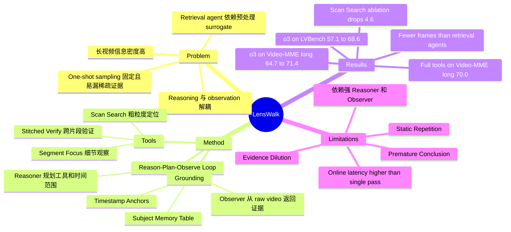

## Summary
LensWalk 提出一种无需 fine-tuning 的 agentic video understanding 框架，让 LLM Reasoner 在推理过程中主动规划“看哪里、看多密”，再调用 VLM Observer 从 raw video 中按需获取证据。核心不是换更大的 video model，而是把视频观察变成 multi-turn reason-plan-observe loop；作者报告它在 LVBench、LongVideoBench、Video-MME、MMVU、Video-MMMU 等 benchmark 上对多种 Reasoner/Observer 组合带来 plug-and-play 提升。

## Problem & Motivation
现有长视频理解通常先做一次性 frame / clip sampling，再把固定上下文交给 VLM 或 LLM 推理；这种静态观察会在长视频中丢掉稀疏关键事件，或者把 token budget 浪费在冗余片段上。另一些 retrieval-based video agent 会查询预处理好的 caption、ASR、OCR 或 clip index，但观察对象仍然是固定 surrogate，而不是让 agent 根据中间假设重新调度 raw video 的时间范围和采样密度。

论文要解决的问题是：在有限观察预算下，如何让模型像人一样按目的搜索证据，从 coarse scan 逐步转向 focused inspection，并在不确定时回看、验证、整合多个时刻。这个问题对 VLM / video-LLM 重要，因为复杂视频 QA 的瓶颈不只是 reasoning token 数量，也包括视觉证据何时、以何种 granularity 被送进模型。

## Method
### Reason-Plan-Observe Loop

LensWalk 把每一轮推理表示成一个显式 observation plan：

$$
a_t = (o_t, q_t, I_t, \rho_{o_t})
$$

其中 $o_t$ 是工具类型，$q_t$ 是本轮子问题，$I_t$ 控制时间区间和 frame budget，$\rho_{o_t}$ 是工具特定参数。Reasoner $M_r$ 根据用户问题、视频 metadata、历史 observation 和 Subject Memory Table 选择下一次观察；Observer $M_o$ 则根据计划采样 frames 并返回带时间锚点的 evidence。历史 $L_t$ 不是普通对话记录，而是带时间范围、采样策略和证据摘要的结构化探索轨迹。

### Observation Tool Suite

LensWalk 的工具集很小，但覆盖了三种互补观察方式：

- **Scan Search**：对较大时间范围做 slice-level sparse scan，用于快速定位可能相关的事件或对象。它可按 slice 数或 slice duration 切分区间，每个 slice 独立查询 Observer。
- **Segment Focus**：对单个连续区间做更密集观察，用于读取细节、验证属性、区分类似实体或动作。
- **Stitched Verify**：把多个非连续 segment 的 frames stitch 到同一个上下文里，用于 before-after comparison、跨片段实体追踪或 causal narrative 验证。
- **Finish**：在证据足够时输出答案并结束。

### Evidence Grounding

作者加入两个轻量 coherence module。第一是 **Timestamp Anchors**：把精细时间戳直接插入 Observer 可见 frames，促使 observation 返回明确时间依据，方便后续 re-observation。第二是 **Subject Memory Table**：每轮后由 LLM 更新全局实体表，记录实体描述和出现区间，避免多轮观察中反复重识别同一人物/物体，也降低长历史带来的上下文负担。

## Key Results
### Long Video Understanding

在 Table 1 的 long-video benchmark 上，LensWalk(o3) 相比单次视频输入的 o3 有明显提升：LVBench **57.1 → 68.6**（+11.5），LongVideoBench-long **60.6 → 70.6**（+10.0），Video-MME long **64.7 → 71.4**（+6.7），EgoSchema-val **63.2 → 74.8**（+11.6）。LensWalk(o3/GPT-4.1) 在 Video-MME long 达到 **70.0**，相对 GPT-4.1 baseline **63.1** 提升 +6.9。

与 prior video agents 的关系需要分开看：LensWalk(o3) 在 Video-MME long **71.4** 高于 Deep Video Discovery **67.3**、MR.Video **61.8**；在 LongVideoBench-long **70.6** 高于 Deep Video Discovery **68.6**、MR.Video **61.6**。但在 LVBench 上 Deep Video Discovery **74.2** 高于 LensWalk(o3) **68.6**，在 EgoSchema 上 Deep Video Discovery **76.6** 也高于 LensWalk(o3) **74.8**。

### Video Reasoning

在 Table 2 的 reasoning benchmark 上，LensWalk(o3/GPT-4.1) 的 MMVU multiple-choice score 为 **80.9**，高于 o3 **78.9** 和 GPT-4.1 **76.3**。Video-MMMU 上，LensWalk(o3) overall **78.33**，高于 o3 **75.44**；LensWalk(o3/GPT-4.1) overall **77.11**，高于 GPT-4.1 **67.44**。

### Ablation

Table 4 在 Video-MME long 上做 component ablation，完整 LensWalk(o3/GPT-4.1) 为 **70.0**。去掉 Scan Search 后只剩 **65.4**（-4.6），说明 broad localization 是最大贡献项；去掉 Stitched Verify 为 **66.8**（-3.2），说明跨片段整合对复杂问题重要；去掉 Segment Focus 为 **68.1**（-1.9）。Reasoning coherence module 也有贡献：包含 Timestamp Anchor 的配置达到 **69.7**，包含 Subject Memory 的配置达到 **69.4**，二者同时使用达到 **70.0**。

### Efficiency

Table 6 的 shared-backbone LVBench 对比显示，LensWalk(o3) 用 **290.3 frames/query**、**190.35s online inference**、**0s offline preprocessing** 达到 **68.6** accuracy；单次 o3 是 **256 frames/query**、**38.9s**、**57.1** accuracy。Deep Video Discovery accuracy 更高（**74.2**），但需要 **2180.4s offline preprocessing** 和 **8202 frames/query**；MR.Video 为 **65.5** accuracy、**4135.2s offline preprocessing**、**9227 frames/query**；VideoAgent 为 **64.1** accuracy、**1131.3s offline preprocessing**、**4101 frames/query**。

Table 7 进一步表明 LensWalk 会按任务难度扩展观察预算：Video-MME short 平均 **2.8 steps / 89.7 frames**，medium **4.2 steps / 233.0 frames**，long **6.8 steps / 387.1 frames**；Video-MMMU 这种 reasoning-intensive benchmark 平均 **4.8 steps / 178.4 frames**，gain 为 +9.7。

## Strengths & Weaknesses
**已知的亮点**：

1. **问题 formulation 有价值**：论文把“如何观察视频”显式暴露给 agent，而不是把 observation 当成一次性 preprocessing。这个抽象简单、可插拔，和 GUI / embodied agent 中“何时放大、何时回看、何时跨片段验证”的需求相近。
2. **工具设计克制**：Scan Search / Segment Focus / Stitched Verify 分别对应 coarse localization、fine inspection、cross-segment verification；Table 4 显示三者互补，不是只靠更多 frames。
3. **效率 tradeoff 说得比较诚实**：LensWalk 不总是最高 accuracy，例如 LVBench 低于 Deep Video Discovery，但它避免了 full-video caption/index preprocessing，frames/query 也少一个数量级以上。
4. **行为分析有信息量**：作者把 tool-call trace 分成 Direct Inquiry、Progressive Zoom-in、Integrative Verify、Strategic Reflection、Scope Partitioning、Static Repetition 六类；这比只报平均 accuracy 更能说明 agentic observation 是否真的发生。

**已知的局限**：

1. **强依赖 Reasoner/Observer 能力**：Table 3 中 Qwen3-235B-A22B 作为 Reasoner 能把 Qwen2.5-VL-7B 从 **55.4** 提到 **59.7**（+4.3），但对 GPT-4.1 几乎没有帮助（**63.1 → 63.2**，+0.1），对 Qwen2.5-VL-72B 还略降（**63.1 → 62.5**，-0.6）。这说明 planning quality 不是自动出现的。
2. **仍会出现 agentic failure**：附录 C.3 明确列出 Premature Conclusion、Evidence Dilution、Persistent Ambiguity、Static Repetition。尤其 Evidence Dilution 表明多观察不一定更好；如果早期强证据被后续弱证据淹没，agent 仍可能被 recency bias 或噪声误导。
3. **在线成本不低**：相对单次 o3，LensWalk 在 LVBench 的 online inference 从 **38.9s** 增至 **190.35s**。它节省的是 offline preprocessing 和大量 full-video frames，而不是绝对 latency。
4. **没有训练或学习新 policy**：LensWalk 是 inference-time framework，论文没有给出让 agent 从失败 trace 中学习更好 observation policy 的训练机制。

**推测**：这篇论文对 GUI-agent / embodied research 的启发主要在 action space 设计：把视觉输入获取过程参数化为可规划动作，而不是把所有 observation 预先塞给模型。这个 idea 可能迁移到屏幕录像、手机动态 UI、机器人长时任务回看，但论文没有在 GUI、web 或 embodied benchmark 上实证。

**不知道**：论文正文未给出项目代码链接，也未看到 DOI。作者报告了 prompts、tool schema、benchmark setup 和多个定性 trace，但没有提供独立复现实验或 human evaluation 来验证 trace 可解释性。

## Mind Map

## Notes
- **与 active perception 的关系**：论文的核心不是“agent 多调用几次 VLM”，而是让每次调用都携带 temporal scope、sampling density 和 sub-question。这个设计比纯 CoT 更接近可审计的 perception policy。
- **与 video retrieval agents 的差异**：VideoAgent、MR.Video、Deep Video Discovery 等方法主要围绕 caption/index/database 查询；LensWalk 的主张是重新观察 raw video，因此更适合分析预处理 surrogate 可能漏掉或模糊的细节。
- **值得追问的下一步**：如果把 observation action 也纳入 RL 或 search policy 学习，是否能减少 Premature Conclusion 和 Static Repetition？论文只展示 test-time prompt/tool framework，没有回答这个训练问题。
- **对 GUI-agent 的潜在借鉴**：GUI 任务也常见“先看全局、再放大局部、跨时间验证状态变化”的需求；LensWalk 的 Scan / Focus / Stitch 抽象可能对应 screen scan、element zoom、trajectory replay。但这是跨领域推测，论文未实测。
