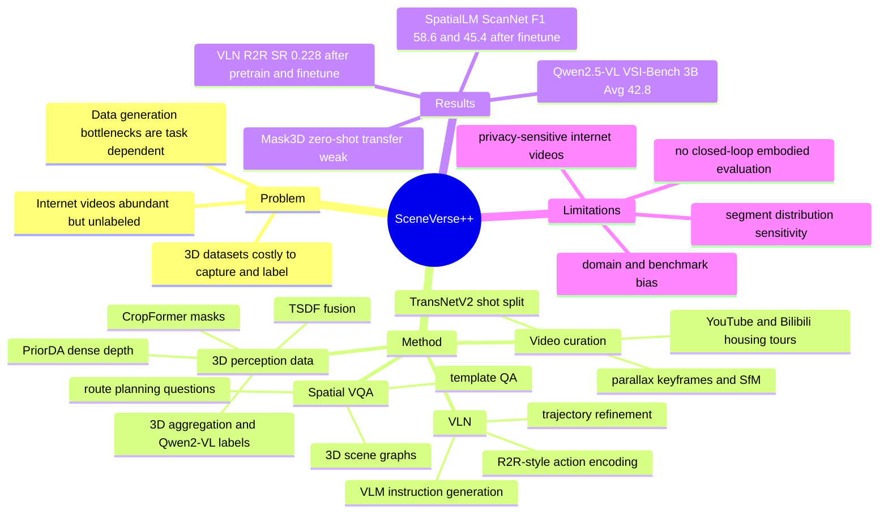

## Summary
这篇论文提出 SceneVerse++：从 unlabeled internet housing-tour videos 自动生成 3D scene understanding 训练数据，覆盖 3D detection / instance segmentation、3D spatial VQA 和 VLN。核心贡献不是单个新模型，而是分析怎样把 SfM、dense reconstruction、2D-to-3D segmentation、VLM annotation 和 trajectory conversion 串成可扩展 data engine，并验证这些生成数据能提升若干下游模型。证据显示 web-scale 3D 数据有用，但收益强烈依赖任务、模型输入形式、benchmark bias 和 data-generation quality。

## Problem & Motivation
3D scene understanding 的瓶颈在数据：ScanNet、ARKitScenes、ScanNet++ 等真实 3D 数据集需要专门采集设备、重建和人工标注，扩展成本远高于 2D image-text 数据。互联网已有大量室内视频，但它们没有 camera pose、3D geometry、instance annotation、spatial QA 或 navigation instruction，不能直接训练 3D perception / reasoning / embodied navigation 模型。

作者想回答的问题是：**unlabeled internet-level videos 能否通过自动 data engine 被提升为有用的 3D training data，并在不同粒度的 3D scene understanding 任务上产生可迁移收益？** 论文强调这个问题不是简单“数据越多越好”：不同 submodule 的误差会级联，模型是否依赖 task-specific precomputed segments、benchmark 是否有 domain bias，都会决定 scaling 是否有效。

## Method
SceneVerse++ 从 YouTube 和 Bilibili 的 housing-tour videos 出发，共收集 8,217 个视频，最终得到 6,687 个 reconstructed scene instances。基础 pipeline 包括 TransNetV2 shot detection、短 clip / black screen / visual noise / human / outdoor scene filtering、parallax-based keyframe selection、dense pixel matching、global bundle adjustment、SfM quality check；长序列会按最多 300 frames 切分并保留 50-frame overlap。Sparse reconstruction 采用 loop pairing 和 sequence pairing，随后用 COLMAP 估计 camera parameters。

**3D detection / instance segmentation data engine**：从 SfM sparse points 出发，先把 sparse 3D points 投影到 image plane 得到 sparse depth priors，用 PriorDA 预测 dense metric depth maps，再通过 TSDF fusion 得到 watertight meshes，并用 large-depth truncation、radius / statistical filtering 去除 floating noisy points。实例分割部分先用 CropFormer 得到 per-frame segmentation masks，再基于 neighboring-frame view consensus 和 spatial agreement 聚合到 3D；最后用 Describe Anything 和 Qwen2-VL 自动生成 instance description，并对齐到 ScanNet category set。

**3D spatial VQA data engine**：作者把生成的 3D geometry 和 instance semantics 转成 3D scene graphs，节点是 3D object instance，边是 pairwise spatial relation；再按 VLM-3R 风格模板生成 Object Counting、Relative Distance、Relative Direction、Object Size、Absolute Distance、Room Size 等 QA。Route Planning QA 来自 VLN trajectory summary，再 mask action 生成 fill-in-the-blank multiple-choice questions；Appearance Order 按 VLM-3R 设置没有纳入。

**VLN data engine**：作者把 room-tour videos 中自然但冗余的 camera trajectories 转成 R2R-compatible navigation trajectories。三阶段是：path pre-processing 通过 0.5m radius cluster 合并近邻 viewpoint、拆分长路径、过滤大于 90° rotation 或大于 70cm translation 的异常 step；action encoding 把 SfM pose 投影到 ground plane，并按 R2R 的 translation bins `[25, 50, 75] cm` 和 rotation bins `[15°, 30°, 45°]` 离散化；instruction generation 使用 VLM 根据 paired images 和 encoded actions 生成 formal / conversational / narrative 三种风格的 navigation instruction。

## Key Results
- **Data scale / quality**：SceneVerse++ 从 8,217 个 internet videos 得到 6,687 个 scenes；每个 scene 平均有 49 个 objects、21 个 distinct categories。人工质量检查中，SceneVerse++ 相比 ScanNet 的平均评分为 `4.13 vs. 3.30`，其中 Scene Item Richness 为 `4.43 vs. 3.68`，Scene Reconstruction Completeness 为 `4.25 vs. 3.09`。
- **3D object detection, SpatialLM on ScanNet / ARKitScenes**：在 ScanNet 上，SceneVerse++ pretrain 的 SpatialLM zero-shot `F1@.25/F1@0.5 = 30.9/21.3`，高于 SpatialLM synthetic pretrain 的 `29.0/19.7`；再 finetune ScanNet 后达到 `58.6/45.4`，明显高于 SpatialLM pretrain + ScanNet finetune 的 `38.0/28.7`。在 ARKitScenes zero-shot 上，SceneVerse++ pretrain 为 `35.8/20.7`，SpatialLM pretrain 为 `35.1/21.2`，提升不单调。
- **3D instance segmentation, Mask3D on ScanNet**：SceneVerse++-only zero-shot transfer 很弱，`AP25/AP50/AP = 15.4/13.0/8.3`，低于直接 ScanNet training 的 `36.1/31.8/22.8`；但 SceneVerse++ pretrain + ScanNet finetune 达到 `38.5/32.9/23.6`，比 ScanNet-only 小幅提升。Supplement 的 segment hyperparameter sensitivity 显示，Mask3D 对 graph-based segment distribution 很敏感，例如 `kThresh=10^-2, segMinVerts=20` 的 AP 为 `22.8`，而更粗的 `segMinVerts=500` 降到 `7.2`。
- **3D spatial VQA, Qwen2.5-VL on VSI-Bench**：SceneVerse++ 生成 632,757 条 spatial VQA data，其中 MCA 391K、NA 241K，实验抽样 202K 训练。Qwen2.5-VL-3B 在 VSI-Bench full set 的 Avg 从 zero-shot `27.9` 提升到 SceneVerse++ training `42.8`（+14.9）；7B 从 `36.6` 提升到 `46.4`（+9.8）。在 ARKit subset 上，3B 的 SceneVerse++ / SN,SN++ Avg 为 `48.0/49.0`，7B 为 `49.1/48.8`，说明 out-of-domain generalization 接近 ground-truth ScanNet / ScanNet++ data。
- **VSI-Bench category / bias finding**：SceneVerse++ 更擅长改善 general spatial knowledge 类别，如 Relative Distance 和 Relative Direction；Object Count、Room Size 这类依赖 domain-specific distribution 的类别较弱。Supplement 给出分布偏差证据：Object Count 的 `DKL(VSI-Bench || SceneVerse++) = 1.04`，而 `DKL(VSI-Bench || SN,SN++) = 0.145`；Room Size 分别为 `6.08` 和 `2.95`。
- **VLN, LLaVA-Video on R2R validation**：SceneVerse++ 生成 9,631 条 trajectories，平均 12.8m、15 steps，每条有三种 instruction style。R2R finetune baseline 的 `SR/OS/SPL/Dist/PL = 0.088/0.133/0.076/8.031/5.222`；SceneVerse++ pretrain + R2R finetune 达到 `0.228/0.315/0.191/7.65/11.642`。直接 mix R2R + SceneVerse++ 训练为 `SR=0.188`，低于 pretrain-then-finetune，作者归因于 real videos 与 simulator-rendered scenes 的 visual gap。
- **VLN ablation / NaVILA comparison**：去掉 instruction enrichment 后，SceneVerse++ + R2R finetune 的 SR 从 `0.228` 降到 `0.074`；去掉 trajectory refinement 降到 `0.177`，说明 raw internet videos 不能直接替代 task-specific processing。Supplement 中，R2R + SceneVerse++ mixed training 在 Qwen2.5-VL-7B 上达到 `SR/SPL/Dist = 0.32/0.258/7.447`，高于 R2R + NaVILA 的 `0.29/0.213/7.960`；作者同时说明 NaVILA 数据约为 SceneVerse++ 的 2.5 倍。

## Strengths & Weaknesses
**已知**：论文最有价值的部分是把“web videos -> 3D training data”的关键瓶颈拆开分析，而不是只报告一个大数据集。SpatialLM、Qwen2.5-VL 和 LLaVA-Video 的结果共同支持一个结论：经过 geometry / semantics / trajectory 对齐后的 internet videos 可以提供 real-world priors，并在 finetuning 或 out-of-domain evaluation 中产生收益。

**已知**：结果不是单调的。Mask3D zero-shot 到 ScanNet 明显失败，作者把原因定位到 segment-level masks 对 sensor / reconstruction pipeline 和 graph segmentation hyperparameters 的敏感性；ARKitScenes detection 上 SceneVerse++ 的 `F1@0.5` 也略低于 SpatialLM synthetic pretrain。这说明“扩大生成数据”对依赖 task-specific intermediate representation 的模型不一定稳健。

**已知**：benchmark bias 是主要风险。VSI-Bench 的 Object Count 和 Room Size 分布更接近 ScanNet / ScanNet++，导致 in-domain training 在这些类别上更强；作者进一步指出 existing benchmarks 可能无法完全反映真实 3D understanding capability，建议更多 zero-shot testing、避免 data contamination，并减少 distribution gap。

**已知**：data engine 仍依赖人工和工程选择。主文写到质量过滤可由 VLM 完成，但实际为保证 downstream data quality 使用了每场景少于 10 秒的人类标注；supplement 也显示 preprocessing / SfM 占 end-to-end per-scene runtime 的 69.8%，平均每 scene 约 0.59h（0.27 GPU-hours + 0.32 CPU-hour）。

**已知**：作者列出的 limitations 包括计算资源限制导致实验只覆盖 minimal setting；3D understanding capability 还依赖 base model capacity、optimization strategy、data mixture；internet videos 可能包含 public areas 的 privacy-sensitive content，扩展时需要遵守 ethical guidelines、regulatory frameworks 和 responsible development。未来工作包括 iterative refinement of generated data、引入更强模型，以及扩展到 dynamic videos / 4D scene evolution。

**推测**：对 embodied / VLM 研究而言，这篇论文的启发是 data engine 可能比单点 architecture 更关键；如果目标是让 embodied agent 获得 spatial intelligence，重点不只是训练更大的 VLM，还要把自然视频中的 metric geometry、object permanence、trajectory intent 和 language instruction 对齐起来。这个推测来自论文的多任务证据，但论文没有直接评估真实机器人 closed-loop performance。

**不知道**：论文没有报告 generated data 对真实 embodied agent deployment、closed-loop navigation、long-horizon task planning 或 GUI / computer-use agent 的影响。也不知道 SceneVerse++ 的自动标签噪声在更大规模、更开放类别或动态场景中会如何累积；论文只说明未来会做 iterative refinement 和 dynamic videos extension。

## Mind Map

## Notes
这篇论文值得和 SceneVerse、VLM-3R、NaVILA、RoomTour3D 一起看：它把“互联网视频能否变成 3D spatial data”从单一导航任务扩展到 detection / segmentation / spatial VQA / VLN，并且明确指出不同任务的可扩展性边界。

一个重要 lesson 是：web-scale data 的价值取决于中间表示是否稳定。Raw RGB / voxel / MLLM-style inputs 更可能受益于数据规模；依赖 dataset-specific segmentation、precomputed segments 或 benchmark-specific QA distribution 的模型，即使有更多数据也可能被 domain gap 抵消。

对未来 idea 的启发：如果要构建面向 embodied agent 的 spatial memory / world model 数据引擎，应该显式评估三个环节的误差传播：SfM / reconstruction 误差、semantic lifting 误差、language / action grounding 误差。只看下游平均分会掩盖真正的 bottleneck。
