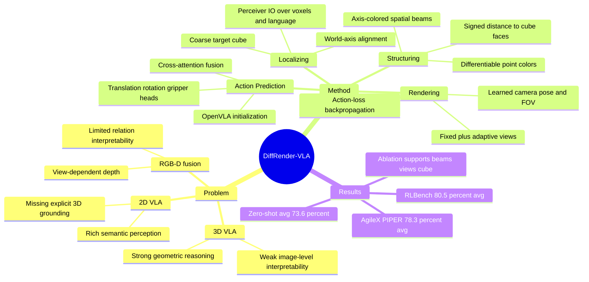

## Summary

DiffRender-VLA 用 differentiable rendering 把 3D point cloud 中的 target location、object-to-target spatial relation 和 adaptive viewpoint 投射成 2D VLA 可读的图像，从而桥接 3D VLA 的几何推理和 2D VLA 的语义感知。论文在 RLBench 12 个仿真任务达到 80.5% average success，在 AgileX PIPER 6 个真实任务达到 78.3% average success，但对 failure cases、运行开销和部分基线表述的一致性披露不足。

## Problem & Motivation

机器人操作同时需要 3D spatial reasoning 和 image-level semantic perception。作者认为现有 VLA 路线被分成两类：3D VLA（如 PerAct、VoxPoser、DP3、Act3D）能直接处理 voxel / point cloud 的几何关系，但牺牲 image-level interpretability；2D VLA（如 RT-2、OpenVLA、RoboMamba、PaLM-E）有更强的视觉语义连续性，却缺少 explicit global 3D grounding。

RGB-D fusion 是直接补强 2D VLA 的自然做法，但论文指出 depth map 仍然是固定视角下的 surface geometry，缺少显式 object-to-object spatial relationship 编码；多数 fusion 又发生在 feature level，难以解释空间线索如何进入 action prediction。DiffRender-VLA 的问题 formulation 是：能否把 3D spatial structure 转成可解释、可微、image-compatible 的 visual mediation，让 2D VLA 继续利用预训练视觉语义，同时获得更明确的空间结构。

## Method

### Overall: Localizing -> Structuring -> Rendering

DiffRender-VLA 输入 multi-view RGB-D observations 和 language instruction，先重建 point cloud 并 voxelize 成 3D grid，再通过三步把空间关系渲染成 enriched images，最后交给可训练的 VLA backbone 做 6-DoF action prediction。

1. **Localizing coarse target region**：Perceiver IO encoder 同时处理 voxel representation 和 language embedding，预测 coarse target voxel probability `Qcoarse`、coarse spatial feature `Zcoarse` 和 dynamic viewpoint 参数 `theta_view`。最高置信位置通过 differentiable spatial expectation 得到 `pcoarse`，并在该位置插入 world-axis-aligned cube marker。cube 与世界坐标轴对齐，使 2D projection 的形变、大小和方向能携带深度与朝向线索。
2. **Structuring differential spatial information**：对 point cloud 中每个点计算到 cube 六个面的 signed distance，用 red/cyan、green/magenta、blue/yellow 分别编码 +/-X、+/-Y、+/-Z 方向，并按距离把原始 RGB 与 directional color beam 混合。hue 表示世界坐标方向，intensity 表示相对 target 的距离，且整个 beam encoding 对 `pcoarse` 可微。
3. **Rendering adaptive viewpoint**：viewpoint decoder 输出动态 camera rotation、translation 和 field-of-view；这些参数通过 action loss 反传学习，不是单独搜索得到。论文声称 adaptive viewpoints 会倾向于暴露 cube marker、降低遮挡、调节 cube 在图像中的大小，从而让 2D encoder 更容易读取 spatial relation。
4. **Fine-grained action prediction**：VLA backbone 初始化自 OpenVLA，包含 SigLIP、DinoV2 和 Llama-2-7B，并在 spatially enriched views 上继续训练。模型用 bidirectional cross-attention 融合 `Zcoarse` 与 VLA visual-language features，然后分别预测 translation、rotation 和 gripper state；rotation 离散为 5-degree Euler-angle bins，gripper 是 binary classification。

训练设置：仿真使用 RLBench，每个任务 100 demos、50 trials/task；真实机器人使用 AgileX PIPER + Robotic 2F-85 gripper，每个任务 50 demos、20 trials/task。空间模块从头训练，VLA backbone 从 OpenVLA 初始化；loss weights 为 `lambda_trans=1.0`、`lambda_rot=0.8`、`lambda_grip=0.5`。

## Key Results

### RLBench simulation

在 RLBench 12 个任务上，DiffRender-VLA 达到 **80.5% average success rate**。表 1 中最强 3D baseline 是 GWM **68.4%**，因此 full method 高 **+12.1 points**；其他代表性 baseline 包括 FVP 66.1%、Act3D 65.8%、ManiGaussian 65.7%、DP3 64.0%、VLA-adapter 63.9%、TraceVLA 60.6%、OpenVLA-OFT 53.4%、RT-2 47.5%。

任务分组上，论文报告 occlusion tasks 平均 **91.7% success**，比 GWM 高 **+7.6 points**；clutter & precision tasks 平均 **69.4% success**，比 GWM 高 **+24.0 points**。这说明主要收益集中在遮挡、拥挤和精细空间关系场景，而不是简单语义识别。

### Real-world AgileX PIPER

真实机器人实验在 6 个任务、每任务 20 trials 上评估。DiffRender-VLA 达到 **78.3% average success rate**，高于最强 baseline VLA-Adapter **60.8%**，提升 **+17.5 points**；逐任务结果为 Place Cup 90.0%、Place Plate 85.0%、Place Stamp 70.0%、Place Banana 80.0%、Press Button 75.0%、Block Stacking 70.0%。其中 Place Stamp 相比 best baseline 提升 **+25.0 points**，Place Banana / Press Button / Block Stacking 均提升 **+20.0 points**。

### Ablation and generalization

组件消融支持三阶段设计：full method 为 **80.5% avg**、translation error **1.7 cm**、rotation error **8.2 degrees**；去掉 Adaptive View 降到 **71.6%**，去掉 Spatial Beams 降到 **72.5%**，去掉 Coarse Cube 降到 **68.4%**。gradient-flow 消融显示 non-differentiable beams 为 **74.8%**、non-differentiable viewpoint 为 **73.6%**、two-stage training 为 **76.2%**，均低于端到端可微训练。

替代 spatial encoding 中，Trajectory Traces 为 **75.3%**，Keypoint Markers 为 **74.1%**，Fixed Multi-View 为 **77.4%**，仍低于 differentiable beams + adaptive viewpoints。zero-shot generalization 中，DiffRender-VLA 从 in-domain **80.5%** 降到平均 **73.6%**：Novel Objects 74.2%、Novel Scenes 71.8%、Novel Lighting 76.3%、Distractors 73.5%、Random Views 67.9%。

## Strengths & Weaknesses

### Strengths

- **已知**：问题 formulation 清晰，不是简单把 depth 塞进 VLA，而是把 3D relation 显式渲染成 2D visual tokens，让 pretrained image encoder 可以读取空间结构。
- **已知**：方法结构相对简洁：coarse cube 定位 target，spatial beams 编码方向与距离，adaptive viewpoint 决定从哪里看；三个模块分别对应 where、what relation、how to visualize。
- **已知**：ablation 覆盖了关键假设，包括 adaptive view、spatial beams、coarse cube、differentiability、two-stage training 和 alternative encodings，能较直接地支撑"可微视觉中介"这一主张。
- **已知**：实验同时覆盖 RLBench simulation 和 AgileX PIPER real-world deployment，对 manipulation / embodied VLA 方向相关性很高。

### Weaknesses / Limitations

- **已知**：论文没有系统展示 failure case taxonomy，也没有说明失败主要来自 localization、beam ambiguity、viewpoint learning、VLA semantic error 还是 robot execution noise。
- **已知**：缺少 runtime / memory / rendering overhead 分析。方法引入 point-cloud aggregation、beam rasterization、dynamic camera pose learning 和 multi-view rendering，但论文没有给出相对 OpenVLA / RVT-2 / DP3 的推理成本。
- **已知**：部分结果表述存在内部不一致。表 1 中 VLA-adapter 的 average 是 63.9%、TraceVLA 是 60.6%，但正文把 TraceVLA 写成 63.9%、VLA-adapter 写成 60.6；表 4 中 "RVT-2" 的 in-domain success 写为 68.4%，但表 1 中 68.4 对应 GWM，且表 1 没有 RVT-2 行。
- **推测**：方法最适合 target-object spatial relation 能被 cube / beam 显式视觉化的任务；如果瓶颈是 language ambiguity、contact-rich dynamics 或 object state 不可见，beam rendering 的边际收益可能下降。这个判断来自方法机制和任务分组结果，不是论文直接实验结论。
- **不知道**：论文正文没有给出该 CVPR 版本的 DOI 或 arXiv id；也没有报告更大规模真实机器人、多 embodiment 或长时间闭环部署下的稳定性。

## Mind Map

## Notes

- 对 VLA / embodied research 的启发：这篇论文的核心不是新的 foundation model，而是把结构化 3D state 变成 pretrained 2D VLA 可消费的 visual representation。这个思路与 affordance / visual prompting 路线相邻，但更强调世界坐标系下的几何方向与距离。
- 对 GUI agent 的间接启发：可以把 latent state 或 task-relevant relation 显式渲染成 screen-level visual cue，再交给已有 VLM / GUI grounding 模型读取；不过这是跨 domain 类比，不是论文实验结论。
- 后续如果代码可复现，优先检查三点：adaptive viewpoint 是否真的由 task loss 学出稳定视角、beam encoding 在多色物体上是否引入视觉混淆、以及 rendering overhead 是否抵消了相对 3D VLA 的部署优势。
