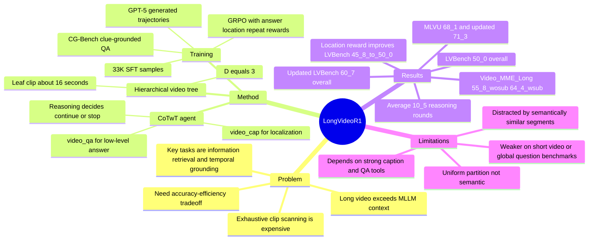

## Summary
LongVideo-R1 面向 low-cost long video understanding，把长视频 QA 从 exhaustive clip scanning 改成一个会主动导航的 CoTwT agent：先看高层 caption，再按问题决定 zoom in、横向移动、回退或停止回答。它用 CG-Bench clue-grounded annotations 合成约 33K tool-use reasoning samples，并通过 SFT + GRPO-style RL 训练 Qwen3-8B reasoning model，在 LVBench 上取得 **50.0%** accuracy 与约 **3 分钟/QA** 的效率权衡。

## Problem & Motivation
长视频理解的核心瓶颈不是单纯“模型不够大”，而是 1-2 小时视频无法完整塞进 MLLM context；常见做法必须把视频切成很多 clips，逐段 caption / summarize / retrieval，再把结果整合回答。论文指出 Ego-R1、VideoTree 等 agentic 方法虽然能提升 long video QA，但计算复杂度随视频长度近似线性增长，不适合 low-latency embodied agents 或有 per-sample budget 的 video-chat 服务。

作者把问题重新定义为 **accuracy-efficiency tradeoff**：每个 QA task 按需执行，计算开销来自 reasoning model、video captioning tool 和 video QA tool 的调用总成本；目标不是只刷最高 QA accuracy，而是在有限 budget 下找到接近 Pareto-optimal 的策略。关键假设是：如果 agent 能根据 partial high-level context 判断当前信息是否足够，并选择下一段最可能有用的视频，就能避免 full-video exhaustive search。

## Method
LongVideo-R1 把视频组织成一个均匀层级树。根节点是整段视频，默认深度 \(D=3\)，宽度 \(K=\mathrm{round}((T/16s)^{1/D})\)，使 leaf-level clips 约为 16 秒；这让 agent 可以先看长 clip 的粗描述，再逐层 zoom in 到更细时间粒度。作者也承认 uniform partition 不是最优，因为语义相近内容可能落在相邻 sub-clips 中，增加 localization ambiguity。

推理过程是 Chain-of-Thought-with-Tool (CoTwT)。Reasoning model 根据 question 和历史 observations 生成 reasoning statement，并调用两个外部 multimodal tools：`video_cap()` 给某个 clip 生成通用 caption，用于定位；`video_qa()` 只允许在 lowest-level clip 上调用，用于回答具体问题，也可以返回 unknown。每轮之后，tool output 被追加到 chat history，agent 再决定继续探索、换 segment、回退，或直接输出答案。

训练分两阶段。第一阶段用 CG-Bench 生成监督轨迹：正文说作者选取 **800** 个视频和对应 **5.6K** QA pairs，利用 clue-grounded annotations、Qwen2.5-VL-72B captions 和 GPT-5 生成 CoTwT trajectories，平均 **5.8** steps，得到约 **33K** SFT samples。附录的表述略有差异：它写的是约 **8000** QA pairs 经过 filtering 得到 **5600** high-quality CoTwT trajectories，另有 **400** videos / **4200** QA pairs 留给 RL；这里应视为论文内部口径不完全一致。

第二阶段把 video reasoning 视为 interactive exploration environment，用 GRPO 继续优化。Reward 由三部分组成：`rans` 奖励最终答案正确，`rloc` 用 coverage / precision 的 F1-like metric 奖励定位到 ground-truth time intervals 且少探索无关片段，`rrepeat` 惩罚重复访问同一 segment。实现上，reasoning model 是 Qwen3-8B；`video_cap()` 和 `video_qa()` 默认分别使用 Qwen2.5-VL-72B 与 Qwen2.5-VL-32B；训练为 SFT **3 epochs** + RL **2 epochs**。

## Key Results
- **LVBench**：LongVideo-R1 overall **50.0%**，分项 ER **49.2**、EU **48.4**、KIR **56.4**、TG **56.4**、Rea **44.3**、Sum **43.1**。它高于 agent-based baselines MemVid **44.4%**、VCA **41.3%**、VideoAgent **29.3%**、VideoTree **28.8%**；但低于 open-source AdaReTake-72B **53.3%**。使用 Qwen3-VL-32B-Instruct captions 和 renewed SFT data 的 updated version 达到 **60.7%** overall，KIR **70.1**、TG **62.7**。
- **MLVU / Video-MME Long**：LongVideo-R1 在 MLVU 上为 **68.1%**，updated version 为 **71.3%**；在 Video-MME Long 上为 **55.8% / 64.4%**（w/o subtitles / w/ subtitles），updated version 为 **58.0% / 68.6%**。作者明确指出它在 MLVU 和 Video-MME 上并不领先 open-source MLLMs，因为 MLVU 有不少短视频，Video-MME 有许多 global questions，uniform/adaptive frame sampling 方法更占优。
- **Efficiency**：Figure 1 / Table 7 报告 LongVideo-R1 在 LVBench 以约 **3 分钟/QA** 达到 **50.0%**；降到约 **2 分钟/QA** 时 accuracy 仅下降 **0.2%**。VideoMME-Long 的时间估算中，平均 reasoning rounds 为 **10.5**，`video_qa` 平均 **0.36** 次，caption calls 约 **14.14** 次；用 Qwen2.5-VL-32B 作为 cap/QA tool 时，端到端约 **135s**。
- **Tool scale / round budget**：Table 6 显示 caption model 从 Qwen2.5-VL-3B 换到 72B 时，LVBench 从 **44.5%** 提到 **50.0%**，Video-MME/L 从 **56.0%** 提到 **64.4%**，但平均时间从 **50.5s** 增至 **175.7s**。Table 7 中 max rounds 从 **10** 到 **30**，LVBench 从 **43.0%** 提到 **50.0%**，Video-MME/L 从 **57.1%** 提到 **64.4%**，时间从 **103.6s** 增至 **175.7s**。
- **Ablation**：Table 4 中 full 33K SFT samples 优于 10K subset：SFT 后 LVBench **41.6 vs 39.1**，RL 后 **50.0 vs 47.4**；Video-MME/L 上 RL 后 **64.4 vs 60.2**。Table 5 中加入 location reward 后，LVBench 从 w/o `rloc` 的 **45.8%** 到完整模型 **50.0%**，KIR 从 **49.1** 到 **56.4**，TG 从 **53.2** 到 **56.4**。

## Strengths & Weaknesses
**已知 / Strengths**

- 问题 formulation 有价值：论文把 long-video QA 的目标从单一 accuracy 改成 accuracy-efficiency tradeoff，并显式计算 reasoning / caption / QA tool calls 的成本，这比只比较最终分数更贴近真实 agent deployment。
- 方法相对简洁：hierarchical video tree + `video_cap` / `video_qa` + reasoning controller，核心是 learned navigation policy，而不是为整段视频构建昂贵的 full caption database。
- RL reward 与目标对齐：`rloc` 不只奖励答案正确，还奖励少看但看准；Table 5 支持 location reward 对 KIR / TG 任务有明显帮助。
- Trace 可解释：CoTwT trajectory 记录每轮为什么看某段、看到了什么、何时回答，便于分析 agent 是真的定位证据，还是只在语言层面猜测。

**已知 / Limitations**

- 依赖外部强 video tools：LongVideo-R1 的 reasoning model 是 8B LLM，但视觉感知主要来自 Qwen2.5-VL-72B captions 和 Qwen2.5-VL-32B video QA；Table 6 显示 caption tool scale 对结果和成本都很敏感。
- 不是所有 benchmark 都占优：作者自己说明 MLVU 和 Video-MME 中短视频 / global questions 较多，使 uniform/adaptive frame sampling 更适合；LongVideo-R1 的优势主要集中在 KIR 和 TG 这类需要定位关键片段的问题。
- Failure cases 明确存在：附录 D 显示，当视频中有语义相关但无关的 object / segment 时，模型可能 stuck in wrong branch，直到给出 textual hints 才能转回正确 segment。
- 数据生成依赖 GPT-5 与 clue hints：SFT trajectories 由 proprietary GPT-5 生成，并在失败时用 CG-Bench clue-grounded hints 逐步纠正；这保证轨迹正确性，但也让训练数据质量、hint leakage 程度和复现成本需要进一步审视。
- 层级切分较粗：uniform tree partition 易把同一事件切散或让相似事件位于邻近 sub-clips；论文没有提供 learned segmentation 或 semantic boundary detection 的实验。

**推测 / Implications**

这篇论文对 GUI-agent / embodied research 的启发在于 **active perception policy**：agent 不必一次性读取完整 observation history，而可以先看 coarse summary，再按任务目标逐步 request finer evidence。这个思想可能迁移到屏幕录像回看、mobile UI trajectory debugging 或机器人长时任务，但论文没有在 GUI、web、robotics 或 embodied benchmark 上验证。

**不知道 / Open Questions**

- 不知道 code release 是否包含完整训练数据生成、RL rollout 环境和所有 prompts；论文只说明 code/data available。
- 不知道真实部署时 dollar cost、GPU utilization、batching 后 latency，以及多 QA 同一视频时是否仍然优于离线 indexing。
- 不知道 textual hints 能救回多少失败样本；论文给了 qualitative examples，但没有量化 human hint 或 self-correction 成功率。

## Mind Map

## Notes
- 和 [[2606-LensWalk]] / [[2606-VideoARM]] 一起看，LongVideo-R1 更偏 **learned navigation policy**：LensWalk 是 test-time planning，VideoARM 是 hierarchical memory / tool orchestration，LongVideo-R1 则用 SFT + RL 训练一个开源 8B reasoning controller。
- 最值得复用的不是具体 video tree，而是 reward 设计：把 “look at fewer irrelevant segments” 变成可训练信号。GUI-agent 若有 action trace grounding，也可以考虑把 coverage / precision 式 reward 用在 screen region 或 timestep selection 上。
- 需要谨慎引用 “low-cost”：它确实比 exhaustive agent methods 更省，但默认还依赖 72B caption model，LVBench full setting 仍约 **175.7s** / QA；低成本是相对于 linear-scan video agents，而不是绝对实时。
