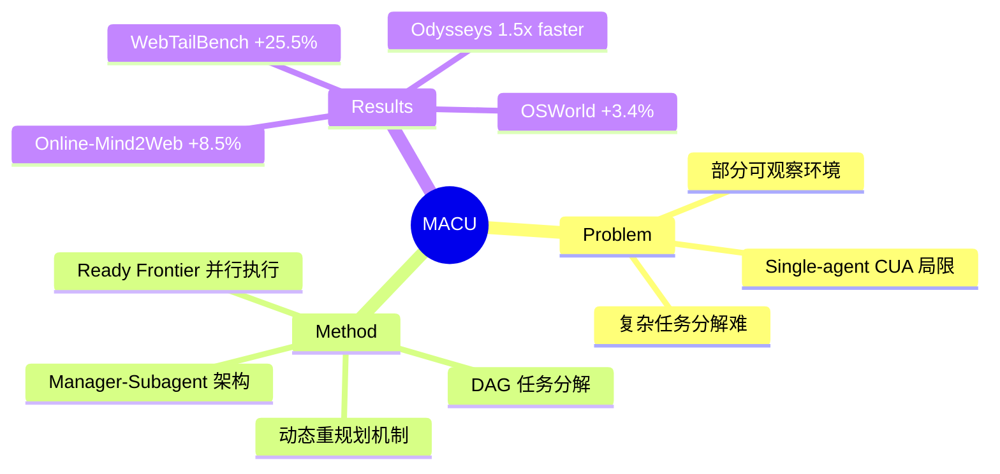

## Summary
提出 Multi-Agent Computer Use (MACU) 框架，通过 Manager-Subagent 架构将 CUA 任务分解为 DAG 并行执行，在 OSWorld 和多个 Web 导航 benchmark 上相比单 agent baseline 提升 3.4-25.5%，长任务完成时间缩短约 1.5 倍。

## Problem & Motivation
现有 Computer Use Agent (CUA) 均为单一串行 agent，在处理复杂长程任务时存在明显局限：无法有效分解任务、无法并行执行子任务、难以根据新信息持续重规划。论文指出，复杂桌面/网页操作任务天然具有可分解性和并行性，单 agent 架构浪费了这些机会。部分可观察环境（如网页内容动态变化、跨窗口信息传递）是 CUA 的核心挑战，但现有工作未将其作为一等公民处理。

## Method
MACU 框架的核心设计：

**Manager-Subagent 架构**
- Manager model：负责任务分解、DAG 构建、状态追踪、动态重规划
- CUA Subagents：执行具体操作的单一 agent，可并行部署

**DAG 任务表示**
- 将任务分解为 DAG，节点为子任务，边编码依赖关系和目标传递
- Ready frontier：无前置依赖的节点集合，可并行执行
- Manager 每轮调度 ready frontier 上的节点给 subagents

**信息传递机制**
- 针对部分可观察环境设计：下游 agent 无法重新观察的信息通过 DAG 结构和 Manager 传递
- 每个子任务节点携带目标描述和关键上下文

**动态重规划**
- Manager 根据 subagent 返回结果持续修订 DAG（添加、取消、重写节点）
- 支持失败重试、分支探索、提前终止

## Key Results
在四个 benchmark 上的表现：

| Benchmark | Single-Agent Baseline | MACU | Improvement |
|-----------|----------------------|------|-------------|
| OSWorld | - | - | +3.4% |
| Online-Mind2Web | - | - | +8.5% |
| WebTailBench | - | - | +25.5% |
| Odysseys | - | - | +15.2%, 1.5x faster |

- **OSWorld**：桌面操作任务，MACU 相比 Claude 单 agent baseline 提升 3.4%
- **Online-Mind2Web**：真实网页导航任务，提升 8.5%
- **WebTailBench**：长程网页操作，提升最显著达 25.5%
- **Odysseys**：长程 web 导航 benchmark，任务完成 wall-clock time 缩短约 1.5 倍

**Test-time Scaling**：MACU 展现更优的测试时扩展性，增加 subagent 并行度持续提升性能

**长任务突破**：在 single-agent CUA 卡住的复杂长程任务上，MACU 通过并行探索和动态重规划成功解决

## Strengths & Weaknesses
**Strengths:**
- 首次系统性地将 multi-agent 协作引入 CUA 场景，架构设计简洁清晰
- DAG 表示天然支持任务依赖和并行执行，信息传递机制有效解决部分可观察问题
- 实验覆盖全面：桌面（OSWorld）+ 多个 web 导航 benchmark
- Test-time scaling 展示了清晰的 scaling path
- 开源代码和可视化工具

**Weaknesses:**
- Manager model 依赖强大的 LLM（Claude/GPT-4），成本较高
- 并行 subagent 增加了 API 调用开销，可能抵消 wall-clock 时间收益
- 论文未深入分析失败案例，尤其是 DAG 规划错误的传播影响
- 与 single-agent baseline 的对比未充分控制 API 调用次数/成本
- 缺少对 subagent 数量、并行度等超参的消融

## Mind Map

## Notes
- 与 OSWorld 同团队工作，延续了 CUA benchmark 的研究路线
- DAG 表示与 planning 领域的经典方法（HTN、GOAP）有相似性，但针对 CUA 场景做了适配
- 信息传递机制的设计思路可迁移到其他 multi-agent 协作场景
- 有意思的延伸：subagent 是否可以异构（不同模型/能力）？Manager 是否可以被 RL 训练？