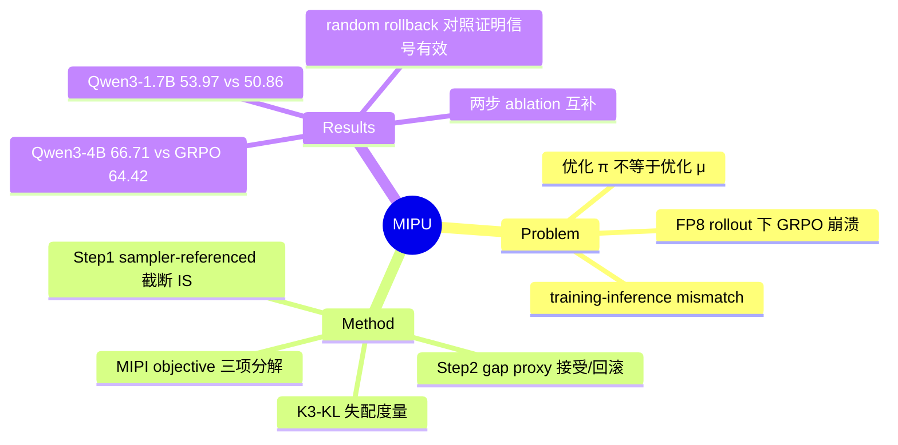

## Summary
指出 LLM RL 中真正该优化的是部署所用的 inference policy（μ）而非 training engine 中的 policy（π），并提出两步框架 MIPU：Step 1 用 sampler-referenced 截断重要性权重修正 pre-update mismatch，Step 2 用 inference-side gap proxy 对同步后的候选做接受/回滚，在 FP8 rollout 高失配设定下显著稳定训练并提升数学推理精度。

## Problem & Motivation
现代 LLM RL 系统为效率使用分离的 inference engine（vLLM）与 training engine（Megatron），即使参数同步，两侧对同一 trajectory 给出的概率也不一致（training-inference mismatch）。已有工作（TIS/MIS 等）把它当作 off-policy correction 问题处理，但本文提出更根本的 objective 层质疑：**优化 training policy π 并不必然改进部署时真正使用的 inference policy μ**——训练侧指标上升可能是"海市蜃楼"。在 FP8-quantized rollout 这种高失配场景下，标准 GRPO 会训练崩溃。因此作者主张把优化目标改写为 Monotonic Inference Policy Improvement（MIPI）：保证 J(μ) 单调提升。

## Method
**核心分解（Eq. 5）**：J(μ_{k+1}) − J(μ_k) = [J(μ_{k+1}) − J(π_{k+1})]（post-update gap ①） + [J(π_{k+1}) − J(π_k)]（training-side update ②） + [J(π_k) − J(μ_k)]（pre-update gap ③）。标准 GRPO 只管 ②，①③ 两个 gap 项放任不管。

**MIPU 两步框架**：

1. **Step 1: Sampler-Referenced Update**（管 ②+③）
   - 将 trainer-to-sampler 全比值分解为 ρ_i(θ) = w_i^k · r_i(θ)，其中 w_i^k = π_k/μ_k 是 pre-update mismatch，r_i(θ) = π_θ/π_k 是当前更新比值
   - 对 w_i^k 做截断（w̄ = min(w, w*_max)）修正失配，PPO-style clip 只作用于 r_i(θ)：J_S1 = E[w̄_i^k · min(r_i Â^μk, clip(r_i) Â^μk)]
   - 与 TIS 的区别：把失配修正与当前更新的 clipping 解耦，而非对整个比值一起 clip；理论上保证 J(π_{k+1}) − J(μ_k) ≥ 0
2. **Step 2: Inference-Gap-Aware Acceptance**（管 ①）
   - 参数同步到 inference engine 后，用 validation rollouts 估计 post-update gap proxy T̂_post = −E[ρ_i Â^μk+1]
   - 仅当 T̂_post ≥ −c（c 为容忍度超参）才接受该次更新，否则回滚（rollback），拒绝 post-update gap 过大的候选

失配度量用 K3-KL estimator：d_t = log π − log μ，对 exp(d_t) − d_t − 1 取平均估计 D_KL(μ‖π)。

## Key Results
- **设定**：Qwen3-1.7B / Qwen3-4B，FP8-quantized rollout（刻意制造高失配），DAPO-Math-17K + DeepMath 数据，H100×8，Megatron 训练 + vLLM 推理；baseline 为 GRPO、MIS（token-level masking，w̄>2 的 token 屏蔽）、LR-decay
- **Table 1**：Qwen3-4B 平均 66.71%（GRPO 64.42%，最强 baseline 65.66%）；Qwen3-1.7B 53.97%（GRPO 50.86%，最强 baseline 52.23%）。基准覆盖 MATH-500 / AIME24 / AMC23 / Minerva / OlympiadBench；4B 上 AMC23 82.50→85.00，1.7B 上 MATH-500 83.10→86.52
- **训练稳定性**：MIPU 保持 plateau，各 baseline 出现崩溃/退化（Figure 2）
- **Ablation（Table 2）**：Step 1 only +0.94（候选质量提升但不稳）；Step 2 only −1.61（防崩溃但把改进也挡掉）；合起来 +2.29 且稳定——两步互补，Step 1 构造好候选、Step 2 验收
- **回滚信号分析（Figure 4）**：T̂_post 与失配大小（K3-KL）呈结构化相关；random rollback baseline 拒绝 67% 更新仍然崩溃，而 MIPU 拒绝 53.5% 却稳定——证明 Step 2 的收益是 signal-conditioned 而非单纯稀疏化更新

## Strengths & Weaknesses
**Strengths**
- Problem formulation 的贡献大于算法本身：把 training-inference mismatch 从"off-policy 修正的工程 trick"上升为 objective misalignment，三项分解（Eq. 5）干净地揭示了 GRPO 只优化中间项的盲区
- Random rollback 对照实验设计得好——排除了"Step 2 只是减少更新频率"的平凡解释，说明 gap proxy 携带真实信号
- Step 1/Step 2 的 ablation 显示两个组件各自失效、组合才 work，机制解释自洽

**Weaknesses**
- 主实验建立在 FP8 rollout 这一**人为放大的失配**上；BF16 常规设定下 mismatch 小得多，MIPU 的收益与 rollback 开销是否仍划算，论文没有回答
- 只有 1.7B/4B 两个中等规模模型 + 纯数学域，作者自己承认 scaling 与跨域泛化未验证
- Step 2 需要额外 validation rollouts，计算开销没有量化报告；且 acceptance 基于 proxy，没有正式的 monotonic improvement 保证——标题里的 "Monotonic" 是愿景不是定理
- 容忍度 c 敏感（Appendix C），过严会滞留 stale policy，实际部署需要 per-setting 调参

**影响推测**：对 RL 基建方向有参考价值——随着 rollout 量化/异步化成为降本标配，inference-side objective 的视角可能成为标准考量；但方法本身能否在低失配主流设定下立足仍是未知数。

## Mind Map

## Notes
- 与 [[2606-AsyncWebRL]] 的异步 RL 基建关切同源：都在处理 rollout 端与训练端不一致的问题，本文从 objective 层切入，AsyncWebRL 从系统层切入。
- 值得追问：常规 BF16 设定下 pre/post gap 的量级有多大？若本身可忽略，本文更像是"为量化 rollout 时代提前准备的保险"。
