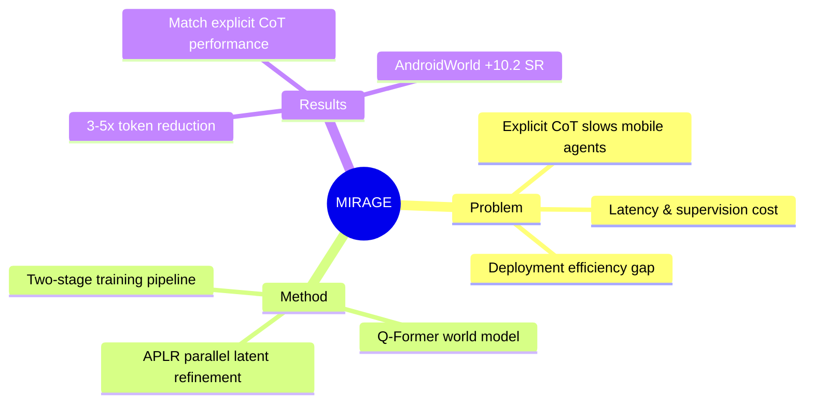

## Summary
MIRAGE 是一个将显式推理链迁移到连续 latent space 的 Mobile Agent 框架，通过 APLR 并行隐式推理和 Q-Former world model 实现"thinking forward"——在输出 action 前先在内部预测下一屏状态。核心贡献是证明 latent reasoning 可以在 3-5x 更少的 token 预算下达到显式 CoT 的性能。

## Problem & Motivation
现有 Mobile Agent（如 UI-TARS、MAI-UI）依赖显式 CoT 进行推理，但长文本推理链带来三大问题：1) 推理速度慢、latency 高；2) supervision 成本高（需要人工或合成 rationale）；3) deployment 困难（每个 token 都延迟交互）。作者的核心 insight：推理过程本身是有价值的，但不需要 decode 出来——可以把 reasoning internalize 到 hidden states，同时引入 world model 让 agent 学会预测未来界面状态。

## Method
MIRAGE 采用两阶段训练 pipeline：

**Stage 1: Explicit-Thought Warmup**
- 在结构化 thought 数据上训练：`<THOUGHT> [observation] [rationale] [predict] <ACTION_DESC> <ACTION>`
- 让 VLM 学会 action formatting 和 observation-rationale-predict 的推理模式

**Stage 2: Latent-Thought Distillation**
- 将 `<THOUGHT>` 文本块替换为 N 个 latent tokens（4B 用 9 slots，8B 用 6 slots）
- **APLR (Approximate Parallel Latent Refinement)**：Jacobi-style 并行更新，K=3 rounds。数学上证明前 K 个 latent slots 精确匹配 serial solution，tail error 有界
- **Q-Former World Model**：用 BLIP-2 style Q-Former 将 latent states 对齐到 next screenshot 的 frozen vision features（stop-gradient），避免 latent collapse 并补充 APLR tail error 的 supervision

核心训练目标：$\mathcal{L} = 0.8 \mathcal{L}_{ce} + 0.2 \mathcal{L}_{wm}$

## Key Results
**AndroidControl**（动作准确率 benchmark）：
- MIRAGE-4B: Low-level EM 77.59 (+13.30%), Action Acc 91.09 (+21.21%), Tokens 18.92 (-83.64%)
- MIRAGE-8B: Low-level EM 83.75 (+7.84%), Action Acc 94.62 (+14.64%), Tokens 18.01 (-77.45%)
- 相比 size-matched Qwen3-VL baseline，token 减少 75-83%，同时 EM/action acc 显著提升

**AndroidWorld**（动态真实设备 benchmark）：
- MIRAGE-4B: SR 52.6 (+10.2 points vs baseline 42.9), Avg Tokens 31.0 (-69.9%)
- MIRAGE-8B: SR 57.8 (+10.2 points vs baseline 47.6), Avg Tokens 27.0 (-75.0%)
- 与 Explicit CoT SFT（52.6 SR）性能相同，但 token budget 3-5x 更少

**Ablation**（AndroidWorld SR）：
- Action-only SFT（无 reasoning）: 31.0（比 base 42.9 还差）
- Explicit CoT SFT: 52.6
- Serial latent CoT: 50.9
- APLR only（无 world model）: 48.2
- MIRAGE（APLR + world model）: 52.6

## Strengths & Weaknesses
**Strengths**：
1. 问题定位精准——显式 CoT 的 deployment cost 是真实痛点，latent reasoning 的解决方案方向正确
2. APLR 的理论证明扎实：前 K slots 精确匹配 serial，tail error 有界，这比 naive latent CoT 更有说服力
3. Q-Former world model 的设计巧妙：用 frozen vision features 作为 target，避免额外 decoder 和 target drift
4. Ablation clean——清晰展示了 world model 对 APLR tail error 的补偿作用

**Weaknesses**：
1. 只在 Android 场景验证，iOS/Web/Desktop 的泛化性未讨论
2. latent slots 数量（6-9）和 APLR rounds（K=3）是 empirical choice，缺乏 systematic hyperparameter study
3. "predict" field 位于 thought sequence 尾部，恰好是 APLR tail error 最严重的位置——这个设计是 deliberate 还是巧合？如果 predict 在中间位置，world model 的作用是否减弱？
4. 相比 UI-Venus-Navi-7B（85.09 EM, 93.05 action acc），MIRAGE-8B（83.75, 94.62）的 EM 略低，虽然 token 更少——说明大模型 + 显式 CoT 可能仍有上限优势
5. 未讨论 multi-turn 任务中 latent states 是否能累积跨 step 的 reasoning

## Mind Map

## Notes
- 这个工作对 GUI Agent 的推理效率问题提出了合理的解决方案，但需要更多场景验证
- APLR 的数学形式类似于 fixed-point iteration，理论上可以收敛到 serial solution（当 K→N）
- World model 的设计借鉴了 JEPA/SimCLR 的 stop-gradient 思想，但目标是 next-frame features 而不是 contrastive pairs
- 值得思考：如果 predict field 在 thought sequence 的位置影响 world model 效果，是否可以通过 reordering 或 multi-head Q-Former 来缓解？